# Полный курс «Мой первый Биткоин» (Версия для РФ)

<a rel="Website" href="https://miprimerbitcoin.io/en/">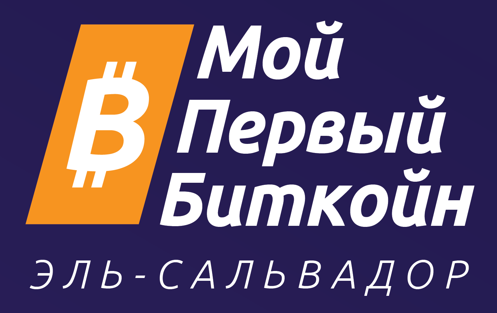</a>

 
 

**_Мой Первый Биткойн_** создал эту работу и предоставил её    
в свободном доступе на условиях **Creative Commons**.    

Эта работа находится под лицензией     
**Creative Commons**     
**Attribution-ShareAlike**    
**4.0 International (CC BY-SA 4.0)**    
 
 
 

__________________________________________________________________________________________________________    
    
# Биткойн-Диплом    

> **Важно:** [Юридический отказ от ответственности](../../../../DISCLAIMER_RU.md)

---

    
### _Финансовое Образование в Эпоху Биткойна_    

 
 

### ***Рабочая Тетрадь Для Учащихся***    
Русская Версия | Декабрь 2023 г.    
На Основе Английской Версии | Март 2023 г.    

 
 
 

***ПОЖЕРТВОВАЙТЕ СЕЙЧАС:***    

<a rel="Donation" href="https://miprimerbitcoin.io/en/donate/">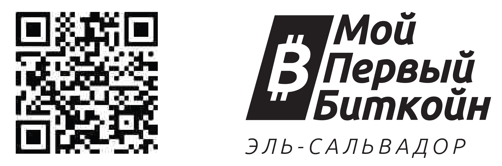</a>

 
bc1qc0h5ddd4ln4z05u55l87cp4umg8eg0jjkhcgvf        
      
__________________________________________________________________________________________________________              
           
### Благодарности    

     
    
Биткойн-диплом имел ошеломительный успех и вырос быстрее, чем кто-либо ожидал. Мы хотели бы отдать должное всем замечательным людям, которые привели нас сюда.    

Далия Платт — руководитель разработки учебных программ и движущая сила нашего контента с самого начала. Она рок-звезда. В подготовке этого издания ей оказали большую помощь замечательные авторы, в том числе Мэделин Херефорд, Грег Фосс, Ронни Авендано, Алехандро Галан, Эвелин Лемус, Херардо Линарес, Марк Платт, Джим Платт, Наполеон Осорио, Виктор Ясбек, Роберт Малка и Арел Эделькамп. А также, Глориана Солано, Рауль Гирола, Джакомо Зукко, Герсон Мартинес, Врити Сараф и другие поддержали более ранние издания. Херардо Апостол и Энрике Хубис из ACTIVA также внесли свой невероятный вклад.    

История Биткойн-диплом началась в феврале 2022 года на встрече в Ла Пачеко, государственной школе в Сан-Маркосе, Сальвадор. Среди присутствующих были директор школы по инновациям Асаэль Родригес, сторонник биткойн-образования и конгрессмен Родриго Айала и создатель сообщества Ibex Mercado Карлос Ториелло, который пригласил других биткойнеров, включая меня, посетить школу и обсудить образование.    

Первые студенты, получившие Биткойн-диплом, начали приниматься в апреле при ранней поддержке со стороны Ibex, а также сотен индивидуальных доноров. К июню первая группа из 38 студентов закончила обучение в Ла Пачеко, и мы начали расширяться. Благодаря огромной поддержке со стороны новых доноров и спонсоров, включая Bitfinex, местных мэров и Bitcoin Beach, набор студентов продолжает увеличиваться более чем вдвое каждые десять недель, и эта тенденция позволит нам в этом году охватить тысячи студентов по всей стране. В феврале 2023 года реализация учебной программы началась в Гватемале, и до конца года планируется распространить её на многие другие страны, включая Колумбию, Гондурас, Южную Африку, Эквадор и США. Пожертвования от этих программ позволят субсидировать еще больше студентов в Сальвадоре.    

Рабочая тетрадь Биткойн-диплом стала открытой. Он находится в свободном доступе, его переводили, распечатывали и независимо преподавали сообществам по всему миру, от Южной Кореи до Уругвая.    

Мой Первый Биткойн — это некоммерческая организация с единственной миссией — как можно быстрее обеспечить качественное, независимое и беспристрастное обучение Биткойна на уровне сообщества для всех в Сальвадоре. Будучи первой страной, принявшей Биткойн, Сальвадор станет примером для всего мира; мы сами решим, какой это будет пример. Наша цель – научить нацию и изменить мир. Я знаю, это звучит безумно, но я думаю, что мы на верном пути, и Биткойн-диплом — большая часть этого.    

Для лучшего мира,    

 

**Джон Деннехи**    
Основатель    
**_Мой Первый Биткойн_**    
Mарт 2023 г.    

# Оглавление    

> **Важно:** [Юридический отказ от ответственности](../../../../DISCLAIMER_RU.md)

---

### _[Благодарности](https://github.com/MyFirstBitcoin/Translation/blob/main/%D0%9C%D0%BE%D0%B9%20%D0%9F%D0%B5%D1%80%D0%B2%D1%8B%D0%B9%20%D0%91%D0%B8%D1%82%D0%BA%D0%BE%D0%B8%D0%BD%20-%20Russian/2023%20-%20March/WebView/10.Cover-and-Acknowledgments.md#%D0%B1%D0%BB%D0%B0%D0%B3%D0%BE%D0%B4%D0%B0%D1%80%D0%BD%D0%BE%D1%81%D1%82%D0%B8)_    
    
### _[Почему Биткойн?](https://github.com/MyFirstBitcoin/Translation/blob/main/%D0%9C%D0%BE%D0%B9%20%D0%9F%D0%B5%D1%80%D0%B2%D1%8B%D0%B9%20%D0%91%D0%B8%D1%82%D0%BA%D0%BE%D0%B8%D0%BD%20-%20Russian/2023%20-%20March/WebView/12.Why-Bitcoin_.md#%D0%BF%D0%BE%D1%87%D0%B5%D0%BC%D1%83-%D0%B1%D0%B8%D1%82%D0%BA%D0%BE%D0%B9%D0%BD)_    
    
### _[Глава №1 - Сила Денег](https://github.com/MyFirstBitcoin/Translation/blob/main/%D0%9C%D0%BE%D0%B9%20%D0%9F%D0%B5%D1%80%D0%B2%D1%8B%D0%B9%20%D0%91%D0%B8%D1%82%D0%BA%D0%BE%D0%B8%D0%BD%20-%20Russian/2023%20-%20March/WebView/13.Chapter-1.md#%D0%B3%D0%BB%D0%B0%D0%B2%D0%B0-1)_    
- [**1.0** Готовы?](https://github.com/MyFirstBitcoin/Translation/blob/main/%D0%9C%D0%BE%D0%B9%20%D0%9F%D0%B5%D1%80%D0%B2%D1%8B%D0%B9%20%D0%91%D0%B8%D1%82%D0%BA%D0%BE%D0%B8%D0%BD%20-%20Russian/2023%20-%20March/WebView/13.Chapter-1.md#10-%D0%B3%D0%BE%D1%82%D0%BE%D0%B2%D1%8B)    
- [**1.1** Обсуждение в Классе: Что Такое Деньги?](https://github.com/MyFirstBitcoin/Translation/blob/main/%D0%9C%D0%BE%D0%B9%20%D0%9F%D0%B5%D1%80%D0%B2%D1%8B%D0%B9%20%D0%91%D0%B8%D1%82%D0%BA%D0%BE%D0%B8%D0%BD%20-%20Russian/2023%20-%20March/WebView/13.Chapter-1.md#11-%D0%BE%D0%B1%D1%81%D1%83%D0%B6%D0%B4%D0%B5%D0%BD%D0%B8%D0%B5-%D0%B2-%D0%BA%D0%BB%D0%B0%D1%81%D1%81%D0%B5-%D1%87%D1%82%D0%BE-%D1%82%D0%B0%D0%BA%D0%BE%D0%B5-%D0%B4%D0%B5%D0%BD%D1%8C%D0%B3%D0%B8)    
- [**1.2** Ограниченный Мир: Преодоление Дефицита в Условиях Растущей Экономики](https://github.com/MyFirstBitcoin/Translation/blob/main/%D0%9C%D0%BE%D0%B9%20%D0%9F%D0%B5%D1%80%D0%B2%D1%8B%D0%B9%20%D0%91%D0%B8%D1%82%D0%BA%D0%BE%D0%B8%D0%BD%20-%20Russian/2023%20-%20March/WebView/13.Chapter-1.md#12-%D0%BE%D0%B3%D1%80%D0%B0%D0%BD%D0%B8%D1%87%D0%B5%D0%BD%D0%BD%D1%8B%D0%B9-%D0%BC%D0%B8%D1%80-%D0%BF%D1%80%D0%B5%D0%BE%D0%B4%D0%BE%D0%BB%D0%B5%D0%BD%D0%B8%D0%B5-%D0%B4%D0%B5%D1%84%D0%B8%D1%86%D0%B8%D1%82%D0%B0-%D0%B2-%D1%83%D1%81%D0%BB%D0%BE%D0%B2%D0%B8%D1%8F%D1%85-%D1%80%D0%B0%D1%81%D1%82%D1%83%D1%89%D0%B5%D0%B9-%D1%8D%D0%BA%D0%BE%D0%BD%D0%BE%D0%BC%D0%B8%D0%BA%D0%B8)    
- [**1.3** Определение Денег](https://github.com/MyFirstBitcoin/Translation/blob/main/%D0%9C%D0%BE%D0%B9%20%D0%9F%D0%B5%D1%80%D0%B2%D1%8B%D0%B9%20%D0%91%D0%B8%D1%82%D0%BA%D0%BE%D0%B8%D0%BD%20-%20Russian/2023%20-%20March/WebView/13.Chapter-1.md#13-%D0%BE%D0%BF%D1%80%D0%B5%D0%B4%D0%B5%D0%BB%D0%B5%D0%BD%D0%B8%D0%B5-%D0%B4%D0%B5%D0%BD%D0%B5%D0%B3)    
  - [**1.3.1** Мы Можем Их Использовать, но Можем Ли Мы Дать Им Определение?](https://github.com/MyFirstBitcoin/Translation/blob/main/%D0%9C%D0%BE%D0%B9%20%D0%9F%D0%B5%D1%80%D0%B2%D1%8B%D0%B9%20%D0%91%D0%B8%D1%82%D0%BA%D0%BE%D0%B8%D0%BD%20-%20Russian/2023%20-%20March/WebView/13.Chapter-1.md#131-%D0%BC%D1%8B-%D0%BC%D0%BE%D0%B6%D0%B5%D0%BC-%D0%B8%D1%85-%D0%B8%D1%81%D0%BF%D0%BE%D0%BB%D1%8C%D0%B7%D0%BE%D0%B2%D0%B0%D1%82%D1%8C-%D0%BD%D0%BE-%D0%BC%D0%BE%D0%B6%D0%B5%D0%BC-%D0%BB%D0%B8-%D0%BC%D1%8B-%D0%B4%D0%B0%D1%82%D1%8C-%D0%B8%D0%BC-%D0%BE%D0%BF%D1%80%D0%B5%D0%B4%D0%B5%D0%BB%D0%B5%D0%BD%D0%B8%D0%B5)    
  - [**1.3.2** Функции Денег](https://github.com/MyFirstBitcoin/Translation/blob/main/%D0%9C%D0%BE%D0%B9%20%D0%9F%D0%B5%D1%80%D0%B2%D1%8B%D0%B9%20%D0%91%D0%B8%D1%82%D0%BA%D0%BE%D0%B8%D0%BD%20-%20Russian/2023%20-%20March/WebView/13.Chapter-1.md#132-%D1%84%D1%83%D0%BD%D0%BA%D1%86%D0%B8%D0%B8-%D0%B4%D0%B5%D0%BD%D0%B5%D0%B3)    
  - [**1.3.3** Характеристики Денег](https://github.com/MyFirstBitcoin/Translation/blob/main/%D0%9C%D0%BE%D0%B9%20%D0%9F%D0%B5%D1%80%D0%B2%D1%8B%D0%B9%20%D0%91%D0%B8%D1%82%D0%BA%D0%BE%D0%B8%D0%BD%20-%20Russian/2023%20-%20March/WebView/13.Chapter-1.md#133-%D1%85%D0%B0%D1%80%D0%B0%D0%BA%D1%82%D0%B5%D1%80%D0%B8%D1%81%D1%82%D0%B8%D0%BA%D0%B8-%D0%B4%D0%B5%D0%BD%D0%B5%D0%B3)    
  - [**1.3.4** Виды Денег](https://github.com/MyFirstBitcoin/Translation/blob/main/%D0%9C%D0%BE%D0%B9%20%D0%9F%D0%B5%D1%80%D0%B2%D1%8B%D0%B9%20%D0%91%D0%B8%D1%82%D0%BA%D0%BE%D0%B8%D0%BD%20-%20Russian/2023%20-%20March/WebView/13.Chapter-1.md#134-%D0%B2%D0%B8%D0%B4%D1%8B-%D0%B4%D0%B5%D0%BD%D0%B5%D0%B3)    

### _[Глава №2 - От Бартера к Биткойнам и ЦВЦБ: Путешествие Во Времени](https://github.com/MyFirstBitcoin/Translation/blob/main/%D0%9C%D0%BE%D0%B9%20%D0%9F%D0%B5%D1%80%D0%B2%D1%8B%D0%B9%20%D0%91%D0%B8%D1%82%D0%BA%D0%BE%D0%B8%D0%BD%20-%20Russian/2023%20-%20March/WebView/14.Chapter-2.md#%D0%B3%D0%BB%D0%B0%D0%B2%D0%B0-2)_      

- [**2.0** Введение](https://github.com/MyFirstBitcoin/Translation/blob/main/%D0%9C%D0%BE%D0%B9%20%D0%9F%D0%B5%D1%80%D0%B2%D1%8B%D0%B9%20%D0%91%D0%B8%D1%82%D0%BA%D0%BE%D0%B8%D0%BD%20-%20Russian/2023%20-%20March/WebView/14.Chapter-2.md#20-%D0%B2%D0%B2%D0%B5%D0%B4%D0%B5%D0%BD%D0%B8%D0%B5)       
  - [**2.0.1** Классное Упражнение: Бартерная Игра](https://github.com/MyFirstBitcoin/Translation/blob/main/%D0%9C%D0%BE%D0%B9%20%D0%9F%D0%B5%D1%80%D0%B2%D1%8B%D0%B9%20%D0%91%D0%B8%D1%82%D0%BA%D0%BE%D0%B8%D0%BD%20-%20Russian/2023%20-%20March/WebView/14.Chapter-2.md#201-%D0%BA%D0%BB%D0%B0%D1%81%D1%81%D0%BD%D0%BE%D0%B5-%D1%83%D0%BF%D1%80%D0%B0%D0%B6%D0%BD%D0%B5%D0%BD%D0%B8%D0%B5-%D0%B1%D0%B0%D1%80%D1%82%D0%B5%D1%80%D0%BD%D0%B0%D1%8F-%D0%B8%D0%B3%D1%80%D0%B0)         
- [**2.1** Ранние Формы Денег](https://github.com/MyFirstBitcoin/Translation/blob/main/%D0%9C%D0%BE%D0%B9%20%D0%9F%D0%B5%D1%80%D0%B2%D1%8B%D0%B9%20%D0%91%D0%B8%D1%82%D0%BA%D0%BE%D0%B8%D0%BD%20-%20Russian/2023%20-%20March/WebView/14.Chapter-2.md#21-%D1%80%D0%B0%D0%BD%D0%BD%D0%B8%D0%B5-%D1%84%D0%BE%D1%80%D0%BC%D1%8B-%D0%B4%D0%B5%D0%BD%D0%B5%D0%B3)       
- [**2.2** От Товаров к Долговым Распискам](https://github.com/MyFirstBitcoin/Translation/blob/main/%D0%9C%D0%BE%D0%B9%20%D0%9F%D0%B5%D1%80%D0%B2%D1%8B%D0%B9%20%D0%91%D0%B8%D1%82%D0%BA%D0%BE%D0%B8%D0%BD%20-%20Russian/2023%20-%20March/WebView/14.Chapter-2.md#22-%D0%BE%D1%82-%D1%82%D0%BE%D0%B2%D0%B0%D1%80%D0%BE%D0%B2-%D0%BA-%D0%B4%D0%BE%D0%BB%D0%B3%D0%BE%D0%B2%D1%8B%D0%BC-%D1%80%D0%B0%D1%81%D0%BF%D0%B8%D1%81%D0%BA%D0%B0%D0%BC)       
- [**2.3** Переход от Надёжных Денег к Ненадёжным](https://github.com/MyFirstBitcoin/Translation/blob/main/%D0%9C%D0%BE%D0%B9%20%D0%9F%D0%B5%D1%80%D0%B2%D1%8B%D0%B9%20%D0%91%D0%B8%D1%82%D0%BA%D0%BE%D0%B8%D0%BD%20-%20Russian/2023%20-%20March/WebView/14.Chapter-2.md#23-%D0%BF%D0%B5%D1%80%D0%B5%D1%85%D0%BE%D0%B4-%D0%BE%D1%82-%D0%BD%D0%B0%D0%B4%D1%91%D0%B6%D0%BD%D1%8B%D1%85-%D0%B4%D0%B5%D0%BD%D0%B5%D0%B3-%D0%BA-%D0%BD%D0%B5%D0%BD%D0%B0%D0%B4%D1%91%D0%B6%D0%BD%D1%8B%D0%BC)      
- [**2.4** Где Мы Находимся Сегодня?](https://github.com/MyFirstBitcoin/Translation/blob/main/%D0%9C%D0%BE%D0%B9%20%D0%9F%D0%B5%D1%80%D0%B2%D1%8B%D0%B9%20%D0%91%D0%B8%D1%82%D0%BA%D0%BE%D0%B8%D0%BD%20-%20Russian/2023%20-%20March/WebView/14.Chapter-2.md#24-%D0%B3%D0%B4%D0%B5-%D0%BC%D1%8B-%D0%BD%D0%B0%D1%85%D0%BE%D0%B4%D0%B8%D0%BC%D1%81%D1%8F-%D1%81%D0%B5%D0%B3%D0%BE%D0%B4%D0%BD%D1%8F)          
- [**2.5** Цена Контроля: Взгляд на Слежку, Цензуру и Регулирование](https://github.com/MyFirstBitcoin/Translation/blob/main/%D0%9C%D0%BE%D0%B9%20%D0%9F%D0%B5%D1%80%D0%B2%D1%8B%D0%B9%20%D0%91%D0%B8%D1%82%D0%BA%D0%BE%D0%B8%D0%BD%20-%20Russian/2023%20-%20March/WebView/14.Chapter-2.md#25-%D1%86%D0%B5%D0%BD%D0%B0-%D0%BA%D0%BE%D0%BD%D1%82%D1%80%D0%BE%D0%BB%D1%8F-%D0%B2%D0%B7%D0%B3%D0%BB%D1%8F%D0%B4-%D0%BD%D0%B0-%D1%81%D0%BB%D0%B5%D0%B6%D0%BA%D1%83-%D1%86%D0%B5%D0%BD%D0%B7%D1%83%D1%80%D0%B0-%D0%B8-%D1%80%D0%B5%D0%B3%D1%83%D0%BB%D0%B8%D1%80%D0%BE%D0%B2%D0%B0%D0%BD%D0%B8%D0%B5)        
  - [**2.5.1** Возникновение Безналичного Общества](https://github.com/MyFirstBitcoin/Translation/blob/main/%D0%9C%D0%BE%D0%B9%20%D0%9F%D0%B5%D1%80%D0%B2%D1%8B%D0%B9%20%D0%91%D0%B8%D1%82%D0%BA%D0%BE%D0%B8%D0%BD%20-%20Russian/2023%20-%20March/WebView/14.Chapter-2.md#251-%D0%B2%D0%BE%D0%B7%D0%BD%D0%B8%D0%BA%D0%BD%D0%BE%D0%B2%D0%B5%D0%BD%D0%B8%D0%B5-%D0%B1%D0%B5%D0%B7%D0%BD%D0%B0%D0%BB%D0%B8%D1%87%D0%BD%D0%BE%D0%B3%D0%BE-%D0%BE%D0%B1%D1%89%D0%B5%D1%81%D1%82%D0%B2%D0%B0)         
  - [**2.5.2** Наблюдение](https://github.com/MyFirstBitcoin/Translation/blob/main/%D0%9C%D0%BE%D0%B9%20%D0%9F%D0%B5%D1%80%D0%B2%D1%8B%D0%B9%20%D0%91%D0%B8%D1%82%D0%BA%D0%BE%D0%B8%D0%BD%20-%20Russian/2023%20-%20March/WebView/14.Chapter-2.md#252-%D0%BD%D0%B0%D0%B1%D0%BB%D1%8E%D0%B4%D0%B5%D0%BD%D0%B8%D0%B5)         
  - [**2.5.3** Финансовое Регулирование и Цензура](https://github.com/MyFirstBitcoin/Translation/blob/main/%D0%9C%D0%BE%D0%B9%20%D0%9F%D0%B5%D1%80%D0%B2%D1%8B%D0%B9%20%D0%91%D0%B8%D1%82%D0%BA%D0%BE%D0%B8%D0%BD%20-%20Russian/2023%20-%20March/WebView/14.Chapter-2.md#253-%D1%84%D0%B8%D0%BD%D0%B0%D0%BD%D1%81%D0%BE%D0%B2%D0%BE%D0%B5-%D1%80%D0%B5%D0%B3%D1%83%D0%BB%D0%B8%D1%80%D0%BE%D0%B2%D0%B0%D0%BD%D0%B8%D0%B5-%D0%B8-%D1%86%D0%B5%D0%BD%D0%B7%D1%83%D0%1%D0%0%D0%0%D0%B0)         

### _[Глава №3 - Раскрытие Темной Стороны Фиата](https://github.com/MyFirstBitcoin/Translation/blob/main/%D0%9C%D0%BE%D0%B9%20%D0%9F%D0%B5%D1%80%D0%B2%D1%8B%D0%B9%20%D0%91%D0%B8%D1%82%D0%BA%D0%BE%D0%B8%D0%BD%20-%20Russian/2023%20-%20March/WebView/15.Chapter-3.md#%D0%B3%D0%BB%D0%B0%D0%B2%D0%B0-3)_    

- [**3.0** Классное Упражнение: Влияние Инфляции: Аукционная Деятельность](https://github.com/MyFirstBitcoin/Translation/blob/main/%D0%9C%D0%BE%D0%B9%20%D0%9F%D0%B5%D1%80%D0%B2%D1%8B%D0%B9%20%D0%91%D0%B8%D1%82%D0%BA%D0%BE%D0%B8%D0%BD%20-%20Russian/2023%20-%20March/WebView/15.Chapter-3.md#30-%D0%BA%D0%BB%D0%B0%D1%81%D1%81%D0%BD%D0%BE%D0%B5-%D1%83%D0%BF%D1%80%D0%B0%D0%B6%D0%BD%D0%B5%D0%BD%D0%B8%D0%B5-%D0%B2%D0%BB%D0%B8%D1%8F%D0%BD%D0%B8%D0%B5-%D0%B8%D0%BD%D1%84%D0%BB%D1%8F%D1%86%D0%B8%D0%B8-%D0%B0%D1%83%D0%BA%D1%86%D0%B8%D0%BE%D0%BD%D0%BD%D0%B0%D1%8F-%D0%B4%D0%B5%D1%8F%D1%82%D0%B5%D0%BB%D1%8C%D0%BD%D0%BE%D1%81%D1%82%D1%8C)      
- [**3.1** Самые Большие Угрозы Вашим Деньгам: Инфляция, Обесценивание и Потеря Покупательной Способности](https://github.com/MyFirstBitcoin/Translation/blob/main/%D0%9C%D0%BE%D0%B9%20%D0%9F%D0%B5%D1%80%D0%B2%D1%8B%D0%B9%20%D0%91%D0%B8%D1%82%D0%BA%D0%BE%D0%B8%D0%BD%20-%20Russian/2023%20-%20March/WebView/15.Chapter-3.md#31-%D1%81%D0%B0%D0%BC%D1%8B%D0%B5-%D0%B1%D0%BE%D0%BB%D1%8C%D1%88%D0%B8%D0%B5-%D1%83%D0%B3%D1%80%D0%BE%D0%B7%D1%8B-%D0%B2%D0%B0%D1%88%D0%B8%D0%BC-%D0%B4%D0%B5%D0%BD%D1%8C%D0%B3%D0%B0%D0%BC-%D0%B8%D0%BD%D1%84%D0%BB%D1%8F%D1%86%D0%B8%D1%8F-%D0%BE%D0%B1%D0%B5%D1%81%D1%86%D0%B5%D0%BD%D0%B8%D0%B2%D0%B0%D0%BD%D0%B8%D0%B5-%D0%B8-%D0%BF%D0%BE%D1%82%D0%B5%D1%80%D1%8F-%D0%BF%D0%BE%D0%BA%D1%83%D0%BF%D0%B0%D1%82%D0%B5%D0%BB%D1%8C%D0%BD%D0%BE%D0%B9-%D1%81%D0%BF%D0%BE%D1%81%D0%BE%D0%B1%D0%BD%D0%BE%D1%81%D1%82%D0%B8)     
- [**3.2** Долг: Тонкая Грань Между Помощью и Вредом](https://github.com/MyFirstBitcoin/Translation/blob/main/%D0%9C%D0%BE%D0%B9%20%D0%9F%D0%B5%D1%80%D0%B2%D1%8B%D0%B9%20%D0%91%D0%B8%D1%82%D0%BA%D0%BE%D0%B8%D0%BD%20-%20Russian/2023%20-%20March/WebView/15.Chapter-3.md#32-%D0%B4%D0%BE%D0%BB%D0%B3-%D1%82%D0%BE%D0%BD%D0%BA%D0%B0%D1%8F-%D0%B3%D1%80%D0%B0%D0%BD%D1%8C-%D0%BC%D0%B5%D0%B6%D0%B4%D1%83-%D0%BF%D0%BE%D0%BC%D0%BE%D1%89%D1%8C%D1%8E-%D0%B8-%D0%B2%D1%80%D0%B5%D0%B4%D0%BE%D0%BC)     
- [**3.3** ФРС и Её Партнеры: Как Правительство и Банки Контролируют Денежную Массу](https://github.com/MyFirstBitcoin/Translation/blob/main/%D0%9C%D0%BE%D0%B9%20%D0%9F%D0%B5%D1%80%D0%B2%D1%8B%D0%B9%20%D0%91%D0%B8%D1%82%D0%BA%D0%BE%D0%B8%D0%BD%20-%20Russian/2023%20-%20March/WebView/15.Chapter-3.md#33-%D1%84%D1%80%D1%81-%D0%B8-%D0%B5%D1%91-%D0%BF%D0%B0%D1%80%D1%82%D0%BD%D0%B5%D1%80%D1%8B-%D0%BA%D0%B0%D0%BA-%D0%BF%D1%80%D0%B0%D0%B2%D0%B8%D1%82%D0%B5%D0%BB%D1%8C%D1%81%D1%82%D0%B2%D0%BE-%D0%B8-%D0%B1%D0%B0%D0%BD%D0%BA%D0%B8-%D0%BA%D0%BE%D0%BD%D1%82%D1%80%D0%BE%D0%BB%D0%B8%D1%80%D1%83%D1%8E%D1%82-%D0%B4%D0%B5%D0%BD%D0%B5%D0%B6%D0%BD%D1%83%D1%8E-%D0%BC%D0%B0%D1%81%D1%81%D1%83)     
- [**3.4** Магия Создания Денег](https://github.com/MyFirstBitcoin/Translation/blob/main/%D0%9C%D0%BE%D0%B9%20%D0%9F%D0%B5%D1%80%D0%B2%D1%8B%D0%B9%20%D0%91%D0%B8%D1%82%D0%BA%D0%BE%D0%B8%D0%BD%20-%20Russian/2023%20-%20March/WebView/15.Chapter-3.md#34-%D0%BC%D0%B0%D0%B3%D0%B8%D1%8F-%D1%81%D0%BE%D0%B7%D0%B4%D0%B0%D0%BD%D0%B8%D1%8F-%D0%B4%D0%B5%D0%BD%D0%B5%D0%B3)     
  - [**3.4.1** Временная Стоимость Денег и Её Роль в Экономическом Росте](https://github.com/MyFirstBitcoin/Translation/blob/main/%D0%9C%D0%BE%D0%B9%20%D0%9F%D0%B5%D1%80%D0%B2%D1%8B%D0%B9%20%D0%91%D0%B8%D1%82%D0%BA%D0%BE%D0%B8%D0%BD%20-%20Russian/2023%20-%20March/WebView/15.Chapter-3.md#341-%D0%B2%D1%80%D0%B5%D0%BC%D0%B5%D0%BD%D0%BD%D0%B0%D1%8F-%D1%81%D1%82%D0%BE%D0%B8%D0%BC%D0%BE%D1%81%D1%82%D1%8C-%D0%B4%D0%B5%D0%BD%D0%B5%D0%B3-%D0%B8-%D0%B5%D1%91-%D1%80%D0%BE%D0%BB%D1%8C-%D0%B2-%D1%8D%D0%BA%D0%BE%D0%BD%D0%BE%D0%BC%D0%B8%D1%87%D0%B5%D1%81%D0%BA%D0%BE%D0%BC-%D1%80%D0%BE%D1%81%D1%82%D0%B5)     
  - [**3.4.2** Экономия Денег в Трудные Времена](https://github.com/MyFirstBitcoin/Translation/blob/main/%D0%9C%D0%BE%D0%B9%20%D0%9F%D0%B5%D1%80%D0%B2%D1%8B%D0%B9%20%D0%91%D0%B8%D1%82%D0%BA%D0%BE%D0%B8%D0%BD%20-%20Russian/2023%20-%20March/WebView/15.Chapter-3.md#342-%D1%8D%D0%BA%D0%BE%D0%BD%D0%BE%D0%BC%D0%B8%D1%8F-%D0%B4%D0%B5%D0%BD%D0%B5%D0%B3-%D0%B2-%D1%82%D1%80%D1%83%D0%B4%D0%BD%D1%8B%D0%B5-%D0%B2%D1%80%D0%B5%D0%BC%D0%B5%D0%BD%D0%B0)     
  - [**3.4.3** Частичное Банковское Резервирование](https://github.com/MyFirstBitcoin/Translation/blob/main/%D0%9C%D0%BE%D0%B9%20%D0%9F%D0%B5%D1%80%D0%B2%D1%8B%D0%B9%20%D0%91%D0%B8%D1%82%D0%BA%D0%BE%D0%B8%D0%BD%20-%20Russian/2023%20-%20March/WebView/15.Chapter-3.md#343-%D1%87%D0%B0%D1%81%D1%82%D0%B8%D1%87%D0%BD%D0%BE%D0%B5-%D0%B1%D0%B0%D0%BD%D0%BA%D0%BE%D0%B2%D1%81%D0%BA%D0%BE%D0%B5-%D1%80%D0%B5%D0%B7%D0%B5%D1%80%D0%B2%D0%B8%D1%80%D0%BE%D0%B2%D0%B0%D0%BD%D0%B8%D0%B5)     
  - [**3.4.4** Классное Упражнение: Частичное Банковское Резервирование](https://github.com/MyFirstBitcoin/Translation/blob/main/%D0%9C%D0%BE%D0%B9%20%D0%9F%D0%B5%D1%80%D0%B2%D1%8B%D0%B9%20%D0%91%D0%B8%D1%82%D0%BA%D0%BE%D0%B8%D0%BD%20-%20Russian/2023%20-%20March/WebView/15.Chapter-3.md#344-%D0%BA%D0%BB%D0%B0%D1%81%D1%81%D0%BD%D0%BE%D0%B5-%D1%83%D0%BF%D1%80%D0%B0%D0%B6%D0%BD%D0%B5%D0%BD%D0%B8%D0%B5-%D1%87%D0%B0%D1%81%D1%82%D0%B8%D1%87%D0%BD%D0%BE%D0%B5-%D0%B1%D0%B0%D0%BD%D0%BA%D0%BE%D0%B2%D1%81%D0%BA%D0%BE%D0%B5-%D1%80%D0%B5%D0%B7%D0%B5%D0%B7%D0%B5%D1%80%D0%B2%D0%B8%D1%80%D0%BE%D0%B2%D0%B0%D0%BD%D0%B8%D0%B5)     
      
_________________________________________________________________________________________________________
    
### _[Глава №4 - Будущее Децентрализовано: Расширение Прав и Возможностей Сообществ и Частных Лиц](https://github.com/MyFirstBitcoin/Translation/blob/main/%D0%9C%D0%BE%D0%B9%20%D0%9F%D0%B5%D1%80%D0%B2%D1%8B%D0%B9%20%D0%91%D0%B8%D1%82%D0%BA%D0%BE%D0%B8%D0%BD%20-%20Russian/2023%20-%20March/WebView/16.Chapter-4.md#%D0%B3%D0%BB%D0%B0%D0%B2%D0%B0-4)_    

- [**4.0** От Кризиса к Инновациям: Шифропанки и Создание Децентрализованной Цифровой Валюты](https://github.com/MyFirstBitcoin/Translation/blob/main/%D0%9C%D0%BE%D0%B9%20%D0%9F%D0%B5%D1%80%D0%B2%D1%8B%D0%B9%20%D0%91%D0%B8%D1%82%D0%BA%D0%BE%D0%B8%D0%BD%20-%20Russian/2023%20-%20March/WebView/16.Chapter-4.md#40-%D0%BE%D1%82-%D0%BA%D1%80%D0%B8%D0%B7%D0%B8%D1%81%D0%B0-%D0%BA-%D0%B8%D0%BD%D0%BD%D0%BE%D0%B2%D0%B0%D1%86%D0%B8%D1%8F%D0%BC-%D1%88%D0%B8%D1%84%D1%80%D0%BE%D0%BF%D0%B0%D0%BD%D0%BA%D0%B8-%D0%B8-%D1%81%D0%BE%D0%B7%D0%B4%D0%B0%D0%BD%D0%B8%D0%B5-%D0%B4%D0%B5%D1%86%D0%B5%D0%BD%D1%82%D1%80%D0%B0%D0%BB%D0%B8%D0%B7%D0%BE%D0%B2%D0%B0%D0%BD%D0%BD%D0%BE%D0%B9-%D1%86%D0%B8%D1%84%D1%80%D0%BE%D0%B2%D0%BE%D0%B9-%D0%B2%D0%B0%D0%BB%D1%8E%D1%82%D1%8B)    
- [**4.1** Злоупотребление Централизацией](https://github.com/MyFirstBitcoin/Translation/blob/main/%D0%9C%D0%BE%D0%B9%20%D0%9F%D0%B5%D1%80%D0%B2%D1%8B%D0%B9%20%D0%91%D0%B8%D1%82%D0%BA%D0%BE%D0%B8%D0%BD%20-%20Russian/2023%20-%20March/WebView/16.Chapter-4.md#41-%D0%B7%D0%BB%D0%BE%D1%83%D0%BF%D0%BE%D1%82%D1%80%D0%B5%D0%B1%D0%BB%D0%B5%D0%BD%D0%B8%D0%B5-%D1%86%D0%B5%D0%BD%D1%82%D1%80%D0%B0%D0%BB%D0%B8%D0%B7%D0%B0%D1%86%D0%B8%D0%B5%D0%B9)    
  - [**4.1.1** Централизованные Системы](https://github.com/MyFirstBitcoin/Translation/blob/main/%D0%9C%D0%BE%D0%B9%20%D0%9F%D%B5%D1%80%D0%B2%D1%8B%D0%B9%20%D0%91%D0%B8%D1%82%D0%BA%D0%BE%D0%B8%D0%BD%20-%20Russian/2023%20-%20March/WebView/16.Chapter-4.md#411-%D1%86%D0%B5%D0%BD%D1%82%D1%80%D0%B0%D0%BB%D0%B8%D0%B7%D0%BE%D0%B2%D0%B0%D0%BD%D0%BD%D1%8B%D0%B5-%D1%81%D0%B8%D1%81%D1%82%D0%B5%D0%BC%D1%8B)    
  - [**4.1.2** Подсчет Посредников: Взгляд на Посредников в Транзакции по Кредитной Карте](https://github.com/MyFirstBitcoin/Translation/blob/main/%D0%9C%D0%BE%D0%B9%20%D0%9F%D1%80%D0%B2%D1%8B%D0%B9%20%D0%91%D0%B8%D1%82%D0%BA%D0%BE%D0%B8%D0%BD%20-%20Russian/2023%20-%20March/WebView/16.Chapter-4.md#412-%D0%BF%D0%BE%D0%B4%D1%81%D1%87%D0%B5%D1%82-%D0%BF%D0%BE%D1%81%D1%80%D0%B5%D0%B4%D0%BD%D0%B8%D0%BA%D0%BE%D0%B2-%D0%B2%D0%B7%D0%B3%D0%BB%D1%8F%D0%B4-%D0%BD%D0%B0-%D0%BF%D0%BE%D1%81%D1%80%D0%B5%D0%B4%D0%BD%D0%B8%D0%BA%D0%BE%D0%B2-%D0%B2-%D1%82%D1%80%D0%B0%D0%BD%D0%B7%D0%B0%D0%BA%D1%86%D0%B8%D0%B8-%D0%BF%D0%BE-%D0%BA%D1%80%D0%B5%D0%B4%D0%B8%D1%82%D0%BD%D0%BE%D0%B9-%D0%BA%D0%B0%D1%80%D1%82%D0%B5)
- [**4.2** Мощный Инструмент для Преодоления Ограничений Централизации](https://github.com/MyFirstBitcoin/Translation/blob/main/%D0%9C%D0%BE%D0%B9%20%D0%9F%D0%B5%D1%80%D0%B2%D1%8B%D0%B9%20%D0%91%D0%B8%D1%82%D0%BA%D0%BE%D0%B8%D0%BD%20-%20Russian/2023%20-%20March/WebView/16.Chapter-4.md#42-%D0%BC%D0%BE%D1%89%D0%BD%D0%B9-%D0%B8%D0%BD%D1%81%D1%82%D1%80%D1%83%D0%BC%D0%B5%D0%BD%D1%82-%D0%B4%D0%BB%D1%8F-%D0%BF%D1%80%D0%B5%D0%BE%D0%B4%D0%BE%D0%BB%D0%B5%D0%BD%D0%B8%D1%8F-%D0%BE%D0%B3%D1%80%D0%B0%D0%BD%D0%B8%D1%87%D0%B5%D0%BD%D0%B8%D0%B9-%D1%86%D0%B5%D0%BD%D1%82%D1%80%D0%B0%D0%BB%D0%B8%D0%B7%D0%B0%D1%86%D0%B8%D0%B8)    
  - [**4.2.1** Классное Упражнение: Децентрализованная Игра на Основе Консенсуса с Плохими Участниками](https://github.com/MyFirstBitcoin/Translation/blob/main/%D0%9C%D0%BE%D0%B9%20%D0%9F%D1%80%D0%B2%D1%8B%D0%B9%20%D0%91%D0%B8%D1%82%D0%BA%D0%BE%D0%B8%D0%BD%20-%20Russian/2023%20-%20March/WebView/16.Chapter-4.md#421-%D0%BA%D0%BB%D0%B0%D1%81%D1%81%D0%BD%D0%BE%D0%B5-%D1%83%D0%BF%D1%80%D0%B0%D0%B6%D0%BD%D0%B5%D0%BD%D0%B8%D0%B5-%D0%B4%D0%B5%D1%86%D0%B5%D0%BD%D1%82%D1%80%D0%B0%D0%BB%D0%B8%D0%B7%D0%BE%D0%B2%D0%B0%D0%BD%D0%B0%D1%8F-%D0%B8%D0%B3%D1%80%D0%B0-%D0%BD%D0%B0-%D0%BE%D1%81%D0%BD%D0%BE%D0%B2%D0%B5-%D0%BA%D0%BE%D0%BD%D1%81%D0%B5%D0%BD%D1%81%D1%83%D1%81%D0%B0-%D1%81-%D0%BF%D0%BB%D0%BE%D1%85%D0%B8%D0%BC%D0%B8-%D1%83%D1%87%D0%B0%D1%81%D1%82%D0%BD%D0%B8%D0%BA%D0%B0%D0%BC%D0%B8)    
- [**4.3** Сделки — Это Всего Лишь Торговые Соглашения](https://github.com/MyFirstBitcoin/Translation/blob/main/%D0%9C%D0%BE%D0%B9%20%D0%9F%D0%B5%D1%80%D0%B2%D1%8B%D0%B9%20%D0%91%D0%B8%D1%82%D0%BA%D0%BE%D0%B8%D0%BD%20-%20Russian/2023%20-%20March/WebView/16.Chapter-4.md#43-%D1%81%D0%B4%D0%B5%D0%BB%D0%BA%D0%B8--%D1%8D%D1%82%D0%BE-%D0%B2%D1%81%D0%B5%D0%B3%D0%BE-%D0%BB%D0%B8%D1%88%D1%8C-%D1%82%D0%BE%D1%80%D0%B3%D0%BE%D0%B2%D1%8B%D0%B5-%D1%81%D0%BE%D0%B3%D0%BB%D0%B0%D1%88%D0%B5%D0%BD%D0%B8%D1%8F)    
  - [**4.3.1** Доверять или Не Доверять](https://github.com/MyFirstBitcoin/Translation/blob/main/%D0%9C%D0%BE%D0%B9%20%D0%9F%D0%B5%D1%80%D0%B2%D1%8B%D0%B9%20%D0%91%D0%B8%D1%82%D0%BA%D0%BE%D0%B8%D0%BD%20-%20Russian/2023%20-%20March/WebView/16.Chapter-4.md#431-%D0%B4%D0%BE%D0%B2%D0%B5%D1%80%D1%8F%D1%82%D1%8C-%D0%B8%D0%BB%D0%B8-%D0%BD%D0%B5-%D0%B4%D0%BE%D0%B2%D0%B5%D1%80%D1%8F%D1%82%D1%8C)    
  - [**4.3.2** Давайте Заменим Доверие Правилами](https://github.com/MyFirstBitcoin/Translation/blob/main/%D0%9C%D0%BE%D0%B9%20%D0%9F%D0%B5%D1%80%D0%B2%D1%8B%D0%B9%20%D0%91%D0%B8%D1%82%D0%BA%D0%BE%D0%B8%D0%BD%20-%20Russian/2023%20-%20March/WebView/16.Chapter-4.md#432-%D0%B4%D0%B0%D0%B2%D0%B0%D0%B9%D1%82%D0%B5-%D0%B7%D0%B0%D0%BC%D0%B5%D0%BD%D0%B8%D0%BC-%D0%B4%D0%BE%D0%B2%D0%B5%D1%80%D0%B8%D0%B5-%D0%BF%D1%80%D0%B0%D0%B2%D0%B8%D0%BB%D0%B0%D0%BC%D0%B8)    
- [**4.4** Раскрытие Возможностей Блокчейна: Технология, Революционизирующая Будущее](https://github.com/MyFirstBitcoin/Translation/blob/main/%D0%9C%D0%BE%D0%B9%20%D0%9F%D0%B5%D1%80%D0%B2%D1%8B%D0%B9%20%D0%91%D0%B8%D1%82%D0%BA%D0%BE%D0%B8%D0%BD%20-%20Russian/2023%20-%20March/WebView/16.Chapter-4.md#44-%D1%80%D0%B0%D1%81%D0%BA%D1%80%D1%8B%D1%82%D0%B8%D0%B5-%D0%B2%D0%BE%D0%B7%D0%BC%D0%BE%D0%B6%D0%BD%D0%BE%D1%81%D1%82%D0%B5%D0%B9-%D0%B1%D0%BB%D0%BE%D0%BA%D1%87%D0%B5%D0%B9%D0%BD%D0%B0-%D1%82%D0%B5%D1%85%D0%BD%D0%BE%D0%BB%D0%BE%D0%B3%D0%B8%D1%8F-%D1%80%D0%B5%D0%B2%D0%BE%D0%BB%D1%8E%D1%86%D0%B8%D0%BE%D0%BD%D0%B8%D0%B7%D0%B8%D1%80%D1%83%D1%8E%D1%89%D0%B0%D1%8F-%D0%B1%D1%83%D0%B4%D1%83%D1%89%D0%B5%D0%B5)    

### _[Глава №5 - Раскрытие Будущего Денег: Введение в Биткойн](https://github.com/MyFirstBitcoin/Translation/blob/main/%D0%9C%D0%BE%D0%B9%20%D0%9F%D0%B5%D1%80%D0%B2%D1%8B%D0%B9%20%D0%91%D0%B8%D1%82%D0%BA%D0%BE%D0%B8%D0%BD%20-%20Russian/2023%20-%20March/WebView/17.Chapter-5.md#%D0%B3%D0%BB%D0%B0%D0%B2%D0%B0-5)_

- [**5.0** Таинственный Создатель Биткойна: Раскрытие Личности Сатоши Накамото и Его Белай Книге](https://github.com/MyFirstBitcoin/Translation/blob/main/%D0%9C%D0%BE%D0%B9%20%D0%9F%D0%B5%D1%80%D0%B2%D1%8B%D0%B9%20%D0%91%D0%B8%D1%82%D0%BA%D0%BE%D0%B8%D0%BD%20-%20Russian/2023%20-%20March/WebView/17.Chapter-5.md#50-%D1%82%D0%B0%D0%B8%D0%BD%D1%81%D1%82%D0%B2%D0%B5%D0%BD%D0%BD%D1%8B%D0%B9-%D1%81%D0%BE%D0%B7%D0%B4%D0%B0%D1%82%D0%B5%D0%BB%D1%8C-%D0%B1%D0%B8%D1%82%D0%BA%D0%BE%D0%B9%D0%BD%D0%B0-%D1%80%D0%B0%D1%81%D0%BA%D1%80%D1%8B%D1%82%D0%B8%D0%B5-%D0%BB%D0%B8%D1%87%D0%BD%D0%BE%D1%81%D1%82%D0%B8-%D1%81%D0%B0%D1%82%D0%BE%D1%88%D0%B8-%D0%BD%D0%B0%D0%BA%D0%B0%D0%BC%D0%BE%D1%82%D0%BE-%D0%B8-%D0%B5%D0%B3%D0%BE-%D0%B1%D0%B5%D0%BB%D0%B0%D0%B9-%D0%BA%D0%BD%D0%B8%D0%B3%D0%B5)   
- [**5.1** Введение в Биткойн и биткойн](https://github.com/MyFirstBitcoin/Translation/blob/main/%D0%9C%D0%BE%D0%B9%20%D0%9F%D0%B5%D1%80%D0%B2%D1%8B%D0%B9%20%D0%91%D0%B8%D1%82%D0%BA%D0%BE%D0%B8%D0%BD%20-%20Russian/2023%20-%20March/WebView/17.Chapter-5.md#51-%D0%B2%D0%B2%D0%B5%D0%B4%D0%B5%D0%BD%D0%B8%D0%B5-%D0%B2-%D0%B1%D0%B8%D1%82%D0%BA%D0%BE%D0%B9%D0%BD-%D0%B8-%D0%B1%D0%B8%D1%82%D0%BA%D0%BE%D0%B9%D0%BD)    
  - [**5.1.1** Что Такое биткойн? Что Такое Биткойн?](https://github.com/MyFirstBitcoin/Translation/blob/main/%D0%9C%D0%BE%D0%B9%20%D0%9F%D0%B5%D1%80%D0%B2%D1%8B%D0%B9%20%D0%91%D0%B8%D1%82%D0%BA%D0%BE%D0%B8%D0%BD%20-%20Russian/2023%20-%20March/WebView/17.Chapter-5.md#511-%D1%87%D1%82%D0%BE-%D1%82%D0%B0%D0%BA%D0%BE%D0%B5-%D0%B1%D0%B8%D1%82%D0%BA%D0%BE%D0%B9%D0%BD-%D1%87%D1%82%D0%BE-%D1%82%D0%B0%D0%BA%D0%BE%D0%B5-%D0%B1%D0%B8%D1%82%D0%BA%D0%BE%D0%B9%D0%BD)    
  - [**5.1.2** В Чем Разница Между Биткойнам и биткойнам?](https://github.com/MyFirstBitcoin/Translation/blob/main/%D0%9C%D0%BE%D0%B9%20%D0%9F%D0%B5%D1%80%D0%B2%D1%8B%D0%B9%20%D0%91%D0%B8%D1%82%D0%BA%D0%BE%D0%B8%D0%BD%20-%20Russian/2023%20-%20March/WebView/17.Chapter-5.md#512-%D0%B2-%D1%87%D0%B5%D0%BC-%D1%80%D0%B0%D0%B7%D0%BD%D0%B8%D1%86%D0%B0-%D0%BC%D0%B5%D0%B6%D0%B4%D1%83-%D0%B1%D0%B8%D1%82%D0%BA%D0%BE%D0%B9%D0%BD%D0%B0%D0%BC-%D0%B8-%D0%B1%D0%B8%D1%82%D0%BA%D0%BE%D0%B9%D0%BD%D0%B0%D0%BC)     
  - [**5.1.3** Зачем узнавать о биткойне, если Я не могу себе это позволить?](https://github.com/MyFirstBitcoin/Translation/blob/main/%D0%9C%D0%BE%D0%B9%20%D0%9F%D0%B5%D1%80%D0%B2%D1%8B%D0%B9%20%D0%91%D0%B8%D1%82%D0%BA%D0%BE%D0%B8%D0%BD%20-%20Russian/2023%20-%20March/WebView/17.Chapter-5.md#513-%D0%B7%D0%B0%D1%87%D0%B5%D0%BC-%D1%83%D0%B7%D0%BD%D0%B0%D0%B2%D0%B0%D1%82%D1%8C-%D0%BE-%D0%B1%D0%B8%D1%82%D0%BA%D0%BE%D0%B9%D0%BD%D0%B5-%D0%B5%D1%81%D0%BB%D0%B8-%D1%8F-%D0%BD%D0%B5-%D0%BC%D0%BE%D0%B3%D1%83-%D1%81%D0%B5%D0%B1%D0%B5-%D1%8D%D1%82%D0%BE-%D0%BF%D0%BE%D0%B7%D0%B2%D0%BE%D0%BB%D0%B8%D1%82%D1%8C)    
  - [**5.1.4** Из чего состоит биткойн?](https://github.com/MyFirstBitcoin/Translation/blob/main/%D0%9C%D0%BE%D0%B9%20%D0%9F%D0%B5%D1%80%D0%B2%D1%8B%D0%B9%20%D0%91%D0%B8%D1%82%D0%BA%D0%BE%D0%B8%D0%BD%20-%20Russian/2023%20-%20March/WebView/17.Chapter-5.md#514-%D0%B8%D0%B7-%D1%87%D0%B5%D0%B3%D0%BE-%D1%81%D0%BE%D1%81%D1%82%D0%BE%D0%B8%D1%82-%D0%B1%D0%B8%D1%82%D0%BA%D0%BE%D0%B9%D0%BD)    
  - [**5.1.5** Почему биткойн — хорошие деньги?](https://github.com/MyFirstBitcoin/Translation/blob/main/%D0%9C%D0%BE%D0%B9%20%D0%9F%D0%B5%D1%80%D0%B2%D1%8B%D0%B9%20%D0%91%D0%B8%D1%82%D0%BA%D0%BE%D0%B8%D0%BD%20-%20Russian/2023%20-%20March/WebView/17.Chapter-5.md#515-%D0%BF%D0%BE%D1%87%D0%B5%D0%BC%D1%83-%D0%B1%D0%B8%D1%82%D0%BA%D0%BE%D0%B9%D0%BD--%D1%85%D0%BE%D1%80%D0%BE%D1%88%D0%B8%D0%B5-%D0%B4%D0%B5%D0%BD%D1%8C%D0%B3%D0%B8)    
  - [**5.1.6** Почему меня это должно волновать?](https://github.com/MyFirstBitcoin/Translation/blob/main/%D0%9C%D0%BE%D0%B9%20%D0%9F%D0%B5%D1%80%D0%B2%D1%8B%D0%B9%20%D0%91%D0%B8%D1%82%D0%BA%D0%BE%D0%B8%D0%BD%20-%20Russian/2023%20-%20March/WebView/17.Chapter-5.md#516-%D0%BF%D0%BE%D1%87%D0%B5%D0%BC%D1%83-%D0%BC%D0%B5%D0%BD%D1%8F-%D1%8D%D1%82%D0%BE-%D0%B4%D0%BE%D0%BB%D0%B6%D0%BD%D0%BE-%D0%B2%D0%BE%D0%BB%D0%BD%D0%BE%D0%B2%D0%B0%D1%82%D1%8C)    
  - [**5.1.7** Как вы **используете** биткойн?](https://github.com/MyFirstBitcoin/Translation/blob/main/%D0%9C%D0%BE%D0%B9%20%D0%9F%D0%B5%D1%80%D0%B2%D1%8B%D0%B9%20%D0%91%D0%B8%D1%82%D0%BA%D0%BE%D0%B8%D0%BD%20-%20Russian/2023%20-%20March/WebView/17.Chapter-5.md#517-%D0%BA%D0%B0%D0%BA-%D0%B2%D1%8B-%D0%B8%D1%81%D0%BF%D0%BE%D0%BB%D1%8C%D0%B7%D1%83%D0%B5%D1%82%D0%B5-%D0%B1%D0%B8%D1%82%D0%BA%D0%BE%D0%B9%D0%BD)    
  - [**5.1.8** Как вы **отправляете** или **тратите** биткойн?](https://github.com/MyFirstBitcoin/Translation/blob/main/%D0%9C%D0%BE%D0%B9%20%D0%9F%D0%B5%D1%80%D0%B2%D1%8B%D0%B9%20%D0%91%D0%B8%D1%82%D0%BA%D0%BE%D0%B8%D0%BD%20-%20Russian/2023%20-%20March/WebView/17.Chapter-5.md#518-%D0%BA%D0%B0%D0%BA-%D0%B2%D1%8B-%D0%BE%D1%82%D0%BF%D1%80%D0%B0%D0%B2%D0%BB%D1%8F%D0%B5%D1%82%D0%B5-%D0%B8%D0%BB%D0%B8-%D1%82%D1%80%D0%B0%D1%82%D0%B8%D1%82%D0%B5-%D0%B1%D0%B8%D1%82%D0%BA%D0%BE%D0%B9%D0%BD)    
  - [**5.1.9** Как вы **получаете** биткойны?](https://github.com/MyFirstBitcoin/Translation/blob/main/%D0%9C%D0%BE%D0%B9%20%D0%9F%D0%B5%D1%80%D0%B2%D1%8B%D0%B9%20%D0%91%D0%B8%D1%82%D0%BA%D0%BE%D0%B8%D0%BD%20-%20Russian/2023%20-%20March/WebView/17.Chapter-5.md#519-%D0%BA%D0%B0%D0%BA-%D0%B2%D1%8B-%D0%BF%D0%BE%D0%BB%D1%83%D1%87%D0%B0%D0%B5%D1%82%D0%B5-%D0%B1%D0%B8%D1%82%D0%BA%D0%BE%D0%B9%D0%BD%D1%8B)    
  - [**5.1.10** Можно ли отключить биткойн?](https://github.com/MyFirstBitcoin/Translation/blob/main/%D0%9C%D0%BE%D0%B9%20%D0%9F%D0%B5%D1%80%D0%B2%D1%8B%D0%B9%20%D0%91%D0%B8%D1%82%D0%BA%D0%BE%D0%B8%D0%BD%20-%20Russian/2023%20-%20March/WebView/17.Chapter-5.md#5110-%D0%BC%D0%BE%D0%B6%D0%BD%D0%BE-%D0%BB%D0%B8-%D0%BE%D1%82%D0%BA%D0%BB%D1%8E%D1%87%D0%B8%D1%82%D1%8C-%D0%B1%D0%B8%D1%82%D0%BA%D0%BE%D0%B9%D0%BD)    
  - [**5.1.11** Как блокчейн отслеживает, кто какие биткойны тратит?](https://github.com/MyFirstBitcoin/Translation/blob/main/%D0%9C%D0%BE%D0%B9%20%D0%9F%D0%B5%D1%80%D0%B2%D1%8B%D0%B9%20%D0%91%D0%B8%D1%82%D0%BA%D0%BE%D0%B8%D0%BD%20-%20Russian/2023%20-%20March/WebView/17.Chapter-5.md#5111-%D0%BA%D0%B0%D0%BA-%D0%B1%D0%BB%D0%BE%D0%BA%D1%87%D0%B5%D0%B9%D0%BD-%D0%BE%D1%82%D1%81%D0%BB%D0%B5%D0%B6%D0%B8%D0%B2%D0%B0%D0%B5%D1%82-%D0%BA%D1%82%D0%BE-%D0%BA%D0%B0%D0%BA%D0%B8%D0%B5-%D0%B1%D0%B8%D1%82%D0%BA%D0%BE%D0%B9%D0%BD%D1%8B-%D1%82%D1%80%D0%B0%D1%82%D0%B8%D1%82)    
  - [**5.1.12** Как новые биткойны попадают в сеть?](https://github.com/MyFirstBitcoin/Translation/blob/main/%D0%9C%D0%BE%D0%B9%20%D0%9F%D0%B5%D1%80%D0%B2%D1%8B%D0%B9%20%D0%91%D0%B8%D1%82%D0%BA%D0%BE%D0%B8%D0%BD%20-%20Russian/2023%20-%20March/WebView/17.Chapter-5.md#5112-%D0%BA%D0%B0%D0%BA-%D0%BD%D0%BE%D0%B2%D1%8B%D0%B5-%D0%B1%D0%B8%D1%82%D0%BA%D0%BE%D0%B9%D0%BD%D1%8B-%D0%BF%D0%BE%D0%BF%D0%B0%D0%B4%D0%B0%D1%8E%D1%82-%D0%B2-%D1%81%D0%B5%D1%82%D1%8C)    
  - [**5.1.13** Что такое биткойн-транзакция?](https://github.com/MyFirstBitcoin/Translation/blob/main/%D0%9C%D0%BE%D0%B9%20%D0%9F%D0%B5%D1%80%D0%B2%D1%8B%D0%B9%20%D0%91%D0%B8%D1%82%D0%BA%D0%BE%D0%B8%D0%BD%20-%20Russian/2023%20-%20March/WebView/17.Chapter-5.md#5113-%D1%87%D1%82%D0%BE-%D1%82%D0%B0%D0%BA%D0%BE%D0%B5-%D0%B1%D0%B8%D1%82%D0%BA%D0%BE%D0%B9%D0%BD-%D1%82%D1%80%D0%B0%D0%BD%D0%B7%D0%B0%D0%BA%D1%86%D0%B8%D1%8F)   
  - [**5.1.14** Безопасны ли биткойн-транзакции?](https://github.com/MyFirstBitcoin/Translation/blob/main/%D0%9C%D0%BE%D0%B9%20%D0%9F%D0%B5%D1%80%D0%B2%D1%8B%D0%B9%20%D0%91%D0%B8%D1%82%D0%BA%D0%BE%D0%B8%D0%BD%20-%20Russian/2023%20-%20March/WebView/17.Chapter-5.md#5114-%D0%B1%D0%B5%D0%B7%D0%BE%D0%BF%D0%B0%D1%81%D0%BD%D1%8B-%D0%BB%D0%B8-%D0%B1%D0%B8%D1%82%D0%BA%D0%BE%D0%B9%D0%BD-%D1%82%D1%80%D0%B0%D0%BD%D0%B7%D0%B0%D0%BA%D1%86%D0%B8%D0%B8)    
- [**5.2** Кто Есть Кто и Что Есть Что в Мире Биткойна?](https://github.com/MyFirstBitcoin/Translation/blob/main/%D0%9C%D0%BE%D0%B9%20%D0%9F%D0%B5%D1%80%D0%B2%D1%8B%D0%B9%20%D0%91%D0%B8%D1%82%D0%BA%D0%BE%D0%B8%D0%BD%20-%20Russian/2023%20-%20March/WebView/17.Chapter-5.md#52-%D0%BA%D1%82%D0%BE-%D0%B5%D1%81%D1%82%D1%8C-%D0%BA%D1%82%D0%BE-%D0%B8-%D1%87%D1%82%D0%BE-%D0%B5%D1%81%D1%82%D1%8C-%D1%87%D1%82%D0%BE-%D0%B2-%D0%BC%D0%B8%D1%80%D0%B5-%D0%B1%D0%B8%D1%82%D0%BA%D0%BE%D0%B9%D0%BD%D0%B0)   
- [**5.3** Проведите Меня Через Реальную биткойн-Транзакцию](https://github.com/MyFirstBitcoin/Translation/blob/main/%D0%9C%D0%BE%D0%B9%20%D0%9F%D0%B5%D1%80%D0%B2%D1%8B%D0%B9%20%D0%91%D0%B8%D1%82%D0%BA%D0%BE%D0%B8%D0%BD%20-%20Russian/2023%20-%20March/WebView/17.Chapter-5.md#53-%D0%BF%D1%80%D0%BE%D0%B2%D0%B5%D0%B4%D0%B8%D1%82%D0%B5-%D0%BC%D0%B5%D0%BD%D1%8F-%D1%87%D0%B5%D1%80%D0%B5%D0%B7-%D1%80%D0%B5%D0%B0%D0%BB%D1%8C%D0%BD%D1%83%D1%8E-%D0%B1%D0%B8%D1%82%D0%BA%D0%BE%D0%B9%D0%BD-%D1%82%D1%80%D0%B0%D0%BD%D0%B7%D0%B0%D0%BA%D1%86%D0%B8%D1%8E)    
  - [**5.3.1** Классное Упражнение: Биткойн-транзакции в Действии](https://github.com/MyFirstBitcoin/Translation/blob/main/%D0%9C%D0%BE%D0%B9%20%D0%9F%D0%B5%D1%80%D0%B2%D1%8B%D0%B9%20%D0%91%D0%B8%D1%82%D0%BA%D0%BE%D0%B8%D0%BD%20-%20Russian/2023%20-%20March/WebView/17.Chapter-5.md#531-%D0%BA%D0%BB%D0%B0%D1%81%D1%81%D0%BD%D0%BE%D0%B5-%D1%83%D0%BF%D1%80%D0%B0%D0%B6%D0%BD%D0%B5%D0%BD%D0%B8%D0%B5-%D0%B1%D0%B8%D1%82%D0%BA%D0%BE%D0%B9%D0%BD-%D1%82%D1%80%D0%B0%D0%BD%D0%B7%D0%B0%D0%BA%D1%86%D0%B8%D0%B8-%D0%B2-%D0%B4%D0%B5%D0%B9%D1%81%D1%82%D0%B2%D0%B8%D0%B8)    
- [**5.4** Что Придаёт биткойну Его Ценность?](https://github.com/MyFirstBitcoin/Translation/blob/main/%D0%9C%D0%BE%D0%B9%20%D0%9F%D0%B5%D1%80%D0%B2%D1%8B%D0%B9%20%D0%91%D0%B8%D1%82%D0%BA%D0%BE%D0%B8%D0%BD%20-%20Russian/2023%20-%20March/WebView/17.Chapter-5.md#54-%D1%87%D1%82%D0%BE-%D0%BF%D1%80%D0%B8%D0%B4%D0%B0%D1%91%D1%82-%D0%B1%D0%B8%D1%82%D0%BA%D0%BE%D0%B9%D0%BD%D1%83-%D0%B5%D0%B3%D0%BE-%D1%86%D0%B5%D0%BD%D0%BD%D0%BE%D1%81%D1%82%D1%8C)    

_________________________________________________________________________________________________________

### _[Глава №6 - Биткойн-Кошельки Рзблокированы: Управление Самостоятельным Хранением и Сетью Лайтнинг для Безопасных Транзакций](https://github.com/MyFirstBitcoin/Translation/blob/main/%D0%9C%D0%BE%D0%B9%20%D0%9F%D0%B5%D1%80%D0%B2%D1%8B%D0%B9%20%D0%91%D0%B8%D1%82%D0%BA%D0%BE%D0%B8%D0%BD%20-%20Russian/2023%20-%20March/WebView/18.Chapter-6.md#%D0%B3%D0%BB%D0%B0%D0%B2%D0%B0-6)_

- [**6.0** От Новичка к Профессионалу: Путешествие по Миру Биткойн-Кошелька](https://github.com/MyFirstBitcoin/Translation/blob/main/%D0%9C%D0%BE%D0%B9%20%D0%9F%D0%B5%D1%80%D0%B2%D1%8B%D0%B9%20%D0%91%D0%B8%D1%82%D0%BA%D0%BE%D0%B8%D0%BD%20-%20Russian/2023%20-%20March/WebView/18.Chapter-6.md#60-%D0%BE%D1%82-%D0%BD%D0%BE%D0%B2%D0%B8%D1%87%D0%BA%D0%B0-%D0%BA-%D0%BF%D1%80%D0%BE%D1%84%D0%B5%D1%81%D1%81%D0%B8%D0%BE%D0%BD%D0%B0%D0%BB%D1%83-%D0%BF%D1%83%D1%82%D0%B5%D1%88%D0%B5%D1%81%D1%82%D0%B2%D0%B8%D0%B5-%D0%BF%D0%BE-%D0%BC%D0%B8%D1%80%D1%83-%D0%B1%D0%B8%D1%82%D0%BA%D0%BE%D0%B9%D0%BD-%D0%BA%D0%BE%D1%88%D0%B5%D0%BB%D1%8C%D0%BA%D0%B0)    
- [**6.1** Процесс Регистрации и Защиты Вашего биткойна](https://github.com/MyFirstBitcoin/Translation/blob/main/%D0%9C%D0%BE%D0%B9%20%D0%9F%D0%B5%D1%80%D0%B2%D1%8B%D0%B9%20%D0%91%D0%B8%D1%82%D0%BA%D0%BE%D0%B8%D0%BD%20-%20Russian/2023%20-%20March/WebView/18.Chapter-6.md#61-%D0%BF%D1%80%D0%BE%D1%86%D0%B5%D1%81%D1%81-%D1%80%D0%B5%D0%B3%D0%B8%D1%81%D1%82%D1%80%D0%B0%D1%86%D0%B8%D0%B8-%D0%B8-%D0%B7%D0%B0%D1%89%D0%B8%D1%82%D1%8B-%D0%B2%D0%B0%D1%88%D0%B5%D0%B3%D0%BE-%D0%B1%D0%B8%D1%82%D0%BA%D0%BE%D0%B9%D0%BD%D0%B0)    
  - [**6.1.1** Классное Упражнение: Освоение Самостоятельного Хранения и Уверенное Использование Кошелька](https://github.com/MyFirstBitcoin/Translation/blob/main/%D0%9C%D0%BE%D0%B9%20%D0%9F%D0%B5%D1%80%D0%B2%D1%8B%D0%B9%20%D0%91%D0%B8%D1%82%D0%BA%D0%BE%D0%B8%D0%BD%20-%20Russian/2023%20-%20March/WebView/18.Chapter-6.md#611-%D0%BA%D0%BB%D0%B0%D1%81%D1%81%D0%BD%D0%BE%D0%B5-%D1%83%D0%BF%D1%80%D0%B0%D0%B6%D0%BD%D0%B5%D0%BD%D0%B8%D0%B5-%D0%BE%D1%81%D0%B2%D0%BE%D0%B5%D0%BD%D0%B8%D0%B5-%D1%81%D0%B0%D0%BC%D0%BE%D1%81%D1%82%D0%BE%D1%8F%D1%82%D0%B5%D0%BB%D1%8C%D0%BD%D0%BE%D0%B3%D0%BE-%D1%85%D1%80%D0%B0%D0%BD%D0%B5%D0%BD%D0%B8%D1%8F-%D0%B8-%D1%83%D0%B2%D0%B5%D1%80%D0%B5%D0%BD%D0%BD%D0%BE%D0%B5-%D0%B8%D1%81%D0%BF%D0%BE%D0%BB%D1%8C%D0%B7%D0%BE%D0%B2%D0%B0%D0%BD%D0%B8%D0%B5-%D0%BA%D0%BE%D1%88%D0%B5%D0%BB%D1%8C%D0%BA%D0%B0)    
  - [**6.1.2** Классное Упражнение: Как Получить биткойны (подробно)](https://github.com/MyFirstBitcoin/Translation/blob/main/%D0%9C%D0%BE%D0%B9%20%D0%9F%D0%B5%D1%80%D0%B2%D1%8B%D0%B9%20%D0%91%D0%B8%D1%82%D0%BA%D0%BE%D0%B8%D0%BD%20-%20Russian/2023%20-%20March/WebView/18.Chapter-6.md#612-%D0%BA%D0%BB%D0%B0%D1%81%D1%81%D0%BD%D0%BE%D0%B5-%D1%83%D0%BF%D1%80%D0%B0%D0%B6%D0%BD%D0%B5%D0%BD%D0%B8%D0%B5-%D0%BA%D0%B0%D0%BA-%D0%BF%D0%BE%D0%BB%D1%83%D1%87%D0%B8%D1%82%D1%8C-%D0%B1%D0%B8%D1%82%D0%BA%D0%BE%D0%B9%D0%BD%D1%8B-%D0%BF%D0%BE%D0%B4%D1%80%D0%BE%D0%B1%D0%BD%D0%BE)    
  - [**6.1.3** Классное Упражнение: Как Отправить биткойны и Оплатить за Товары и Услуги (подробно)](https://github.com/MyFirstBitcoin/Translation/blob/main/%D0%9C%D0%BE%D0%B9%20%D0%9F%D0%B5%D1%80%D0%B2%D1%8B%D0%B9%20%D0%91%D0%B8%D1%82%D0%BA%D0%BE%D0%B8%D0%BD%20-%20Russian/2023%20-%20March/WebView/18.Chapter-6.md#613-%D0%BA%D0%BB%D0%B0%D1%81%D1%81%D0%BD%D0%BE%D0%B5-%D1%83%D0%BF%D1%80%D0%B0%D0%B6%D0%BD%D0%B5%D0%BD%D0%B8%D0%B5-%D0%BA%D0%B0%D0%BA-%D0%BE%D1%82%D0%BF%D1%80%D0%B0%D0%B2%D0%B8%D1%82%D1%8C-%D0%B1%D0%B8%D1%82%D0%BA%D0%BE%D0%B9%D0%BD%D1%8B-%D0%B8-%D0%BE%D0%BF%D0%BB%D0%B0%D1%82%D0%B8%D1%82%D1%8C-%D0%B7%D0%B0-%D1%82%D0%BE%D0%B2%D0%B0%D1%80%D1%8B-%D0%B8-%D1%83%D1%81%D0%BB%D1%83%D0%B3%D0%B8-%D0%BF%D0%BE%D0%B4%D1%80%D0%BE%D0%B1%D0%BD%D0%BE)
- [**6.2** Он-Чейн против Офф-Чейн](https://github.com/MyFirstBitcoin/Translation/blob/main/%D0%9C%D0%BE%D0%B9%20%D0%9F%D0%B5%D1%80%D0%B2%D1%8B%D0%B9%20%D0%91%D0%B8%D1%82%D0%BA%D0%BE%D0%B8%D0%BD%20-%20Russian/2023%20-%20March/WebView/18.Chapter-6.md#62-%D0%BE%D0%BD-%D1%87%D0%B5%D0%B9%D0%BD-%D0%BF%D1%80%D0%BE%D1%82%D0%B8%D0%B2-%D0%BE%D1%84%D1%84-%D1%87%D0%B5%D0%B9%D0%BD)    
- [**6.3** Сеть Лайтнинг](https://github.com/MyFirstBitcoin/Translation/blob/main/%D0%9C%D0%BE%D0%B9%20%D0%9F%D0%B5%D1%80%D0%B2%D1%8B%D0%B9%20%D0%91%D0%B8%D1%82%D0%BA%D0%BE%D0%B8%D0%BD%20-%20Russian/2023%20-%20March/WebView/18.Chapter-6.md#63-%D1%81%D0%B5%D1%82%D1%8C-%D0%BB%D0%B0%D0%B9%D1%82%D0%BD%D0%B8%D0%BD%D0%B3)    
  - [**6.3.1** Лайтнинг Транзакция](https://github.com/MyFirstBitcoin/Translation/blob/main/%D0%9C%D0%BE%D0%B9%20%D0%9F%D0%B5%D1%80%D0%B2%D1%8B%D0%B9%20%D0%91%D0%B8%D1%82%D0%BA%D0%BE%D0%B8%D0%BD%20-%20Russian/2023%20-%20March/WebView/18.Chapter-6.md#631-%D0%BB%D0%B0%D0%B9%D1%82%D0%BD%D0%B8%D0%BD%D0%B3-%D1%82%D1%80%D0%B0%D0%BD%D0%B7%D0%B0%D0%BA%D1%86%D0%B8%D1%8F)    
  - [**6.3.2** Классное Упражнение: Эстафета с Кошельком Лайтнинг](https://github.com/MyFirstBitcoin/Translation/blob/main/%D0%9C%D0%BE%D0%B9%20%D0%9F%D0%B5%D1%80%D0%B2%D1%8B%D0%B9%20%D0%91%D0%B8%D1%82%D0%BA%D0%BE%D0%B8%D0%BD%20-%20Russian/2023%20-%20March/WebView/18.Chapter-6.md#632-%D0%BA%D0%BB%D0%B0%D1%81%D1%81%D0%BD%D0%BE%D0%B5-%D1%83%D0%BF%D1%80%D0%B0%D0%B6%D0%BD%D0%B5%D0%BD%D0%B8%D0%B5-%D1%8D%D1%81%D1%82%D0%B0%D1%84%D0%B5%D1%82%D0%B0-%D1%81-%D0%BA%D0%BE%D1%88%D0%B5%D0%BB%D1%8C%D0%BA%D0%BE%D0%BC-%D0%BB%D0%B0%D0%B9%D1%82%D0%BD%D0%B8%D0%BD%D0%B3)    
  - [**6.3.3** Классное Упражнение: Интерактивная Демонстрация Lightning Online](https://github.com/MyFirstBitcoin/Translation/blob/main/%D0%9C%D0%BE%D0%B9%20%D0%9F%D0%B5%D1%80%D0%B2%D1%8B%D0%B9%20%D0%91%D0%B8%D1%82%D0%BA%D0%BE%D0%B8%D0%BD%20-%20Russian/2023%20-%20March/WebView/18.Chapter-6.md#633-%D0%BA%D0%BB%D0%B0%D1%81%D1%81%D0%BD%D0%BE%D0%B5-%D1%83%D0%BF%D1%80%D0%B0%D0%B6%D0%BD%D0%B5%D0%BD%D0%B8%D0%B5-%D0%B8%D0%BD%D1%82%D0%B5%D1%80%D0%B0%D0%BA%D1%82%D0%B8%D0%B2%D0%BD%D0%B0%D1%8F-%D0%B4%D0%B5%D0%BC%D0%BE%D0%BD%D1%81%D1%82%D1%80%D0%B0%D1%86%D0%B8%D1%8F-lightning-online)    

### _[Глава №7 - Раскрытие Секретов Внутренней Работы Биткойна: математика, Мемпул и UTXO](https://github.com/MyFirstBitcoin/Translation/blob/main/%D0%9C%D0%BE%D0%B9%20%D0%9F%D0%B5%D1%80%D0%B2%D1%8B%D0%B9%20%D0%91%D0%B8%D1%82%D0%BA%D0%BE%D0%B8%D0%BD%20-%20Russian/2023%20-%20March/WebView/19.Chapter-7.md#%D0%B3%D0%BB%D0%B0%D0%B2%D0%B0-7)_

- [**7.0** Решение Проблемы Двойных Расходов: Понимание Решения Биткойна](https://github.com/MyFirstBitcoin/Translation/blob/main/%D0%9C%D0%BE%D0%B9%20%D0%9F%D0%B5%D1%80%D0%B2%D1%8B%D0%B9%20%D0%91%D0%B8%D1%82%D0%BA%D0%BE%D0%B8%D0%BD%20-%20Russian/2023%20-%20March/WebView/19.Chapter-7.md#70-%D1%80%D0%B5%D1%88%D0%B5%D0%BD%D0%B8%D0%B5-%D0%BF%D1%80%D0%BE%D0%B1%D0%BB%D0%B5%D0%BC%D1%8B-%D0%B4%D0%B2%D0%BE%D0%B9%D0%BD%D1%8B%D1%85-%D1%80%D0%B0%D1%81%D1%85%D0%BE%D0%B4%D0%BE%D0%B2-%D0%BF%D0%BE%D0%BD%D0%B8%D0%BC%D0%B0%D0%BD%D0%B8%D0%B5-%D1%80%D0%B5%D1%88%D0%B5%D0%BD%D0%B8%D1%8F-%D0%B1%D0%B8%D1%82%D0%BA%D0%BE%D0%B9%D0%BD%D0%B0)    
- [**7.1** Отслеживание Пути Вашей Монеты](https://github.com/MyFirstBitcoin/Translation/blob/main/%D0%9C%D0%BE%D0%B9%20%D0%9F%D0%B5%D1%80%D0%B2%D1%8B%D0%B9%20%D0%91%D0%B8%D1%82%D0%BA%D0%BE%D0%B8%D0%BD%20-%20Russian/2023%20-%20March/WebView/19.Chapter-7.md#71-%D0%BE%D1%82%D1%81%D0%BB%D0%B5%D0%B6%D0%B8%D0%B2%D0%B0%D0%BD%D0%B8%D0%B5-%D0%BF%D1%83%D1%82%D0%B8-%D0%B2%D0%B0%D1%88%D0%B5%D0%B9-%D0%BC%D0%BE%D0%BD%D0%B5%D1%82%D1%8B)    
- [**7.2** Безопасность и Секретность](https://github.com/MyFirstBitcoin/Translation/blob/main/%D0%9C%D0%BE%D0%B9%20%D0%9F%D0%B5%D1%80%D0%B2%D1%8B%D0%B9%20%D0%91%D0%B8%D1%82%D0%BA%D0%BE%D0%B8%D0%BD%20-%20Russian/2023%20-%20March/WebView/19.Chapter-7.md#72-%D0%B1%D0%B5%D0%B7%D0%BE%D0%BF%D0%B0%D1%81%D0%BD%D0%BE%D1%81%D1%82%D1%8C-%D0%B8-%D1%81%D0%B5%D0%BA%D1%80%D0%B5%D1%82%D0%BD%D0%BE%D1%81%D1%82%D1%8C)    
- [**7.3** "Мемпул" или Бассейн Памяти: Понимание Резервуара Хранения Биткойн-Транзакций](https://github.com/MyFirstBitcoin/Translation/blob/main/%D0%9C%D0%BE%D0%B9%20%D0%9F%D0%B5%D1%80%D0%B2%D1%8B%D0%B9%20%D0%91%D0%B8%D1%82%D0%BA%D0%BE%D0%B8%D0%BD%20-%20Russian/2023%20-%20March/WebView/19.Chapter-7.md#73-%D0%BC%D0%B5%D0%BC%D0%BF%D1%83%D0%BB-%D0%B8%D0%BB%D0%B8-%D0%B1%D0%B0%D1%81%D1%81%D0%B5%D0%B9%D0%BD-%D0%BF%D0%B0%D0%BC%D1%8F%D1%82%D0%B8-%D0%BF%D0%BE%D0%BD%D0%B8%D0%BC%D0%B0%D0%BD%D0%B8%D0%B5-%D1%80%D0%B5%D0%B7%D0%B5%D1%80%D0%B2%D1%83%D0%B0%D1%80%D0%B0-%D1%85%D1%80%D0%B0%D0%BD%D0%B5%D0%BD%D0%B8%D1%8F-%D0%B1%D0%B8%D1%82%D0%BA%D0%BE%D0%B9%D0%BD-%D1%82%D1%80%D0%B0%D0%BD%D0%B7%D0%B0%D0%BA%D1%86%D0%B8%D0%B9)    
  - [**7.3.1** Классное Упражнение: "В Режиме Ожидания": Изучение Неподтвержденных Транзакций в Сети Биткойн](https://github.com/MyFirstBitcoin/Translation/blob/main/%D0%9C%D0%BE%D0%B9%20%D0%9F%D0%B5%D1%80%D0%B2%D1%8B%D0%B9%20%D0%91%D0%B8%D1%82%D0%BA%D0%BE%D0%B8%D0%BD%20-%20Russian/2023%20-%20March/WebView/19.Chapter-7.md#731-%D0%BA%D0%BB%D0%B0%D1%81%D1%81%D0%BD%D0%BE%D0%B5-%D1%83%D0%BF%D1%80%D0%B0%D0%B6%D0%BD%D0%B5%D0%BD%D0%B8%D0%B5-%D0%B2-%D1%80%D0%B5%D0%B6%D0%B8%D0%BC%D0%B5-%D0%BE%D0%B6%D0%B8%D0%B4%D0%B0%D0%BD%D0%B8%D1%8F-%D0%B8%D0%B7%D1%83%D1%87%D0%B5%D0%BD%D0%B8%D0%B5-%D0%BD%D0%B5%D0%BF%D0%BE%D0%B4%D1%82%D0%B2%D0%B5%D1%80%D0%B6%D0%B4%D0%B5%D0%BD%D0%BD%D1%8B%D1%85-%D1%82%D1%80%D0%B0%D0%BD%D0%B7%D0%B0%D0%BA%D1%86%D0%B8%D0%B9-%D0%B2-%D1%81%D0%B5%D1%82%D0%B8-%D0%B1%D0%B8%D1%82%D0%BA%D0%BE%D0%B9%D0%BD)    
- [**7.4** За Блоками: Тайна Биткойн-Скриптов](https://github.com/MyFirstBitcoin/Translation/blob/main/%D0%9C%D0%BE%D0%B9%20%D0%9F%D0%B5%D1%80%D0%B2%D1%8B%D0%B9%20%D0%91%D0%B8%D1%82%D0%BA%D0%BE%D0%B8%D0%BD%20-%20Russian/2023%20-%20March/WebView/19.Chapter-7.md#74-%D0%B7%D0%B0-%D0%B1%D0%BB%D0%BE%D0%BA%D0%B0%D0%BC%D0%B8-%D1%82%D0%B0%D0%B9%D0%BD%D0%B0-%D0%B1%D0%B8%D1%82%D0%BA%D0%BE%D0%B9%D0%BD-%D1%81%D0%BA%D1%80%D0%B8%D0%BF%D1%82%D0%BE%D0%B2)    
  - [**7.4.1** Техническое Погружение в Биткойн-Транзакции](https://github.com/MyFirstBitcoin/Translation/blob/main/%D0%9C%D0%BE%D0%B9%20%D0%9F%D0%B5%D1%80%D0%B2%D1%8B%D0%B9%20%D0%91%D0%B8%D1%82%D0%BA%D0%BE%D0%B8%D0%BD%20-%20Russian/2023%20-%20March/WebView/19.Chapter-7.md#741-%D1%82%D0%B5%D1%85%D0%BD%D0%B8%D1%87%D0%B5%D1%81%D0%BA%D0%BE%D0%B5-%D0%BF%D0%BE%D0%B3%D1%80%D1%83%D0%B6%D0%B5%D0%BD%D0%B8%D0%B5-%D0%B2-%D0%B1%D0%B8%D1%82%D0%BA%D0%BE%D0%B9%D0%BD-%D1%82%D1%80%D0%B0%D0%BD%D0%B7%D0%B0%D0%BA%D1%86%D0%B8%D0%B8)    

### _[Глава №8 - Построение Цепочки Безопасности: Понимание Процесса Майнинга Биткойнов и его Роли в Блокчейне](https://github.com/MyFirstBitcoin/Translation/blob/main/%D0%9C%D0%BE%D0%B9%20%D0%9F%D0%B5%D1%80%D0%B2%D1%8B%D0%B9%20%D0%91%D0%B8%D1%82%D0%BA%D0%BE%D0%B8%D0%BD%20-%20Russian/2023%20-%20March/WebView/20.Chapter-8.md#%D0%B3%D0%BB%D0%B0%D0%B2%D0%B0-8)_

- [**8.0** Раскрытие Жемчужин Блокчейна: Знакомство с Майнерами и Процессом Майнинга](https://github.com/MyFirstBitcoin/Translation/blob/main/%D0%9C%D0%BE%D0%B9%20%D0%9F%D0%B5%D1%80%D0%B2%D1%8B%D0%B9%20%D0%91%D0%B8%D1%82%D0%BA%D0%BE%D0%B8%D0%BD%20-%20Russian/2023%20-%20March/WebView/20.Chapter-8.md#80-%D1%80%D0%B0%D1%81%D0%BA%D1%80%D1%8B%D1%82%D0%B8%D0%B5-%D0%B6%D0%B5%D0%BC%D1%87%D1%83%D0%B6%D0%B8%D0%BD-%D0%B1%D0%BB%D0%BE%D0%BA%D1%87%D0%B5%D0%B9%D0%BD%D0%B0-%D0%B7%D0%BD%D0%B0%D0%BA%D0%BE%D0%BC%D1%81%D1%82%D0%B2%D0%BE-%D1%81-%D0%BC%D0%B0%D0%B9%D0%BD%D0%B5%D1%80%D0%B0%D0%BC%D0%B8-%D0%B8-%D0%BF%D1%80%D0%BE%D1%86%D0%B5%D1%81%D1%81%D0%BE%D0%BC-%D0%BC%D0%B0%D0%B9%D0%BD%D0%B8%D0%BD%D0%B3%D0%B0)
- [**8.1** Динамическая Система Вознаграждений за Майнинг Биткойнов: Вознаграждения за Блок, Комиссии за Транзакции и Сокращение Вдвое](https://github.com/MyFirstBitcoin/Translation/blob/main/%D0%9C%D0%BE%D0%B9%20%D0%9F%D0%B5%D1%80%D0%B2%D1%8B%D0%B9%20%D0%91%D0%B8%D1%82%D0%BA%D0%BE%D0%B8%D0%BD%20-%20Russian/2023%20-%20March/WebView/20.Chapter-8.md#81-%D0%B4%D0%B8%D0%BD%D0%B0%D0%BC%D0%B8%D1%87%D0%B5%D1%81%D0%BA%D0%B0%D1%8F-%D1%81%D0%B8%D1%81%D1%82%D0%B5%D0%BC%D0%B0-%D0%B2%D0%BE%D0%B7%D0%BD%D0%B0%D0%B3%D1%80%D0%B0%D0%B6%D0%B4%D0%B5%D0%BD%D0%B8%D0%B9-%D0%B7%D0%B0-%D0%BC%D0%B0%D0%B9%D0%BD%D0%B8%D0%BD%D0%B3-%D0%B1%D0%B8%D1%82%D0%BA%D0%BE%D0%B9%D0%BD%D0%BE%D0%B2-%D0%B2%D0%BE%D0%B7%D0%BD%D0%B0%D0%B3%D1%80%D0%B0%D0%B6%D0%B4%D0%B5%D0%BD%D0%B8%D1%8F-%D0%B7%D0%B0-%D0%B1%D0%BB%D0%BE%D0%BA-%D0%BA%D0%BE%D0%BC%D0%B8%D1%81%D1%81%D0%B8%D0%B8-%D0%B7%D0%B0-%D1%82%D1%80%D0%B0%D0%BD%D0%B7%D0%B0%D0%BA%D1%86%D0%B8%D0%B8-%D0%B8-%D1%81%D0%BE%D0%BA%D1%80%D0%B0%D1%89%D0%B5%D0%BD%D0%B8%D0%B5-%D0%B2%D0%B4%D0%B2%D0%BE%D0%B5)
- [**8.2** Важнейшая Задача Майнинга Биткойнов: Обеспечение Безопасности Блокчейна](https://github.com/MyFirstBitcoin/Translation/blob/main/%D0%9C%D0%BE%D0%B9%20%D0%9F%D0%B5%D1%80%D0%B2%D1%8B%D0%B9%20%D0%91%D0%B8%D1%82%D0%BA%D0%BE%D0%B8%D0%BD%20-%20Russian/2023%20-%20March/WebView/20.Chapter-8.md#82-%D0%B2%D0%B0%D0%B6%D0%BD%D0%B5%D0%B9%D1%88%D0%B0%D1%8F-%D0%B7%D0%B0%D0%B4%D0%B0%D1%87%D0%B0-%D0%BC%D0%B0%D0%B9%D0%BD%D0%B8%D0%BD%D0%B3%D0%B0-%D0%B1%D0%B8%D1%82%D0%BA%D0%BE%D0%B9%D0%BD%D0%BE%D0%B2-%D0%BE%D0%B1%D0%B5%D1%81%D0%BF%D0%B5%D1%87%D0%B5%D0%BD%D0%B8%D0%B5-%D0%B1%D0%B5%D0%B7%D0%BE%D0%BF%D0%B0%D1%81%D0%BD%D0%BE%D1%81%D1%82%D0%B8-%D0%B1%D0%BB%D0%BE%D0%BA%D1%87%D0%B5%D0%B9%D0%BD%D0%B0)
- [**8.3** Анализ Блока](https://github.com/MyFirstBitcoin/Translation/blob/main/%D0%9C%D0%BE%D0%B9%20%D0%9F%D0%B5%D1%80%D0%B2%D1%8B%D0%B9%20%D0%91%D0%B8%D1%82%D0%BA%D0%BE%D0%B8%D0%BD%20-%20Russian/2023%20-%20March/WebView/20.Chapter-8.md#83-%D0%B0%D0%BD%D0%B0%D0%BB%D0%B8%D0%B7-%D0%B1%D0%BB%D0%BE%D0%BA%D0%B0)

_________________________________________________________________________________________________________

- [**8.4** Перефразирование Хешей – Без Каламбура](https://github.com/MyFirstBitcoin/Translation/blob/main/%D0%9C%D0%BE%D0%B9%20%D0%9F%D0%B5%D1%80%D0%B2%D1%8B%D0%B9%20%D0%91%D0%B8%D1%82%D0%BA%D0%BE%D0%B8%D0%BD%20-%20Russian/2023%20-%20March/WebView/20.Chapter-8.md#84-%D0%BF%D0%B5%D1%80%D0%B5%D1%84%D1%80%D0%B0%D0%B7%D0%B8%D1%80%D0%BE%D0%B2%D0%B0%D0%BD%D0%B8%D0%B5-%D1%85%D0%B5%D1%88%D0%B5%D0%B9--%D0%B1%D0%B5%D0%B7-%D0%BA%D0%B0%D0%BB%D0%B0%D0%BC%D0%B1%D1%83%D1%80%D0%B0)
- [**8.5** Пошаговый Процесс Майнинга Блока](https://github.com/MyFirstBitcoin/Translation/blob/main/%D0%9C%D0%BE%D0%B9%20%D0%9F%D0%B5%D1%80%D0%B2%D1%8B%D0%B9%20%D0%91%D0%B8%D1%82%D0%BA%D0%BE%D0%B8%D0%BD%20-%20Russian/2023%20-%20March/WebView/20.Chapter-8.md#85-%D0%BF%D0%BE%D1%88%D0%B0%D0%B3%D0%BE%D0%B2%D1%8B%D0%B9-%D0%BF%D1%80%D0%BE%D1%86%D0%B5%D1%81%D1%81-%D0%BC%D0%B0%D0%B9%D0%BD%D0%B8%D0%BD%D0%B3%D0%B0-%D0%B1%D0%BB%D0%BE%D0%BA%D0%B0)    
  - [**8.5.1** Классовое Упражнение: Интерактивное Упражнение по Майнингу](https://github.com/MyFirstBitcoin/Translation/blob/main/%D0%9C%D0%BE%D0%B9%20%D0%9F%D0%B5%D1%80%D0%B2%D1%8B%D0%B9%20%D0%91%D0%B8%D1%82%D0%BA%D0%BE%D0%B8%D0%BD%20-%20Russian/2023%20-%20March/WebView/20.Chapter-8.md#851-%D0%BA%D0%BB%D0%B0%D1%81%D1%81%D0%BE%D0%B2%D0%BE%D0%B5-%D1%83%D0%BF%D1%80%D0%B0%D0%B6%D0%BD%D0%B5%D0%BD%D0%B8%D0%B5-%D0%B8%D0%BD%D1%82%D0%B5%D1%80%D0%B0%D0%BA%D1%82%D0%B8%D0%B2%D0%BD%D0%BE%D0%B5-%D1%83%D0%BF%D1%80%D0%B0%D0%B6%D0%BD%D0%B5%D0%BD%D0%B8%D0%B5-%D0%BF%D0%BE-%D0%BC%D0%B0%D0%B9%D0%BD%D0%B8%D0%BD%D0%B3%D1%83)    
  - [**8.5.2** Краткое Описание Транзакции от Начала до Конца](https://github.com/MyFirstBitcoin/Translation/blob/main/%D0%9C%D0%BE%D0%B9%20%D0%9F%D0%B5%D1%80%D0%B2%D1%8B%D0%B9%20%D0%91%D0%B8%D1%82%D0%BA%D0%BE%D0%B8%D0%BD%20-%20Russian/2023%20-%20March/WebView/20.Chapter-8.md#852-%D0%BA%D1%80%D0%B0%D1%82%D0%BA%D0%BE%D0%B5-%D0%BE%D0%BF%D0%B8%D1%81%D0%B0%D0%BD%D0%B8%D0%B5-%D1%82%D1%80%D0%B0%D0%BD%D0%B7%D0%B0%D0%BA%D1%86%D0%B8%D0%B8-%D0%BE%D1%82-%D0%BD%D0%B0%D1%87%D0%B0%D0%BB%D0%B0-%D0%B4%D0%BE-%D0%BA%D0%BE%D0%BD%D1%86%D0%B0)    
  - [**8.5.3** Не Доверяй, Проверяй](https://github.com/MyFirstBitcoin/Translation/blob/main/%D0%9C%D0%BE%D0%B9%20%D0%9F%D0%B5%D1%80%D0%B2%D1%8B%D0%B9%20%D0%91%D0%B8%D1%82%D0%BA%D0%BE%D0%B8%D0%BD%20-%20Russian/2023%20-%20March/WebView/20.Chapter-8.md#853-%D0%BD%D0%B5-%D0%B4%D0%BE%D0%B2%D0%B5%D1%80%D1%8F%D0%B9-%D0%BF%D1%80%D0%BE%D0%B2%D0%B5%D1%80%D1%8F%D0%B9)
- [**8.6** Классное Упражнение: Транзакция с UTXO](https://github.com/MyFirstBitcoin/Translation/blob/main/%D0%9C%D0%BE%D0%B9%20%D0%9F%D0%B5%D1%80%D0%B2%D1%8B%D0%B9%20%D0%91%D0%B8%D1%82%D0%BA%D0%BE%D0%B8%D0%BD%20-%20Russian/2023%20-%20March/WebView/20.Chapter-8.md#86-%D0%BA%D0%BB%D0%B0%D1%81%D1%81%D0%BD%D0%BE%D0%B5-%D1%83%D0%BF%D1%80%D0%B0%D0%B6%D0%BD%D0%B5%D0%BD%D0%B8%D0%B5-%D1%82%D1%80%D0%B0%D0%BD%D0%B7%D0%B0%D0%BA%D1%86%D0%B8%D1%8F-%D1%81-utxo)    

### _[Глава №9 - Почему Внутренняя Ценность Биткойна Не Просто Поверхностная](https://github.com/MyFirstBitcoin/Translation/blob/main/%D0%9C%D0%BE%D0%B9%20%D0%9F%D0%B5%D1%80%D0%B2%D1%8B%D0%B9%20%D0%91%D0%B8%D1%82%D0%BA%D0%BE%D0%B8%D0%BD%20-%20Russian/2023%20-%20March/WebView/21.Chapter-9.md#%D0%B3%D0%BB%D0%B0%D0%B2%D0%B0-9)_

- [**9.0** Почему Биткойн?](https://github.com/MyFirstBitcoin/Translation/blob/main/%D0%9C%D0%BE%D0%B9%20%D0%9F%D0%B5%D1%80%D0%B2%D1%8B%D0%B9%20%D0%91%D0%B8%D1%82%D0%BA%D0%BE%D0%B8%D0%BD%20-%20Russian/2023%20-%20March/WebView/21.Chapter-9.md#90-%D0%BF%D0%BE%D1%87%D0%B5%D0%BC%D1%83-%D0%B1%D0%B8%D1%82%D0%BA%D0%BE%D0%B9%D0%BD)    
- [**9.1** Будущее Биткойна](https://github.com/MyFirstBitcoin/Translation/blob/main/%D0%9C%D0%BE%D0%B9%20%D0%9F%D0%B5%D1%80%D0%B2%D1%8B%D0%B9%20%D0%91%D0%B8%D1%82%D0%BA%D0%BE%D0%B8%D0%BD%20-%20Russian/2023%20-%20March/WebView/21.Chapter-9.md#91-%D0%B1%D1%83%D0%B4%D1%83%D1%89%D0%B5%D0%B5-%D0%B1%D0%B8%D1%82%D0%BA%D0%BE%D0%B9%D0%BD%D0%B0)    
  - [**9.1.1** Эффект Линди](https://github.com/MyFirstBitcoin/Translation/blob/main/%D0%9C%D0%BE%D0%B9%20%D0%9F%D0%B5%D1%80%D0%B2%D1%8B%D0%B9%20%D0%91%D0%B8%D1%82%D0%BA%D0%BE%D0%B8%D0%BD%20-%20Russian/2023%20-%20March/WebView/21.Chapter-9.md#911-%D1%8D%D1%84%D1%84%D0%B5%D0%BA%D1%82-%D0%BB%D0%B8%D0%BD%D0%B4%D0%B8)    
- [**9.2** Использование Биткойна не Только в Качестве Цифровых Денег](https://github.com/MyFirstBitcoin/Translation/blob/main/%D0%9C%D0%BE%D0%B9%20%D0%9F%D0%B5%D1%80%D0%B2%D1%8B%D0%B9%20%D0%91%D0%B8%D1%82%D0%BA%D0%BE%D0%B8%D0%BD%20-%20Russian/2023%20-%20March/WebView/21.Chapter-9.md#92-%D0%B8%D1%81%D0%BF%D0%BE%D0%BB%D1%8C%D0%B7%D0%BE%D0%B2%D0%B0%D0%BD%D0%B8%D0%B5-%D0%B1%D0%B8%D1%82%D0%BA%D0%BE%D0%B9%D0%BD%D0%B0-%D0%BD%D0%B5-%D1%82%D0%BE%D0%BB%D1%8C%D0%BA%D0%BE-%D0%B2-%D0%BA%D0%B0%D1%87%D0%B5%D1%81%D1%82%D0%B2%D0%B5-%D1%86%D0%B8%D1%84%D1%80%D0%BE%D0%B2%D1%8B%D1%85-%D0%B4%D0%B5%D0%BD%D0%B5%D0%B3)    
- [**9.3** Проблемы](https://github.com/MyFirstBitcoin/Translation/blob/main/%D0%9C%D0%BE%D0%B9%20%D0%9F%D0%B5%D1%80%D0%B2%D1%8B%D0%B9%20%D0%91%D0%B8%D1%82%D0%BA%D0%BE%D0%B8%D0%BD%20-%20Russian/2023%20-%20March/WebView/21.Chapter-9.md#93-%D0%BF%D1%80%D0%BE%D0%B1%D0%BB%D0%B5%D0%BC%D1%8B)    
  - [**9.3.1** Нормативно-Правовая База Для Биткойна](https://github.com/MyFirstBitcoin/Translation/blob/main/%D0%9C%D0%BE%D0%B9%20%D0%9F%D0%B5%D1%80%D0%B2%D1%8B%D0%B9%20%D0%91%D0%B8%D1%82%D0%BA%D0%BE%D0%B8%D0%BD%20-%20Russian/2023%20-%20March/WebView/21.Chapter-9.md#931-%D0%BD%D0%BE%D1%80%D0%BC%D0%B0%D1%82%D0%B8%D0%B2%D0%BD%D0%BE-%D0%BF%D1%80%D0%B0%D0%B2%D0%BE%D0%B2%D0%B0%D1%8F-%D0%B1%D0%B0%D0%B7%D0%B0-%D0%B4%D0%BB%D1%8F-%D0%B1%D0%B8%D1%82%D0%BA%D0%BE%D0%B9%D0%BD%D0%B0)    
  - [**9.3.2** Понимание Энергопотребления При Майнинге Биткойна](https://github.com/MyFirstBitcoin/Translation/blob/main/%D0%9C%D0%BE%D0%B9%20%D0%9F%D0%B5%D1%80%D0%B2%D1%8B%D0%B9%20%D0%91%D0%B8%D1%82%D0%BA%D0%BE%D0%B8%D0%BD%20-%20Russian/2023%20-%20March/WebView/21.Chapter-9.md#932-%D0%BF%D0%BE%D0%BD%D0%B8%D0%BC%D0%B0%D0%BD%D0%B8%D0%B5-%D1%8D%D0%BD%D0%B5%D1%80%D0%B3%D0%BE%D0%BF%D0%BE%D1%82%D1%80%D0%B5%D0%B1%D0%BB%D0%B5%D0%BD%D0%B8%D1%8F-%D0%BF%D1%80%D0%B8-%D0%BC%D0%B0%D0%B9%D0%BD%D0%B8%D0%BD%D0%B3%D0%B5-%D0%B1%D0%B8%D1%82%D0%BA%D0%BE%D0%B9%D0%BD%D0%B0)    
- [**9.4** Риски](https://github.com/MyFirstBitcoin/Translation/blob/main/%D0%9C%D0%BE%D0%B9%20%D0%9F%D0%B5%D1%80%D0%B2%D1%8B%D0%B9%20%D0%91%D0%B8%D1%82%D0%BA%D0%BE%D0%B8%D0%BD%20-%20Russian/2023%20-%20March/WebView/21.Chapter-9.md#94-%D1%80%D0%B8%D1%81%D0%BA%D0%B8)    
- [**9.5** Торговля и Инвестирование в Биткойн](https://github.com/MyFirstBitcoin/Translation/blob/main/%D0%9C%D0%BE%D0%B9%20%D0%9F%D0%B5%D1%80%D0%B2%D1%8B%D0%B9%20%D0%91%D0%B8%D1%82%D0%BA%D0%BE%D0%B8%D0%BD%20-%20Russian/2023%20-%20March/WebView/21.Chapter-9.md#95-%D1%82%D0%BE%D1%80%D0%B3%D0%BE%D0%B2%D0%BB%D1%8F-%D0%B8-%D0%B8%D0%BD%D0%B2%D0%B5%D1%81%D1%82%D0%B8%D1%80%D0%BE%D0%B2%D0%B0%D0%BD%D0%B8%D0%B5-%D0%B2-%D0%B1%D0%B8%D1%82%D0%BA%D0%BE%D0%B9%D0%BD)    

### _[Глава №10 - От Битов к Биткоинам: Складываем Воедино Головоломку](https://github.com/MyFirstBitcoin/Translation/blob/main/%D0%9C%D0%BE%D0%B9%20%D0%9F%D0%B5%D1%80%D0%B2%D1%8B%D0%B9%20%D0%91%D0%B8%D1%82%D0%BA%D0%BE%D0%B8%D0%BD%20-%20Russian/2023%20-%20March/WebView/22.Chapter-10.md#%D0%B3%D0%BB%D0%B0%D0%B2%D0%B0-10)_    

- [**10.0** Просто Некоторые Факты, Несколько Шуток… и Жаргон](https://github.com/MyFirstBitcoin/Translation/blob/main/%D0%9C%D0%BE%D0%B9%20%D0%9F%D0%B5%D1%80%D0%B2%D1%8B%D0%B9%20%D0%91%D0%B8%D1%82%D0%BA%D0%BE%D0%B8%D0%BD%20-%20Russian/2023%20-%20March/WebView/22.Chapter-10.md#100-%D0%BF%D1%80%D0%BE%D1%81%D1%82%D0%BE-%D0%BD%D0%B5%D0%BA%D0%BE%D1%82%D0%BE%D1%80%D1%8B%D0%B5-%D1%84%D0%B0%D0%BA%D1%82%D1%8B-%D0%BD%D0%B5%D1%81%D0%BA%D0%BE%D0%BB%D1%8C%D0%BA%D0%BE-%D1%88%D1%83%D1%82%D0%BE%D0%BA-%D0%B8-%D0%B6%D0%B0%D1%80%D0%B3%D0%BE%D0%BD)    
- [**10.1** Мой Первый Биткойн - Окончательное Представление Проекта и Рекомендации По Оценке](https://github.com/MyFirstBitcoin/Translation/blob/main/%D0%9C%D0%BE%D0%B9%20%D0%9F%D0%B5%D1%80%D0%B2%D1%8B%D0%B9%20%D0%91%D0%B8%D1%82%D0%BA%D0%BE%D0%B8%D0%BD%20-%20Russian/2023%20-%20March/WebView/22.Chapter-10.md#101-%D0%BC%D0%BE%D0%B9-%D0%BF%D0%B5%D1%80%D0%B2%D1%8B%D0%B9-%D0%B1%D0%B8%D1%82%D0%BA%D0%BE%D0%B9%D0%BD---%D0%BE%D0%BA%D0%BE%D0%BD%D1%87%D0%B0%D1%82%D0%B5%D0%BB%D1%8C%D0%BD%D0%BE%D0%B5-%D0%BF%D1%80%D0%B5%D0%B4%D1%81%D1%82%D0%B0%D0%B2%D0%BB%D0%B5%D0%BD%D0%B8%D0%B5-%D0%BF%D1%80%D0%BE%D0%B5%D0%BA%D1%82%D0%B0-%D0%B8-%D1%80%D0%B5%D0%BA%D0%BE%D0%BC%D0%B5%D0%BD%D0%B4%D0%B0%D1%86%D0%B8%D0%B8-%D0%BF%D0%BE-%D0%BE%D1%86%D0%B5%D0%BD%D0%BA%D0%B5)    

### _[Дополнительные Ресурсы](https://github.com/MyFirstBitcoin/Translation/blob/main/%D0%9C%D0%BE%D0%B9%20%D0%9F%D0%B5%D1%80%D0%B2%D1%8B%D0%B9%20%D0%91%D0%B8%D1%82%D0%BA%D0%BE%D0%B8%D0%BD%20-%20Russian/2023%20-%20March/WebView/23.Additional-Resources.md#%D0%B4%D0%BE%D0%BF%D0%BE%D0%BB%D0%BD%D0%B8%D1%82%D0%B5%D0%BB%D1%8C%D0%BD%D1%8B%D0%B5-%D1%80%D0%B5%D1%81%D1%83%D1%80%D1%81%D1%8B)_    

### _[Глоссарий (Словарь)](https://github.com/MyFirstBitcoin/Translation/blob/main/%D0%9C%D0%BE%D0%B9%20%D0%9F%D0%B5%D1%80%D0%B2%D1%8B%D0%B9%20%D0%91%D0%B8%D1%82%D0%BA%D0%BE%D0%B8%D0%BD%20-%20Russian/2023%20-%20March/WebView/24.Glossary.md#%D0%B3%D0%BB%D0%BE%D1%81%D1%81%D0%B0%D1%80%D0%B8%D0%B9-%D1%81%D0%BB%D0%BE%D0%B2%D0%B0%D1%80%D1%8C)_    
    
    
### _[Почему важно знать о Биткойне?](https://github.com/MyFirstBitcoin/Translation/blob/main/%D0%9C%D0%BE%D0%B9%20%D0%9F%D0%B5%D1%80%D0%B2%D1%8B%D0%B9%20%D0%91%D0%B8%D1%82%D0%BA%D0%BE%D0%B8%D0%BD%20-%20Russian/2023%20-%20March/WebView/25.Why-to-learn-about-Bitcoin_.md#%D0%BF%D0%BE%D1%87%D0%B5%D0%BC%D1%83-%D0%B2%D0%B0%D0%B6%D0%BD%D0%BE-%D0%B7%D0%BD%D0%B0%D1%82%D1%8C-%D0%BE-%D0%B1%D0%B8%D1%82%D0%BA%D0%BE%D0%B9%D0%BD%D0%B5)_

  

  

> **Важно:** [Юридический отказ от ответственности](../../../../DISCLAIMER_RU.md)

---

### _Почему Биткойн?_

**$\color[RGB]{104,60,148} **Критическое** $** **$\color[RGB]{104,60,148} **Мышление.** $** Почему **$\color[RGB]{104,60,148} Биткойн $** важен для вас и как, по вашему мнению, он изменит человечество?
_________________________________________________________________________________________________________
_________________________________________________________________________________________________________
_________________________________________________________________________________________________________
_________________________________________________________________________________________________________
_________________________________________________________________________________________________________
_________________________________________________________________________________________________________
_________________________________________________________________________________________________________
_________________________________________________________________________________________________________
_________________________________________________________________________________________________________
_________________________________________________________________________________________________________
_________________________________________________________________________________________________________
_________________________________________________________________________________________________________

   

<h2 align="center">Биткойн-Диплом</h2>   

Десятинедельное трансформационное путешествие через независимое, беспристрастное, качественное и бесплатное образование
    

 

<a rel="Video" href="https://www.youtube.com/watch?v=zpNlG3VtcBM">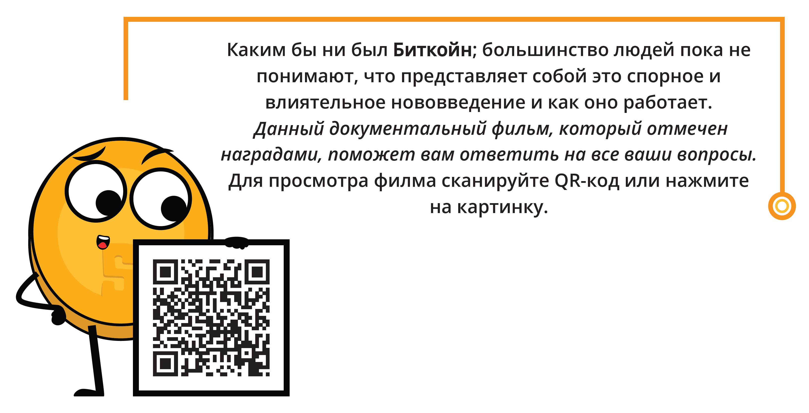</a>

 

_________________________________________________________________________________________________________

Прежде чем изучать **$\color[RGB]{104,60,148} Биткойн$**, важно иметь четкое представление об основах денег, их истории и нынешней финансовой системы. Понимание этих концепций обеспечивает прочную основу для понимания уникальной и революционной природы **$\color[RGB]{104,60,148} Биткойна$**. Узнав об эволюции денег, вы сможете лучше понять потенциал и ограничения нынешней финансовой системы, а также то, как **$\color[RGB]{104,60,148} Биткойн$** стремится их решить. Без этой основы, может быть сложно полностью оценить значение и потенциальное влияние **$\color[RGB]{104,60,148} Биткойна$**. Доверяйте процессу обучения и сохраняйте концентрацию, поскольку награда за более глубокое понимание и признание этой передовой области будет того стоить.

  

<em>Сообщение от Нашего Основателя (Для просмотра сканируйте QR-Код или нажмите на картинку)</em>

## _Глава №1_

# ***Сила Денег***

> **Важно:** [Юридический отказ от ответственности](../../../../DISCLAIMER_RU.md)

---

- [**1.0** Готовы?](https://github.com/MyFirstBitcoin/Translation/blob/main/%D0%9C%D0%BE%D0%B9%20%D0%9F%D0%B5%D1%80%D0%B2%D1%8B%D0%B9%20%D0%91%D0%B8%D1%82%D0%BA%D0%BE%D0%B9%D0%BD%20-%20Russian/2023%20-%20March/WebView/13.Chapter-1.md#10-%D0%B3%D0%BE%D1%82%D0%BE%D0%B2%D1%8B)          
- [**1.1** Обсуждение в Классе: Что Такое Деньги?](https://github.com/MyFirstBitcoin/Translation/blob/main/%D0%9C%D0%BE%D0%B9%20%D0%9F%D0%B5%D1%80%D0%B2%D1%8B%D0%B9%20%D0%91%D0%B8%D1%82%D0%BA%D0%BE%D0%B9%D0%BD%20-%20Russian/2023%20-%20March/WebView/13.Chapter-1.md#11-%D0%BE%D0%B1%D1%81%D1%83%D0%B6%D0%B4%D0%B5%D0%BD%D0%B8%D0%B5-%D0%B2-%D0%BA%D0%BB%D0%B0%D1%81%D1%81%D0%B5-%D1%87%D1%82%D0%BE-%D1%82%D0%B0%D0%BA%D0%BE%D0%B5-%D0%B4%D0%B5%D0%BD%D1%8C%D0%B3%D0%B8)          
- [**1.2** Ограниченный Мир: Преодоление Дефицита в Условиях Растущей Экономики](https://github.com/MyFirstBitcoin/Translation/blob/main/%D0%9C%D0%BE%D0%B9%20%D0%9F%D0%B5%D1%80%D0%B2%D1%8B%D0%B9%20%D0%91%D0%B8%D1%82%D0%BA%D0%BE%D0%B9%D0%BD%20-%20Russian/2023%20-%20March/WebView/13.Chapter-1.md#12-%D0%BE%D0%B3%D1%80%D0%B0%D0%BD%D0%B8%D1%87%D0%B5%D0%BD%D0%BD%D1%8B%D0%B9-%D0%BC%D0%B8%D1%80-%D0%BF%D1%80%D0%B5%D0%BE%D0%B4%D0%BE%D0%BB%D0%B5%D0%BD%D0%B8%D0%B5-%D0%B4%D0%B5%D1%84%D0%B8%D1%86%D0%B8%D1%82%D0%B0-%D0%B2-%D1%83%D1%81%D0%BB%D0%BE%D0%B2%D0%B8%D1%8F%D1%85-%D1%80%D0%B0%D1%81%D1%82%D1%83%D1%89%D0%B5%D0%B9-%D1%8D%D0%BA%D0%BE%D0%BD%D0%BE%D0%BC%D0%B8%D0%BA%D0%B8)        
- [**1.3** Определение Денег](https://github.com/MyFirstBitcoin/Translation/blob/main/%D0%9C%D0%BE%D0%B9%20%D0%9F%D0%B5%D1%80%D0%B2%D1%8B%D0%B9%20%D0%91%D0%B8%D1%82%D0%BA%D0%BE%D0%B9%D0%BD%20-%20Russian/2023%20-%20March/WebView/13.Chapter-1.md#13-%D0%BE%D0%BF%D1%80%D0%B5%D0%B4%D0%B5%D0%BB%D0%B5%D0%BD%D0%B8%D0%B5-%D0%B4%D0%B5%D0%BD%D0%B5%D0%B3)        
  - [**1.3.1** Мы Можем Их Использовать, но Можем Ли Мы Дать Им Определение?](https://github.com/MyFirstBitcoin/Translation/blob/main/%D0%9C%D0%BE%D0%B9%20%D0%9F%D0%B5%D1%80%D0%B2%D1%8B%D0%B9%20%D0%91%D0%B8%D1%82%D0%BA%D0%BE%D0%B9%D0%BD%20-%20Russian/2023%20-%20March/WebView/13.Chapter-1.md#131-%D0%BC%D1%8B-%D0%BC%D0%BE%D0%B6%D0%B5%D0%BC-%D0%B8%D1%85-%D0%B8%D1%81%D0%BF%D0%BE%D0%BB%D1%8C%D0%B7%D0%BE%D0%B2%D0%B0%D1%82%D1%8C-%D0%BD%D0%BE-%D0%BC%D0%BE%D0%B6%D0%B5%D0%BC-%D0%BB%D0%B8-%D0%BC%D1%8B-%D0%B4%D0%B0%D1%82%D1%8C-%D0%B8%D0%BC-%D0%BE%D0%BF%D1%80%D0%B5%D0%B4%D0%B5%D0%BB%D0%B5%D0%BD%D0%B8%D0%B5)         
  - [**1.3.2** Функции Денег](https://github.com/MyFirstBitcoin/Translation/blob/main/%D0%9C%D0%BE%D0%B9%20%D0%9F%D0%B5%D1%80%D0%B2%D1%8B%D0%B9%20%D0%91%D0%B8%D1%82%D0%BA%D0%BE%D0%B9%D0%BD%20-%20Russian/2023%20-%20March/WebView/13.Chapter-1.md#132-%D1%84%D1%83%D0%BD%D0%BA%D1%86%D0%B8%D0%B8-%D0%B4%D0%B5%D0%BD%D0%B5%D0%B3)          
  - [**1.3.3** Характеристики Денег](https://github.com/MyFirstBitcoin/Translation/blob/main/%D0%9C%D0%BE%D0%B9%20%D0%9F%D0%B5%D1%80%D0%B2%D1%8B%D0%B9%20%D0%91%D0%B8%D1%82%D0%BA%D0%BE%D0%B9%D0%BD%20-%20Russian/2023%20-%20March/WebView/13.Chapter-1.md#133-%D1%85%D0%B0%D1%80%D0%B0%D0%BA%D1%82%D0%B5%D1%80%D0%B8%D1%81%D1%82%D0%B8%D0%BA%D0%B8-%D0%B4%D0%B5%D0%BD%D0%B5%D0%B3)        
  - [**1.3.4** Виды Денег](https://github.com/MyFirstBitcoin/Translation/blob/main/%D0%9C%D0%BE%D0%B9%20%D0%9F%D0%B5%D1%80%D0%B2%D1%8B%D0%B9%20%D0%91%D0%B8%D1%82%D0%BA%D0%BE%D0%B9%D0%BD%20-%20Russian/2023%20-%20March/WebView/13.Chapter-1.md#134-%D0%B2%D0%B8%D0%B4%D1%8B-%D0%B4%D0%B5%D0%BD%D0%B5%D0%B3)         

____________________________________________________________________________________________________

### ***1.0 Готовы?***

**$\color[RGB]{104,60,148} Биткойн$** называли по-разному: причудой, мошенничеством, «волшебными интернет-деньгами». Но за этой шумихой стоит мощная технология, которая может изменить наше мышление и способ использования денег; потенциал изменить мир таким образом, чтобы «нормальные люди», такие как вы и я, имели возможность накопить богатство, стать по-настоящему свободными и жить той жизнью, которой мы хотим жить. В этом курсе мы рассмотрим недостатки и ограничения нашей нынешней финансовой системы, а также то, как **$\color[RGB]{104,60,148} Биткойн$** предлагает потенциальное решение. Итак, если вы готовы выйти за рамки заголовков и узнать о реальных возможностях **$\color[RGB]{104,60,148} Биткойна$**, давайте углубимся!    

 

<!-- (Picture) Привет! Я Сатоши, интерактивный помощник, который поможет вам на протяжении всего курса получения биткойн-диплома. Я дам вам данные и рекомендации для лучшего понимания.] -->
 

### ***1.1 Обсуждение в Классе: Что Такое Деньги?***

- Пожалуйста, пока не ешьте конфету, лежащую на вашем столе.
- Кто захочет обменять свои конфеты на купюру в 1 доллар США?
- Теперь поднимите руки, если вы по-прежнему готовы обменять свою конфету на монопольную купюру в 1 доллар вместо своей конфеты?
  - Почему или почему нет?

<!-- (Picture) Единственная разница между этими двумя купюрами заключается в вашем убеждении в том, что одна имеет большую ценность, чем другая. -->

- Что делает один банкнот таким желанным, а другой — мусором?
- Что придает деньгам их «ценность»? Откуда берутся деньги и кто решает, сколько их печатать?
- Почему бы не напечатать больше денег и не распределить их между всеми поровну?
- Деньги обеспечены золотом? Или любым другим товаром?
- Сколько людей все еще используют наличные?

____________________________________________________________________________________________________

### ***1.2 Ограниченный Мир: Преодоление Дефицита в Условиях Растущей Экономики***

Представьте, что вы застряли в пустыне, и у вас осталась только одна бутылка воды. Вы испытываете жажду и отчаянно нуждаетесь в воде, но вы также знаете, что вода вам понадобится, чтобы выжить, пока вы не найдете еще. Это классический пример дефицита: у вас есть только ограниченное количество ресурса (воды), и вы должны сделать выбор, как его использовать.

В этой ситуации вы можете решить нормировать его и пить небольшими глотками в течение более длительного периода времени, чтобы его хватило как можно дольше. В качестве альтернативы вы можете решить выпить как можно больше за один прием, надеясь, что гидратация даст вам энергию, необходимую для поиска большего количества воды. Независимо от того, какой выбор вы сделаете, вы столкнулись с трудным решением.

- 💡 **Дефицит** заставляет нас взвешивать плюсы и минусы того, как мы используем наши ресурсы, и идти на компромиссы.

В этом случае выбор стоит между утолением жажды _немедленно_ и сохранением воды на _потом_.

Эта концепция _дефицита_ применима ко всем видам ресурсов, а не только к воде. Будь то деньги, время или даже любовь и внимание, мы постоянно сталкиваемся с выбором, как распределить наши ограниченные ресурсы.

 

 

- Существует два типа дефицита: **искусственный дефицит** и **естественный дефицит**.
  - **Искусственный дефицит**, также известный как _централизованный дефицит_, включает в себя такие вещи, как дизайнерские сумки ограниченного выпуска, редкие спортивные карточки и пронумерованные произведения искусства. Их можно легко скопировать или подделать.
  - **Естественный дефицит**, также известный как _децентрализованный дефицит_, включает в себя такие вещи, как соль, ракушки и драгоценные металлы, такие как золото. Их сложнее воспроизвести или подделать.
- Основное различие между ними заключается в контроле. Централизованный дефицит контролируется одной организацией, например, компанией или правительством, тогда как децентрализованный дефицит никем не контролируется.

**Дефицит** влияет на наш выбор, и понимание этого может улучшить наше принятие решений. Нам часто приходится выбирать между немедленной выгодой и долгосрочными выгодами, и эти компромиссы определяют наш путь к достижению наших целей.

____________________________________________________________________________________________________

- В контексте примера с пустыней это означает, что вы, возможно, захотите выпить всю воду сразу, даже если это означает, что у вас ее не останется на потом. Это потому, что жажда, которую вы чувствуете сейчас, более острая, чем потенциальная жажда, которую вы можете почувствовать в будущем.
- С другой стороны, если вы решите нормировать воду и пить её медленно, вы демонстрируете меньшее временное предпочтение. Это означает, что вы готовы подождать, чтобы утолить свою жажду, чтобы иметь больше шансов на выживание в долгосрочной перспективе.

- 💡 **Временное предпочтение** относится к идее, что люди обычно предпочитают иметь что-то СЕЙЧАС, а не позже.

- Например, предположим, что у вас есть возможность получить 100 долларов сегодня или 110 долларов через год. Если у вас высокое временные предпочтения, вы можете выбрать получение 100 долларов сегодня, потому что вы цените немедленное удовлетворение от получения денег сейчас больше, чем потенциальную выгоду от ожидания дополнительных 10 долларов через год. С другой стороны, если у вас низкие временные предпочтения, вы, возможно, захотите дождаться большего вознаграждения в будущем, потому что вы меньше озабочены немедленным удовлетворением и больше сосредоточены на долгосрочном планировании.

Концепция ***альтернативных издержек*** тесно связана с идеей **дефицита** и **временных предпочтений**.

- 💡 **Альтернативная стоимость** — это ценность следующей лучшей альтернативы, от которой вы отказываетесь при принятии решения. **Каждое решение предполагает компромиссы**.

- В примере с пустыней, альтернативные издержки немедленного питья всей воды — это выгоды для выживания, которые вы получили бы, если бы нормировали воду и использовали её в течение более длительного периода времени.

____________________________________________________________________________________________________

- Допустим, вы решили нормировать воду и пить её небольшими глотками в течение длительного периода времени. В результате у вас есть энергия и гидратация, необходимые для поиска большего количества воды.
- Однако, пока вы ищете, вы натыкаетесь на кактус, внутри которого находится небольшое количество воды. Это немного, но на мгновение достаточно, чтобы утолить жажду. Если бы вы решили выпить всю воду сразу, у вас, возможно, не хватило бы сил искать ещё воды и найти кактус. В этом случае **альтернативными издержками** выпивания всей воды за раз был бы шанс найти кактус и получить больше жидкости.

Этот пример иллюстрирует, как альтернативные издержки включают не только непосредственный **компромисс** между двумя вариантами, но и потенциальные будущие возможности, которые могут быть получены или потеряны в результате нашего выбора. На нашу готовность отказаться от большей награды в будущем в обмен на меньшую награду сейчас влияют наши **временные предпочтения** или то, насколько мы ценим немедленное удовлетворение по сравнению с долгосрочным планированием.

Корпорации, Правительства и Общества также должны делать выбор.

| КОРПОРАЦИИ  | ПРАВИТЕЛЬСТВА/ОБЩЕСТВА |
| ------------- | ------------- |
| Увольнение 200 сотрудников против замораживания заработной платы | Строительство новой автомагистрали против повышения зарплат учителям |
| Просьба о кредите против привлечения большего количества акционеров | Финансирование исследований в области лечения рака против чистой энергии |

 
 

### ***1.3 Определение Денег***

### _1.3.1 Мы Можем Их Использовать, но Можем Ли Мы Дать Им Определение?_

Вы когда-нибудь задумывались о том, что такое деньги на самом деле? Вы когда-нибудь задумывались, что делает деньги, ну, деньги? Большинство из нас знают, как его использовать, но не многие из нас понимают, откуда оно взялось и как оно работает.

Деньги – это, по сути, способ обмена товарами и услугами. Он представляет стоимость этих предметов в форме, которую можно легко продать.

____________________________________________________________________________________________________

Это может принимать самые разные формы, такие как бумажные банкноты, металлические монеты и электронные платежи. Правительства или другие органы власти обычно выпускают и контролируют деньги.

Но деньги — это гораздо больше, чем просто физическое или цифровое средство обмена. Это как универсальный язык, который позволяет нам торговать с людьми по всему миру, даже если мы не говорим на одном языке или не имеем тоже самый культуры. Например, вы можете находиться на другом конце света и при этом «говорить» деньгами, размещая товар на прилавке и обменивая его на местную валюту или используя кредитную карту. Деньги подобны общественному контракту, который позволяет нам осуществлять обмен без необходимости полагаться на бартер или искать кого-то, кто конкретно хочет того, что мы можем предложить. Если бы группа людей начала принимать шоколад в качестве оплаты за большинство товаров и услуг, шоколад стал бы деньгами. (Хотя, поскольку в некоторых частях мира он тает, мы можем считать его плохими деньгами).

Как отметил французский экономист Жан Батист Сэй: «Деньги выполняют лишь сиюминутную функцию в обмене; и когда **сделка** наконец будет завершена, всегда будет обнаружено, что один вид товара был обменен на другой».

Другими словами, деньги сами по себе не способны удовлетворить человеческие потребности. Это просто инструмент, который позволяет нам обменивать один товар на другой.

- 💡 **Транзакция** – это обмен или передача товаров и услуг. Это способ обмена ценностями между двумя или более сторонами.

Существует множество различных типов транзакций: от простых обменов (например, покупка сэндвича в гастрономе) до более сложных финансовых операций (например, покупка дома или инвестирование в акции или облигации). Транзакции могут проводиться лично, по телефону, через Интернет или другими способами, и в них может участвовать широкий круг сторон, включая частных лиц, предприятия и финансовые учреждения.

- 💡 Деньги — **ЭТО** стоимость, **НА** которую обмениваются товары. Деньги **НЕ ЯВЛЯЮТСЯ** ценностью, **НА** которую обмениваются товары.

____________________________________________________________________________________________________

Подводя итог, **деньги**:
- **Облегчают торговлю**, поскольку **все принимают их в качестве окончательного платежа**.
- Позволяет нам **измерять стоимость** и **сравнивать** различные товары и услуги.
- Снижает наше предпочтение времени, поскольку позволяет нам **экономить** и **тратить его в будущем**.

 

### _1.3.2 Функции Денег_

Когда дело доходит до покупки и продажи товаров и услуг, деньги играют ключевую роль. У него есть несколько важных задач, таких как:

- **Облегчение обмена:** имея деньги, вам не нужно искать кого-то, кто хочет именно то, чем вы можете торговать. Вместо этого вы можете использовать деньги, чтобы покупать и продавать все, что захотите. Это делает торговлю и коммерцию намного более удобными и эффективными.

- **Будучи единицей расчета:** деньги обеспечивают универсальный стандарт стоимости, который позволяет людям выражать и сравнивать цены на различные товары и услуги. Это позволяет создать более эффективный и прозрачный рынок, на котором люди могут принимать обоснованные решения о том, что покупать и продавать.
  - Подумайте об этом так: если вы хотите купить новую машину, вы можете сравнить цены в разных автосалонах и принять обоснованное решение о том, какую из них купить, исходя из цены в долларах. Без расчетной единицы вам пришлось бы пытаться сравнивать стоимость одной машины с другой, используя что-то другое, например, количество коров, которое она стоила, или время, необходимое для ее изготовления.

____________________________________________________________________________________________________

- **Будучи средством сбережения:** деньги должны сохранять свою ценность с течением времени, что делает их полезными в качестве способа сбережения и инвестирования стоимости человеческого труда. Это позволяет людям использовать деньги как инструмент для планирования будущего, а также брать взаймы и одалживать деньги друг другу.

Поэтому в следующий раз, когда вы будете копить на что-то особенное, помните, что деньги — это больше, чем просто способ оплаты вещей, это инструмент, который поможет вам планировать и инвестировать в свое будущее.

Именно эти три функции позволяют экономике стать сложной и динамичной. Без денег было бы гораздо сложнее покупать и продавать товары и услуги, а наша экономика была бы гораздо менее развитой.

 

**$\color[RGB]{104,60,148} Классное $**  **$\color[RGB]{104,60,148} упражнение.$** Примером какой функции денег является этот пример?

1. Роби решил откладывать часть своей еженедельной зарплаты на покупку щенка.
2. Джим покупает два куска пиццы за 8,30 доллара в Ray’s Pizza.
3. Марк не может решить, купить ли ему билеты на концерт за 75 долларов или купить ски-пасс за 95 долларов.

 
 

### _1.3.3 Характеристики Денег_

Со временем люди в конечном итоге осознали, что деньги должны обладать определенными качествами, чтобы быть эффективным средством обмена. Эти характеристики включают долговечность, портативность, делимость, взаимозаменяемость, редкость и приемлемость.

- **Долговечность** – это способность денег противостоять физическому износу и сохраняться с течением времени. Это гарантирует, что деньги могут обращаться в экономике в приемлемом и узнаваемом состоянии.
  - Золото — прочный материал, способный противостоять износу, что делает его хорошим показателем долговечности денег.

____________________________________________________________________________________________________

- **Портативность** означает легкость, с которой деньги можно транспортировать и носить с собой. Это позволяет людям без труда использовать деньги для покупки и продажи товаров и услуг.
  - Кредитные карты портативны, так как их можно легко носить с собой в кошельке или сумочке, что делает их хорошим примером портативности, характерной для денег.

Экскурсия! Портативный

- **Приемлемость** означает широкое признание денег в качестве формы платежа, чтобы люди могли с уверенностью использовать их для покупки и продажи товаров и услуг.
  - Доллар США широко принят в качестве формы платежа, что делает его хорошим показателем приемлемости денег.

хочешь поменяться местами?
приемлемый

- **Дефицит** означает ограниченное запас денег, которое помогает поддерживать их ценность и не позволяет нам тратить больше денег на покупку того же количества товаров.
  - Коллекционные марки, особенно редкие и ценные, могут быть хорошей формой денег, поскольку они редки и со временем могут дорожать. Коллекционеры марок часто используют свои марки как способ инвестировать свое богатство и диверсифицировать свое портфолио.

А вот и я, готовы вы или нет!
скудный.

- **Взаимозаменяемость** означает взаимозаменяемость денег, при которой одна денежная единица эквивалентна другой единице той же стоимости.
  - Деньги должны быть **едиными**.
  - Медные монеты одинаковы по размеру и весу, что делает их хорошим показателем однородности, характерной для денег.

единый

____________________________________________________________________________________________________

- **Делимость** означает способность денег делиться на более мелкие единицы, чтобы люди могли использовать их для совершения покупок на разные суммы.
  - Бумажные купюры можно легко разделить на более мелкие номиналы, что делает их хорошим отражением свойства делимости денег.

есть сдача? мы есть сдача.
делимый.

В целом, эти характеристики делают деньги полезным и эффективным инструментом для облегчения торговли и коммерции, и они необходимы для развития и стабильности экономики.

 

**$\color[RGB]{104,60,148} Классное $**  **$\color[RGB]{104,60,148} упражнение.$** Разные активы обладают разными свойствами и в разной степени выполняют функции денег. Общество в конечном итоге определяет, какой актив используется в качестве денег, на основе таких факторов, как его стабильность, редкость, делимость, возможность передачи и признание в качестве средства обмена.

Чтобы определить, насколько хорошо разные предметы соответствуют конкретным характеристикам денег, можно оценить каждый предмет по шкале от 1 до 5 по каждой характеристике. Подсчитав баллы по каждому предмету, вы сможете определить, какой из них лучше всего подходит в качестве формы денег.

<em> [ 0 = Ужасно; 3 = Хорошо; 5 = Отлично] </em>

<strong>* Пожалуйста, не заполняйте графу для биткойнов; мы вернемся к этому позже в курсе.</strong>

 

Используйте следующие вопросы, чтобы определить, насколько различные элементы таблицы соответствуют характеристикам денег.

- **Долговечность:** могут ли деньги выдержать износ с течением времени?
- **Мобильность:** можно ли легко транспортировать деньги и использовать их в разных местах?
- **Взаимозаменяемость:** являются ли деньги взаимозаменяемыми с другими формами денег?
- **Приемлемость:** широко ли принимаются деньги в качестве формы оплаты?
- **Дефицит:** денег мало и не слишком ли много?
- **Делимость:** Можно ли разделить деньги на более мелкие единицы для транзакций?

____________________________________________________________________________________________________

Характеристика хороших денег
ПРОЧНЫЙ. ПОРТАТИВНЫЙ. УНИФОРМА. ПРИЕМЛЕМЫЙ. РЕДКОСТЬ. РАЗДЕЛИМЫЙ. ОБЩИЙ.

Коровы. Сигареты. Бриллианты. евро. Биткойн.

### _1.3.4 Виды Денег_

Когда дело доходит до денег, существует две основные категории: **физические и цифровые**.

Для **физических денег** у нас есть три варианта:

- **Фиатные деньги** — это то, чем мы пользуемся каждый день, например, бумажные купюры и монеты. Он выпускается правительством и принимается в качестве средства обмена, даже несмотря на то, что он не обеспечен каким-либо физическим товаром.
- **Представительские деньги** представляют собой право требования на физический товар. Как и фиатные деньги, это также может быть бумажная купюра (например, золотой или серебряный сертификат), но в отличие от фиатных денег она обеспечена физическим товаром, который общество считает ценным. Это означает, например, что золотой сертификат стоимостью один доллар можно обменять в банке на золото стоимостью один доллар, как это было раньше во многих странах.
- **Товарные деньги** — это физический объект, имеющий внутреннюю ценность и широко принятый в качестве средства обмена. В эту категорию входят золото и серебро.

____________________________________________________________________________________________________

Не все деньги одинаковы!

Товарные деньги - Такие предметы, как этот порох, когда-то служили товарными деньгами.

Представительские деньги - Представительские деньги, такие как этот серебряный сертификат, можно было обменять на серебро.

Фиатные деньги - Сегодня банкноты Федеральной резервной системы представляют собой фиатные деньги, которые по указу федерального правительства являются приемлемым способом оплаты долгов.

- 💡 **Товары** (или товарные деньги) часто считаются <strong>"взаимозаменяемыми"</strong> и имеют постоянное качество. Например, один баррель нефти обычно считается таким же, как и любой другой баррель нефти, независимо от того, откуда он добывается и кто его произвел.

- 💡 **Платежные рельсы** подобны цифровым магистралям, которые помогают электронным валютам перемещаться из одного места в другое в Интернете. Они упрощают, ускоряют и безопаснее оплачивать покупки в Интернете, независимо от того, используете ли вы криптовалюту, например **$\color[RGB]{104,60,148} Биткойн$**, или традиционный способ оплаты, например кредитную карту.

- 💡 **Цифровые валюты центрального банка (CBDC):** это цифровые версии фиатной валюты страны, которые выпускаются и поддерживаются центральным банком и, следовательно, осуществляются при посредничестве правительства. Это означает, что правительство является посредником в обмене.

**Электронные валюты** — это тип денег, которые можно использовать для онлайн-транзакций. Они подобны цифровым версиям обычных денег, таких как доллары или евро, и могут использоваться для покупки и продажи вещей в Интернете через **платежные системы**.

Наличные.
ACH (автоматизированная расчетная палата)
Чеки.
Телеграфный перевод.
Карточные сети.
Крипто.

____________________________________________________________________________________________________

**Цифровые платежные системы** в **традиционной финансовой системе** состоят из технологий и систем, которые позволяют совершать и обрабатывать электронные платежи, таких как банковские серверы, базы данных и защищенные сети. Однако всегда есть посредник, например банк или финансовое учреждение, который взимает комиссию и имеет право принимать, отменять, возвращать или задерживать транзакции.

 

К основным типам цифровых платежных путей в промежуточной финансовой системе относятся:

- **Карточные Сети:** это сети, которые облегчают перевод средств между финансовыми учреждениями и торговцами, когда клиент совершает покупку с помощью дебетовой или кредитной карты. Примеры включают Visa, Mastercard и American Express.
- **Цифровые Кошельки:** Цифровой кошелек — это онлайн-учетная запись, которая позволяет пользователям хранить и управлять своими электронными валютами (т. е. цифровыми активами, такими как цифровые фиатные деньги, криптовалюта или баллы лояльности). Пользователи могут совершать платежи с помощью своего электронного кошелька, переводя средства со своего счета на счет получателя.
- **Криптовалюты:** цифровые валюты, которые используют цифровые платежные пути или цифровые магистрали для перемещения из одного места в другое в Интернете. Их можно рассматривать как автомобили, которые могут путешествовать напрямую из одной точки в другую, не останавливаясь у посредников, как, например, пункты взимания платы за проезд на шоссе. Это означает, что криптовалюты можно передавать и обменивать напрямую, без необходимости использования посредника, такого как банк.

Процесс оплаты кредитной картой

Клиент.
Торговый бизнес
Интернет.
Программное обеспечение для веб-платежей.
Процессор для банк торговца.
Сеть кредитных карт.
Банк-эмитент кредитной карты.
Банк торговца.

Процесс оплаты кредитной картой является примером платежной системы.

- 💡 **Стейблкоины** — это криптовалюты, которые предназначены для поддержания стабильной стоимости по отношению к активу, такому как доллар США. Некоторые из них обеспечены физическими активами, и все они используются как способ хранения стоимости или совершения транзакций без волатильности, которая может быть связана с другими криптовалютами.

____________________________________________________________________________________________________

Валюта, работающая без посредников, более эффективна и выгодна для общества. Это не позволяет нескольким людям контролировать денежную массу и концентрировать свою власть.

Однако найти технологию, которая бы способствовала безопасным транзакциям, не полагаясь на доверие между сторонами, на протяжении всей истории было непростой задачей. Для достижения этой цели необходимо создать валюту, которая будет работать как Интернет, где контроль будет распределен между всеми и никем одновременно. Это требует согласия всех сторон, включая тех, кто обладает властью, отказаться от контроля ради общего блага.

Но как будет выглядеть такая валюта?

## _Глава №2_

# ***От Бартера к Биткойнам и ЦВЦБ: Путешествие Во Времени***

> **Важно:** [Юридический отказ от ответственности](../../../../DISCLAIMER_RU.md)

---

- [**2.0** Введение](https://github.com/MyFirstBitcoin/Translation/blob/main/%D0%9C%D0%BE%D0%B9%20%D0%9F%D0%B5%D1%80%D0%B2%D1%8B%D0%B9%20%D0%91%D0%B8%D1%82%D0%BA%D0%BE%D0%B9%D0%BD%20-%20Russian/2023/%D0%92%D0%B5%D0%B1-%D0%B2%D0%B5%D1%80%D1%81%D0%B8%D1%8F%20%D0%94%D0%B8%D0%BF%D0%BB%D0%BE%D0%BC%D0%B0/14.%D0%93%D0%BB%D0%B0%D0%B2%D0%B0-2.md#20-%D0%B2%D0%B2%D0%B5%D0%B4%D0%B5%D0%BD%D0%B8%D0%B5)
  - [**2.0.1** Классное Упражнение: Бартерная Игра](https://github.com/MyFirstBitcoin/Translation/blob/main/%D0%9C%D0%BE%D0%B9%20%D0%9F%D0%B5%D1%80%D0%B2%D1%8B%D0%B9%20%D0%91%D0%B8%D1%82%D0%BA%D0%BE%D0%B9%D0%BD%20-%20Russian/2023/%D0%92%D0%B5%D0%B1-%D0%B2%D0%B5%D1%80%D1%81%D0%B8%D1%8F%20%D0%94%D0%B8%D0%BF%D0%BB%D0%BE%D0%BC%D0%B0/14.%D0%93%D0%BB%D0%B0%D0%B2%D0%B0-2.md#201-%D0%BA%D0%BB%D0%B0%D1%81%D1%81%D0%BD%D0%BE%D0%B5-%D1%83%D0%BF%D1%80%D0%B0%D0%B6%D0%BD%D0%B5%D0%BD%D0%B8%D0%B5-%D0%B1%D0%B0%D1%80%D1%82%D0%B5%D1%80%D0%BD%D0%B0%D1%8F-%D0%B8%D0%B3%D1%80%D0%B0)         
- [**2.1** Ранние Формы Денег](https://github.com/MyFirstBitcoin/Translation/blob/main/%D0%9C%D0%BE%D0%B9%20%D0%9F%D0%B5%D1%80%D0%B2%D1%8B%D0%B9%20%D0%91%D0%B8%D1%82%D0%BA%D0%BE%D0%B9%D0%BD%20-%20Russian/2023/%D0%92%D0%B5%D0%B1-%D0%B2%D0%B5%D1%80%D1%81%D0%B8%D1%8F%20%D0%94%D0%B8%D0%BF%D0%BB%D0%BE%D0%BC%D0%B0/14.%D0%93%D0%BB%D0%B0%D0%B2%D0%B0-2.md#21-%D1%80%D0%B0%D0%BD%D0%BD%D0%B8%D0%B5-%D1%84%D0%BE%D1%80%D0%BC%D1%8B-%D0%B4%D0%B5%D0%BD%D0%B5%D0%B3)       
- [**2.2** От Товаров к Долговым Распискам](https://github.com/MyFirstBitcoin/Translation/blob/main/%D0%9C%D0%BE%D0%B9%20%D0%9F%D0%B5%D1%80%D0%B2%D1%8B%D0%B9%20%D0%91%D0%B8%D1%82%D0%BA%D0%BE%D0%B9%D0%BD%20-%20Russian/2023/%D0%92%D0%B5%D0%B1-%D0%B2%D0%B5%D1%80%D1%81%D0%B8%D1%8F%20%D0%94%D0%B8%D0%BF%D0%BB%D0%BE%D0%BC%D0%B0/14.%D0%93%D0%BB%D0%B0%D0%B2%D0%B0-2.md#22-%D0%BE%D1%82-%D1%82%D0%BE%D0%B2%D0%B0%D1%80%D0%BE%D0%B2-%D0%BA-%D0%B4%D0%BE%D0%BB%D0%B3%D0%BE%D0%B2%D1%8B%D0%BC-%D1%80%D0%B0%D1%81%D0%BF%D0%B8%D1%81%D0%BA%D0%B0%D0%BC)       
- [**2.3** Переход от Надёжных Денег к Ненадёжным](https://github.com/MyFirstBitcoin/Translation/blob/main/%D0%9C%D0%BE%D0%B9%20%D0%9F%D0%B5%D1%80%D0%B2%D1%8B%D0%B9%20%D0%91%D0%B8%D1%82%D0%BA%D0%BE%D0%B9%D0%BD%20-%20Russian/2023/%D0%92%D0%B5%D0%B1-%D0%B2%D0%B5%D1%80%D1%81%D0%B8%D1%8F%20%D0%94%D0%B8%D0%BF%D0%BB%D0%BE%D0%BC%D0%B0/14.%D0%93%D0%BB%D0%B0%D0%B2%D0%B0-2.md#23-%D0%BF%D0%B5%D1%80%D0%B5%D1%85%D0%BE%D0%B4-%D0%BE%D1%82-%D0%BD%D0%B0%D0%B4%D1%91%D0%B6%D0%BD%D1%8B%D1%85-%D0%B4%D0%B5%D0%BD%D0%B5%D0%B3-%D0%BA-%D0%BD%D0%B5%D0%BD%D0%B0%D0%B4%D1%91%D0%B6%D0%BD%D1%8B%D0%BC)      
- [**2.4** Где Мы Находимся Сегодня?](https://github.com/MyFirstBitcoin/Translation/blob/main/%D0%9C%D0%BE%D0%B9%20%D0%9F%D0%B5%D1%80%D0%B2%D1%8B%D0%B9%20%D0%91%D0%B8%D1%82%D0%BA%D0%BE%D0%B9%D0%BD%20-%20Russian/2023/%D0%92%D0%B5%D0%B1-%D0%B2%D0%B5%D1%80%D1%81%D0%B8%D1%8F%20%D0%94%D0%B8%D0%BF%D0%BB%D0%BE%D0%BC%D0%B0/14.%D0%93%D0%BB%D0%B0%D0%B2%D0%B0-2.md#24-%D0%B3%D0%B4%D0%B5-%D0%BC%D1%8B-%D0%BD%D0%B0%D1%85%D0%BE%D0%B4%D0%B8%D0%BC%D1%81%D1%8F-%D1%81%D0%B5%D0%B3%D0%BE%D0%B4%D0%BD%D1%8F)          
- [**2.5** Цена Контроля: Взгляд на Слежку, Цензуру и Регулирование](https://github.com/MyFirstBitcoin/Translation/blob/main/%D0%9C%D0%BE%D0%B9%20%D0%9F%D0%B5%D1%80%D0%B2%D1%8B%D0%B9%20%D0%91%D0%B8%D1%82%D0%BA%D0%BE%D0%B9%D0%BD%20-%20Russian/2023/%D0%92%D0%B5%D0%B1-%D0%B2%D0%B5%D1%80%D1%81%D0%B8%D1%8F%20%D0%94%D0%B8%D0%BF%D0%BB%D0%BE%D0%BC%D0%B0/14.%D0%93%D0%BB%D0%B0%D0%B2%D0%B0-2.md#25-%D1%86%D0%B5%D0%BD%D0%B0-%D0%BA%D0%BE%D0%BD%D1%82%D1%80%D0%BE%D0%BB%D1%8F-%D0%B2%D0%B7%D0%B3%D0%BB%D1%8F%D0%B4-%D0%BD%D0%B0-%D1%81%D0%BB%D0%B5%D0%B6%D0%BA%D1%83-%D1%86%D0%B5%D0%BD%D0%B7%D1%83%D1%80%D1%83-%D0%B8-%D1%80%D0%B5%D0%B3%D1%83%D0%BB%D0%B8%D1%80%D0%BE%D0%B2%D0%B0%D0%BD%D0%B8%D0%B5)        
  - [**2.5.1** Возникновение Безналичного Общества](https://github.com/MyFirstBitcoin/Translation/blob/main/%D0%9C%D0%BE%D0%B9%20%D0%9F%D0%B5%D1%80%D0%B2%D1%8B%D0%B9%20%D0%91%D0%B8%D1%82%D0%BA%D0%BE%D0%B9%D0%BD%20-%20Russian/2023/%D0%92%D0%B5%D0%B1-%D0%B2%D0%B5%D1%80%D1%81%D0%B8%D1%8F%20%D0%94%D0%B8%D0%BF%D0%BB%D0%BE%D0%BC%D0%B0/14.%D0%93%D0%BB%D0%B0%D0%B2%D0%B0-2.md#251-%D0%B2%D0%BE%D0%B7%D0%BD%D0%B8%D0%BA%D0%BD%D0%BE%D0%B2%D0%B5%D0%BD%D0%B8%D0%B5-%D0%B1%D0%B5%D0%B7%D0%BD%D0%B0%D0%BB%D0%B8%D1%87%D0%BD%D0%BE%D0%B3%D0%BE-%D0%BE%D0%B1%D1%89%D0%B5%D1%81%D1%82%D0%B2%D0%B0)         
  - [**2.5.2** Наблюдение](https://github.com/MyFirstBitcoin/Translation/blob/main/%D0%9C%D0%BE%D0%B9%20%D0%9F%D0%B5%D1%80%D0%B2%D1%8B%D0%B9%20%D0%91%D0%B8%D1%82%D0%BA%D0%BE%D0%B9%D0%BD%20-%20Russian/2023/%D0%92%D0%B5%D0%B1-%D0%B2%D0%B5%D1%80%D1%81%D0%B8%D1%8F%20%D0%94%D0%B8%D0%BF%D0%BB%D0%BE%D0%BC%D0%B0/14.%D0%93%D0%BB%D0%B0%D0%B2%D0%B0-2.md#252-%D0%BD%D0%B0%D0%B1%D0%BB%D1%8E%D0%B4%D0%B5%D0%BD%D0%B8%D0%B5)         
  - [**2.5.3** Финансовое Регулирование и Цензура](https://github.com/MyFirstBitcoin/Translation/blob/main/%D0%9C%D0%BE%D0%B9%20%D0%9F%D0%B5%D1%80%D0%B2%D1%8B%D0%B9%20%D0%91%D0%B8%D1%82%D0%BA%D0%BE%D0%B9%D0%BD%20-%20Russian/2023/%D0%92%D0%B5%D0%B1-%D0%B2%D0%B5%D1%80%D1%81%D0%B8%D1%8F%20%D0%94%D0%B8%D0%BF%D0%BB%D0%BE%D0%BC%D0%B0/14.%D0%93%D0%BB%D0%B0%D0%B2%D0%B0-2.md#253-%D1%84%D0%B8%D0%BD%D0%B0%D0%BD%D1%81%D0%BE%D0%B2%D0%BE%D0%B5-%D1%80%D0%B5%D0%B3%D1%83%D0%BB%D0%B8%D1%80%D0%BE%D0%B2%D0%B0%D0%BD%D0%B8%D0%B5-%D0%B8-%D1%86%D0%B5%D0%BD%D0%B7%D1%83%D1%80%D0%B0)         

___________________________________________________________________________________________________

### ***2.0 Введение***    

Понятие денег менялось с течением времени. В своих ранних формах, деньги использовались для облегчения торговли и обмена товарами и услугами.

- В древних цивилизациях, люди полагались на бартер — систему прямого обмена товарами и услугами без использования средств обмена.
- Позже, металлические монеты и бумажные деньги стали более удобными формами денег, проложив путь к сложным финансовым системам, которые мы имеем сегодня.

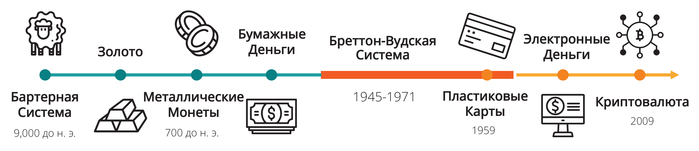

В этой главе, мы отправимся в путешествие во времени, испытав эволюцию денег на собственном опыте. Мы проследим его происхождение и посмотрим, как он менялся и адаптировался на протяжении истории.

### _2.0.1 Классное Упражнение: Бартерная Игра_   

- Раунд №1 – Бартер

Это 6000 год до н.э. Излишне говорить, что деньги в том виде, в каком мы их знаем, еще не были изобретены. Вы находитесь в Месопотамии и напрямую обмениваетесь товарами и услугами друг с другом посредством бартера.

Следует отметить, что многие предприятия по-прежнему принимают неденежные платежи за свои услуги, и правительства рассматривают эти бартерные транзакции так же, как валютные операции для целей налоговой отчетности.

- Разрежьте лист бумаги по пунктирной линии. Ваша цель — продать свое «имею» столько раз, сколько вам нужно, чтобы наконец получить свое первоначальное «хочу». Вы не можете изменить свое первоначальное «хочу». У вас будет 5 минут, чтобы достичь цели этого упражнения.

- Когда ваше новое «имею» совпадет с вашим первоначальным «хочу», вернитесь на свое место. По истечении времени, если вы не нашли торгового партнера, все равно вернитесь на свое место.

___________________________________________________________________________________________________

Поднимите руку, если вы смогли получить то, что хотели, после одной сделки. Две? Трех?

Вопросы. Ответьте на следующие вопросы кратко, но содержательно.

1. Почему некоторым из вас удалось найти кого-то для торговли, а другим — нет?

2. Каковы преимущества бартера?

3. Исходя из вашего опыта выполнения этого упражнения, каковы недостатки использования бартера?

- Раунд №2 – Товарные деньги

Перенесемся вперед и отправимся на западное побережье Африки где-то примерно в 14 веке до нашей эры. Бартер стал утомительным и неэффективным. Мы развились как цивилизация и теперь используем **товарные деньги**.

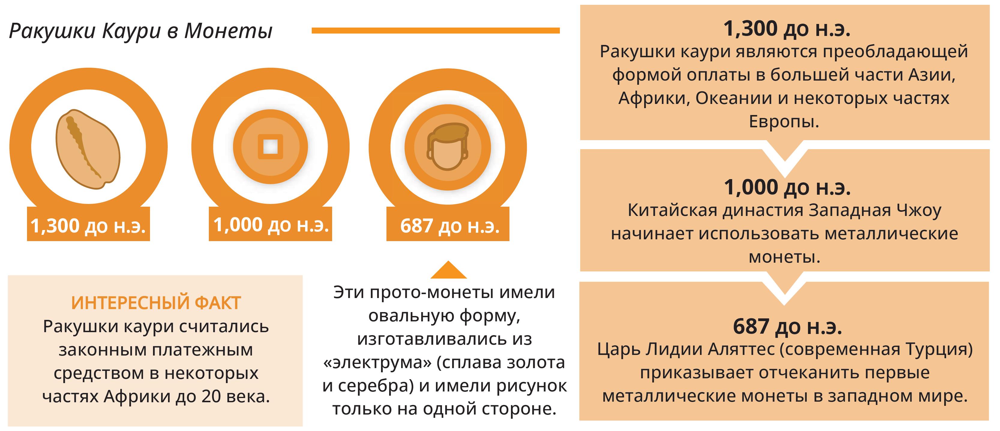

___________________________________________________________________________________________________

Ваш учитель дал вам одну макарону (для простоты). Предположим, что условно цена каждого товара равна одной макароне. Ваша цель снова — получить то, что вы «хотите». Но теперь наш вид немного поумнел и нашел способ решения определенных проблем.
- Почему мы считаем макароны товарными деньгами?
- Как нам получить то, что мы хотим сейчас?
- С макаронами было проще?
- Как вы думаете, почему деньги заменили товары?
- В каком смысле использование товарных денег более эффективно, чем бартер?
- Каковы недостатки использования макарон в качестве денег?

Как вы думаете, что произошло, когда Испания начала привозить в вашу общину лодки с макаронами (золото и серебро из Америки обратно в Испанию)?
____________________________________________________________________________________________________________
____________________________________________________________________________________________________________
____________________________________________________________________________________________________________
____________________________________________________________________________________________________________
____________________________________________________________________________________________________________
____________________________________________________________________________________________________________

### ***2.1 Ранние Формы Денег***    

<a rel="Video" href="https://www.youtube.com/watch?v=-nZkP2b-4vo">

В **бартерной экономике**, люди торгуют друг с другом, основываясь на относительной стоимости товаров и услуг, которые они могут предложить. **Бартерная экономика** неэффективна, и ею трудно управлять, особенно в сложных обществах.
 
 

- 💡 Ситуация, известная как **двойное совпадение желаний**, необходима в любой бартерной системе, поскольку люди всегда должны найти кого-то, кто имеет то, что они хотят, но также хочет того, что они могут предложить.

 

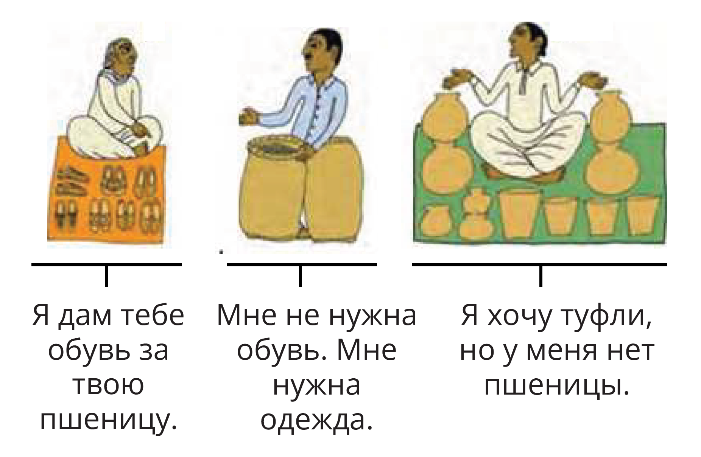

________________________________________________________________________________________________________________________________

Предположим:
- Джозеф хочет обменять свой банан на кокос Яэль.
- Но Яэль хочет обменять свой кокос только на манго Тэмми.
- А Тэмми хочет только обменять свое манго на банан Джозефа.
- Они застряли в бесконечном цикле торговли фруктами без двойного совпадения желаний.
- Джозеф предлагает просто обменять фрукты на вкусную холодную газировку, но они понимают, что находятся на отдаленном острове и газировки нет.
- Они решают просто посидеть на пляже и молча насладиться своими фруктами.

Использование общей расчетной единицы, такой как «газировка», делает торговлю и коммерцию намного более эффективными. В древние времена люди начали использовать бусы, ракушки и другие предметы, имевшие ценность в их обществе, в качестве средств обмена.

### ***2.2 От Товаров к Долговым Распискам***

По мере того, как вы и ваше сообщество станете более активно участвовать в торговле и коммерции, вы осознаете ограничения использования бартера и других форм неденежного обмена. Вы решаете использовать металлические монеты в качестве денег.

 

<strong>Почему были Изобретены Деньги</strong>

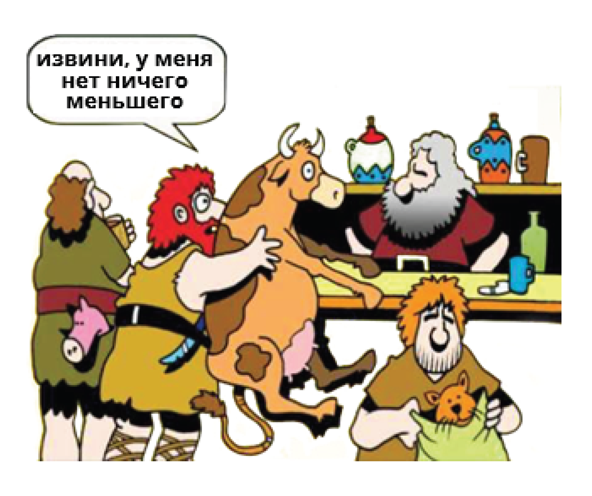</a>

 

<a rel="Video" href="https://www.youtube.com/watch?v=rPHTmGjoe2k">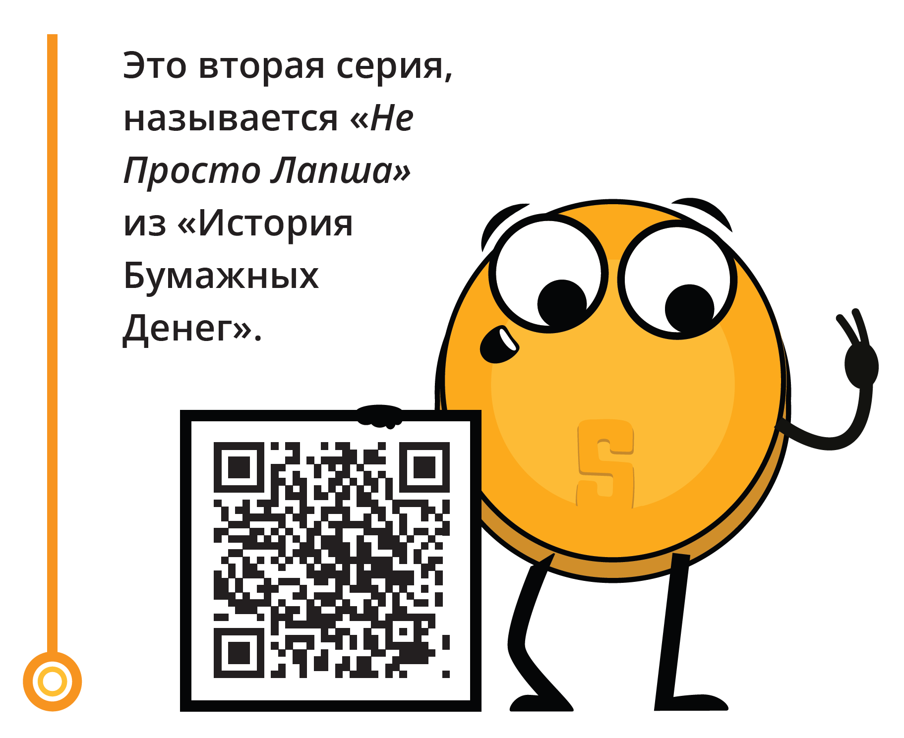</a>

- 💡 Эти металлические монеты изготовлены из ценных материалов, таких как золото и серебро, и служат как средством обмены и расчетной единицей для облегчения торговли и коммерции: **товарные деньги**.

___________________________________________________________________________________________________

Однако, когда вы начнете чаще использовать металлические монеты, вы столкнетесь с некоторыми недостатками. Они могут быть тяжелыми и неудобными для проведения крупных транзакций, и вы замечаете, что некоторые люди пользуются этой системой, переплавляя монеты и создавая новые, смешивая их с более дешевыми металлами, что приводит к росту цен и подрывает доверие к системе.

Стремясь решить эти проблемы, вы и ваше сообщество начинаете использовать бумажные квитанции как форму денег. Эти бумажные квитанции, возникшие в древнем Китае, представляют собой удобную и легко обмениваемую форму валюты. Они обеспечены золотом и другими ценными металлами и могут быть конвертированы в эти металлы в течение семнадцатого по девятнадцатый век. Это позволяет вам иметь более портативную и легко передаваемую форму денег, сохраняя при этом ценность и безопасность драгоценных металлов.

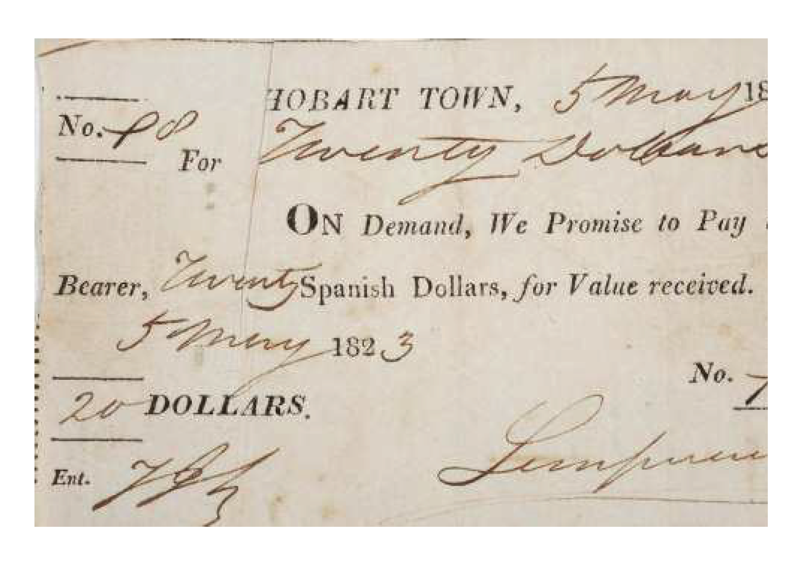</a>

 

### ***2.3 Переход от Надёжных Денег к Ненадёжным***

<a rel="Video" href="https://www.youtube.com/watch?v=lzH1p3t2oRE">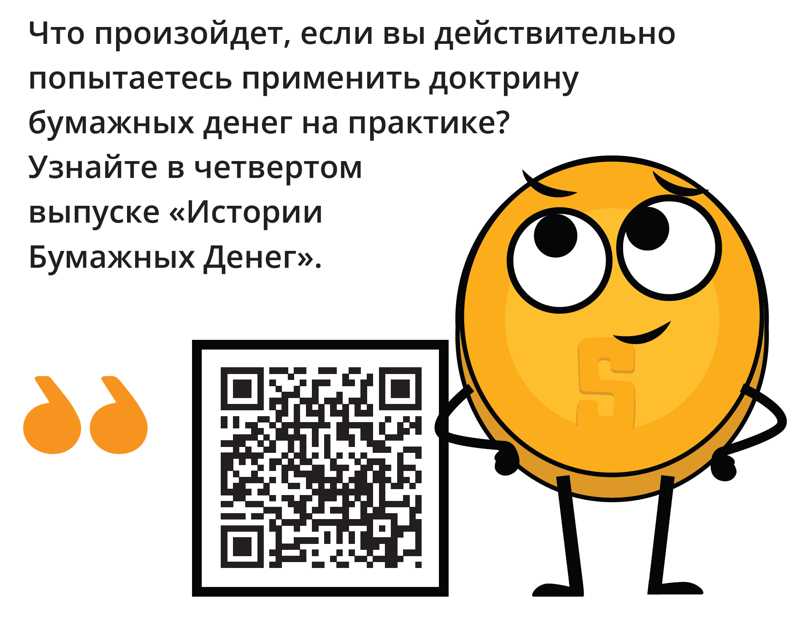</a>

  Перенесемся в 17 век в Швеции. Теперь вы полностью зависите от банков в хранении ваших ценных активов. Однако вы начинаете замечать что-то подозрительное, происходящее с этими банкирами. Кажется, они выдают больше бумажных квитанций, чем имеют золота на хранении, что позволяет им создавать больше денег, чем у них есть активов для их поддержки. Эта хитрая практика позволяет банкирам получать прибыль от разницы между стоимостью бумажных квитанций и стоимостью золота, которое они держат для своих клиентов.

</a>

___________________________________________________________________________________________________

Вы понимаете, что это знаменует собой серьезный сдвиг в том, как работают деньги. Вы переходите от системы надежных денег (т. е. денег, обеспеченных драгоценными металлами) к системе ненадежных денег (т. е. бумажной валюты, не обеспеченной физическим товаром). Этот переход не произошел в одночасье, а скорее представлял собой постепенный процесс, на который повлияли несколько факторов. Промышленная революция с ее массовым производством и урбанизацией сыграла свою роль, равно как и рост передовых финансовых систем, таких как банки и фондовые рынки. Появление центральных банков и других органов денежно-кредитного регулирования способствовало централизации или контролю над деньгами, что привело к выпуску бумажных валют для поддержки экономического роста.

- 💡 Однако вы также начинаете видеть недостатки этой централизации, включая безответственное потребление, рост долга и манипулирование гражданами посредством экономических стимулов.

До Первой мировой войны, вы могли конвертировать бумажные деньги в определенное количество золота. Но две мировые войны и экономический кризис 1929 года положили этому конец. В 1944 году было подписано Бреттон-Вудское соглашение, устанавливающее доллар США в качестве мировой резервной валюты и фиксирующее стоимость доллара США к цене золота по курсу 35 долларов за унцию. Валюты других стран привязаны к доллару, что помогает стабилизировать международные финансовые рынки.

 

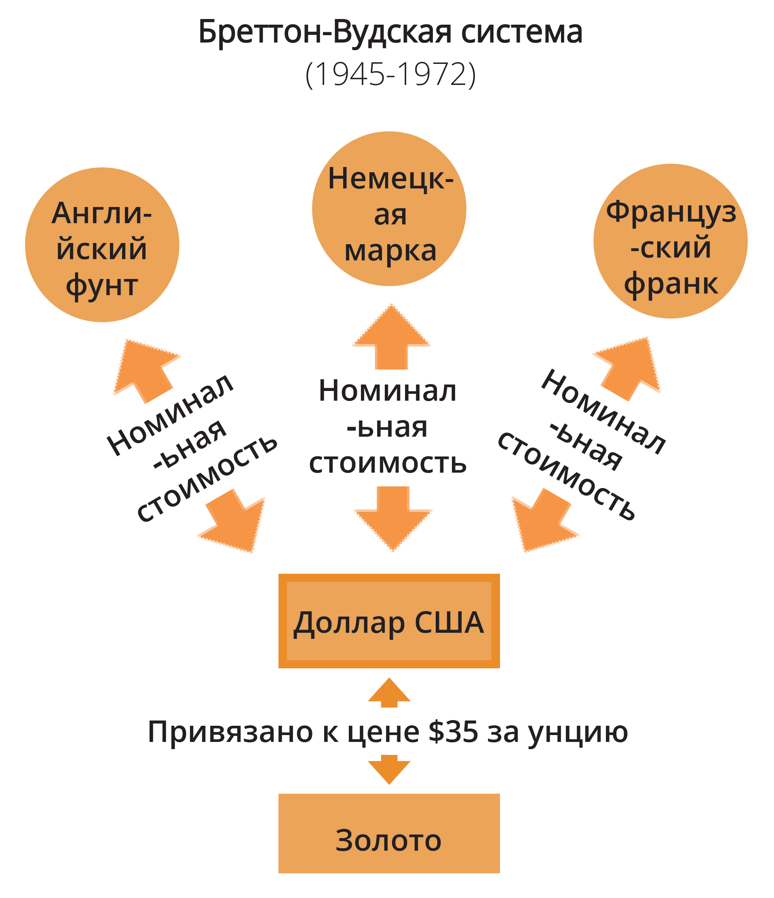</a>

К сожалению, система начала разрушаться в конце 1960-х годов, что привело к шоку Никсона в 1971 году, когда правительство США приостановило конвертацию доллара в золото. Это знаменует собой конец золотого стандарта и начало мира, движимого созданием и накоплением долга.

В повседневной жизни вы начинаете замечать, что ценность денег уже не такая стабильная, как раньше. Точно так же, как гибкая линейка затрудняет точное измерение длины стола, жизнь в бумажном мире, где стоимость денег зависит от непредсказуемости тех, кто находится у власти, также может затруднить точное измерение стоимости товаров и услуг. Вы чувствуете замешательство и беспокойство, приспосабливаясь к миру, где ценность денег больше не привязана к физическому товару, такому как золото.

___________________________________________________________________________________________________

Вы видите влияние этого сдвига на мировую экономику и начинаете сомневаться в стабильности и надежности бумажных валют. Вы понимаете, что в современном мире доллар больше не является фиксированным и стабильным, как это было, когда он был привязан к золоту, а вместо этого становится подверженным колебаниям. Это затрудняет использование доллара в качестве расчетной единицы, поскольку на его стоимость влияют различные факторы, включая инфляцию (рост цен), процентные ставки, силу экономики страны, политические события, рыночные спекуляции и спрос в международной торговле. Это может быть запутанное и непредсказуемое время, когда вы пытаетесь ориентироваться в постоянно меняющейся стоимости доллара и его влиянии на вашу повседневную жизнь.

Несмотря на усилия по улучшению качества жизни с помощью современных денежных систем, повышения эффективности, расширения доступа к информации и улучшения коммуникации, уровень жизни большинства людей начинает снижаться из-за:

- Злоупотребление централизацией.
- Рост цен.
- Стагнация реальной заработной платы.
- Ослабление валют.
- Необходимость тратить больше денег на меньшее количество вещей.

Это создает проблемы для тех, у кого более низкие экономические ресурсы, которые могут иметь ограниченный доступ к образованию, кредитам, ресурсам, социальным сетям и политическому представительству, что приводит к потенциальным недостаткам в их способности добиться успеха.

В результате кажется, что богатые продолжают становиться богаче, а бедные — беднеть.

 
 

> _"Я не верю, что у нас когда-нибудь снова будут хорошие деньги, пока мы не выберем эту вещь из рук правительства… все, что мы можем сделать, это каким-то хитрым, окольным путем ввести что-то, что они не смогут остановить."_

**Фридрих Хайек**,    
Лауреат Нобелевской Премии по Экономике

 

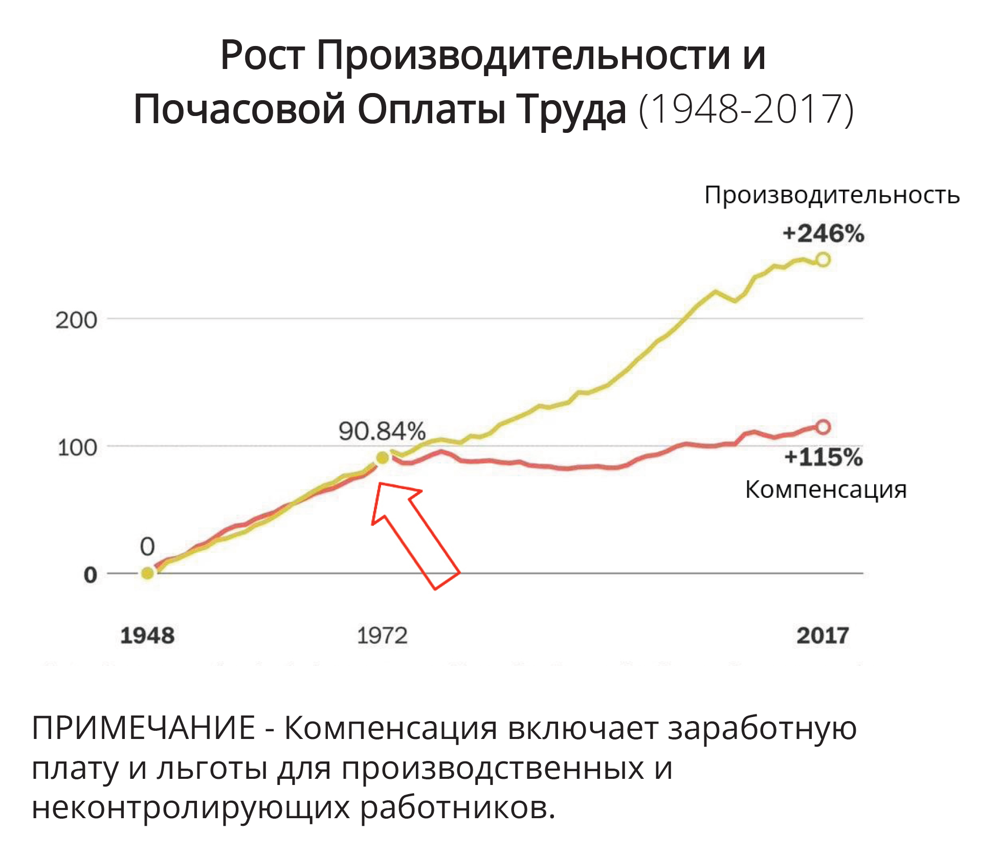</a>

 

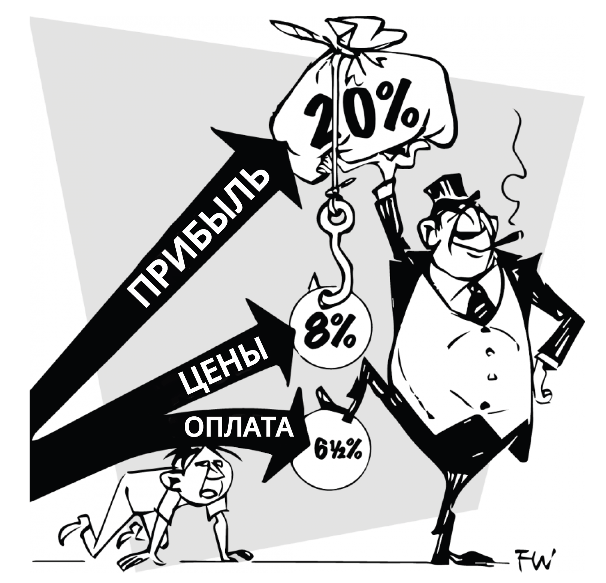</a>

___________________________________________________________________________________________________

### ***2.4 Где Мы Находимся Сегодня?***

Сегодня мы прошли долгий путь от появления первой кредитной карты еще в 1950-х годах. Простым движением пластика мы можем купить все, что захотим, когда захотим, без каких-либо хлопот. Это похоже на открытие мира безграничных возможностей, и волнение от открытия того, что он таит в себе, ощутимо… по крайней мере, мы так думали. Мало ли мы знали, что наша зависимость от кредита будет иметь болезненные последствия — например, повышение общей стоимости товаров и стимулирование определенной экономики, обреченной на крах.

По мере развития технологий, меняется и то, как мы обращаемся с деньгами. Интернет становится крупным игроком в финансовом мире: веб-сайты с онлайн-банкинга и электронной коммерции позволяют управлять деньгами и тратить их полностью онлайн.    
     

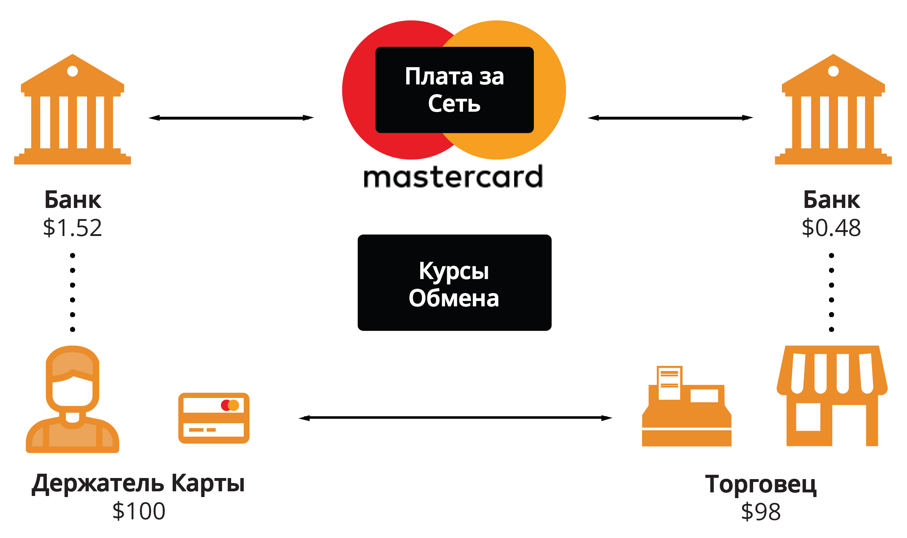</a>
    
    
Затем, в 2009 году, создается первая децентрализованная криптовалюта — **$\color[RGB]{104,60,148} Биткойн$**. По мере роста его популярности он вдохновляет на создание новых технологий и неизведанных границ будущего денег. Итак, как мы узнаем, мы прошли полный круг от надежных денег к ненадежным деньгам и обратно, твёрдые деньги впервые за почти сто лет обрели новый ветер в своих парусах.

### ***2.5 Цена Контроля: Взгляд на Слежку, Цензуру и Регулирование***        

### _2.5.1 Возникновение Безналичного Общества_

Когда в 1950-х годах была представлена первая кредитная карта, люди радовались мысли, что им больше никогда не придется носить с собой наличные. Больше не нужно искать мелочь или неловко выписывать чеки на кассе. Все эти надоедливые посредники теперь могут получать свою долю, даже не осознавая этого, точно так же как потери в сети. Ах, удобство современных финансов.

___________________________________________________________________________________________________

Но с появлением цифровых валют, таких как ЦВЦБ, мы как будто перешли от платы за использование сети к необходимости спрашивать разрешение. Хуже того, теперь мы ожидаем, что правительство будет обыскивать, сканировать и проверять каждый раз, когда мы проезжаем мимо. Контроль и наблюдение заняли место удобства. И так же, как и плата от сети, эти вторжения в нашу финансовую жизнь имеют свою цену, будь то денежную, нарушение конфиденциальности или потерю автономии.

Поскольку все больше наших ежедневных транзакций переходят в онлайн, использование наличных денег снижается. Правительства и финансовые учреждения по всему миру продвигают использование электронных платежей и ужесточают использование физических денег. Эта тенденция вызвала дискуссию о будущем наличных денег и потенциальных последствиях безналичного общества.

Война с наличными деньгами — это термин, который относится к различным усилиям по сокращению использования физических денег, отказу от банкнот высокого номинала и продвижению использования электронных платежей.

Сторонники войны с наличными утверждают, что это сделает транзакции быстрее, удобнее и безопаснее. Критики, однако, опасаются, что это может привести к потере конфиденциальности и финансовой доступности, а также к увеличению рисков мошенничества и кибератак.

 

- 💡 **Вопрос:** Как традиционные банковские методы подвергают риску финансовые данные частных лиц?

- 💡 **Ответ:** Используя кредитные и дебетовые карты, банковские переводы и другие централизованно контролируемые платежные сети, люди передают свои личные данные о финансовых транзакциях третьей стороне и потенциально жертвуют своими правами на конфиденциальность.

 

В этой инфографике мы представим обзор войны с наличными деньгами и рассмотрим все стороны дискуссии. Мы рассмотрим причины, лежащие в основе стремления к безналичному обществу, испытание и обеспокоенность, которые оно поднимает, а также потенциальное влияние на отдельных лиц, предприятия и общество в целом.

- 💡 Вопрос в том, готовы ли мы заплатить цену за удобство современных финансов или будем искать альтернативные варианты, которые будут отдавать приоритет нашей свободе и конфиденциальности?    

<a rel="Video" href="https://www.visualcapitalist.com/global-war-cash/">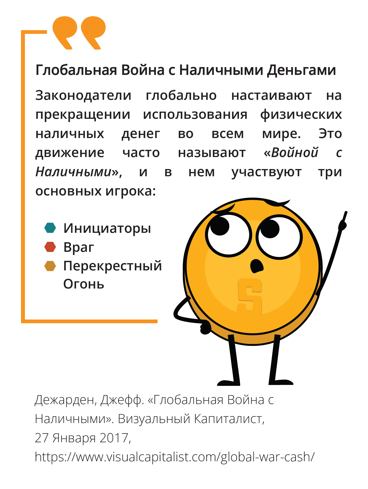</a>

___________________________________________________________________________________________________

 

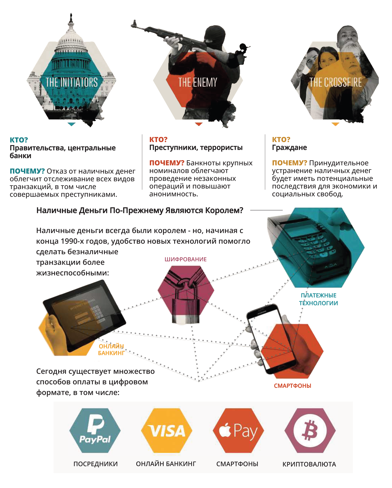</a>

 

___________________________________________________________________________________________________

 

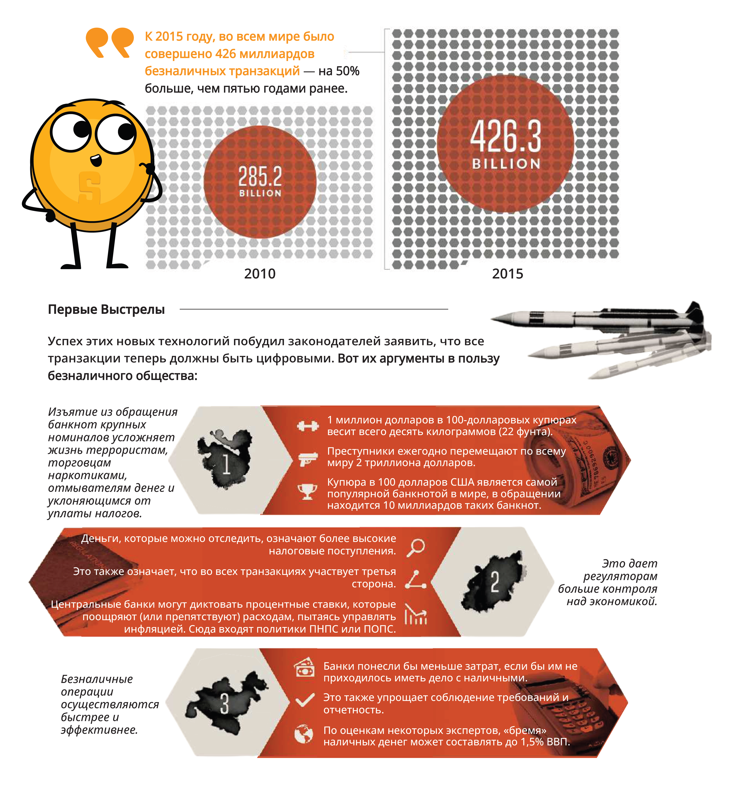</a>

 

___________________________________________________________________________________________________

 

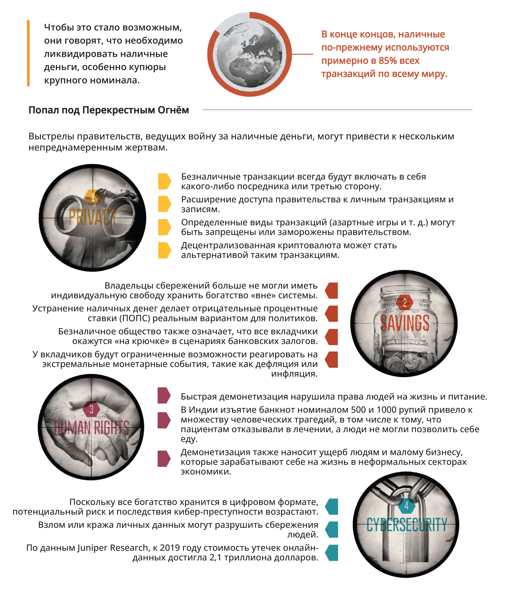</a>

 

___________________________________________________________________________________________________

### _2.5.2 Наблюдение_

Наблюдение – дело непростое. С одной стороны, это помогает поймать людей, совершающих плохие поступки, например, отмывание денег. Но чем больше случаев мошенничества, тем больше необходимо наблюдения, что может привести к вторжению в частную жизнь с помощью технологий. Частные компании также могут собирать и продавать вашу личную информацию в своих целях, и риски такого наблюдения могут включать мошенничество, преследование, вымогательство, кражу личных данных и даже отслеживание покупок по вашей карте. Кроме того, с развитием искусственного интеллекта и машинного обучения, правительствам и компаниям становится еще проще вторгаться в нашу конфиденциальность. Более того, зачастую больше всего страдают люди, которые уже находятся в неблагоприятном или обездоленном положении.

 

### _Влияние Искусственного Интеллекта и Технологий на Будущую Конфиденциальность и Наблюдение_

| Будущий Эффект  | Богатые | Бедные |
| ------------- | ------------- | ----- |
| Доступ к личной информации | Может иметь доступ к обширной личной информации и может использовать ее для принятия обоснованных решений | Может не хватать этой информации и, возможно, придется полагаться на устаревшие или ненадежные источники | 
| Способность формировать мир в своих интересах | Могут использовать свой доступ к данным, чтобы формировать мир в своих интересах | Может иметь незначительное влияние на происходящее |
| Контроль над другими | Могут осуществлять контроль над бедными посредством их доступа к данным, что приводит к потере индивидуальной свободы | Маленький контроль; часто являются контролируемыми |
| Уязвимость для цифрового мошенничества, онлайн-преследований, вымогательства и кражи личных данных | Вероятно, он менее уязвим для этих проблем благодаря большему количеству информации и большей защите от такого мошенничества | Могут быть более уязвимы к этим проблемам из-за отсутствия доступа к ресурсам и информации |

 

### _2.5.3 Финансовое Регулирование и Цензура_

Финансовое регулирование, цензура и запреты могут стать эмоционально и финансово обременительной реальностью для общества и его граждан. Они бывают разных форм, например:

- **Контроль за капиталом или санкции:** Когда расходы выходят из-под контроля, правительства могут ввести контроль над ценами, чтобы попытаться решить проблему. Но иногда этот контроль ухудшает ситуацию. Правительства могут также ограничить количество денег, которые граждане могут переводить, обменивать или вывозить из страны. Создать систему социального кредитного рейтинга, которую можно использовать для контроля над гражданами.

  - Как работает система Социального Кредитного Рейтинга в Китае? В Китае финансовые транзакции и другие данные всех граждан собираются централизованно и используются для создания системы социального кредитного рейтинга, которую можно использовать для контроля граждан.

  - Посмотрите, что произошло в Греции в 2015 году — по постановлению правительства граждане могли снимать только 60 евро в день. Аналогичным образом, китайцы могут отправлять из страны лишь ограниченное количество юаней.

  - В Аргентине было несколько случаев, когда правительство ввело строгий валютный контроль, чтобы попытаться стабилизировать песо. Один из таких случаев произошел в 2011 году, когда правительство ввело контроль за движением капитала, чтобы остановить отток долларов из страны и предотвратить дальнейшую девальвацию песо. Другой случай был в 2019 году.

_______________________________________________________________________________________________

- **Ограничительная банковская политика:** Вы когда-нибудь пытались снять наличные в банкомате только для того, чтобы обнаружить, что вы достигли своего дневного лимита?

Или, может быть, вы пытались перевести деньги другу, но вам сказали, что вы можете отправить определенную максимальную сумму. Это всего лишь несколько примеров ограничительной банковской политики, которая может затруднить доступ к вашим собственным деньгам и делать с ними все, что захотите.

Банки также могут взимать комиссию за большинство транзакций и могут быть открыты только в определенные часы, что затрудняет доступ к вашим наличным или принятие финансовых решений. Ношение с собой большого количества наличных увеличивает риск быть ограбленным. Вдобавок ко всему, банки иногда предлагают богатым кредиты под более низкие проценты, и одновременно открывая бедных для ростовщиков и кредитов под более высокие проценты. При этом финансовая система часто извлекает выгоду из разрыва между богатыми и бедными.

 

</a>

___________________________________________________________________________________________________

- **Дорогие Денежные Переводы:** Отправка денег в другие страны может быть дорогостоящей из-за комиссий банков и других финансовых учреждений. Многие семьи с низкими доходами в развивающихся странах полагаются на деньги родственников, живущих за границей, чтобы выжить. Но высокие комиссии за международные денежные переводы могут повлиять на то, сколько денег фактически получит получатель. Из-за этого семьям может быть сложно позволить себе предметы первой необходимости, такие как еда, жилье и образование.

 

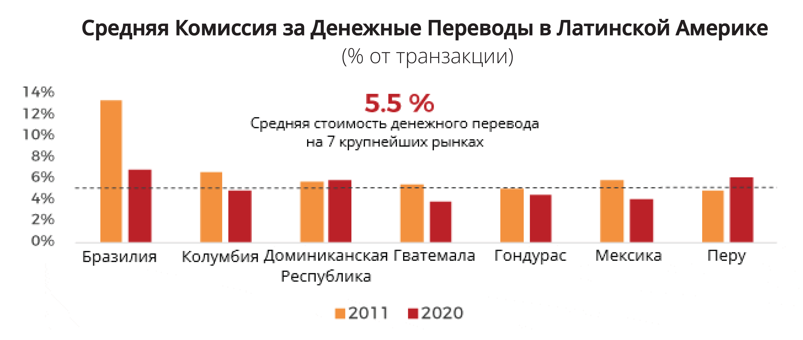</a>

 

- Представьте себе семью в сельской деревне в Бразилии, которая зависит от денег родственника, работающего в США. Если родственник отправляет 100 долларов, но банк взимает за перевод комиссию в 7 долларов, семья получает только 93 доллара. Это может показаться не так уж и много, но для семьи, живущей с ограниченным бюджетом, потеря 7 долларов может иметь большое значение.

- **Не Охваченные Банками и Недостаточно Обеспеченный Банками:** К сожалению, **не у всех есть доступ к традиционным банковским услугам**, будь то потому, что они не соответствуют требованиям для открытия счета или потому, что они живут в районах, где банковские услуги недоступны. Это может затруднить людям доступ к финансовым услугам и участие в глобальной экономике.

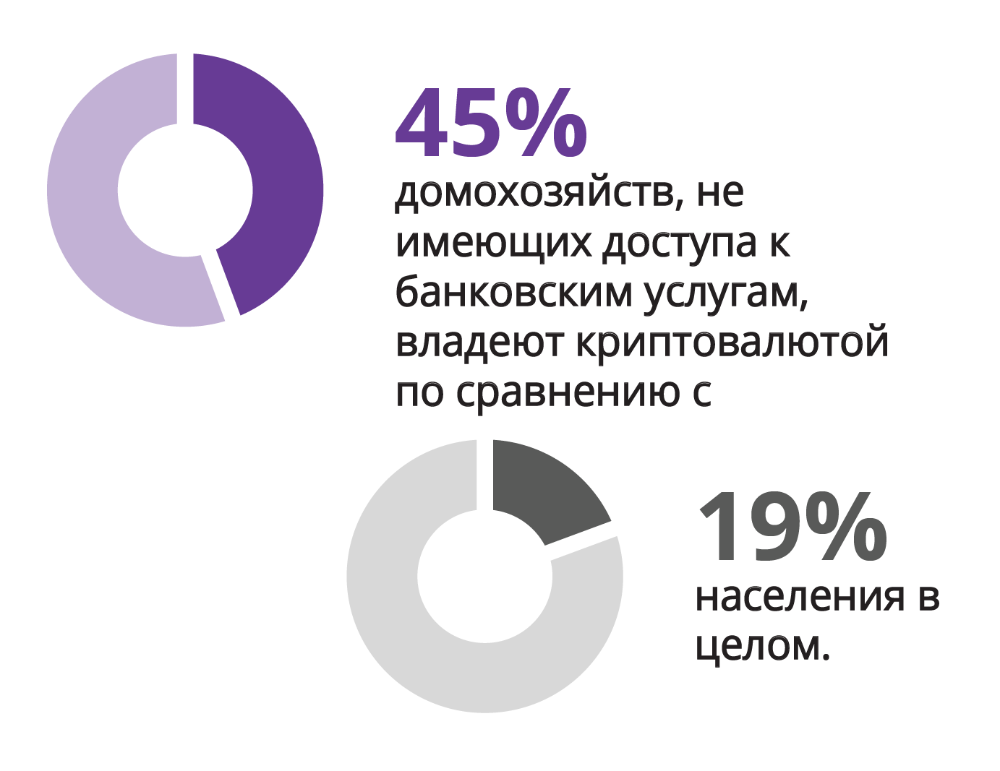</a>

- Но подождите, это еще не все! Правительства могут также контролировать обменный курс своей валюты, что может затруднить обмен денег между странами или привести к **неблагоприятным обменным курсам**. Финансовые учреждения могут **заблокировать пожертвования** определенным организациям или частным лицам или вообще забрать ваш банковский счет. Платформы социальных сетей и финансовые учреждения могут удалить определенный контент, если считают, что он распространяет дезинформацию или нарушает стандарты или политику их сообщества. Иногда это называют **цензурой** и может включать широкий спектр действий, таких как блокирование или подавление контента, ограничение доступа или полное удаление информации.

___________________________________________________________________________________________________

Наблюдение, контроль и скрытые платежи — это лишь политические недостатки нынешней системы, в которой мы живем. К сожалению, существует также ряд скрытых экономических издержек, о которых мы часто никогда не узнаем.    
    

</a>

## _Глава №3_

# ***Раскрытие Темной Стороны Фиата***

> **Важно:** [Юридический отказ от ответственности](../../../../DISCLAIMER_RU.md)

---

- [**3.0** Классное Упражнение: Влияние Инфляции: Аукционная Деятельность](https://github.com/MyFirstBitcoin/Translation/blob/main/%D0%9C%D0%BE%D0%B9%20%D0%9F%D0%B5%D1%80%D0%B2%D1%8B%D0%B9%20%D0%91%D0%B8%D1%82%D0%BA%D0%BE%D0%B8%D0%BD%20-%20Russian/2023%20-%20March/WebView/15.Chapter-3.md#30-%D0%BA%D0%BB%D0%B0%D1%81%D1%81%D0%BD%D0%BE%D0%B5-%D1%83%D0%BF%D1%80%D0%B0%D0%B6%D0%BD%D0%B5%D0%BD%D0%B8%D0%B5-%D0%B2%D0%BB%D0%B8%D1%8F%D0%BD%D0%B8%D0%B5-%D0%B8%D0%BD%D1%84%D0%BB%D1%8F%D1%86%D0%B8%D0%B8-%D0%B0%D1%83%D0%BA%D1%86%D0%B8%D0%BE%D0%BD%D0%BD%D0%B0%D1%8F-%D0%B4%D0%B5%D1%8F%D1%82%D0%B5%D0%BB%D1%8C%D0%BD%D0%BE%D1%81%D1%82%D1%8C)      
- [**3.1** Самые Большие Угрозы Вашим Деньгам: Инфляция, Обесценивание и Потеря Покупательной Способности](https://github.com/MyFirstBitcoin/Translation/blob/main/%D0%9C%D0%BE%D0%B9%20%D0%9F%D0%B5%D1%80%D0%B2%D1%8B%D0%B9%20%D0%91%D0%B8%D1%82%D0%BA%D0%BE%D0%B8%D0%BD%20-%20Russian/2023%20-%20March/WebView/15.Chapter-3.md#31-%D1%81%D0%B0%D0%BC%D1%8B%D0%B5-%D0%B1%D0%BE%D0%BB%D1%8C%D1%88%D0%B8%D0%B5-%D1%83%D0%B3%D1%80%D0%BE%D0%B7%D1%8B-%D0%B2%D0%B0%D1%88%D0%B8%D0%BC-%D0%B4%D0%B5%D0%BD%D1%8C%D0%B3%D0%B0%D0%BC-%D0%B8%D0%BD%D1%84%D0%BB%D1%8F%D1%86%D0%B8%D1%8F-%D0%BE%D0%B1%D0%B5%D1%81%D1%86%D0%B5%D0%BD%D0%B8%D0%B2%D0%B0%D0%BD%D0%B8%D0%B5-%D0%B8-%D0%BF%D0%BE%D1%82%D0%B5%D1%80%D1%8F-%D0%BF%D0%BE%D0%BA%D1%83%D0%BF%D0%B0%D1%82%D0%B5%D0%BB%D1%8C%D0%BD%D0%BE%D0%B9-%D1%81%D0%BF%D0%BE%D1%81%D0%BE%D0%B1%D0%BD%D0%BE%D1%81%D1%82%D0%B8)     
- [**3.2** Долг: Тонкая Грань Между Помощью и Вредом](https://github.com/MyFirstBitcoin/Translation/blob/main/%D0%9C%D0%BE%D0%B9%20%D0%9F%D0%B5%D1%80%D0%B2%D1%8B%D0%B9%20%D0%91%D0%B8%D1%82%D0%BA%D0%BE%D0%B8%D0%BD%20-%20Russian/2023%20-%20March/WebView/15.Chapter-3.md#32-%D0%B4%D0%BE%D0%BB%D0%B3-%D1%82%D0%BE%D0%BD%D0%BA%D0%B0%D1%8F-%D0%B3%D1%80%D0%B0%D0%BD%D1%8C-%D0%BC%D0%B5%D0%B6%D0%B4%D1%83-%D0%BF%D0%BE%D0%BC%D0%BE%D1%89%D1%8C%D1%8E-%D0%B8-%D0%B2%D1%80%D0%B5%D0%B4%D0%BE%D0%BC)     
- [**3.3** ФРС и Её Партнеры: Как Правительство и Банки Контролируют Денежную Массу](https://github.com/MyFirstBitcoin/Translation/blob/main/%D0%9C%D0%BE%D0%B9%20%D0%9F%D0%B5%D1%80%D0%B2%D1%8B%D0%B9%20%D0%91%D0%B8%D1%82%D0%BA%D0%BE%D0%B8%D0%BD%20-%20Russian/2023%20-%20March/WebView/15.Chapter-3.md#33-%D1%84%D1%80%D1%81-%D0%B8-%D0%B5%D1%91-%D0%BF%D0%B0%D1%80%D1%82%D0%BD%D0%B5%D1%80%D1%8B-%D0%BA%D0%B0%D0%BA-%D0%BF%D1%80%D0%B0%D0%B2%D0%B8%D1%82%D0%B5%D0%BB%D1%8C%D1%81%D1%82%D0%B2%D0%BE-%D0%B8-%D0%B1%D0%B0%D0%BD%D0%BA%D0%B8-%D0%BA%D0%BE%D0%BD%D1%82%D1%80%D0%BE%D0%BB%D0%B8%D1%80%D1%83%D1%8E%D1%82-%D0%B4%D0%B5%D0%BD%D0%B5%D0%B6%D0%BD%D1%83%D1%8E-%D0%BC%D0%B0%D1%81%D1%81%D1%83)     
- [**3.4** Магия Создания Денег](https://github.com/MyFirstBitcoin/Translation/blob/main/%D0%9C%D0%BE%D0%B9%20%D0%9F%D0%B5%D1%80%D0%B2%D1%8B%D0%B9%20%D0%91%D0%B8%D1%82%D0%BA%D0%BE%D0%B8%D0%BD%20-%20Russian/2023%20-%20March/WebView/15.Chapter-3.md#34-%D0%BC%D0%B0%D0%B3%D0%B8%D1%8F-%D1%81%D0%BE%D0%B7%D0%B4%D0%B0%D0%BD%D0%B8%D1%8F-%D0%B4%D0%B5%D0%BD%D0%B5%D0%B3)     
  - [**3.4.1** Временная Стоимость Денег и Её Роль в Экономическом Росте](https://github.com/MyFirstBitcoin/Translation/blob/main/%D0%9C%D0%BE%D0%B9%20%D0%9F%D0%B5%D1%80%D0%B2%D1%8B%D0%B9%20%D0%91%D0%B8%D1%82%D0%BA%D0%BE%D0%B8%D0%BD%20-%20Russian/2023%20-%20March/WebView/15.Chapter-3.md#341-%D0%B2%D1%80%D0%B5%D0%BC%D0%B5%D0%BD%D0%BD%D0%B0%D1%8F-%D1%81%D1%82%D0%BE%D0%B8%D0%BC%D0%BE%D1%81%D1%82%D1%8C-%D0%B4%D0%B5%D0%BD%D0%B5%D0%B3-%D0%B8-%D0%B5%D1%91-%D1%80%D0%BE%D0%BB%D1%8C-%D0%B2-%D1%8D%D0%BA%D0%BE%D0%BD%D0%BE%D0%BC%D0%B8%D1%87%D0%B5%D1%81%D0%BA%D0%BE%D0%BC-%D1%80%D0%BE%D1%81%D1%82%D0%B5)     
  - [**3.4.2** Экономия Денег в Трудные Времена](https://github.com/MyFirstBitcoin/Translation/blob/main/%D0%9C%D0%BE%D0%B9%20%D0%9F%D0%B5%D1%80%D0%B2%D1%8B%D0%B9%20%D0%91%D0%B8%D1%82%D0%BA%D0%BE%D0%B8%D0%BD%20-%20Russian/2023%20-%20March/WebView/15.Chapter-3.md#342-%D1%8D%D0%BA%D0%BE%D0%BD%D0%BE%D0%BC%D0%B8%D1%8F-%D0%B4%D0%B5%D0%BD%D0%B5%D0%B3-%D0%B2-%D1%82%D1%80%D1%83%D0%B4%D0%BD%D1%8B%D0%B5-%D0%B2%D1%80%D0%B5%D0%BC%D0%B5%D0%BD%D0%B0)     
  - [**3.4.3** Частичное Банковское Резервирование](https://github.com/MyFirstBitcoin/Translation/blob/main/%D0%9C%D0%BE%D0%B9%20%D0%9F%D0%B5%D1%80%D0%B2%D1%8B%D0%B9%20%D0%91%D0%B8%D1%82%D0%BA%D0%BE%D0%B8%D0%BD%20-%20Russian/2023%20-%20March/WebView/15.Chapter-3.md#343-%D1%87%D0%B0%D1%81%D1%82%D0%B8%D1%87%D0%BD%D0%BE%D0%B5-%D0%B1%D0%B0%D0%BD%D0%BA%D0%BE%D0%B2%D1%81%D0%BA%D0%BE%D0%B5-%D1%80%D0%B5%D0%B7%D0%B5%D1%80%D0%B2%D0%B8%D1%80%D0%BE%D0%B2%D0%B0%D0%BD%D0%B8%D0%B5)     
  - [**3.4.4** Классное Упражнение: Частичное Банковское Резервирование](https://github.com/MyFirstBitcoin/Translation/blob/main/%D0%9C%D0%BE%D0%B9%20%D0%9F%D0%B5%D1%80%D0%B2%D1%8B%D0%B9%20%D0%91%D0%B8%D1%82%D0%BA%D0%BE%D0%B8%D0%BD%20-%20Russian/2023%20-%20March/WebView/15.Chapter-3.md#344-%D0%BA%D0%BB%D0%B0%D1%81%D1%81%D0%BD%D0%BE%D0%B5-%D1%83%D0%BF%D1%80%D0%B0%D0%B6%D0%BD%D0%B5%D0%BD%D0%B8%D0%B5-%D1%87%D0%B0%D1%81%D1%82%D0%B8%D1%87%D0%BD%D0%BE%D0%B5-%D0%B1%D0%B0%D0%BD%D0%BA%D0%BE%D0%B2%D1%81%D0%BA%D0%BE%D0%B5-%D1%80%D0%B5%D0%B7%D0%B5%D1%80%D0%B2%D0%B8%D1%80%D0%BE%D0%B2%D0%B0%D0%BD%D0%B8%D0%B5)     

____________________________________________________________________________________________________

### ***3.0 Классное Упражнение: Влияние Инфляции: Аукционная Деятельность***

Цель: Понять концепцию денежной массы и то, как она влияет на цены товаров и услуг в экономике.

Определения:
Денежная Масса – это общая сумма денег, находящихся в обращении в экономике в определенный момент времени. Это включает в себя:
- Физическая валюта, такая как монеты и купюры
- Электронные деньги, хранящиеся на банковских счетах
- Денежная масса является важной концепцией в экономике, поскольку она может повлиять на общее состояние экономики.
Аукцион – это публичные торги, на которых товары или имущество продаются тому, кто предложит самую высокую цену.

Классное Упражнение. Следуйте инструкциям ниже.

1. Вы получите от учителя случайное количество монопольных денег. Это представляет собой денежную массу в обществе.
2. Запишите общую денежную массу в приведенную таблицу.
3. Учитель продаёт ученикам шоколадные батончики. Чтобы выиграть шоколадный батончик, вам нужно будет сделать самую высокую ставку, используя свои монопольные деньги. Запишите выигрышную ставку рядом с денежной массой.
4. Учитель тогда добавит значительную сумму монопольных денег к общей денежной массе. Это представляет собой увеличение денежной массы в экономике. Позже вы узнаете, как денежная масса увеличивается или уменьшается в экономике.
5. Учитель продаст учащимся на аукционе второй шоколадный батончик, используя тот же процесс, что и раньше. Запишите выигрышную ставку рядом с денежной массой на графике.
6. Учитель повторит аукцион в третий раз.

Общества часто могут быть непредсказуемыми и несправедливыми, примером чего является симуляция учителя, случайным образом дающего значительную сумму денег лишь нескольким избранным ученикам. Это имитирует реальные ситуации, когда может иметь место неравномерное распределение ресурсов и возможностей, подчеркивая присущую многим ситуациям случайность и несправедливость.

____________________________________________________________________________________________________

Раунд.
Денежная Масса.
Выигравшая Ставка.

Вопросы. Опираясь на то, что вы узнали из упражнения, ответьте на следующие вопросы.

1. Как увеличение денежной массы повлияло на выигрышные ставки на шоколадные батончики?
2. Какова связь между денежной массой и инфляцией?
3. Насколько денежная масса актуальна в реальном мире?
4. Можете ли вы вспомнить какие-либо другие факторы, которые могут повлиять на цены товаров и услуг?

____________________________________________________________________________________________________

### ***3.1 Самые Большие Угрозы Вашим Деньгам: Инфляция, Обесценивание и Потеря Покупательной Способности***

Нынешний глобальный экономический климат является сложным, что может затруднить экономию. Одним из факторов, способствующих этому, является инфляция – явление, которое возникает, когда стоимость денег со временем снижается. Это означает, что даже если вы сэкономите больше долларов сейчас, их покупательная способность может измениться в будущем, а это означает, что на большее количество денег вы фактически купите меньше вещей. Осознание экономических условий и их влияния на ваши личные финансы поможет вам принять обоснованные решения о сбережениях и расходах.

Покупательная способность – это количество товаров или услуг, которое можно купить на определенную сумму денег.

Давайте начнем с реалистичного сценария, чтобы объяснить каждый термин.

Джейме — студент колледжа, живущий в маленькой квартире. Он подрабатывает в кафе, чтобы оплатить расходы на жизнь и обучение. Как только Джейме начал жить самостоятельно, он стал профессионалом в управлении собственной бухгалтерской книгой.

В начале года он заложил в бюджет 10 000 долларов на расходы на проживание, включая аренду, еду и другие предметы первой необходимости.

Инфляция – это увеличение общего уровня цен на товары и услуги в экономике за определенный период времени. Когда общий уровень цен повышается, на каждую валютную единицу можно купить меньше товаров и услуг; следовательно, инфляция отражает снижение покупательной способности денег – потерю реальной стоимости средства обмена и расчетной единицы внутри экономики.

Бухгалтерская Книга — это подробная запись всех ваших денежных транзакций. Независимо от того, зарабатываете ли вы деньги или тратите их, бухгалтерская книга поможет вам отслеживать все это.

____________________________________________________________________________________________________

Вот его транзакции за январь:

Дата. Описание. Количество. Тип. Баланс.

Дебет
Кредит

Начальный баланс
Аренда на январь
Продукты питания
Частичная заработная плата
Газ для автомобиля
Учебники

Из этой бухгалтерскай книги видно, что начальный баланс на его текущем счете Джейме на 1 января составлял 1600 долларов, из которых он потратил 800 долларов на оплату аренды за месяц. Затем он потратил (дебет) 100 долларов на продукты и получил 500 долларов (кредит) в качестве заработной платы за работу с частичной занятостью, в результате чего его баланс составил 1200 долларов. Затем он потратил деньги на бензин и учебники, в результате чего к концу месяца его баланс снизился до 650 долларов.

Двенадцать месяцев спустя, обедая с дедушкой, Джейме замечает, что его бюджет не так велик, как раньше. Он понимает, что цены на необходимые ему товары и услуги значительно выросли за последний год, и задается вопросом, почему. Потом он увидел это изображение и не поверил своим глазам.

Когда он рассказал об этом своему дедушке, ему сказали: «В 1956 году я был всего лишь молодым человеком, начинающим свой путь в мир. Помню, я зарабатывал 100 долларов в месяц, работая на заводе. По сегодняшним меркам это может показаться не такой уж большой суммой, но в то время это была приличная зарплата. Фактически, мне удалось накопить достаточно денег, чтобы купить небольшой дом в пригороде».

Как мы видим, стоимость каждого предмета в корзине увеличилась, что привело к общему снижению его покупательной способности.

К счастью, Джейме научился пользоваться бухгалтерской книгой, поскольку она ясно показала ему, как снизилась его годовая покупательная способность.

Как инфляция изменила цену гамбургера. Изменение цен на отдельные ингредиенты гамбургера по сравнению с прошлым годом (апрель 2021 г. – апрель 2022 г.)

Булочка. Латук. Помидор. Бекон. Соус. Говяжий фарш. Приправы.
- Судя по розничным ценам, городским потребителям.

____________________________________________________________________________________________________

Джейме: «Что? Это безумие. Я даже представить себе не могу, во что бы тогда стоила моя аренда».

Дед: «Ну, посмотрим. Если принять во внимание инфляцию, то за 1 доллар я мог бы тогда купить около 10 пакетов кренделей».

Джейме: «Ух ты, это действительно интересно, дедушка. Но сколько бы это стоило сегодня?»

Дед: «Ой, вещи были намного дешевле! Буханка хлеба стоила всего несколько центов, а галлон бензина можно было купить всего за четвертак. Невероятно, насколько выросла стоимость жизни».

Стоимость доллара
Покупательная способность доллара США

Покупательная способность доллара США резко упала за последнее столетие из-за роста инфляции и денежной массы.

Закон о Федеральной резервной системе создает центральный банк, способный управлять денежной массой страны.

Фондовый рынок рушится в преддверии Великой Депрессии.

Президент США Рузвельт криминализирует владение золотом.

Бреттон-Вудское соглашение устанавливает золотой стандарт и доллар США в качестве мировой резервной валюты.

Золотой стандарт отменен, и валюты больше не привязаны к золоту.

Количественное смягчение (QE1) начинается в ответ на финансовый кризис.

Денежная масса США в 2020 году выросла на 3,8 триллиона долларов, что соответствует 20% всех когда-либо созданных долларов.

покупательная способность 1 доллар США (2020 г.)
Что можно купить за 1 доллар.

30 шоколадных батончиков Hershey's

10 рулонов туалетной бумаги

10 бутылок пива

20 бутылок кока-колы

10 пакетов кренделей

17 апельсинов

2 коробки цветных карандашей

4 виноградных плода

2 лимона

1 кофе из Макдональдса

Стоимость одного доллара США (2020 г.)

____________________________________________________________________________________________________

- Джейме необходимо заложить в бюджет дополнительно 1000 долларов на ту же корзину товаров и услуг, которую он приобрел в прошлом году.
- Это означает, что его покупательная способность снизилась на 1000 долларов, поскольку теперь ему приходится тратить больше денег на покупку тех же товаров и услуг.
- В корзину товаров и услуг входит аренда квартиры, продукты и другие предметы первой необходимости.
- В следующей таблице показана стоимость каждого товара в корзине в первый и второй год, а также процентное увеличение цены:

Элемент. Стоимость, год №1. Стоимость, год №2. процентное увеличение

Аренда
Продукты
Предметы первой (необходимости)
Общий

Джейме за год зарабатывает больше, чем когда-либо зарабатывал его дедушка, но это также снижает стимул к сбережениям. Сейчас выгоднее тратить деньги, так как их ценность падает. Это мешает способности планировать будущее. Как показано на предыдущем графике (в разделе 2.3), рост заработной платы среднего гражданина в США из года в год остается неизменным, а это означает, что большинство людей не получают повышения в той же степени, в которой снижается стоимость их денег, несмотря на то, что они работают усерднее.

Для Джейме могло быть и хуже. Например, в Зимбабве в конце 2000-х годов наблюдалась гиперинфляция, когда экономика страны пострадала от сочетания политической нестабильности, неэффективного управления экономикой и внешних факторов, таких как засуха и санкции. В результате стоимость зимбабвийского доллара (ZWD) резко упала, и правительство было вынуждено печатать больше денег.

- Купюра в 100 000 ZWD была введена в обращение в Зимбабве в 2008 году. Из-за гиперинфляции в то время она стоила всего несколько долларов США.
- Несмотря на высокую номинальную стоимость, купюры в 100 000 ZWD было недостаточно для покупки предметов первой необходимости, таких как еда или топливо, и людям приходилось носить с собой большие пачки наличных, чтобы совершать повседневные покупки.

После рассмотрения значительного роста цен с середины 50-х годов в США и примера гиперинфляции в Зимбабве становится ясно, что влияние инфляции на покупательную способность человека может сильно различаться в зависимости от его местоположения и периода времени, в котором он жил.

Так что же такое инфляция? Почему это так опасно? Стив Форбс объясняет это.

Инфляция имеет тенденцию затрагивать тех, кто живет в бедных странах, гораздо больше, чем тех, кто живет в богатых странах. Это подчеркивает тот факт, что зачастую это чистая удача, где и когда человек родился, и что обстоятельства рождения человека могут оказать существенное влияние на качество его жизни и экономические возможности.

____________________________________________________________________________________________________

### ***3.2 Долг: Тонкая Грань Между Помощью и Вредом***    

Долг – это палка о двух концах. Это правда, что заимствование денег может обеспечить столь необходимый финансовый импульс, будь то частные лица, совершающие крупные покупки, предприятия, инвестирующие в свой рост, или правительства, финансирующие важные услуги. Но слишком большие займы могут привести к финансовому краху. Когда вы не можете выплатить проценты по своим долгам, становится труднее оплачивать счета и оставаться на плаву. Это особенно верно, когда организация берет на себя дополнительную задолженность для погашения существующей задолженности и попадает в порочный круг, известный как «долговая спираль».

Долг – это деньги, которые одно лицо или организация задолжало другому. Если у вас есть долг, вы обязаны вернуть задолженность, обычно с процентами, к определенной дате.

Долговой кризис является мировой проблемой, в том числе и в США. В настоящее время правительство тратит больше денег, чем зарабатывает. Чтобы оплатить свои счета, оно занимает все больше и больше денег. Однако этот долговой цикл и более высокие затраты по займам могут вскоре нанести ущерб кредитному рейтингу правительства. Если долг станет слишком большим, правительство может столкнуться с финансовыми трудностями и потенциально обанкротиться, как это было во многих других странах в прошлом.

Соотношение долга к ВВП 2021 г. (%)
200% и более
Менее 10%

Состояние мирового государственного долга

____________________________________________________________________________________________________

- Долг, взятый на себя правительством, может иметь долгосрочные последствия для будущих поколений.
- Печатание большего количества денег для покрытия расходов может привести к девальвации валюты и возможному краху денежной системы.

Но как мы можем измерить риск того, что страна возьмет на себя слишком большой долг? Одним из способов является соотношение долга к ВВП, которое показывает сумму общего долга страны в процентах от ее ВВП.

- Отношение долга к ВВП — это способ увидеть, способна ли страна выплатить свои долги.
- - Если коэффициент высок, у страны могут возникнуть проблемы с выплатой долгов в будущем.
- - Если соотношение низкое, страна может легко погасить свои долги и находиться в хорошей финансовой форме.
- Важно помнить, что соотношение долга к ВВП — это лишь часть понимания денежной ситуации в стране.

Валовой внутренний продукт (ВВП) — это показатель общей стоимости товаров и услуг, произведенных внутри страны за определенный период времени, обычно за год. Его часто используют как меру размера и состояния экономики.

### ***3.3 ФРС и Её Партнеры: Как Правительство и Банки Контролируют Денежную Массу***    
    
Вы когда-нибудь задумывались, откуда взялись триллионы долларов стимулирующих фондов, которые были распределены во время пандемии, и кто решает, сколько и кому будет выделено? Распределение этих средств может оказать огромное влияние на общество и экономику, однако оно часто остается без внимания.

Существует несколько инструментов, которые централизованные правительства могут использовать для управления объемом денежной массы в определенный момент времени.

Центральные банки и правительства могут использовать инструменты денежно-кредитной и фискальной политики, чтобы влиять на денежную массу и экономику.

Центральный банк Соединенных Штатов называется Федеральной резервной системой или ФРС.

Правительства могут занимать деньги для стимулирования экономики, но это может привести к инфляции, если им придется печатать больше денег для погашения кредитов.

____________________________________________________________________________________________________

Целевые ставки
Денежно-кредитная политика

Безработица ниже 6,5%

2% - 3% годовой прирост валового внутреннего продукта

Базовый уровень инфляции составляет от 2,0% до 2,5%

Экспансионистская фискальная политика

Целью является увеличение потребительских расходов и инвестиций в бизнес для увеличения совокупного спроса и экономического роста.

Более низкие налоги.
Увеличение государственных расходов.

Сдерживающая фискальная политика

Целью является сокращение потребительских расходов и инвестиций в бизнес для снижения совокупного спроса и экономического роста.

Сокращение государственных расходов. Увеличить налоги.

Политика/Инструмент. Денежно-кредитная политика.
Фискальная политика.
Курсовая политика.
Шок запаса.
Контроль цен.

Описание.
- Денежно-кредитная политика предполагает корректировку процентных ставок для контроля количества денег в обращении.
- Фискальная политика предполагает использование расходов и налоговой политики для воздействия на экономику.
- Использование обменного курса страны (стоимости ее валюты по отношению к другим валютам) для влияния на торговлю и экономику.
- Внезапное и неожиданное событие, которое нарушает поставки товаров и услуг, приводящее к изменениям цен и денежной массы.
- Правительство устанавливает ограничения на цены товаров и услуг для управления инфляцией или стабилизации цен.

Пример
- Федеральная резервная система повышает процентные ставки, чтобы замедлить инфляцию, или может снизить их, чтобы стимулировать занятость.
- Правительство увеличивает расходы на инфраструктурные проекты для стимулирования экономического роста. Это также может снизить налоги, чтобы люди тратили больше.
- Правительство Китая привязывает стоимость юаня к доллару США для стабилизации обменного курса
- Стихийное бедствие, уничтожающее значительную часть сельскохозяйственного производства страны, приводящее к нехватке продовольствия и росту цен.
- Правительство устанавливает максимальную цену на бензин, чтобы предотвратить взвинчивание цен во время кризиса.

____________________________________________________________________________________________________

### ***3.4 Магия Создания Денег***     
### _3.4.1 Временная Стоимость Денег и Её Роль в Экономическом Росте_ 

Вы когда-нибудь задумывались, почему банки предлагают своим клиентам так много услуг? Хотя может показаться, что они щедры, важно помнить, что банки — это предприятия, и их основная цель — получение прибыли. Но как они получают прибыль, если раздают деньги в кредит?

Помимо получения процентов по депозитам, банки получают доход и другими способами, в том числе:
1. Начисление процентов по кредитам, которые они выдают.
2. Взимание платы за такие услуги, как использование банкоматов и обслуживание счета.
3. Заработок денег посредством инвестиций, таких как покупка и продажа ценных бумаг или инвестирование в недвижимость.
4. Хранить процент кредитов в резерве и инвестировать или выдавать в долг остальную часть
5. Выплата процентов по депозитам и взимание комиссий по текущим и сберегательным счетам

Занимая деньги под низкие процентные ставки и выдавая их в долг под более высокой ставки, банки могут получить прибыль. Они также получают доход за счет сборов и инвестиционной деятельности.

Но почему это должно иметь значение для вас как личность? Ну, слышали ли вы фразу «доллар сегодня стоит больше, чем доллар завтра»? Эта концепция известна как временная стоимость денег, и она основана на идее о том, что деньги стоят больше в настоящем, чем в будущем. Это связано с тем, что деньги можно инвестировать для получения процентов, а также потому, что деньги могут со временем потерять свою ценность из-за инфляции.

Другими словами, если у вас есть деньги на сберегательном счете с низкой процентной ставкой, в будущем они не будут стоить так много, как сегодня. С другой стороны, если вы вкладываете свои деньги во что-то, что может принести более высокую прибыль, вы можете выйти вперед.

Банки занимают деньги у вкладчиков под процент (скажем, 5%).

Банки одалживают эти деньги заемщикам под более высокую процентную ставку (скажем, 9%).

Банки платят проценты с процентов, полученных от кредитования (9% - 6% = 4%), а остальное оставляют в качестве прибыли.

Чтобы гарантировать, что ваши деньги сохранят свою ценность с течением времени, цель инвестирования — получить доход, превышающий уровень инфляции. Таким образом, ваши деньги в будущем будут стоить больше, чем сегодня.
Page 56:

### _3.4.2 Экономия Денег в Трудные Времена_    

Текущая глобальная экономическая ситуация, на которую негативно повлияла пандемия, породила такие проблемы, как высокая инфляция и низкие процентные ставки по сберегательным счетам. Эти условия могут затруднить эффективное сбережение денег, поскольку инфляция со временем съедает стоимость валюты. Даже если вы сэкономите сегодня, в будущем ваша покупательная способность может снизиться.

Но не волнуйтесь! Есть еще способы сэкономить деньги и обеспечить финансовую безопасность. Вот несколько идей, которые стоит попробовать:

- Составьте бюджет: Бюджет — это план того, как вы будете использовать свои деньги. Это может помочь вам увидеть, где вы тратите слишком много денег, а где можно сэкономить. Каждый месяц откладывайте немного денег для экономии и ищите способы сократить свои расходы.
- Начните инвестировать: Инвестирование — это способ заставить ваши деньги расти с течением времени. Существует множество типов инвестиций на выбор, и вы можете найти тот, который соответствует вашему бюджету и уровню риска.
- Проявите творческий подход: существует множество творческих способов сэкономить деньги. Вы можете попробовать подстричься самостоятельно или обмениваться с другими для товаров и услуг. Будьте готовы пробовать что-то новое и искать нетрадиционные решения для своих финансовых проблем.

- В целом приемлемо брать в долг, если деньги используются для получения дохода и увеличения покупательной способности в будущем. Это связано с тем, что заимствование денег может позволить частному лицу или предприятию делать инвестиции, которые повышают их производительность и эффективность, что в конечном итоге приводит к большей прибыли и финансовой стабильности.
- Например, если фермер возьмет кредит на покупку нового оборудования, которое позволит ему собирать урожай быстрее и эффективнее, он сможет получать больший доход и в результате увеличить свою покупательную способность. С другой стороны, если деньги используются для растраты ресурсов или непроизводительных инвестиций, это может привести к финансовым трудностям и не будет мудрым решением.

Взяв на себя ответственность за свои финансы и проявив гибкость, вы сможете лучше выдержать шторм жесткой экономики и выйти на первое место.

План расходов 50/30/20

50% должны иметь расходы.
30% гибкие расходы.
20% голов.

____________________________________________________________________________________________________

### _3.4.3 Частичное Банковское Резервирование_    

До сих пор мы говорили о том, как центральные банки, такие как Федеральная резервная система, управляют денежной массой, как банки зарабатывают деньги для себя, а также о некоторых стратегиях, как экономить деньги, но мы еще не обсудили, как на самом деле создаются новые деньги и введены в общество. Это может показаться волшебством, но за этим стоит интересный процесс.

Как новые деньги на самом деле попадают в обращение и способствуют экономическому росту? В отличие от физических ресурсов, таких как еда или вода, которые могут закончиться, у денег нет фиксированного предела! Итак, как это работает?

Правительство, центральный банк и частные банки играют роль в этом процессе.

Вот упрощенная версия того, как Федеральная резервная система (ФРС) может добавить в обращение 100 миллионов долларов:

1. ФРС решает, что хочет увеличить денежную массу на 100 миллионов долларов. Это решение обычно принимается на основе целей денежно-кредитной политики ФРС, таких как стимулирование экономического роста или стабилизация цен.
2. ФРС поручает крупному коммерческому банку создать депозит в размере 100 миллионов долларов на его счете в ФРС. Этот депозит создан из воздуха и не подкреплен никакими физическими активами.
3. Когда коммерческий банк создает депозит в ФРС, он, по сути, занимает деньги у ФРС. ФРС предоставляет банку средства для депозита, а взамен банк должен выплатить проценты по кредиту и в конечном итоге вернуть кредит.
4. Затем банк-участник использует этот новый депозит в размере 100 миллионов долларов для выдачи кредитов предприятиям или частным лицам или для покупки ценных бумаг, таких как государственные облигации.
5. Предприятия или частные лица, получающие эти кредиты, могут затем использовать деньги для совершения покупок, оплаты счетов или инвестирования в другие активы. Это увеличивает общей массой денег в экономике.
6. По мере обращения и расходования денег они в конечном итоге попадают в другие банки, которые затем могут использовать их для выдачи собственных кредитов и инвестиций. Этот процесс продолжается до тех пор, пока 100 миллионов долларов не будут полностью введены в обращение.

В целом, способность ФРС вводить новые деньги в обращение через банковскую систему помогает стимулировать экономический рост и достигать целей денежно-кредитной политики.

доход от труда
центральное правительство
передача
тратить
налоги
домохозяйства
сбережения
государственные займы
вложения
предприятия
заимствование
банки
заем для инвестиций
процентная ставка
создавать деньги
Центральный банк
потребление
импорт
заимствование
экспорт
зарубежные рынки

____________________________________________________________________________________________________

Банки фактически создают новые деньги каждый раз, когда кредитуют клиентов или делают инвестиции. Что? Да, вы правильно прочитали. Когда банк выдает кредит, он создает деньги, добавляя новые средства на счет заемщика на сумму кредита. Затем заемщик может использовать эти деньги для совершения покупок или оплаты счетов, эффективно увеличивая общей массой денег в экономике. Посмотрим как, дальше.

### _3.4.4 Классное Упражнение: Частичное Банковское Резервирование_

Процесс, известный как банковское дело с частичным резервированием, заключается в том, что банки держат в качестве резервов только часть своих депозитов, а остальную часть выдают в долг. Пока они поддерживают определенный коэффициент резервирования, установленный центральным банком, банки могут создавать больше денег, чем они имеют на руках. Однако эта способность создавать новые деньги может также нести в себе риск чрезмерных заимствований и финансовой нестабильности, если ею не управлять осторожно.

Коэффициент резервирования — это правило, которое сообщает банкам, сколько денег они должны хранить в своих сейфах и сколько они могут дать взаймы. Он устанавливается центральным банком, который представляет собой специальную группу людей, отвечающих за здоровье экономики.

В этом упражнении мы изучим концепцию банковского частичного резервирования и то, как это может привести к обесцениванию валюты; инфляция; и снижение покупательной способности.

- Допустим, общая сумма денег в экономике составляет 1000 долларов, а норма резервирования равна 50%. Это означает, что на каждые 1000 долларов в экономике 50% из них должны храниться в резерве банка.

- Если Энрике вложит в банк 1000 долларов, а позже Кари придет в банк за кредитом, с требуемым соотношением, банк может оставить себе половину, а половину одолжить, поэтому они одолжат ей 500 долларов. В результате общая денежная масса увеличится с 1000 до 1500 долларов.

Частичное банковское резервирование. Сохранение ½

вносит 1000 долларов США

Оставляет половину депозита Энрике в качестве резерва.

Одалживает другую половину.

Кредитует 1000 долларов США

Денежная масса выросла с 1000 до 1500 долларов.

Формула: Созданные деньги = Общая сумма денег в экономике ÷ Коэффициент резервирования.

____________________________________________________________________________________________________

Классное упражнение. Используя приведенную выше формулу, мы можем рассчитать количество созданных денег следующим образом:

Созданные деньги = 1000 долларов США / 50% = 2000 долларов США.

*Обратите внимание, что это немного упрощено.

Мы собираемся смоделировать создание денег в небольшой экономике (которая будет состоять из 6 участников, один из которых будет выполнять роль банка). Норматив резервирования, устанавливаемый Центральным банком, рассчитывается как доля депозитов клиентов и определяет, какую сумму коммерческие банки должны откладывать на хранение, а не выдавать в кредит. Давайте предположим, что для целей этого моделирования существует обязательная норма резервирования, равная 10%.

- Например, если банк получает 100 долларов США и имеет резервные требования в размере 10%, он может выдать кредит в размере 90 долларов США. Если этот кредит будет размещен в другом банке, этот банк может выдать кредит в размере 81 доллара и так далее.

- Это создает эффект мультипликатора, увеличивая общую денежную массу. Это может стимулировать экономику, но также может вызвать инфляцию, если денежная масса будет расти слишком быстро.

- Чтобы узнать, сколько денег создается при определенном процентном соотношении, вы можете использовать формулу.

- Чтобы использовать формулу, сначала необходимо знать общее количество денег в экономике. Это все деньги, которые используются для покупки и продажи товаров и услуг. Затем вам нужно знать норму резервирования, которая представляет собой процент денег, который банк должен держать под рукой, а не выдавать взаймы.

- Таким образом, когда банк выдает деньги в долг, он создает новые деньги, которых раньше не существовало, и это увеличивает общую сумму денег в экономике.

- Как правило, страны с нестабильной экономикой или высоким уровнем инфляции имеют высокие нормы резервов, которые помогают снизить риски и стабилизировать финансовую систему.

Нам нужны следующие волонтеры:
1 = Вкладчик (Победитель лотереи) (Голубой).
2 = Банковский кассир (Банк).
3 = Должник №1 (Темно-синий).
4 = Владелец собственности/депонент (красный).
5 = Должник №2 (Светло-фиолетовый).
6 = Владелец художественной галереи/вкладчик (зеленый)

Депозит. Депозиты. Заем. Транзакция.
Всего. Депозитов.

И так далее, пока он не будет подкреплен долгами.

____________________________________________________________________________________________________

(1) только что выиграл в лотерею 100 000 долларов и идет в недавно открывшийся банк, чтобы положить их на депозит. Банк, (2), имеет требование коэффициента 10%. Сколько (2) должен хранить в своем хранилище?
На следующее утро (3) приходит в банк и просит кредит. Какую сумму может выдать банк?
(3) занимает максимальную сумму, потому что хочет внести первоначальный взнос за дом. (3) индоссирует чек и передает его (4). Затем (4) идет в банк и вносит чек. Сколько вложил (4)? Каковы общие депозиты в банке на данный момент?
(5) приходит в банк и просит огромную ссуду. В банке говорят, что могут одолжить им максимум _______.
(5) выходит из банка с деньгами и идет покупать произведение искусства у (6). После двусторонних переговоров, произведение искусства продается именно за ту сумму, которую МЫ одолжили в банке. (5) платит (6). (6) кладет деньги в банк. Каковы общие депозиты на данный момент?

Имя. Депозит. Величина займа. Резервная сумма.

Итак, сколько денег на самом деле создается с помощью этих 100 000 долларов США, если деньги продолжают циркулировать по всей экономике?

Когда норма резервирования высока, банки должны хранить больше денег в своих сейфах и могут выдавать меньше кредитов. Это может затруднить получение займов для людей и предприятий и замедлить экономику. Когда норма резервирования низкая, банкам приходится хранить меньше денег в своих сейфах и они могут выдавать больше кредитов. Это может облегчить людям и предприятиям получение денег в долг и ускорить рост экономики.

____________________________________________________________________________________________________

Итак, можем ли мы найти ответ для нашего классного упражнения, где резерв составляет 10%? (Не забудьте преобразовать 10% в десятичную форму 10%=0,1)

Просто из любопытства: сколько денег будет создано в экономике, если норма резервирования будет снижена до 1%? (Убедитесь, что вы разделили 100 000 долларов США на 0,01). Удивлены?

С 2020 года Федеральная резервная система (Центральный банк США) снизила нормативы резервных требований до нуля процентов в целях стимулирования экономики.

## _Глава №4_

# ***Будущее Децентрализовано: Расширение Прав и Возможностей Сообществ и Частных Лиц***

> **Важно:** [Юридический отказ от ответственности](../../../../DISCLAIMER_RU.md)

---

- [**4.0** От Кризиса к Инновациям: Шифропанки и Создание Децентрализованной Цифровой Валюты](https://github.com/MyFirstBitcoin/Translation/blob/main/%D0%9C%D0%BE%D0%B9%20%D0%9F%D0%B5%D1%80%D0%B2%D1%8B%D0%B9%20%D0%91%D0%B8%D1%82%D0%BA%D0%BE%D0%B8%D0%BD%20-%20Russian/2023%20-%20March/WebView/16.Chapter-4.md#40-%D0%BE%D1%82-%D0%BA%D1%80%D0%B8%D0%B7%D0%B8%D1%81%D0%B0-%D0%BA-%D0%B8%D0%BD%D0%BD%D0%BE%D0%B2%D0%B0%D1%86%D0%B8%D1%8F%D0%BC-%D1%88%D0%B8%D1%84%D1%80%D0%BE%D0%BF%D0%B0%D0%BD%D0%BA%D0%B8-%D0%B8-%D1%81%D0%BE%D0%B7%D0%B4%D0%B0%D0%BD%D0%B8%D0%B5-%D0%B4%D0%B5%D1%86%D0%B5%D0%BD%D1%82%D1%80%D0%B0%D0%BB%D0%B8%D0%B7%D0%BE%D0%B2%D0%B0%D0%BD%D0%BD%D0%BE%D0%B9-%D1%86%D0%B8%D1%84%D1%80%D0%BE%D0%B2%D0%BE%D0%B9-%D0%B2%D0%B0%D0%BB%D1%8E%D1%82%D1%8B)    
- [**4.1** Злоупотребление Централизацией](https://github.com/MyFirstBitcoin/Translation/blob/main/%D0%9C%D0%BE%D0%B9%20%D0%9F%D0%B5%D1%80%D0%B2%D1%8B%D0%B9%20%D0%91%D0%B8%D1%82%D0%BA%D0%BE%D0%B8%D0%BD%20-%20Russian/2023%20-%20March/WebView/16.Chapter-4.md#41-%D0%B7%D0%BB%D0%BE%D1%83%D0%BF%D0%BE%D1%82%D1%80%D0%B5%D0%B1%D0%BB%D0%B5%D0%BD%D0%B8%D0%B5-%D1%86%D0%B5%D0%BD%D1%82%D1%80%D0%B0%D0%BB%D0%B8%D0%B7%D0%B0%D1%86%D0%B8%D0%B5%D0%B9)    
  - [**4.1.1** Централизованные Системы](https://github.com/MyFirstBitcoin/Translation/blob/main/%D0%9C%D0%BE%D0%B9%20%D0%9F%D0%B5%D1%80%D0%B2%D1%8B%D0%B9%20%D0%91%D0%B8%D1%82%D0%BA%D0%BE%D0%B8%D0%BD%20-%20Russian/2023%20-%20March/WebView/16.Chapter-4.md#411-%D1%86%D0%B5%D0%BD%D1%82%D1%80%D0%B0%D0%BB%D0%B8%D0%B7%D0%BE%D0%B2%D0%B0%D0%BD%D0%BD%D1%8B%D0%B5-%D1%81%D0%B8%D1%81%D1%82%D0%B5%D0%BC%D1%8B)    
  - [**4.1.2** Подсчет Посредников: Взгляд на Посредников в Транзакции по Кредитной Карте](https://github.com/MyFirstBitcoin/Translation/blob/main/%D0%9C%D0%BE%D0%B9%20%D0%9F%D0%B5%D1%80%D0%B2%D1%8B%D0%B9%20%D0%91%D0%B8%D1%82%D0%BA%D0%BE%D0%B8%D0%BD%20-%20Russian/2023%20-%20March/WebView/16.Chapter-4.md#412-%D0%BF%D0%BE%D0%B4%D1%81%D1%87%D0%B5%D1%82-%D0%BF%D0%BE%D1%81%D1%80%D0%B5%D0%B4%D0%BD%D0%B8%D0%BA%D0%BE%D0%B2-%D0%B2%D0%B7%D0%B3%D0%BB%D1%8F%D0%B4-%D0%BD%D0%B0-%D0%BF%D0%BE%D1%81%D1%80%D0%B5%D0%B4%D0%BD%D0%B8%D0%BA%D0%BE%D0%B2-%D0%B2-%D1%82%D1%80%D0%B0%D0%BD%D0%B7%D0%B0%D0%BA%D1%86%D0%B8%D0%B8-%D0%BF%D0%BE-%D0%BA%D1%80%D0%B5%D0%B4%D0%B8%D1%82%D0%BD%D0%BE%D0%B9-%D0%BA%D0%B0%D1%80%D1%82%D0%B5)    
- [**4.2** Мощный Инструмент для Преодоления Ограничений Централизации](https://github.com/MyFirstBitcoin/Translation/blob/main/%D0%9C%D0%BE%D0%B9%20%D0%9F%D0%B5%D1%80%D0%B2%D1%8B%D0%B9%20%D0%91%D0%B8%D1%82%D0%BA%D0%BE%D0%B8%D0%BD%20-%20Russian/2023%20-%20March/WebView/16.Chapter-4.md#42-%D0%BC%D0%BE%D1%89%D0%BD%D1%8B%D0%B9-%D0%B8%D0%BD%D1%81%D1%82%D1%80%D1%83%D0%BC%D0%B5%D0%BD%D1%82-%D0%B4%D0%BB%D1%8F-%D0%BF%D1%80%D0%B5%D0%BE%D0%B4%D0%BE%D0%BB%D0%B5%D0%BD%D0%B8%D1%8F-%D0%BE%D0%B3%D1%80%D0%B0%D0%BD%D0%B8%D1%87%D0%B5%D0%BD%D0%B8%D0%B9-%D1%86%D0%B5%D0%BD%D1%82%D1%80%D0%B0%D0%BB%D0%B8%D0%B7%D0%B0%D1%86%D0%B8%D0%B8)    
  - [**4.2.1** Классное Упражнение: Децентрализованная Игра на Основе Консенсуса с Плохими Участниками](https://github.com/MyFirstBitcoin/Translation/blob/main/%D0%9C%D0%BE%D0%B9%20%D0%9F%D0%B5%D1%80%D0%B2%D1%8B%D0%B9%20%D0%91%D0%B8%D1%82%D0%BA%D0%BE%D0%B8%D0%BD%20-%20Russian/2023%20-%20March/WebView/16.Chapter-4.md#421-%D0%BA%D0%BB%D0%B0%D1%81%D1%81%D0%BD%D0%BE%D0%B5-%D1%83%D0%BF%D1%80%D0%B0%D0%B6%D0%BD%D0%B5%D0%BD%D0%B8%D0%B5-%D0%B4%D0%B5%D1%86%D0%B5%D0%BD%D1%82%D1%80%D0%B0%D0%BB%D0%B8%D0%B7%D0%BE%D0%B2%D0%B0%D0%BD%D0%BD%D0%B0%D1%8F-%D0%B8%D0%B3%D1%80%D0%B0-%D0%BD%D0%B0-%D0%BE%D1%81%D0%BD%D0%BE%D0%B2%D0%B5-%D0%BA%D0%BE%D0%BD%D1%81%D0%B5%D0%BD%D1%81%D1%83%D1%81%D0%B0-%D1%81-%D0%BF%D0%BB%D0%BE%D1%85%D0%B8%D0%BC%D0%B8-%D1%83%D1%87%D0%B0%D1%81%D1%82%D0%BD%D0%B8%D0%BA%D0%B0%D0%BC%D0%B8)    
- [**4.3** Сделки — Это Всего Лишь Торговые Соглашения](https://github.com/MyFirstBitcoin/Translation/blob/main/%D0%9C%D0%BE%D0%B9%20%D0%9F%D0%B5%D1%80%D0%B2%D1%8B%D0%B9%20%D0%91%D0%B8%D1%82%D0%BA%D0%BE%D0%B8%D0%BD%20-%20Russian/2023%20-%20March/WebView/16.Chapter-4.md#43-%D1%81%D0%B4%D0%B5%D0%BB%D0%BA%D0%B8--%D1%8D%D1%82%D0%BE-%D0%B2%D1%81%D0%B5%D0%B3%D0%BE-%D0%BB%D0%B8%D1%88%D1%8C-%D1%82%D0%BE%D1%80%D0%B3%D0%BE%D0%B2%D1%8B%D0%B5-%D1%81%D0%BE%D0%B3%D0%BB%D0%B0%D1%88%D0%B5%D0%BD%D0%B8%D1%8F)    
  - [**4.3.1** Доверять или Не Доверять](https://github.com/MyFirstBitcoin/Translation/blob/main/%D0%9C%D0%BE%D0%B9%20%D0%9F%D0%B5%D1%80%D0%B2%D1%8B%D0%B9%20%D0%91%D0%B8%D1%82%D0%BA%D0%BE%D0%B8%D0%BD%20-%20Russian/2023%20-%20March/WebView/16.Chapter-4.md#431-%D0%B4%D0%BE%D0%B2%D0%B5%D1%80%D1%8F%D1%82%D1%8C-%D0%B8%D0%BB%D0%B8-%D0%BD%D0%B5-%D0%B4%D0%BE%D0%B2%D0%B5%D1%80%D1%8F%D1%82%D1%8C)    
  - [**4.3.2** Давайте Заменим Доверие Правилами](https://github.com/MyFirstBitcoin/Translation/blob/main/%D0%9C%D0%BE%D0%B9%20%D0%9F%D0%B5%D1%80%D0%B2%D1%8B%D0%B9%20%D0%91%D0%B8%D1%82%D0%BA%D0%BE%D0%B8%D0%BD%20-%20Russian/2023%20-%20March/WebView/16.Chapter-4.md#432-%D0%B4%D0%B0%D0%B2%D0%B0%D0%B9%D1%82%D0%B5-%D0%B7%D0%B0%D0%BC%D0%B5%D0%BD%D0%B8%D0%BC-%D0%B4%D0%BE%D0%B2%D0%B5%D1%80%D0%B8%D0%B5-%D0%BF%D1%80%D0%B0%D0%B2%D0%B8%D0%BB%D0%B0%D0%BC%D0%B8)    
- [**4.4** Раскрытие Возможностей Блокчейна: Технология, Революционизирующая Будущее](https://github.com/MyFirstBitcoin/Translation/blob/main/%D0%9C%D0%BE%D0%B9%20%D0%9F%D0%B5%D1%80%D0%B2%D1%8B%D0%B9%20%D0%91%D0%B8%D1%82%D0%BA%D0%BE%D0%B8%D0%BD%20-%20Russian/2023%20-%20March/WebView/16.Chapter-4.md#44-%D1%80%D0%B0%D1%81%D0%BA%D1%80%D1%8B%D1%82%D0%B8%D0%B5-%D0%B2%D0%BE%D0%B7%D0%BC%D0%BE%D0%B6%D0%BD%D0%BE%D1%81%D1%82%D0%B5%D0%B9-%D0%B1%D0%BB%D0%BE%D0%BA%D1%87%D0%B5%D0%B9%D0%BD%D0%B0-%D1%82%D0%B5%D1%85%D0%BD%D0%BE%D0%BB%D0%BE%D0%B3%D0%B8%D1%8F-%D1%80%D0%B5%D0%B2%D0%BE%D0%BB%D1%8E%D1%86%D0%B8%D0%BE%D0%BD%D0%B8%D0%B7%D0%B8%D1%80%D1%83%D1%8E%D1%89%D0%B0%D1%8F-%D0%B1%D1%83%D0%B4%D1%83%D1%89%D0%B5%D0%B5)    

______________________________________________________________________________________________________

### ***4.0 От Кризиса к Инновациям: Шифропанки и Создание Децентрализованной Цифровой Валюты***    

До создания Биткойна люди искали способы решения проблем традиционных финансов, таких как мошенничество, коррупция и отсутствие доверия к финансовым учреждениям. Эти проблемы стали еще более актуальными из-за глобального финансового кризиса 2008 года. В ответ группа технически подкованных и дальновидных людей, известных как шифропанки, задалась целью создать цифровую валюту, которую можно было бы использовать для онлайн-транзакций без необходимости в посредниках, таких как банки.

Шифропанки были бунтовщиками и провидцами, которые верили в способность технологий вызвать позитивные изменения и бросить вызов традиционным структурам власти. Многие из них были вовлечены в активизм и вопросы гражданских свобод, и их объединяла общая страсть к технологиям и желание использовать их для формирования будущего.

Вопрос: Как люди могут восстановить свою финансовую независимость?

Ответ: Движение шифропанков стремится создать новую финансовую систему, которая уважает безопасность, конфиденциальность и свободу людей, в качестве решения для восстановления финансового самосуверенитета.

РЕШ ЕНИЕ

И поэтому они намеревались создать биткойн, цифровую валюту, которая произведет революцию в нашем представлении о деньгах и финансовых транзакциях. Для этого им нужно было найти способ записи транзакций, который был бы более безопасным и прозрачным, чем традиционные централизованные системы реестров. Почему они так себя чувствовали?

### ***4.1 Злоупотребление Централизацией***    
### _4.1.1 Централизованные Системы_    

Централизация власти часто приводит к коррупции, что может привести к неэффективному управлению ресурсами, в том числе финансовыми ресурсами. Это может непропорционально повлиять на тех, кто стоит ниже в иерархии и не имеет такого большого влияния или власти, заставляя их нести самое большое бремя последствий коррупции и бесхозяйственности.

Современная бумажная система характеризуется централизацией контроля, при этом небольшая группа банков и других финансовых учреждений имеет значительный вес в экономике.

______________________________________________________________________________________________________

Централизованную систему можно представить как дерево с одним стволом. Ствол представляет собой центральный орган или точку контроля, а ветви представляют собой различные части системы, которые контролируются центральным органом. В этой аналогии дерево уязвимо, если ствол поврежден или болен, потому что все дерево опирается на ствол как опору.

У централизованных систем есть много недостатков, в том числе:

- Уязвимость: централизованная система опирается на одну точку, поэтому, если эта точка выйдет из строя, то вся система может выйти из строя.
- Контроль и власть: Те, кто контролирует централизованные системы, обладают большой властью и влиянием на то, как они работают.
- Неэффективность и посредники: Централизованные системы часто используют посредников, что может замедлить их работу и увеличить затраты.
- Отсутствие автономии: люди могут быть не в состоянии принимать собственные финансовые решения.
- Цензура и ограничения: существует риск блокировки или ограничения доступа к определенным финансовым ресурсам в централизованных системах.
- Проблемы масштабирования: Централизованным системам может быть сложно удовлетворить растущий спрос на финансовые услуги и ресурсы.
- Риски безопасности: Централизованные системы могут иметь слабые места, которые хакеры могут использовать для получения доступа или нанесения ущерба.
- Отсутствие прозрачности и доверия: Может быть сложно понять, как работают централизованные системы, и принять обоснованные решения о них, поскольку они могут быть непрозрачными и не заслуживающими доверия.

______________________________________________________________________________________________________

### _4.1.2 Подсчет Посредников: Взгляд на Посредников в Транзакции по Кредитной Карте_    

Современный банкинг. Просто, правда? Возьмите что-нибудь такое, казалось бы, простое, как покупка гамбургера с помощью кредитной карты. На первый взгляд это может показаться нетребовательным и безобидным. Но если мы разберем этапы и увидим задействованных посредников, вы можете быть удивлены тем, что мы обнаружим. Существуют ли неудобства, неэффективность или, может быть, даже скрытые опасности, скрывающиеся в тени? Давайте выясним.

Шаг

Транзакции
- Владелец карты-Продавец
- Торговец-платежный процессор
- платежный процессор. Сеть кредитных карт
- Сеть кредитных карт. Банк-Эмитент
- Банк-Эмитент. Сеть кредитных карт
- Сеть кредитных карт – платежный процессор
- Платежный процессор – торговец
- Владелец карты - Торговец

Описания
- Вы идете в Макдональдс и заказываете гамбургер, используя карту Citi MasterCard.
- Макдональдс отправляет запрос авторизации своему платежному процессору.
- Процессор получает запрос и отправляет его в Mastercard.
- Mastercard передает запрос в банк-эмитент, CitiBank.
- Ситибанк проверяет исправность вашего счета и отправляет код авторизации обратно на карту Mastercard.
- Mastercard отправляет авторизацию обратно процессору.
- Процессор отправляет авторизацию обратно в Макдональдс.
- Вы получаете свой гамбургер.

1. Держатель карты. Предоставляет кредитную карту продавцу в качестве оплаты.
2. Продавец. Продавец отправляет детали транзакции своему платежному процессору.
3. Платежной системы. Процессор передает данные транзакции в карточную сеть.
4. Сеть кредитных карт. Отправляет запрос авторизации в банк-эмитент.
5. Банк-эмитент. подтверждает данные карты, проверяет наличие свободных средств и отправляет ответ (одобренный или отклоненный) в карточную сеть.
6. Сеть кредитных карт. Отправляет ответ эмитента платежному процессору продавца.
7. Платежный процессор Передает ответ эмитента продавцу.
8. Продавец. Продавец и владелец карты завершают транзакцию.

______________________________________________________________________________________________________

На данный момент никакие реальные средства не перешли в другие руки, за исключением, возможно, небольшой комиссии за авторизацию. Сделка существует только на «бумаге». Макдональдсу необходимо закрыть или распределить продажи на сегодня. Процесс закрытия может выглядеть так:

1. Терминал или система точек продаж (POS) Макдональдса отправляет процессору транзакции за день.
2. Процессор отправляет информацию о транзакции в Mastercard.
3. Mastercard отправляет транзакции в Ситибанк.
4. Ситибанк подтверждает авторизации, удерживает комиссию за обмен (в Северной Америке существует более 900 возможных кодов комиссий) и переводит средства обратно на Mastercard.
5. Mastercard берет комиссию за оценку и отправляет средства процессору.
6. Переработчик получает свою долю, предусмотренную торговым соглашением, и переводит средства на банковский счет McDonald's.

Как вы думаете, кто заплатил за сборы? Конечно ты. Но кто-нибудь сообщил вам об этом? О, нет! Они были спрятаны в стоимости гамбургера.

И все это происходит, хотите верьте, хотите нет, потому что мы полагаемся на централизацию.

Современный банковский мир сопряжен с различными рисками, включая случайные двойные операции, мошенничество с кредитными картами, человеческие и компьютерные ошибки, а также потенциальные взломы.

Маскировка инфляции

Цены на сырье растут

Скрыть увеличение

Ухудшение. Снижение качества ингредиентов

Шринкфляция. Уменьшение количества ингредиентов

поднять цены

Ценовая инфляция. Переложите затраты на потребителей

______________________________________________________________________________________________________

### ***4.2 Мощный Инструмент для Преодоления Ограничений Централизации***    

С другой стороны, децентрализованные системы можно рассматривать как лес. Каждое дерево представляет собой независимого участника, а лес представляет собой всю систему. В этой аналогии лес более устойчив, чем отдельное дерево, поскольку у него нет единой точки отказа. Если одно дерево повреждено или заболело, остальной лес может продолжать процветать. Деревья в лесу делят землю, питательные вещества, солнце и дождь.

Децентрализованные системы, такие как сообщества, сети и леса, функционируют лучше всего, когда вместе работает разнообразная группа людей, а не единый центральный орган, диктующий все правила.

Сеть — это группа узлов, которые каким-либо образом связаны друг с другом. Такое соединение позволяет устройствам обмениваться информацией и взаимодействовать друг с другом.

Узел — это компьютер, подключенный к сети, который может обмениваться и/или получать информацию и взаимодействовать с другими узлами.

Преимущества децентрализованной системы:

- Он более устойчив и надежен, поскольку не имеет единой точки отказа. Если одна часть системы выйдет из строя, остальные смогут продолжать работать.
- При правильном шифровании, децентрализация становится более безопасной, поскольку нет центральной точки контроля, которая могла бы стать целью хакеров.

Технология распределенного реестра

______________________________________________________________________________________________________

- Это может помочь вам стать суверенным, а это означает, что у вас будет больше контроля и автономии над своими активами и решениями, вместо того, чтобы полагаться на центральную власть.
- Они могут быть более прозрачными, поскольку все узлы имеют доступ к одной и той же информации и могут видеть, что происходит в системе.
- Они могут работать без разрешения, то есть любой может присоединиться к системе или участвовать в ней без разрешения центрального органа.
- Они могут быть безграничными, то есть не существует заранее определенного ограничения на количество узлов, которые могут присоединиться к системе.
- Каждый узел имеет равные возможности вносить свой вклад и влиять на сеть, что делает ее более демократичной и инклюзивной структурой.
- Участники также могут использовать псевдонимы или «прозвища» для защиты своей конфиденциальности и безопасности, что может сделать систему более устойчивой к цензуре и атакам.

Децентрализованный дефицит часто рассматривается как благо для денег, поскольку он предотвращает инфляцию и манипуляции со стороны центральной власти.

Однако децентрализованные системы также имеют свои проблемы и ограничения.

- Децентрализованным системам может потребоваться дополнительная работа, чтобы все подключенные устройства (узлы) согласовывались и работали вместе.
- Децентрализованные системы также могут быть более подвержены риску возникновения проблем, вызванных злоумышленниками или устройствами (вредоносными узлами), которые могут нанести вред сети.

### _4.2.1 Классное Упражнение: Децентрализованная Игра на Основе Консенсуса с Плохими Участниками_    
В децентрализованной сети консенсус относится к процессу достижения соглашения между членами сети. Это может представлять трудности, поскольку нет центрального органа, который мог бы принимать решения или решать конфликты. Вместо этого решения должны приниматься посредством процесса переговоров и компромисса между членами организации.

Классное упражнение. В этой игре вы будете играть роль узлов в децентрализованной сети. Ваша цель — прийти к консенсусу по проблеме, не доверяя друг другу.

- Вы будете играть роль узла в децентрализованной сети и работать с другими, чтобы прийти к консенсусу по проблеме.
- В группе могут быть злоумышленники, которые попытаются ввести в заблуждение или саботировать процесс.
- Ваша цель как хорошего актера — работать с другими над проверкой информации и достижением консенсуса.

______________________________________________________________________________________________________

- Ваша цель, как плохого актера, — ввести группу в заблуждение, но делать это тонким способом.
- Цель игры — понять проблемы и преимущества децентрализованных систем и научиться как проверять информацию, достигать консенсуса и выявлять вредоносное поведение.
- Вас разделят на небольшие группы и дадут задачу, которую нужно решить в течение установленного периода времени.

Помните, что в децентрализованной системе вы не можете просто доверять ответам других участников группы. Вы должны проверить точность информации и прийти к консенсусу путем обсуждения и сотрудничества.

### ***4.3 Сделки — Это Всего Лишь Торговые Соглашения***    

Добро пожаловать на децентрализованный остров Яп в Микронезии! Это немного отдаленно, но увлекательно, потому что люди используют особый вид валюты, называемый «камнями Раи». Особенностью, которая делает их отличной формой денег, является их редкость. Общее количество камней Раи ограничено, а это означает, что их невозможно легко воспроизвести или раздуть, как бумажные валюты. Такой фиксированный запас помогает поддерживать покупательную способность камней Раи с течением времени и делает их надежным средством сбережения. Эти камни Раи похожи на гигантские монеты, которые используются для покупок на острове. Дело в том, что они могут весить тонну. Камни Раи действительно могут раздавить вас, поэтому их непрактично носить с собой. Как же тогда люди могут удобно использовать камни Раи в качестве средства обмена без необходимости физически переносить их из одного места в другое?

### _4.3.1 Доверять или Не Доверять_    

Хотя доллар США теперь является официальной валютой острова Яп, камни Раи по-прежнему являются разновидностью денег. В отличие от долларов, камни Раи на острове Яп не контролируются одним органом и не хранятся в банках. Вместо этого транзакции основаны на устной истории и доверии, когда люди отслеживают свои собственные записи о том, кому какие камни принадлежат.

Эта система имеет как преимущества, так и недостатки. С одной стороны, это допускает определенную степень независимости от одной центральной власти. С другой стороны, это также может привести к разногласиям и возможности мошенничества. Почему?

Децентрализации легко достичь в небольших группах. Жизнь проста, поскольку нужно координировать меньше людей; зачастую каждый может иметь право голоса в процессах принятия решений, и эти решения могут быть реализованы относительно быстро. По мере того, как группа становится больше, становится труднее достичь соглашения и эффективно реализовать решения.

______________________________________________________________________________________________________

- Представьте, что у вас есть поле, полное спелой кукурузы, которую нужно собрать. Вам нужна помощь, поэтому вы подходите к своей соседке, Ракель, и предлагаете ей сделку: если она поможет вам собрать кукурузу, вы взамен дадите ей камень весом 10 кг. Ракель соглашается, и на следующий день она работает вместе с вами в поле, помогая собирать кукурузу и привозить ее. В конце дня вы оба пожимаете друг другу руки и вместо того, чтобы физически передать камень, вы просто показываете ей, что ее плата (камень Рай) находится у вас на заднем дворе.
- С этого момента вы оба соглашаетесь, что камень теперь принадлежит Ракель. Этот тип транзакции, при котором валюта фактически не передается от одного человека другому в качестве формы платежа, но вместо этого, физический объект используется как символ ценности, распространен на острове Яп и веками использовался в качестве валюты.
- Пять лет спустя вы решаете попытаться заявить права на камень Раи как на свой собственный. Вы представляете обществу доказательства того, что камень передавался из поколения в поколение в вашей семье и что вы являетесь его законным владельцем.
- Однако Ракель помнит о соглашении, которое вы оба заключили, и предоставляет доказательства, привлекая свидетелей обмена для дачи показаний. Она утверждает, что камень по праву принадлежит ей, так как был подарен ей в обмен на помощь в сборе урожая.
- Некоторые члены сообщества могут согласиться с вашим утверждением, ссылаясь на традицию и историю владения камнем вашей семьей. Однако другие могут встать на сторону Ракель, указав на заключенное соглашение и на то, что камень находится в ее владении (образно говоря) уже пять лет без каких-либо возражений со стороны других членов сообщества. Факторы, которые могут быть приняты во внимание, включают историю и традиции владения, условия соглашения между вами и Ракель, а также любые соответствующие доказательства или аргументы. Не очень надежное решение, не так ли?

Так как же тогда тысячи незнакомцев могут прийти к единому мнению в одной истине, и при этом последнее слово не останется ни за кем? Это то, что долгое время озадачивало людей, и это важный вопрос, над которым стоит задуматься. Оказывается, Интернет помог нам найти решение этой проблемы. Решение называется блокчейн.

### _4.3.2 Давайте Заменим Доверие Правилами_    

Представьте, что вы и ваши друзья находитесь в групповом чате, где вы можете покупать и продавать друг другу вещи. Каждый раз, когда совершается покупка, она записывается в общий документ, который может видеть каждый, и баланс каждого человека обновляется. Этот чат использует цифровой реестр для отслеживания всех произошедших транзакций. Реестр похож на книгу рекордов, которую может видеть каждый.

______________________________________________________________________________________________________

В такой децентрализованной системе у всех участников есть копия реестра. Из-за этого любому человеку или группе сложно изменить какую-либо информацию, не будучи замеченным. Это своего рода мера безопасности, позволяющая убедиться, что записи точны и никто не сможет обмануть. Это похоже на то, как работает блокчейн.

Вместо того чтобы полагаться на личные отношения и субъективные интерпретации доверия, децентрализованная система может работать эффективно, если она основана на наборе четких и прозрачных правил, которым все согласны следовать. Таким образом можно принимать решения и решать конфликты справедливым и объективным образом, не полагаясь на доверие отдельных сторон. Возможно, это не так романтично, как полагаться на доверие, но это гораздо более надежный способ обеспечить бесперебойную работу децентрализованной системы.

- Если бы на острове Яп существовал свод нерушимых правил и письменная запись всех транзакций между его участниками, конфликта между вами и Ракель можно было бы избежать. Эти правила и записи разъясняли бы всем членам деревни, каковы их права и обязанности.

Но так ли это просто? Не совсем; Прежде чем технология блокчейна стала действительно успешной, пришлось пройти множество проб и ошибок.

- Каковы точные правила, которые необходимо соблюдать?
- Кто устанавливает эти правила?
- Почему люди хотят следовать правилам?
- Как правила распределяются по сети?
- Что будет, если кто-то нарушит правила?
- Как правила можно изменить или обновить позже?
- Как будут обеспечиваться соблюдение правил, чтобы гарантировать, что все их соблюдают?
- Как сделать правила понятными и доступными для всех участников системы?

### ***4.4 Раскрытие Возможностей Блокчейна: Технология, Революционизирующая Будущее***    

Несмотря на многочисленные неудачи, один очень загадочный человек (или группа людей) наконец нашел ключ к разработке методологии, которая изменит правила игры в мире торговли и финансов. Этот шедевр позволил невероятно легко отслеживать и проверять транзакции, упрощая процесс обмена денег, товаров и других активов. Благодаря инновационному подходу и передовым технологиям, эта система произвела революцию в нашем понимании экономических транзакций, сделав их быстрее, безопаснее и эффективнее, чем когда-либо прежде.

Блокчейн — это децентрализованный цифровой реестр, который безопасно записывает и проверяет все транзакции на нескольких компьютерах прозрачным способом.

______________________________________________________________________________________________________

Блокчейн похож на книгу истории. На каждой странице (или «блоке») есть список произошедших событий (транзакций). По мере того, как происходит больше событий, нам нужно добавлять в книгу новые страницы (блоки). Прочитать книгу бесплатно может любой желающий, но добавлять новые страницы могут только специальные помощники (майнеры). Они следят за тем, чтобы написанное было правдой. Если что-то записано в книге, это невозможно изменить или стереть. Это постоянная запись всех транзакций, произошедших в блокчейне.

- Блокчейн не имеет центрального органа (например, автора, издателя или редактора), который может редактировать, удалять или изменять записанную в нем информацию, поэтому он считается более безопасным и надежным методом ведения учета по сравнению с традиционной центральной базой данных.

Что такое блокчейн?

Все записи действий в блокчейне называются транзакциями.

блок

цепь

Безопасный.
Структурированный.
Доступный.

Транзакционные записи

Имя. Телефон. Адрес. Данные.

Если помощники (майнеры) не пришли к единому мнению относительно достоверности страниц (блоков), они будут отклонены и не будут добавлены в блокчейн.

Но чтобы понять блокчейн, нам необходимо понять контекст, в котором он существует. Хотя многие считают, что блокчейн используется как независимая инновация, его истинная основополагающая роль уникальна: создать неизменяемый реестр, чтобы существовала децентрализованная, не требующая доверия форма денег. Чтобы понять блокчейн, нам нужно понять Биткойн в целом.

## _Глава №5_    

# ***Раскрытие Будущего Денег: Введение в Биткойн***    

> **Важно:** [Юридический отказ от ответственности](../../../../DISCLAIMER_RU.md)

---

    
    
- [**5.0** Таинственный Создатель Биткойна: Раскрытие Личности Сатоши Накамото и Его Белай Книге](https://github.com/MyFirstBitcoin/Translation/blob/main/%D0%9C%D0%BE%D0%B9%20%D0%9F%D0%B5%D1%80%D0%B2%D1%8B%D0%B9%20%D0%91%D0%B8%D1%82%D0%BA%D0%BE%D0%B8%D0%BD%20-%20Russian/2023%20-%20March/WebView/17.Chapter-5.md#50-%D1%82%D0%B0%D0%B8%D0%BD%D1%81%D1%82%D0%B2%D0%B5%D0%BD%D0%BD%D1%8B%D0%B9-%D1%81%D0%BE%D0%B7%D0%B4%D0%B0%D1%82%D0%B5%D0%BB%D1%8C-%D0%B1%D0%B8%D1%82%D0%BA%D0%BE%D0%B9%D0%BD%D0%B0-%D1%80%D0%B0%D1%81%D0%BA%D1%80%D1%8B%D1%82%D0%B8%D0%B5-%D0%BB%D0%B8%D1%87%D0%BD%D0%BE%D1%81%D1%82%D0%B8-%D1%81%D0%B0%D1%82%D0%BE%D1%88%D0%B8-%D0%BD%D0%B0%D0%BA%D0%B0%D0%BC%D0%BE%D1%82%D0%BE-%D0%B8-%D0%B5%D0%B3%D0%BE-%D0%B1%D0%B5%D0%BB%D0%B0%D0%B9-%D0%BA%D0%BD%D0%B8%D0%B3%D0%B5)    
- [**5.1** Введение в Биткойн и биткойн](https://github.com/MyFirstBitcoin/Translation/blob/main/%D0%9C%D0%BE%D0%B9%20%D0%9F%D0%B5%D1%80%D0%B2%D1%8B%D0%B9%20%D0%91%D0%B8%D1%82%D0%BA%D0%BE%D0%B8%D0%BD%20-%20Russian/2023%20-%20March/WebView/17.Chapter-5.md#51-%D0%B2%D0%B2%D0%B5%D0%B4%D0%B5%D0%BD%D0%B8%D0%B5-%D0%B2-%D0%B1%D0%B8%D1%82%D0%BA%D0%BE%D0%B9%D0%BD-%D0%B8-%D0%B1%D0%B8%D1%82%D0%BA%D0%BE%D0%B9%D0%BD)
  - [**5.1.1** Что Такое биткойн? Что Такое Биткойн?](https://github.com/MyFirstBitcoin/Translation/blob/main/%D0%9C%D0%BE%D0%B9%20%D0%9F%D0%B5%D1%80%D0%B2%D1%8B%D0%B9%20%D0%91%D0%B8%D1%82%D0%BA%D0%BE%D0%B8%D0%BD%20-%20Russian/2023%20-%20March/WebView/17.Chapter-5.md#511-%D1%87%D1%82%D0%BE-%D1%82%D0%B0%D0%BA%D0%BE%D0%B5-%D0%B1%D0%B8%D1%82%D0%BA%D0%BE%D0%B9%D0%BD-%D1%87%D1%82%D0%BE-%D1%82%D0%B0%D0%BA%D0%BE%D0%B5-%D0%B1%D0%B8%D1%82%D0%BA%D0%BE%D0%B9%D0%BD)    
  - [**5.1.2** В Чем Разница Между Биткойнам и биткойнам?](https://github.com/MyFirstBitcoin/Translation/blob/main/%D0%9C%D0%BE%D0%B9%20%D0%9F%D0%B5%D1%80%D0%B2%D1%8B%D0%B9%20%D0%91%D0%B8%D1%82%D0%BA%D0%BE%D0%B8%D0%BD%20-%20Russian/2023%20-%20March/WebView/17.Chapter-5.md#512-%D0%B2-%D1%87%D0%B5%D0%BC-%D1%80%D0%B0%D0%B7%D0%BD%D0%B8%D1%86%D0%B0-%D0%BC%D0%B5%D0%B6%D0%B4%D1%83-%D0%B1%D0%B8%D1%82%D0%BA%D0%BE%D0%B9%D0%BD%D0%B0%D0%BC-%D0%B8-%D0%B1%D0%B8%D1%82%D0%BA%D0%BE%D0%B9%D0%BD%D0%B0%D0%BC)    
  - [**5.1.3** Зачем узнавать о биткойне, если Я не могу себе это позволить?](https://github.com/MyFirstBitcoin/Translation/blob/main/%D0%9C%D0%BE%D0%B9%20%D0%9F%D0%B5%D1%80%D0%B2%D1%8B%D0%B9%20%D0%91%D0%B8%D1%82%D0%BA%D0%BE%D0%B8%D0%BD%20-%20Russian/2023%20-%20March/WebView/17.Chapter-5.md#513-%D0%B7%D0%B0%D1%87%D0%B5%D0%BC-%D1%83%D0%B7%D0%BD%D0%B0%D0%B2%D0%B0%D1%82%D1%8C-%D0%BE-%D0%B1%D0%B8%D1%82%D0%BA%D0%BE%D0%B9%D0%BD%D0%B5-%D0%B5%D1%81%D0%BB%D0%B8-%D1%8F-%D0%BD%D0%B5-%D0%BC%D0%BE%D0%B3%D1%83-%D1%81%D0%B5%D0%B1%D0%B5-%D1%8D%D1%82%D0%BE-%D0%BF%D0%BE%D0%B7%D0%B2%D0%BE%D0%BB%D0%B8%D1%82%D1%8C)    
  - [**5.1.4** Из чего состоит биткойн?](https://github.com/MyFirstBitcoin/Translation/blob/main/%D0%9C%D0%BE%D0%B9%20%D0%9F%D0%B5%D1%80%D0%B2%D1%8B%D0%B9%20%D0%91%D0%B8%D1%82%D0%BA%D0%BE%D0%B8%D0%BD%20-%20Russian/2023%20-%20March/WebView/17.Chapter-5.md#514-%D0%B8%D0%B7-%D1%87%D0%B5%D0%B3%D0%BE-%D1%81%D0%BE%D1%81%D1%82%D0%BE%D0%B8%D1%82-%D0%B1%D0%B8%D1%82%D0%BA%D0%BE%D0%B9%D0%BD)    
  - [**5.1.5** Почему биткойн — хорошие деньги?](https://github.com/MyFirstBitcoin/Translation/blob/main/%D0%9C%D0%BE%D0%B9%20%D0%9F%D0%B5%D1%80%D0%B2%D1%8B%D0%B9%20%D0%91%D0%B8%D1%82%D0%BA%D0%BE%D0%B8%D0%BD%20-%20Russian/2023%20-%20March/WebView/17.Chapter-5.md#515-%D0%BF%D0%BE%D1%87%D0%B5%D0%BC%D1%83-%D0%B1%D0%B8%D1%82%D0%BA%D0%BE%D0%B9%D0%BD--%D1%85%D0%BE%D1%80%D0%BE%D1%88%D0%B8%D0%B5-%D0%B4%D0%B5%D0%BD%D1%8C%D0%B3%D0%B8)    
  - [**5.1.6** Почему меня это должно волновать?](https://github.com/MyFirstBitcoin/Translation/blob/main/%D0%9C%D0%BE%D0%B9%20%D0%9F%D0%B5%D1%80%D0%B2%D1%8B%D0%B9%20%D0%91%D0%B8%D1%82%D0%BA%D0%BE%D0%B8%D0%BD%20-%20Russian/2023%20-%20March/WebView/17.Chapter-5.md#516-%D0%BF%D0%BE%D1%87%D0%B5%D0%BC%D1%83-%D0%BC%D0%B5%D0%BD%D1%8F-%D1%8D%D1%82%D0%BE-%D0%B4%D0%BE%D0%BB%D0%B6%D0%BD%D0%BE-%D0%B2%D0%BE%D0%BB%D0%BD%D0%BE%D0%B2%D0%B0%D1%82%D1%8C)    
  - [**5.1.7** Как вы **используете** биткойн?](https://github.com/MyFirstBitcoin/Translation/blob/main/%D0%9C%D0%BE%D0%B9%20%D0%9F%D0%B5%D1%80%D0%B2%D1%8B%D0%B9%20%D0%91%D0%B8%D1%82%D0%BA%D0%BE%D0%B8%D0%BD%20-%20Russian/2023%20-%20March/WebView/17.Chapter-5.md#517-%D0%BA%D0%B0%D0%BA-%D0%B2%D1%8B-%D0%B8%D1%81%D0%BF%D0%BE%D0%BB%D1%8C%D0%B7%D1%83%D0%B5%D1%82%D0%B5-%D0%B1%D0%B8%D1%82%D0%BA%D0%BE%D0%B9%D0%BD)    
  - [**5.1.8** Как вы **отправляете** или **тратите** биткойн?](https://github.com/MyFirstBitcoin/Translation/blob/main/%D0%9C%D0%BE%D0%B9%20%D0%9F%D0%B5%D1%80%D0%B2%D1%8B%D0%B9%20%D0%91%D0%B8%D1%82%D0%BA%D0%BE%D0%B8%D0%BD%20-%20Russian/2023%20-%20March/WebView/17.Chapter-5.md#518-%D0%BA%D0%B0%D0%BA-%D0%B2%D1%8B-%D0%BE%D1%82%D0%BF%D1%80%D0%B0%D0%B2%D0%BB%D1%8F%D0%B5%D1%82%D0%B5-%D0%B8%D0%BB%D0%B8-%D1%82%D1%80%D0%B0%D1%82%D0%B8%D1%82%D0%B5-%D0%B1%D0%B8%D1%82%D0%BA%D0%BE%D0%B9%D0%BD)    
  - [**5.1.9** Как вы **получаете** биткойны?](https://github.com/MyFirstBitcoin/Translation/blob/main/%D0%9C%D0%BE%D0%B9%20%D0%9F%D0%B5%D1%80%D0%B2%D1%8B%D0%B9%20%D0%91%D0%B8%D1%82%D0%BA%D0%BE%D0%B8%D0%BD%20-%20Russian/2023%20-%20March/WebView/17.Chapter-5.md#519-%D0%BA%D0%B0%D0%BA-%D0%B2%D1%8B-%D0%BF%D0%BE%D0%BB%D1%83%D1%87%D0%B0%D0%B5%D1%82%D0%B5-%D0%B1%D0%B8%D1%82%D0%BA%D0%BE%D0%B9%D0%BD%D1%8B)    
  - [**5.1.10** Можно ли отключить биткойн?](https://github.com/MyFirstBitcoin/Translation/blob/main/%D0%9C%D0%BE%D0%B9%20%D0%9F%D0%B5%D1%80%D0%B2%D1%8B%D0%B9%20%D0%91%D0%B8%D1%82%D0%BA%D0%BE%D0%B8%D0%BD%20-%20Russian/2023%20-%20March/WebView/17.Chapter-5.md#5110-%D0%BC%D0%BE%D0%B6%D0%BD%D0%BE-%D0%BB%D0%B8-%D0%BE%D1%82%D0%BA%D0%BB%D1%8E%D1%87%D0%B8%D1%82%D1%8C-%D0%B1%D0%B8%D1%82%D0%BA%D0%BE%D0%B9%D0%BD)    
  - [**5.1.11** Как блокчейн отслеживает, кто какие биткойны тратит?](https://github.com/MyFirstBitcoin/Translation/blob/main/%D0%9C%D0%BE%D0%B9%20%D0%9F%D0%B5%D1%80%D0%B2%D1%8B%D0%B9%20%D0%91%D0%B8%D1%82%D0%BA%D0%BE%D0%B8%D0%BD%20-%20Russian/2023%20-%20March/WebView/17.Chapter-5.md#5111-%D0%BA%D0%B0%D0%BA-%D0%B1%D0%BB%D0%BE%D0%BA%D1%87%D0%B5%D0%B9%D0%BD-%D0%BE%D1%82%D1%81%D0%BB%D0%B5%D0%B6%D0%B8%D0%B2%D0%B0%D0%B5%D1%82-%D0%BA%D1%82%D0%BE-%D0%BA%D0%B0%D0%BA%D0%B8%D0%B5-%D0%B1%D0%B8%D1%82%D0%BA%D0%BE%D0%B9%D0%BD%D1%8B-%D1%82%D1%80%D0%B0%D1%82%D0%B8%D1%82)    
  - [**5.1.12** Как новые биткойны попадают в сеть?](https://github.com/MyFirstBitcoin/Translation/blob/main/%D0%9C%D0%BE%D0%B9%20%D0%9F%D0%B5%D1%80%D0%B2%D1%8B%D0%B9%20%D0%91%D0%B8%D1%82%D0%BA%D0%BE%D0%B8%D0%BD%20-%20Russian/2023%20-%20March/WebView/17.Chapter-5.md#5112-%D0%BA%D0%B0%D0%BA-%D0%BD%D0%BE%D0%B2%D1%8B%D0%B5-%D0%B1%D0%B8%D1%82%D0%BA%D0%BE%D0%B9%D0%BD%D1%8B-%D0%BF%D0%BE%D0%BF%D0%B0%D0%B4%D0%B0%D1%8E%D1%82-%D0%B2-%D1%81%D0%B5%D1%82%D1%8C)    
  - [**5.1.13** Что такое биткойн-транзакция?](https://github.com/MyFirstBitcoin/Translation/blob/main/%D0%9C%D0%BE%D0%B9%20%D0%9F%D0%B5%D1%80%D0%B2%D1%8B%D0%B9%20%D0%91%D0%B8%D1%82%D0%BA%D0%BE%D0%B8%D0%BD%20-%20Russian/2023%20-%20March/WebView/17.Chapter-5.md#5113-%D1%87%D1%82%D0%BE-%D1%82%D0%B0%D0%BA%D0%BE%D0%B5-%D0%B1%D0%B8%D1%82%D0%BA%D0%BE%D0%B9%D0%BD-%D1%82%D1%80%D0%B0%D0%BD%D0%B7%D0%B0%D0%BA%D1%86%D0%B8%D1%8F)    
  - [**5.1.14** Безопасны ли биткойн-транзакции?](https://github.com/MyFirstBitcoin/Translation/blob/main/%D0%9C%D0%BE%D0%B9%20%D0%9F%D0%B5%D1%80%D0%B2%D1%8B%D0%B9%20%D0%91%D0%B8%D1%82%D0%BA%D0%BE%D0%B8%D0%BD%20-%20Russian/2023%20-%20March/WebView/17.Chapter-5.md#5114-%D0%B1%D0%B5%D0%B7%D0%BE%D0%BF%D0%B0%D1%81%D0%BD%D1%8B-%D0%BB%D0%B8-%D0%B1%D0%B8%D1%82%D0%BA%D0%BE%D0%B9%D0%BD-%D1%82%D1%80%D0%B0%D0%BD%D0%B7%D0%B0%D0%BA%D1%86%D0%B8%D0%B8)    
- [**5.2** Кто Есть Кто и Что Есть Что в Мире Биткойна?](https://github.com/MyFirstBitcoin/Translation/blob/main/%D0%9C%D0%BE%D0%B9%20%D0%9F%D0%B5%D1%80%D0%B2%D1%8B%D0%B9%20%D0%91%D0%B8%D1%82%D0%BA%D0%BE%D0%B8%D0%BD%20-%20Russian/2023%20-%20March/WebView/17.Chapter-5.md#52-%D0%BA%D1%82%D0%BE-%D0%B5%D1%81%D1%82%D1%8C-%D0%BA%D1%82%D0%BE-%D0%B8-%D1%87%D1%82%D0%BE-%D0%B5%D1%81%D1%82%D1%8C-%D1%87%D1%82%D0%BE-%D0%B2-%D0%BC%D0%B8%D1%80%D0%B5-%D0%B1%D0%B8%D1%82%D0%BA%D0%BE%D0%B9%D0%BD%D0%B0)    
- [**5.3** Проведите Меня Через Реальную биткойн-Транзакцию](https://github.com/MyFirstBitcoin/Translation/blob/main/%D0%9C%D0%BE%D0%B9%20%D0%9F%D0%B5%D1%80%D0%B2%D1%8B%D0%B9%20%D0%91%D0%B8%D1%82%D0%BA%D0%BE%D0%B8%D0%BD%20-%20Russian/2023%20-%20March/WebView/17.Chapter-5.md#53-%D0%BF%D1%80%D0%BE%D0%B2%D0%B5%D0%B4%D0%B8%D1%82%D0%B5-%D0%BC%D0%B5%D0%BD%D1%8F-%D1%87%D0%B5%D1%80%D0%B5%D0%B7-%D1%80%D0%B5%D0%B0%D0%BB%D1%8C%D0%BD%D1%83%D1%8E-%D0%B1%D0%B8%D1%82%D0%BA%D0%BE%D0%B9%D0%BD-%D1%82%D1%80%D0%B0%D0%BD%D0%B7%D0%B0%D0%BA%D1%86%D0%B8%D1%8E)    
  - [**5.3.1** Классное Упражнение: Биткойн-транзакции в Действии](https://github.com/MyFirstBitcoin/Translation/blob/main/%D0%9C%D0%BE%D0%B9%20%D0%9F%D0%B5%D1%80%D0%B2%D1%8B%D0%B9%20%D0%91%D0%B8%D1%82%D0%BA%D0%BE%D0%B8%D0%BD%20-%20Russian/2023%20-%20March/WebView/17.Chapter-5.md#531-%D0%BA%D0%BB%D0%B0%D1%81%D1%81%D0%BD%D0%BE%D0%B5-%D1%83%D0%BF%D1%80%D0%B0%D0%B6%D0%BD%D0%B5%D0%BD%D0%B8%D0%B5-%D0%B1%D0%B8%D1%82%D0%BA%D0%BE%D0%B9%D0%BD-%D1%82%D1%80%D0%B0%D0%BD%D0%B7%D0%B0%D0%BA%D1%86%D0%B8%D0%B8-%D0%B2-%D0%B4%D0%B5%D0%B9%D1%81%D1%82%D0%B2%D0%B8%D0%B8)    
- [**5.4** Что Придаёт биткойну Его Ценность?](https://github.com/MyFirstBitcoin/Translation/blob/main/%D0%9C%D0%BE%D0%B9%20%D0%9F%D0%B5%D1%80%D0%B2%D1%8B%D0%B9%20%D0%91%D0%B8%D1%82%D0%BA%D0%BE%D0%B8%D0%BD%20-%20Russian/2023%20-%20March/WebView/17.Chapter-5.md#54-%D1%87%D1%82%D0%BE-%D0%BF%D1%80%D0%B8%D0%B4%D0%B0%D1%91%D1%82-%D0%B1%D0%B8%D1%82%D0%BA%D0%BE%D0%B9%D0%BD%D1%83-%D0%B5%D0%B3%D0%BE-%D1%86%D0%B5%D0%BD%D0%BD%D0%BE%D1%81%D1%82%D1%8C)    

_________________________________________________________________________________________________

Посмотрите следующее видео: «Что такое Биткойн? Простое объяснение» от 3Blue1Brown. К ключевым моментам можно вернуться в любой момент, поскольку они сегментированы.

Биткойн — это революционная цифровая система, которая обеспечивает безопасные и прозрачные финансовые транзакции без необходимости использования центрального органа.

### ***5.0 Таинственный Создатель Биткойна: Раскрытие Личности Сатоши Накамото и Его Белай Книге***    

Сатоши Накамото — это псевдоним, используемый неизвестным человеком или группой людей, которые создали Биткойн и внедрили первую базу данных блокчейна.

В 2008 году Сатоши опубликовал документ под названием «Белая книга Биткойна», в котором подробно объяснялось, что такое Биткойн и как он работает. Он поделился им с онлайн-сообществом энтузиастов технологий, известным как шифропанки, и он быстро привлек внимание своим инновационным подходом к цифровой валюте.

Целью Сатоши Накамото в отношении Биткойна было создание децентрализованной цифровой валюты, доступной каждому, у кого есть подключение к Интернету, с прозрачными и честными транзакциями, которые постоянно записывались в безопасный распределенный реестр (блокчейн).

Но вот в чем загвоздка: никто не знает, кто такой Сатоши Накамото на самом деле. Личность Сатоши по сей день остается загадкой, что делает его одной из самых интересных и загадочных фигур в мире технологий.

- По оценкам, у Сатоши Накамото около 1 миллиона биткойнов, что сделало бы его одним из самых богатых людей в мире, если бы его личность была раскрыта.
- Считается, что Сатоши Накамото является носителем японского языка, поскольку исходное программное обеспечение Биткойн и официальный документ были написаны на идеальном английском языке, но некоторые комментарии в коде написаны на японском языке.
- Сатоши Накамото в свое время написал всего несколько сотен сообщений на форумах и электронных писем, но большинство из них до сих пор доступны в Интернете, чтобы дать вам представление о сознании и мотивах создателя Биткойна.

_________________________________________________________________________________________________

- Также возможно, что Сатоши Накамото мог быть группой людей, а не одним человеком.
- На заре существования Биткойна Сатоши Накамото был весьма активен в сообществе, отвечая на вопросы и помогая устранять проблемы. Однако он/она/они внезапно исчезли в 2011 году, и с тех пор о нем ничего не было слышно.
- Истинная личность Сатоши Накамото была предметом множества спекуляций: несколько человек на протяжении многих лет утверждали, что они настоящие Сатоши. Однако ни одно из этих утверждений не было окончательно доказано.

Хотя Сатоши был основным архитектором Биткойна, они работали не в одиночку. Несомненно, большой вклад и помощь оказали влиятельные деятели в области технологий и криптографии, в том числе Вэй Дай и Ник Сабо.

Несмотря на то, что он столкнулся с такими проблемами, как технические проблемы и скептицизм сообщества, его творение вдохновило на разработку многих других технологий и получило широкое распространение. Даже несмотря на противоречия, с которыми он столкнулся, биткойн остается королем в мире криптовалют. Последним известным сообщением Сатоши было заверение, что проект находится «в надежных руках» разработчика программного обеспечения Гэвина Андресена.

Биткойн-конспирация и тайна

Биткойн — это детище загадочного неизвестного человека или группы, известной как «Сатоши Накамото». По сей день никто не знает, кто стоит за Биткойном.

На японском

- «Сатоши» переводится как «ясное мышление; сообразительный; мудрый".
- «Нака» может означать «внутри» или «отношения».
- «Мото» определяется как происхождение; причина; фундамент; основа."

Из-за этого некоторые полагают, что перевод указывает на то, что Биткойн был создан ЦРУ (Центральным разведывательным управлением).

Еще больше сторонников теории заговора полагают, что за всем этим стоят четыре компании:

Сатоши = Самсунг и Тошиба
Накамото = Накамичи и Моторола

(Translate picture of a forum post)

_________________________________________________________________________________________________

### ***5.1 Введение в Биткойн и биткойн***

17 мая 2010 года состоялся первый известный обмен биткойнов на товары. Лазло Ханец купил две пиццы за 10 000 BTC. Как он это сделал?

В широком смысле биткойн похож на традиционные деньги, но он не физический, а существует только в Интернете. Чтобы использовать биткойны, вам необходимо загрузить программу на свой компьютер. Когда вы запускаете программу, она подключается к другим компьютерам, на которых также запущена программа. У них есть общий файл под названием блокчейн, который представляет собой большой список всех когда-либо совершенных биткойн-транзакций.

ОПТИМИСТ – Стакан наполовину полон.

ПЕССИМИСТ – Стакан наполовину пуст.

БИТКОИНЕР — Вода полностью централизована.

### _5.1.1 Что Такое биткойн? Что Такое Биткойн?_    

биткойн (строчная буква «б»): это цифровые деньги, которые работают в сети Биткойн.

Это валюта «b», которая позволяет людям отправлять и получать платежи онлайн. Его называют «цифровым», потому что, в отличие от традиционных валют, таких как доллар США или евро, которые представляют собой физические валюты, которые можно держать в руках, биткойн можно использовать только через Интернет.

Биткойн (заглавная «Б»): это все остальное; система, сеть, программное обеспечение, правила, сообщество… творение Сатоши.

Сеть Биткойн «Б» состоит из компьютеров со всего мира, которые работают вместе для обработки и проверки транзакций. Эти транзакции регистрируются в блокчейне.

Правила использования Биткойн реализованы в программном обеспечении, которое управляет сетью Биткойн, и соблюдаются всеми участниками сети. Они разработаны таким образом, чтобы каждый использовал Биткойн справедливым и предсказуемым образом.

Сообщество людей, использующих и поддерживающих Биткойн, состоит из отдельных лиц, компаний и организаций по всему миру. Именно они поддерживают функционирование сети, используя и поддерживая валюту, запуская программное обеспечение, обеспечивающее работу сети, и внося свой вклад в ее развитие.

_________________________________________________________________________________________________

### _5.1.2 В Чем Разница Между Биткойнам и биткойнам?_    

Один из способов подумать об отношениях между Биткойном и сетью Биткойн — это рассмотреть отношения между электронной почтой и Интернетом. Подобно тому, как электронная почта — это сообщение, которое отправляется и принимается через Интернет, биткойн — это цифровая валюта, которая передается и принимается через сеть Биткойн. Интернет обеспечивает инфраструктуру для отправки и получения электронных писем, а сеть Биткойн обеспечивает инфраструктуру для передачи и получения биткойнов.

### _5.1.3 Зачем узнавать о биткойне, если Я не могу себе это позволить?_    

Вы когда-нибудь задумывались об использовании биткойнов, но вас отпугивала высокая цена одной целой монеты? Не волнуйтесь, вы не одини! Хорошей новостью является то, что вам не нужно покупать целый биткойн, чтобы начать его использовать. Точно так же, как вы можете купить долю доллара за монеты, вы также можете купить долю биткойна. Один биткойн делится на 100 миллионов единиц, называемых сатоши, поэтому вы можете купить любое количество биткойнов, даже небольшое. Теперь, когда вы знаете, что можете купить биткойны всего на 1 цент, давайте продолжим и изучим возможности использования этой цифровой валюты!

Символ биткойна — BTC или ₿, а аббревиатура сатоши — сатс, аналогично тому, как доллар обозначается долларом США или $. Конвертация 1 BTC = 100 000 000 сат.

Например, предположим, что вы хотите купить яблоко по цене 1,40 доллара, но у вас есть только 0,00008 биткойнов. Пусть вас не пугает маленькая сумма! Фактически, когда вы выйдете из магазина после оплаты и проверите баланс на телефоне, вы, скорее всего, заметите, что у вас осталось несколько свободных сат.

### _5.1.4 Из чего состоит биткойн?_    

- Ничего такого, к чему можно было бы прикоснуться физически, например, банкноты или долларовые купюры. Это единицы цифровой валюты, которые существуют в сети Биткойн в качестве свидетельства о праве собственности.

_________________________________________________________________________________________________

- Точно так же, как каждая долларовая банкнота имеет свой УНИКАЛЬНЫЙ серийный номер, который используется для ее идентификации и предотвращения подделки, и каждый человек имеет свой собственный идентификатор, каждая транзакция с биткойнами соответствует уникальному «отпечатку пальца» биткойнов, помогающему идентифицировать биткойн и историю его транзакций.
- В сегодняшнюю виртуальную эпоху вещи могут быть реальными и ценными, даже если они не имеют физической формы.

Серийный номер — это уникальная комбинация одиннадцати цифр и букв, дважды встречающаяся на лицевой стороне банкноты. Каждая банкнота имеет уникальный серийный номер.

Биткойн-транзакция - Каждая биткойн-транзакция имеет уникальный цифровой отпечаток.

### _5.1.5 Почему биткойн — хорошие деньги?_    

Характеристика (look for Russian videos for better translations)
- надежный - Это цифровая валюта, не подверженная физическому износу. Как золото.
- Портативный - Его можно легко хранить и передавать в цифровом виде, что позволяет носить его с собой куда угодно. Как наличные, но лучше.
- Единый - Все биткойны стоят одинаково, независимо от того, где они используются и кто ими владеет. Как наличные, но лучше.
- Доступный - С каждым днем все больше людей во всем мире принимают биткойны в качестве формы оплаты.
- ограниченное количество - Общее количество биткойнов ограничено, а точнее, 21 000 000, что делает его ценным и желанным. Как золото, но лучше.
- Делящийся без остатка - Его можно разделить на более мелкие единицы, называемые сатоши, что позволяет совершать более мелкие транзакции. Теоретически, поскольку биткойн является цифровым, он делится бесконечно. Как наличные, но лучше.

### _5.1.6 Почему меня это должно волновать?_

Быстрые и дешевые платежи - Отправляйте деньги по всему миру за считанные минуты с чрезвычайно низкой комиссией.

Финансовая доступность - 2,5 миллиарда людей, не имеющих доступа к банковским услугам, могут иметь доступ к деньгам через телефон или компьютер.

Повышенная конфиденциальность - Биткойн-транзакции являются общедоступными, но ваша личность — нет.

Технология Блокчейн - Технология, лежащая в основе Биткойна, будет определять будущее многих различных отраслей.

_________________________________________________________________________________________________

### _5.1.7 Как вы **используете** биткойн?_    

Чтобы использовать биткойны, вам необходимо настроить цифровой кошелек на своем компьютере или телефоне. Вы можете использовать свой кошелек для хранения, отправки или получения биткойнов от других людей или даже для покупок в Интернете.

### _5.1.8 Как вы **отправляете** или **тратите** биткойн?_    

Все, что вам нужно, это подключение к Интернету.

- Процесс отправки биткойнов аналогичен отправке электронного письма. Чтобы отправить электронное письмо, вы открываете почтовый клиент, вводите адрес электронной почты получателя, вводите сообщение и нажимаете «Отправить». Аналогичным образом, чтобы отправить кому-либо биткойны или потратить биткойны при покупке чего-то в обмен, вы открываете свой биткойн-кошелек, вводите биткойн-адрес получателя, вводите сумму биткойнов, которую вы хотите отправить (или потратить), и нажимаете «Отправить».

Translate pictures.

### _5.1.9 Как вы **получаете** биткойны?_    

Чтобы получить биткойны, вы можете либо купить их в Интернете, принять в качестве подарка от кого-то или в качестве оплаты за товары или услуги, либо «майнить» их (приложить много усилий), используя вычислительное устройство. Любую из этих форм, как только вы его получите, вы сохраните его в «кошельке».

### _5.1.10 Можно ли отключить Биткойн?_    

Правительства могут попытаться затруднить использование биткойнов людьми, но полностью отключить сеть сложно. Это связано с тем, что Биткойн децентрализован, то есть нет центральной компании или организации, которая бы его контролирула. Вместо этого программное обеспечение имеет открытый исходный код, что означает, что каждый может загрузить, использовать и запустить программное обеспечение на своем компьютере.

Правительства могут попытаться ограничить доступ к Биткойну, но это похоже на то, как правительства пытаются контролировать доступ к Интернету. Люди могут использовать такие инструменты, как VPN, чтобы обойти эти ограничения. Кроме того, из-за цифровой природы Биткойна его можно относительно легко скрыть. Правительствам гораздо сложнее найти и конфисковать биткойны, чем найти и конфисковать физические активы, такие как золото или недвижимость.

Несмотря на то, что в некоторых странах это незаконно, люди продолжают получать доступ к сети Биткойн. Кроме того, некоторые страны пытались контролировать Биткойн, создавая свои собственные цифровые валюты центральных банков, что могло иметь разные результаты. Некоторые люди могут принять новую централизованную систему и адаптироваться к ней, в то время как другие могут отвергнуть её и продолжить поиск децентрализованных решений, таких как Биткойн.

_________________________________________________________________________________________________

### _5.1.11 Как блокчейн отслеживает, кто какие биткойны тратит?_    

Вы знаете, что нельзя потратить одну и ту же долларовую купюру дважды? Биткойн аналогичным образом гарантирует, что вы не сможете потратить одну и ту же цифровую монету дважды.

Видите ли, до Биткойна можно было отправлять транзакции по сети компьютеров, но была проблема: люди могли отправлять конфликтующие транзакции, например, пытаясь потратить одну и ту же монету дважды. Это называется «двойное расходование».

Имейт 1 доллар. Покупайт пиво за 1 доллар. Покупайт пончики за 1 доллар. Апу получает 1 доллар. Мо получает 1 доллар.

Гомер!
1 доллар ≠ 1 доллар + 1 доллар
1 доллар ≠ 1 доллар + 1 доллар

Биткойн решает эту проблему, заставляя все компьютеры в сети работать вместе. Когда отправляется новая транзакция, она отправляется на все компьютеры, и они сохраняют её в памяти, прежде чем записать в постоянный файл (блокчейн).

Этот процесс называется «майнинг», и он гарантирует, что в файл никогда не будут записаны транзакции с двойной тратой. Это похоже на большое соревнование, которое никто не может обмануть, поэтому ваши биткойны всегда в безопасности.

Вот как Биткойн достигает консенсуса, и всё это без единого удара!

Через определенные промежутки времени один из компьютеров добавляет в файл все транзакции, которые он имеет в памяти. Затем он делится обновленным файлом со всеми остальными компьютерами в сети. Все компьютеры договариваются о том, какие транзакции действительны, а какие нет, и удаляют из своей памяти все конфликтующие транзакции.

### _5.1.12 Как новые биткойны попадают в сеть?_    

Чтобы платить или вознаграждать майнеров за их тяжелую работу, каждый раз, когда они добавляют новый блок в блокчейн, они получают компенсацию в виде недавно отчеканенных биткойнов. В настоящее время майнеры получают 6,25 BTC за каждый добытый ими блок.

### _5.1.13 Что такое биткойн-транзакция?_    

Биткойн-транзакция — это передача права собственности на существующие биткойн-единицы новому владельцу. Но вместо передачи реальных монет все узлы сети обновляют свою локальную копию публичного реестра, чтобы отразить смену владельца. (Вспомните камни Раи! Это просто более продвинутая версия, в которой реестр выводится наружу, а не запоминается, чтобы вся публика могла его обозревать и увидеть).

_________________________________________________________________________________________________

- Марк и Роби хотят обменять 1 BTC. Чтобы понять это, важно знать, что в биткойнах нет физических монет, а есть только обновления блокчейна, которые затем отражаются в кошельках обеих участвующих сторон.
- Когда Марк хочет отправить 1 BTC Роби, это называется одноранговой транзакцией, поскольку право собственности на сумму переходит непосредственно от Марка к Роби. Но Роби на самом деле не получает «цифровую монету» от Марка. Вместо этого все узлы в сети обновляют свою локальную копию публичного реестра, в результате чего право собственности на биткойны меняется с адреса Марка на адрес Роби.
- Биткойн-транзакция — это просто подписанное сообщение, которое Марк отправляет в сеть, которое затем проверяется многими узлами. Сообщение проходит несколько этапов, например, его принимают некоторые полные узлы, проверяют, а затем транслируют, пока все узлы в сети не проверят его независимо.

Подпись представляет собой цифровое представление деталей транзакции, включая сумму отправляемых биткойнов, адрес отправителя (Марк) и адрес получателя (Роби).

Цель цифровой подписи - Подпись подтверждает, что сообщение (документ или электронное письмо) исходит от отправителя и НЕ было изменено.

Представьте себе, что все существующие биткойны хранятся в цифровых сейфах, каждый из которых содержит разное количество BTC и историю того, как они туда попали.

У каждого сейфа есть владелец. Поэтому его необходимо идентифицировать по адресу. Адреса защищены цифровым замком с двумя разными ключами, как пароли к учетной записи. Если в сейфе есть биткойны, его владелец может открыть его своим личным ключом и перевести любое желаемое количество биткойнов в другой сейф.

С точки зрения Роби: чтобы получить биткойны, вам необходимо предоставить отправителю (Марку) свой адрес, на который можно внести биткойны.

С точки зрения Марка: чтобы потратить биткойны, вам нужно получить доступ к своему личному ключу, чтобы его можно было разблокировать.

_________________________________________________________________________________________________

### _5.1.14 Безопасны ли биткойн-транзакции?_    

Детали транзакции, такие как адреса отправителя и получателя, а также передаваемая сумма, публично видны в блокчейне, но право собственности на передаваемый биткойн проверяется с помощью криптографии.

Что такое криптография?

Криптография — это способ сохранить информацию в тайне, замаскировав её с помощью кода.

Как решить
шифр крестики-нолики

При разгадывании шифра «крестики-нолики» игроку предоставляется зашифрованное сообщение и шифр. Чтобы расшифровать сообщение, игрок найдет символ из зашифрованного сообщения в шифре, чтобы найти расшифрованное письмо.

- Пример зашифрованного сообщения:

- Шифрование — это процесс получения информации и помещения её в специальный код, делающий её нечитаемой для тех, кто не имеет правильного метода расшифровки. Это похоже на запирание сейфа, открыть который может только человек с правильным ключом или комбинацией.
- С другой стороны, расшифровка — это процесс получения закодированной информации и её повторного чтения, например, открытие сейфа и возможность прочитать информацию внутри.

Например, предположим, что Арел и Джон хотят скрыть сообщение от кого-то по имени Ронни. Они соглашаются использовать секретный ключ, чтобы замаскировать сообщение перед отправкой его друг другу. Они могли бы использовать простой метод, например переместить каждую букву сообщения вниз по алфавиту, чтобы А стало Б, Б стало С и так далее. Только те, у кого есть ключ, могут расшифровать сообщение, что делает его нечитаемым для Ронни. Хотя сегодня этот метод не считается безопасным, он иллюстрирует принцип криптографии с личным ключом.

_________________________________________________________________________________________________

Как криптография работает в биткойн-транзакциях?

В традиционной криптографии с личным ключом Джону и Арелу сначала придется поделиться секретным ключом, например паролем. Затем Джон использует этот ключ, чтобы зашифровать свое сообщение перед отправкой его Арелу. Арел, который также знает личный ключ, затем использовал бы тот же ключ, чтобы расшифровать сообщение и прочитать его.

Однако Ронни также мог перехватить сообщение и использовать тот же ключ, чтобы расшифровать его и прочитать сообщение.

При использовании криптографии с публичным ключом, которая является типом криптографии, используемой в транзакциях биткойнов, Джон и Арел имеют по два ключа: личный ключ и публичный ключ. Джон может использовать публичный ключ Арела, чтобы зашифровать свое сообщение перед его отправкой (Арелу). Только личный ключ Арела может расшифровать сообщение. Ронни, у которого нет личного ключа Арела, не сможет прочитать сообщение, даже если он его перехватит.

Пользователи биткойнов. Сеть Биткойн. Местный кошелек. Веб-кошелек. Бумажный кошелек. Публичный реестр.

Помимо шифрования сообщений, криптография с публичным ключом также может использоваться для цифровых подписей. Цифровая подпись — это способ доказать подлинность сообщения, аналогичный письменной подписи на физическом документе. Чтобы создать цифровую подпись, Джон использует свой личный ключ для шифрования своей подписи. Затем Арел использует публичный ключ Джона, чтобы расшифровать его и убедиться, что он действительно был отправлен Джоном.

Криптография с публичным ключом (для каждой транзакции между двумя пользователями):

У каждого пользователя есть два ключа; личный ключ, который хранится в секрете, и публичный ключ, которым можно поделиться с другими.

Личный ключ служит формой идентификации и доказательства права собственности, подтверждая: «Этот адрес принадлежит мне, и я контролирую его».

Цифровые подписи создаются для идентификации уникальных транзакций.

Цифровая подпись

(Шифровать).
Личный ключ Джона.
Подпись.
Джон подписывает сообщение.

Подписано Джоном.

(Расшифровать).
Публичный ключ Джона.
подтвердить.
Арел подтверждает подпись Джона.

_________________________________________________________________________________________________

Таким образом, основное преимущество криптографии с публичным ключом перед криптографией с личным ключом заключается в том, что она обеспечивает безопасную связь без необходимости для отправителя и получателя сначала делиться секретным ключом, который может быть перехвачен третьей стороной.

- Биткойн-транзакции включают перевод определенного количества биткойнов непосредственно на счет другого человека.
- Вы бы не хотели, чтобы кто-то просто украл деньги, которые ваш друг отправил через Venmo, потому что платежная система небезопасна, не так ли?

- Шифрование — это способ защитить важную информацию от злоумышленников во время её перемещения по сети, некоторые из которых, например хакеры, вместо этого могут перенаправить средства на свой счет.

- В качестве дополнительной меры защиты, чтобы обеспечить безопасность и надежность деталей транзакции в Биткойне, к каждой транзакции добавляется УНИКАЛЬНАЯ подпись. Эта подпись действует как секретный код, который гарантирует, что никто не сможет изменить какую-либо часть транзакции без того, чтобы программное обеспечение обнаружило её и пометило как недействительную.

Алиса [наличный счет].
Боб [наличный счет].
Публичный реестр (цифровая квитанция).
Дебет. Кредит.
Вне. В. Подпись.

Сравнение транзакций биткойнов с традиционным банковским делом

- В традиционном банковском деле, ПИН-код используется для аутентификации транзакций, аналогично тому, как личный ключ используется для подписи транзакций в блокчейнах.

Простая аналогия этого процесса: человек получает доступ к номеру своего банковского счета с помощью личного PIN-кода (личного ключа), а затем использует свою личную подпись (уникальную подпись) в онлайн-чеке (цифровая валюта) для отправки денег (совершения транзакции) кому-то другому (другому пользователю). Точно так же, как подпись человека на чеке подтверждает его личность и авторизует транзакцию, цифровая подпись с использованием личного ключа подтверждает личность и разрешает транзакцию цифровой валюты.

_________________________________________________________________________________________________

### ***5.2 Кто Есть Кто и Что Есть Что в Мире Биткойна?***    

В сети Биткойн есть три основных типа участников:

- Майнеры — это компьютеры в сети Биткойн, которые записывают и проверяют новые транзакции в блокчейне, добавляя к нему новые блоки. Майнеры вознаграждаются биткойнами за проделанную работу!

- Узлы — это компьютеры в сети Биткойн, которые хранят и проверяют транзакции и блоки блокчейна. Ноды не получают вознаграждения за свою работу.

- Разработчики несут ответственность за поддержку и предложение улучшений программного обеспечения Биткойн (т. е. кода). Они гарантируют, что каждый компьютер в сети соблюдает правила и работает бесперебойно.

В целом, эти три группы работают вместе, чтобы поддерживать работу сети Биткойн и обеспечивать её безопасность и децентрализацию.

- Пользователи — это обычные люди, использующие биткойны. Они отправляют и получают биткойны через свои кошельки, а также могут совершать покупки или обменивать их на другие валюты.

- Биржи позволяют пользователям покупать, продавать и торговать биткойнами, а также содействовать транзакции в сети. Однако биржи не играют прямой роли в работе самой сети Биткойн.

Все еще немного растеряны? Возвращаясь к нашей аналогии, в которой сеть Биткойн похожа на транспортную систему, мы вновь представим ключевых игроков.

- Майнеры похожи на автоматизированные пункты взимания платы за проезд или бухгалтеров.
- Они несут ответственность за ведение бухгалтерии. Они регистрируют каждую проезжающую машину и взимают плату. Они также проверяют, что проезжающие автомобили (транзакции с биткойнами) не украдены, не имеют просроченных номерных знаков и не управляются не имеющими прав или пьяными водителями.
- Этот процесс помогает гарантировать безопасность и эффективность магистральной системы (сеть Биткойн), а также помогает предотвратить коллизии или мошенничество.

_________________________________________________________________________________________________

- Узлы можно рассматривать как площадки обслуживания вдоль дорог.

- Точно так же, как сервисный центр — это место, где можно остановиться, поесть или воспользоваться туалетом, узел в сети блокчейна — это точка, где транзакции обрабатываются, проверяются и сохраняются.
- Точно так же, как на площадках обслуживания есть зоны отдыха и парковки, узлы имеют свои собственные комнаты ожидания (мемпулы), где проверенные транзакции охлаждаются, прежде чем они перейдут в блокчейн.
- Центры не взимают плату за пребывание или использование территории.

- Разработчики подобны инженерам, которые проектируют и строят систему автомагистралей.

- Они несут ответственность за поддержание и улучшение инфраструктуры сети, например, за устранение любых проблем, которые могут возникнуть, или добавление новых функций.

- Биткойн-кошелек — это как гараж для вашей машины. Точно так же, как гараж — это безопасное место для хранения вашего автомобиля, когда он не используется, биткойн-кошелек — это безопасное место для хранения ваших биткойнов.

_________________________________________________________________________________________________

Допустим, у вас есть автомобиль (биткойн) и вы хотите сохранить его в безопасности, когда не водите его. Вы можете положить его в свой гараж (биткойн-кошелек) и запереть дверь (заблокировать кошелек паролем). Это защитит ваш автомобиль (биткойн) от воров (хакеров). Когда вы хотите воспользоваться своей машиной (потратить биткойны), вы можете открыть дверь гаража и разблокировать свой кошелек с помощью другого пароля, который необходим, чтобы завести машину и выехать из гаража (совершить транзакцию).

Биржи можно рассматривать как автосалоны. Точно так же, как автосалоны позволяют покупать и продавать автомобили, биржа позволяет покупать и продавать биткойны.

- Например, если вы хотите продать свой автомобиль (биткойн), вы можете отнести его в автосалон (обменять), и они помогут вам найти покупателя.

Давайте посмотрим на Биткойн с точки зрения продажи автомобиля:

Представьте, что у вас, пользователя, есть ценный актив, например биткойн, который вы хотите продать. Вы отдаёте его на биржу, похожую на автосалон, чтобы найти покупателя. По пути вы проходите через узлы сети, похожие на сервисную площадку, чтобы убедиться, что ваш актив находится в оптимальном состоянии перед продажей. Затем транзакция проходит строгий процесс проверки в финансовом отделе биржи, подобно бухгалтерам в дилерском центре, чтобы гарантировать, что всё верно и продажа проходит гладко. После завершения продажи вы получаете оплату в фиатной валюте, и биржа вступает во владение активом, переводя его на свой кошелек. В сети также есть команда разработчиков, похожая на инженеров в дилерском центре, которая работает над улучшением и обновлением функций и технологий Биткойна. Другие участники сети, такие как торговцы и инвесторы, также играют роль в функционировании сети Биткойн.

### ***5.3 Проведите Меня Через Реальную биткойн-Транзакцию***    

Новые биткойн-транзакции инициируются из кошельков по всему миру, но центрального платежного процессора не существует. Вместо этого майнеры по всему миру конкурируют за запись транзакций в реестре.

Допустим, Джим должен Элиане 0,5 BTC и готов вернуть ей долг. У обоих есть цифровые кошельки.

1. Элиана делится своим адресом с Джимом.

2. Джим использует программное обеспечение своего кошелька для создания транзакции, которая включает адрес Элианы, сумму перевода (0,5 BTC) и комиссию для майнера.

_________________________________________________________________________________________________

Когда Джим нажимает «отправить», его кошелек использует его личный ключ для разблокировки 0,5 BTC, поскольку именно так он «подписывает» транзакцию. Однако на самом деле он не раскрывает свой личный ключ.
- Делая это, Джим сообщает сети: «Я являюсь владельцем этой учетной записи и одобряю перевод 0,5 биткойнов на счет Элианы».

Реестр.
Счет.
Владелец.
Сэм.
Адам.
Майкл.
Джим.
Роберт.
Элиана.
Дэниел.

Сообщение запроса транзакции биткойнов.
Джим отправляет 0,50 BTC Элиане

1. После подписания транзакции она передается в сеть, где ее проверяют узлы, называемые майнерами. Майнеры проверяют транзакцию на достоверность и убеждаются, что у Джима достаточно средств. Если у него их нет, они немедленно отклонят транзакцию.
2. Как только транзакция проверена и включена в блок, она добавляется в блокчейн, а средства переводятся на адрес Элианы.
3. Затем Элиана сможет использовать свой личный ключ для доступа к переведенным средствам в её кошельке.

Важно отметить, что после завершения транзакции её нельзя повернуть вспять.

Теперь немного подробностей

Открыв свой цифровой кошелек, Джим через свой собственный адрес инициирует транзакцию, запрашивая и включая биткойн-адрес Элианы (аналогично написанию номера маршрута для традиционного банковского перевода) и сумму биткойнов, которую необходимо отправить. Джим подписывает транзакцию своим личным ключом (аналогично доступу к учетной записи с помощью личного пароля) для подтверждения перевода.

Translate pictures

_________________________________________________________________________________________________

Далее транзакция транслируется в сеть одним нажатием кнопки.

Транзакцию в блокчейне можно рассматривать как процесс доставки посылки. Когда посылка отправляется впервые, это всего лишь одна посылка в одном почтовом отделении (одна транзакция отправляется на первый узел). Почтовое отделение (узел) проверяет подлинность посылки и, если она действительна, отправляет её в другие почтовые отделения (узлы) для дальнейшей проверки. Посылка передается из почтового отделения в почтовое отделение, пока не достигнет каждого почтового отделения в сети (все узлы в блокчейне). Подлинность и действительность пакета подтверждаются на каждой остановке, аналогично тому, как транзакция проверяется несколькими узлами в блокчейне.

- Уникальный адрес Элианы генерируется с использованием её публичного ключа, чтобы гарантировать, что только она может получить доступ к средствам и разблокировать их, подобно решению головоломки, в которой только те, у кого есть правильные части, могут открыть ее.

Для проверки подлинности транзакции используется цифровая подпись и публичный ключ.

Цифровая подпись и публичный ключ — две важные части головоломки. Публичный ключ действует как удостоверение личности, гарантируя, что Джим является законным владельцем биткойнов. Цифровая подпись доказывает, что Джим санкционировал транзакцию, как будто он подписывает чек.

Рукописная подпись
Цифровая подпись

Цифровая подпись с использованием асимметричного шифрования // Метод дешифрования

Концепция.
Проблема.
Многоразовый.
Невозможно повторно использовать.

_________________________________________________________________________________________________

Узлы в сети Биткойн подобны шашкам-головоломкам. Им необходимо убедиться, что все детали правильно сочетаются друг с другом. Они следят за тем, чтобы Джим владел биткойнами и санкционировал транзакцию.

Как только большинство узлов приходят к единому мнению, что головоломка решена правильно, транзакция считается легитимной и добавляется в очередь.

Эта очередь ожидающих транзакций называется «мемпулом».

Мемпул похож на зону ожидания для головоломок, которые были решены правильно, но еще не добавлены (привязаны) к постоянной головоломке (блокчейну). Он расположен в другом разделе памяти узла по сравнению с блокчейном, который постоянно записывает подтвержденные транзакции.

Узел в сети Биткойн.
Мемпул.
Блокчейн.

После проверки транзакций они должны быть постоянно записаны в блокчейне. Группа узлов, называемых «майнеры», соревнуется за право первыми добавить их в блокчейн, чтобы получить вознаграждение.

Встречайте супергероев Биткойна: майнеров! Эти специальные компьютеры используют свое сверхмощное программное обеспечение, чтобы убедиться, что никто не тратит дважды, не крадет или случайно не отправляет средства, которых у них нет, и следят за тем, чтобы все остальные майнеры делали то же самое.

- Майнеры подобны кураторам головоломок: они выбирают, какие головоломки из очереди добавить в окончательную выставку головоломок. Этот процесс гарантирует, что один и тот же биткойн не может быть потрачен дважды одним и тем же человеком, и что транзакции обрабатываются быстро.

Майнеры хранят копию блокчейна и проверяют каждую транзакцию по блокчейну, чтобы убедиться, что тот же биткойн не был потрачен ранее. Майнеры добавляют в блокчейн только законные транзакции, которые соответствуют определенным критериям, таким как наличие правильной цифровой подписи и достаточного количества средств.

Попав в блокчейн, транзакции, включенные в блок, считаются завершенными и необратимыми. Обмен биткойнов с одного адреса на другой урегулирован.

_________________________________________________________________________________________________

Таким образом, использование Биткойна включает в себя создание транзакции, ее трансляцию в сеть, а также ее проверку и подтверждение. Этот процесс гарантирует, что транзакция безопасна и не может быть изменена, что позволяет людям доверять системе без необходимости использования центрального органа.

Майнер.
Переместить действительные транзакции в мемпул.
Пул транзакций/мемпул.
Выбрать транзакции из мемпула и создать блок.
Блок.

Пример транзакции в блокчейне

1. Сэм заплатил Джо 20 долларов в прошлую пятницу.
2. В следующие несколько дней Джо заплатил Элли в общей сложности 50 долларов.
3. Элли заплатила Тому 10 долларов.

Данные.
Порядок данных.

Как работает биткойн-транзакция

Кто-то запрашивает транзакцию

Транзакция транслируется на пиринговые компьютеры (узлы)

Майнеры проверяют транзакцию

Транзакции объединены в блок данных

Новый блок добавлен к существующему блокчейну

Транзакция завершена

### _5.3.1 Классное Упражнение: Биткойн-транзакции в Действии_    

Майнеры несут ответственность за добавление новых транзакций в блокчейн. Полные узлы проверяют транзакции и хранят полную копию блокчейна. Легкие узлы позволяют людям проверять транзакции, используя при этом меньше места для хранения и вычислительных ресурсов.

Классное упражнение. Предположим, что отправитель и получатель — легкие узлы. На самом деле не все кошельки являются легкими узлами.

Поймите свою роль. Вам назначена одна из следующих ролей: отправитель, получатель, узел или майнер.

_________________________________________________________________________________________________

- Отправители будут нести ответственность за создание и трансляцию транзакций.
- Получатели будут нести ответственность за получение и проверку транзакций.
- Узлы будут нести ответственность за проверку транзакций, проверяя их действительность. Они сделают это, проверив его на соответствие правилам протокола и механизма консенсуса.
- Майнеры будут нести ответственность за добавление транзакций в блокчейн.

1. Как отправитель: создайте транзакцию. Чтобы создать транзакцию, выполните следующие действия:
- Возьмите заметку о транзакции и напишите количество монет, которые вы хотите отправить, а также имя или инициалы получателя.
- Подпишите записку своим именем или инициалами, имитируя личный ключ.
- Передайте получателю запись о транзакции и соответствующее количество монет.

И узлы, и получатели должны проверять транзакции:

1. Как получатель: вы несете ответственность за проверку транзакций. Выполните следующие действия:
- Проверьте запись транзакции, чтобы убедиться, что указано правильное количество монет, а также имя или инициалы получателя.
- Посчитайте полученные монеты и сравните их с количеством монет, написанных а записи транзакции.
- Если монеты совпадают, установите флажок одобрения.
- Если монеты не совпадают или у вас есть сомнения, отклоните транзакцию.

Отправленная монета
Отправитель.
Подпись отправителя.
Получатель.
Дата и время.
Одобрение получателя.

1. В качестве узла: проверти и подтвердите транзакции. Вы несете ответственность за проверку действительности транзакции.
- Убедитесь, что адреса отправителя и получателя действительны.
- Убедитесь, что у отправителя достаточно средств для завершения транзакции и что транзакция не приводит к двойной трате монет.

Утверждение узла

1. Добавьте транзакции в блокчейн. Как майнер, вы несете ответственность за добавление транзакций в блокчейн. Выполните следующие действия:
- Проверьте транзакции, которые были одобрены получателями и проверены узлами.

_________________________________________________________________________________________________

Бросьте кубик и сравните числа с числами другого майнера. Майнер с меньшим номером добавит транзакцию в блокчейн.
- За ваше время, энергию и усилия вы получите награду. Идите и выбирайте конфету по вашему выбору.
- Как только транзакция добавлена в блокчейн, её нельзя изменить или отменить.

1. Следите за балансом своих монет: На протяжении всего занятия следите за балансом своих монет, подсчитывая монеты в своем цифровом кошельке.

Одобрение

1. Обсудите изученные понятия с классом.

### ***5.4 Что Придаёт биткойну Его Ценность?***    

В отличие от традиционных форм валюты, таких как золото или бумажные деньги, биткойн является цифровым, децентрализованным и ограниченном количестве. Эти свойства дают ему ряд преимуществ перед традиционными формами денег и делают его ценным средством сбережения и обмена.

Биткойн приобретает свою ценность благодаря сочетанию нескольких факторов, в том числе:
- Его ограниченном количестве, поскольку общее количество биткойнов, которое может быть когда-либо произведено, ограничено 21 миллионом, что отличает его от обычных денег, которые могут быть напечатаны правительствами.
- Его полезность в качестве децентрализованной цифровой валюты означает, что оно не контролируется каким-либо правительством или учреждением и может использоваться для транзакций в любой точке мира.
- Ценность, воспринимаемая инвесторами и пользователями, поскольку некоторые люди рассматривают биткойн как хорошую инвестицию, способ хранить деньги или защиту от инфляции.

Каков рыночный спрос на биткойн и как он влияет на его цену?

Рыночный спрос на биткойны — это количество людей, которые готовы купить биткойны по определенной цене. На цену биткойнов влияет рыночный спрос, а также запас и другие экономические факторы. Когда спрос высок, а запас ограничен, цена биткойна имеет тенденцию расти. И наоборот, когда спрос низкий, а запас большой, цена биткойна имеет тенденцию снижаться.

_________________________________________________________________________________________________

Один из главных аргументов против биткойна заключается в том, что он не обеспечен никакими физическими активами или государственными гарантиями, что делает его по своей сути бесценным. Однако этот аргумент неправильно понимает природу денег.    
    
Чтобы иметь ценность, деньги не обязательно должны быть обеспечены физическими активами или государственными гарантиями; его просто необходимо широко принять в качестве средства обмена и средства сбережения. Биткойн соответствует этим критериям и даже некоторым.

Практически неприкосновенный статус Биткойна, из-за которого его трудно конфисковать, является основным фактором его ценности для тех, кто боится авторитарных или тиранических режимов. Некоторые считают этот атрибут более ценным, чем физические характеристики актива.

Наконец, Биткойн также универсален: лежащая в его основе технология блокчейн применяется в различных отраслях, таких как цепочки поставок, цифровая идентификация и т. д., что делает его ценным товаром во многих различных отраслях.

- Биткойн рассматривается как решение мировых экономических проблем, поскольку он справедлив, безопасен и неподкупен.
- Биткойн называют цифровым золотом, и ожидается, что спрос на него будет продолжать расти по мере того, как всё больше людей будут брать под контроль свое богатство.
- Хотя споры о роли биткойна как средства обмена могут продолжаться, важно признать значительный прогресс, достигнутый в последние годы в повышении его признания в качестве жизнеспособного варианта для транзакций. С появлением новых технологий и инновационных платежных решений биткойн все чаще рассматривается как практичное и эффективное средство обмена, особенно в сфере трансграничных транзакций. По мере того, как все больше предприятий и частных лиц осознают преимущества использования биткойнов для повседневных транзакций, его потенциал стать широко распространенным средством обмена продолжает расти.

## _Глава №6_

# ***Биткойн-Кошельки Рзблокированы: Управление Самостоятельным Хранением и Сетью Лайтнинг для Безопасных Транзакций***

> **Важно:** [Юридический отказ от ответственности](../../../../DISCLAIMER_RU.md)

---

- [**6.0** От Новичка к Профессионалу: Путешествие по Миру Биткойн-Кошелька](https://github.com/MyFirstBitcoin/Translation/blob/main/%D0%9C%D0%BE%D0%B9%20%D0%9F%D0%B5%D1%80%D0%B2%D1%8B%D0%B9%20%D0%91%D0%B8%D1%82%D0%BA%D0%BE%D0%B8%D0%BD%20-%20Russian/2023%20-%20March/WebView/18.Chapter-6.md#60-%D0%BE%D1%82-%D0%BD%D0%BE%D0%B2%D0%B8%D1%87%D0%BA%D0%B0-%D0%BA-%D0%BF%D1%80%D0%BE%D1%84%D0%B5%D1%81%D1%81%D0%B8%D0%BE%D0%BD%D0%B0%D0%BB%D1%83-%D0%BF%D1%83%D1%82%D0%B5%D1%88%D0%B5%D1%81%D1%82%D0%B2%D0%B8%D0%B5-%D0%BF%D0%BE-%D0%BC%D0%B8%D1%80%D1%83-%D0%B1%D0%B8%D1%82%D0%BA%D0%BE%D0%B9%D0%BD-%D0%BA%D0%BE%D1%88%D0%B5%D0%BB%D1%8C%D0%BA%D0%B0)    
- [**6.1** Процесс Регистрации и Защиты Вашего биткойна](https://github.com/MyFirstBitcoin/Translation/blob/main/%D0%9C%D0%BE%D0%B9%20%D0%9F%D0%B5%D1%80%D0%B2%D1%8B%D0%B9%20%D0%91%D0%B8%D1%82%D0%BA%D0%BE%D0%B8%D0%BD%20-%20Russian/2023%20-%20March/WebView/18.Chapter-6.md#61-%D0%BF%D1%80%D0%BE%D1%86%D0%B5%D1%81%D1%81-%D1%80%D0%B5%D0%B3%D0%B8%D1%81%D1%82%D1%80%D0%B0%D1%86%D0%B8%D0%B8-%D0%B8-%D0%B7%D0%B0%D1%89%D0%B8%D1%82%D1%8B-%D0%B2%D0%B0%D1%88%D0%B5%D0%B3%D0%BE-%D0%B1%D0%B8%D1%82%D0%BA%D0%BE%D0%B9%D0%BD%D0%B0)    
  - [**6.1.1** Классное Упражнение: Освоение Самостоятельного Хранения и Уверенное Использование Кошелька](https://github.com/MyFirstBitcoin/Translation/blob/main/%D0%9C%D0%BE%D0%B9%20%D0%9F%D0%B5%D1%80%D0%B2%D1%8B%D0%B9%20%D0%91%D0%B8%D1%82%D0%BA%D0%BE%D0%B8%D0%BD%20-%20Russian/2023%20-%20March/WebView/18.Chapter-6.md#611-%D0%BA%D0%BB%D0%B0%D1%81%D1%81%D0%BD%D0%BE%D0%B5-%D1%83%D0%BF%D1%80%D0%B0%D0%B6%D0%BD%D0%B5%D0%BD%D0%B8%D0%B5-%D0%BE%D1%81%D0%B2%D0%BE%D0%B5%D0%BD%D0%B8%D0%B5-%D1%81%D0%B0%D0%BC%D0%BE%D1%81%D1%82%D0%BE%D1%8F%D1%82%D0%B5%D0%BB%D1%8C%D0%BD%D0%BE%D0%B3%D0%BE-%D1%85%D1%80%D0%B0%D0%BD%D0%B5%D0%BD%D0%B8%D1%8F-%D0%B8-%D1%83%D0%B2%D0%B5%D1%80%D0%B5%D0%BD%D0%BD%D0%BE%D0%B5-%D0%B8%D1%81%D0%BF%D0%BE%D0%BB%D1%8C%D0%B7%D0%BE%D0%B2%D0%B0%D0%BD%D0%B8%D0%B5-%D0%BA%D0%BE%D1%88%D0%B5%D0%BB%D1%8C%D0%BA%D0%B0)    
  - [**6.1.2** Классное Упражнение: Как Получить биткойны (подробно)](https://github.com/MyFirstBitcoin/Translation/blob/main/%D0%9C%D0%BE%D0%B9%20%D0%9F%D0%B5%D1%80%D0%B2%D1%8B%D0%B9%20%D0%91%D0%B8%D1%82%D0%BA%D0%BE%D0%B8%D0%BD%20-%20Russian/2023%20-%20March/WebView/18.Chapter-6.md#612-%D0%BA%D0%BB%D0%B0%D1%81%D1%81%D0%BD%D0%BE%D0%B5-%D1%83%D0%BF%D1%80%D0%B0%D0%B6%D0%BD%D0%B5%D0%BD%D0%B8%D0%B5-%D0%BA%D0%B0%D0%BA-%D0%BF%D0%BE%D0%BB%D1%83%D1%87%D0%B8%D1%82%D1%8C-%D0%B1%D0%B8%D1%82%D0%BA%D0%BE%D0%B9%D0%BD%D1%8B-%D0%BF%D0%BE%D0%B4%D1%80%D0%BE%D0%B1%D0%BD%D0%BE)    
  - [**6.1.3** Классное Упражнение: Как Отправить биткойны и Оплатить за Товары и Услуги (подробно)](https://github.com/MyFirstBitcoin/Translation/blob/main/%D0%9C%D0%BE%D0%B9%20%D0%9F%D0%B5%D1%80%D0%B2%D1%8B%D0%B9%20%D0%91%D0%B8%D1%82%D0%BA%D0%BE%D0%B8%D0%BD%20-%20Russian/2023%20-%20March/WebView/18.Chapter-6.md#613-%D0%BA%D0%BB%D0%B0%D1%81%D1%81%D0%BD%D0%BE%D0%B5-%D1%83%D0%BF%D1%80%D0%B0%D0%B6%D0%BD%D0%B5%D0%BD%D0%B8%D0%B5-%D0%BA%D0%B0%D0%BA-%D0%BE%D1%82%D0%BF%D1%80%D0%B0%D0%B2%D0%B8%D1%82%D1%8C-%D0%B1%D0%B8%D1%82%D0%BA%D0%BE%D0%B9%D0%BD%D1%8B-%D0%B8-%D0%BE%D0%BF%D0%BB%D0%B0%D1%82%D0%B8%D1%82%D1%8C-%D0%B7%D0%B0-%D1%82%D0%BE%D0%B2%D0%B0%D1%80%D1%8B-%D0%B8-%D1%83%D1%81%D0%BB%D1%83%D0%B3%D0%B8-%D0%BF%D0%BE%D0%B4%D1%80%D0%BE%D0%B1%D0%BD%D0%BE)    
- [**6.2** Он-Чейн против Офф-Чейн](https://github.com/MyFirstBitcoin/Translation/blob/main/%D0%9C%D0%BE%D0%B9%20%D0%9F%D0%B5%D1%80%D0%B2%D1%8B%D0%B9%20%D0%91%D0%B8%D1%82%D0%BA%D0%BE%D0%B8%D0%BD%20-%20Russian/2023%20-%20March/WebView/18.Chapter-6.md#62-%D0%BE%D0%BD-%D1%87%D0%B5%D0%B9%D0%BD-%D0%BF%D1%80%D0%BE%D1%82%D0%B8%D0%B2-%D0%BE%D1%84%D1%84-%D1%87%D0%B5%D0%B9%D0%BD)    
- [**6.3** Сеть Лайтнинг](https://github.com/MyFirstBitcoin/Translation/blob/main/%D0%9C%D0%BE%D0%B9%20%D0%9F%D0%B5%D1%80%D0%B2%D1%8B%D0%B9%20%D0%91%D0%B8%D1%82%D0%BA%D0%BE%D0%B8%D0%BD%20-%20Russian/2023%20-%20March/WebView/18.Chapter-6.md#63-%D1%81%D0%B5%D1%82%D1%8C-%D0%BB%D0%B0%D0%B9%D1%82%D0%BD%D0%B8%D0%BD%D0%B3)    
  - [**6.3.1** Лайтнинг Транзакция](https://github.com/MyFirstBitcoin/Translation/blob/main/%D0%9C%D0%BE%D0%B9%20%D0%9F%D0%B5%D1%80%D0%B2%D1%8B%D0%B9%20%D0%91%D0%B8%D1%82%D0%BA%D0%BE%D0%B8%D0%BD%20-%20Russian/2023%20-%20March/WebView/18.Chapter-6.md#631-%D0%BB%D0%B0%D0%B9%D1%82%D0%BD%D0%B8%D0%BD%D0%B3-%D1%82%D1%80%D0%B0%D0%BD%D0%B7%D0%B0%D0%BA%D1%86%D0%B8%D1%8F)    
  - [**6.3.2** Классное Упражнение: Эстафета с Кошельком Лайтнинг](https://github.com/MyFirstBitcoin/Translation/blob/main/%D0%9C%D0%BE%D0%B9%20%D0%9F%D0%B5%D1%80%D0%B2%D1%8B%D0%B9%20%D0%91%D0%B8%D1%82%D0%BA%D0%BE%D0%B8%D0%BD%20-%20Russian/2023%20-%20March/WebView/18.Chapter-6.md#632-%D0%BA%D0%BB%D0%B0%D1%81%D1%81%D0%BD%D0%BE%D0%B5-%D1%83%D0%BF%D1%80%D0%B0%D0%B6%D0%BD%D0%B5%D0%BD%D0%B8%D0%B5-%D1%8D%D1%81%D1%82%D0%B0%D1%84%D0%B5%D1%82%D0%B0-%D1%81-%D0%BA%D0%BE%D1%88%D0%B5%D0%BB%D1%8C%D0%BA%D0%BE%D0%BC-%D0%BB%D0%B0%D0%B9%D1%82%D0%BD%D0%B8%D0%BD%D0%B3)    
  - [**6.3.3** Классное Упражнение: Интерактивная Демонстрация Lightning Online](https://github.com/MyFirstBitcoin/Translation/blob/main/%D0%9C%D0%BE%D0%B9%20%D0%9F%D0%B5%D1%80%D0%B2%D1%8B%D0%B9%20%D0%91%D0%B8%D1%82%D0%BA%D0%BE%D0%B8%D0%BD%20-%20Russian/2023%20-%20March/WebView/18.Chapter-6.md#633-%D0%BA%D0%BB%D0%B0%D1%81%D1%81%D0%BD%D0%BE%D0%B5-%D1%83%D0%BF%D1%80%D0%B0%D0%B6%D0%BD%D0%B5%D0%BD%D0%B8%D0%B5-%D0%B8%D0%BD%D1%82%D0%B5%D1%80%D0%B0%D0%BA%D1%82%D0%B8%D0%B2%D0%BD%D0%B0%D1%8F-%D0%B4%D0%B5%D0%BC%D0%BE%D0%BD%D1%81%D1%82%D1%80%D0%B0%D1%86%D0%B8%D1%8F-lightning-online)    

_______________________________________________________________________________________________

### ***6.0 От Новичка к Профессионалу: Путешествие по Миру Биткойн-Кошелька***    

Когда Саты приобретаются впервые, они будут зачислены на виртуальный счет аналогично тому, как средства зачисляются на банковский счет.

Ключевое отличие состоит в том, что, хотя банковский счет централизован и подчиняется правительственным постановлениям, биткойн-кошелек децентрализован и работает в сети, предназначенной для частных лиц.
- У Биткойна нет центральной точки отказа, но важно быть осторожным, поскольку чей-то биткойн может находиться во владении третьей стороны, которая им управляет.

- Эта виртуальная учетная запись, часто называемая «кошельком», защищена главным личным ключом, подобно тому, как банковский счет защищается личным Пин-кодом или паролем. Точно так же, как вы контролируете средства на своем банковском счете, вы можете контролировать сатоши в своем кошельке и использовать их для совершения покупок или перевода на другие счета.

- Точно так же, как слесарь может создать любое количество ключей, которые можно использовать для открытия замков, фраза восстановления или резервная копия (или главный личный ключ) может использоваться для создания любого количества личных ключей, которые можно использовать для доступа к вашему биткойн-кошельку. Можно сказать, что фраза восстановления подобна слесарю, а личные ключи — это ключи, созданные слесарем.

Резервная фраза из 12 слов

В эту таблицу включены два основных типа биткойн-кошельков: самостоятельные и охраняемые. Вы можете увидеть преимущества и риски использования каждого типа кошелька и узнать, кто контролирует биткойны в каждом случае. Самостоятельное хранение означает, что пользователь владеет личными ключами, а это означает, что он действительно владеет своими биткойнами, тогда как во втором типе их хранит третья сторона.

Тип кошелька.
Кто контролирует мой биткойн?
Преимущества.
Риски.

Кошельки с самостоятельным хранением.
- Пользователь.
- Полный контроль над средствами и транзакциями, отсутствие процесса утверждения или замораживания счетов, отсутствие корпоративного или государственного контроля, защита от произвольной конфискации, например, хранение денег дома.
- Никакого восстановления, если фраза восстановления утеряна, меньше поддержки клиентов, полная ответственность ложится на пользователя.

Охраняемые кошельки.
- Сторонний поставщик.
- Лёгкое восстановление в случае потери доступа, упрощенная поддержка клиентов.
- Фонды всегда подключены к Интернету и более уязвимы для взлома.

_______________________________________________________________________________________________

В кошельке с самостоятельным хранением (также называемом не-кастодиальный кошёлёк) вы единственный, у кого есть ключи от кошелька, и вы имеете полный контроль над тем, что входит и выходит. С другой стороны, в кастодиальном кошельке кто-то другой владеет ключом и может получить доступ к содержимому кошелька и управлять им от вашего имени.

- Самостоятельное хранение — это все равно, что быть собственным банком. Транзакции не подлежат контролю или разрешению со стороны какого-либо правительства или компании, но это также означает, что вы несете полную ответственность за безопасность своих биткойнов.
- Самостоятельное хранение гарантирует, что третьи лица не смогут конфисковать ваши биткойны без вашего согласия.
- Самостоятельное хранение дает душевное спокойствие во времена неопределенности, зная, что ваш биткойн в безопасности.

Важно выбрать правильный тип кошелька для нужд каждого человека. Иногда людям трудно отличить, устанавливают ли они кастодиальный кошелек или кошелек самостоятельного хранения. В этой таблице показаны различия в процессе установки.

Тип кошелька.
Шаг 1: Выберите кошелек.
Шаг 2: Установите кошелек.
Шаг 3: Создайте новый кошелек.
Шаг 4. Закрепите сид-фразу.
Шаг 5: Начните использовать свой кошелек.

Кошелёк с самостоятельным хранением
- Выберите поставщика кошелька с самостоятельным хранением.
- Следуйте инструкциям провайдера кошелька.
- Создайте фразу восстановления и хотя бы один личный ключ.
- Сохраните фразу восстановления в безопасном месте.
- Начните использовать кошелек для получения и отправки биткойнов.

Кастодиальный кошелёк
- Выберите поставщика кастодиального кошелька.
- Следуйте инструкциям провайдера кошелька.
- Создайте учетную запись у поставщика кошелька.
- Н/Д (провайдер кошелька хранит личные ключи).
- Начните использовать кошелек для получения и отправки биткойнов.

Когда дело доходит до хранения ваших биткойнов, дело не только в том, кто их контролирует — существует также множество других рисков, которые следует учитывать. Вот почему так важно найти решение для хранения, которое будет одновременно безопасным и удобным.

Add to book:

Сид-фраза — ключевой набор слов для входа в личный кошелёк. Подробнее о сид-фразе смотрите на странице 187.

_______________________________________________________________________________________________

Тип кошелька.
Описание.
Преимущества.
Недостатки.
Пример Пользователя

Интернет-кошелек.
- Кошелек, доступ к которому осуществляется через веб-браузер.
- Доступен с любого устройства, подключенного к Интернету. Легко использовать.
- Менее безопасно. Может быть взломан или скомпрометирован.
- Тот, кому необходимо часто получать доступ к своему кошельку и у которого нет большого количества средств для хранения.

Мобильный кошелек.
- Кошелек, который устанавливается на мобильное устройство.
- Удобный. Доступен из любого места.
- Могут быть утеряны, если устройство потеряно, украдено или взломано.
- Тот, кому необходимо совершать транзакции на ходу и у которого нет большого количества средств для хранения.

Настольный кошелек.
- Кошелек, который устанавливается на настольный компьютер.
- Более безопасно, чем онлайн-кошельки. Можно использовать в автономном режиме.
- Может быть взломан, если компьютер заражен вредоносным ПО.
- Тот, кто хочет хранить большое количество биткойнов и умеет пользоваться настольным компьютером.

Аппаратный кошелек.
- Физическое устройство, на котором хранятся биткойны в автономном режиме.
Очень безопасно. Можно использовать в автономном режиме.
- Средства могут оказаться невозвратными, если устройство потеряно или украдено.
- Тот, кто хочет хранить большое количество биткойнов и готов платить за дополнительную безопасность аппаратного кошелька.

Бумажный кошелек.
- Физическая запись личных и публичных ключей биткойн-кошелька.
- Очень безопасно. Можно использовать в автономном режиме.
- Могут быть потеряны или украдены, если физическая запись потеряна или украдена.
- Тот, кто хочет хранить большое количество биткойнов и готов принять дополнительные меры предосторожности для обеспечения его безопасности.

Проанализируйте компромиссы кошельков и знайте, что не существует идеального кошелька, удовлетворяющего всем потребностям.

При выборе биткойн-кошелька следует учитывать несколько вещей:

- Безопасность. Убедитесь, что в кошельке установлены надежные меры безопасности, такие как двухфакторная аутентификация и политика безопасных паролей.
- Конфиденциальность: подумайте, позволяет ли кошелек вам оставаться анонимным или для создания учетной записи требуется личная информация.
- Простота использования: выберите кошелек, который прост в использовании и навигации, особенно если вы новичок в использовании биткойнов.
- Совместимость: убедитесь, что кошелек совместим с вашим устройством и операционной системой.
- Комиссии: сравните комиссии, взимаемые разными кошельками, чтобы убедиться, что вы получаете лучшее предложение.

_______________________________________________________________________________________________

- Репутация: изучите репутацию кошелька и его команду, чтобы убедиться, что он заслуживает доверия.
- Контроль: некоторые кошельки дают вам больше контроля над вашими личными ключами, что может быть преимуществом в плане безопасности. Подумайте, нужен ли вам кошелек, который дает вам полный контроль, или тот, который более удобен для пользователя, но может иметь меньший контроль.

Вы всегда можете перевести свои средства на другой кошелек позже.

### ***6.1 Процесс Регистрации и Защиты Вашего биткойна***    

Подключение к Биткойну относится процесс приобретения и использования биткойнов.

Прежде чем двигаться дальше, важно, чтобы мы изучили этапы регистрации и ознакомились с процессом безопасной покупки и безопасное обеспечения биткойнов.

1. Выберите биржу биткойнов или брокерскую компанию: Существует множество различных платформ, которые позволяют покупать и продавать биткойны. Выберите платформу, которая соответствует вашим потребностям и пользуется репутацией.
2. Создайте учетную запись: Следуйте инструкциям платформы, чтобы создать новую учетную запись. Это может включать предоставление личной информации и подтверждение вашей личности.
3. Подключите способ оплаты: Большинство платформ позволяют вам подключить банковский счет, кредитную или дебетовую карту для пополнения вашего счета. Следуйте инструкциям платформы, чтобы добавить способ оплаты.
4. Разместите заказ: как только ваша учетная запись будет создана и пополнена, вы сможете разместить заказ на покупку биткойнов. Платформа предоставит вам ценовое предложение, и вы сможете указать количество биткойнов, которое хотите купить.
5. Подтвердите транзакцию: просмотрите детали вашей транзакции и подтвердите покупку. Платформа обработает транзакцию, и биткойны будут переведены на ваш счет на платформе.
6. Выведите биткойны. Если вы хотите перевести биткойны в кошелек с самостоятельным хранением, вам нужно будет вывести биткойны с платформы и отправить их на свой кошелек. Платформа предоставит инструкции, как это сделать.

«Ни твои ключи, ни твои монеты»

Это популярное высказывание среди держателей биткойнов. Это относится к идее, что если у вас нет прямого контроля над личными ключами, связанными с вашим биткойн-кошельком, вы не являетесь настоящим владельцем монет.

_______________________________________________________________________________________________

Личный ключ — это секретный код, который позволяет вам получить доступ к своим биткойнам и потратить их. Когда вы храните свои биткойны с помощью сторонней службы, такой как биржа или онлайн-кошелек, вы полагаетесь, что эта служба сохранит ваш личный ключ в безопасности. Если сервис будет взломан или прекратит работу, вы можете потерять доступ к своим биткойнам.

Итак, поговорка «Не ваши ключи, не ваши монеты» — это напоминание о том, что важно взять под контроль свои собственные личные ключи и надежно их хранить. Сделав это, вы можете быть уверены, что имеете полный контроль над своими биткойнами и можете получить к ним доступ в любое время.

### _6.1.1 Классное Упражнение: Освоение Самостоятельного Хранения и Уверенное Использование Кошелька_    

Если у учеников нет мобильных телефонов, учитель предоставит каждому ученику по одному на время. Есть два варианта этой деятельности:

Классное упражнение. Вариант 1. Загрузите новый кошелек. Пошаговое руководство учащимися:

Как создать и использовать биткойн-кошелек.
1. Найдите приложение в App Store (iOS) или Google Play Store (Android).
2. Откройте приложение и введите фразу восстановления из 12 или 24 слов. Обязательно запишите. Храните его в безопасном месте. Помните, что если вы потеряете или забудете эту последовательность слов, вы не сможете получить доступ к своим биткойнам, если потеряете доступ к своему кошельку.
3. Затем вы должны подтвердить, что вы действительно сохранили свою фразу восстановления или сид-фразу. Для этого вам необходимо ввести в том же порядке слова вашей сид-фразы.
4. В качестве дополнительной меры безопасности, некоторые кошельки позволяют выбрать надежный пароль. Ваш личный ключ и первый биткойн-адрес автоматически создаются вашим кошельком.
5. Используйте свой адрес получения для получения биткойнов. Переведите биткойны на свой кошелек.
- Имея самостоятельный кошелек, вы не всегда можете купить биткойны напрямую за фиатные деньги, поэтому вам, возможно, придется сначала купить и перевести их с биржи.

Классное упражнение. Вариант 2. Восстановить кошелек (ограничено по времени). Загрузите биткойн-кошелек и добавьте несколько сат для каждого студента. Раздайте каждому ученику лист с сид-фразой, чтобы получить кошелек. Пошаговое руководство учащимися:

_______________________________________________________________________________________________

1. Когда вы впервые запускаете свой кошелек, вы увидите три метода создания кошелька, нажмите [Импортировать существующий кошелек]. Вы увидите вводный экран, нажмите [Восстановить с помощью фразы восстановления]
2. Введите свое 12/18/24-слов фразы восстановления одну за другой в правильном порядке.
3. По завершении коснитесь [Восстановить/Восстановить].
4. Когда ваш кошелек будет успешно импортирован, вы увидите режим «Импорт успешен».

### _6.1.2 Классное Упражнение: Как Получить биткойны (подробно)_    

Чтобы получить биткойны, вам необходимо предоставить отправителю адрес вашего биткойн-кошелька. Это уникальная строка букв и цифр, которая представляет ваш кошелек и используется для его идентификации в сети Биткойн. Вы можете найти адрес своего кошелька, войдя в свой биткойн-кошелек и выбрав опцию «Получить» или «Внести» биткойны.

Затем вы можете поделиться своим биткойн-адресом с отправителем одним из нескольких способов:
- Скопируйте и вставьте адрес: вы можете скопировать адрес, выделив его и нажав «Копировать» на клавиатуре, а затем вставив его в электронное письмо или сообщение отправителю.
- Поделитесь ссылкой на свой биткойн-кошелек: Некоторые биткойн-кошельки позволяют вам создать ссылку на свой биткойн-кошелек, которой вы можете поделиться с отправителем. Затем они смогут нажать на ссылку, чтобы получить доступ к вашему кошельку и отправить биткойны.
- Поделитесь QR-кодом: Если у отправителя есть смартфон с приложением биткойн-кошелька, он может отсканировать QR-код, чтобы получить ваш биткойн-адрес.

Как только отправитель получит ваш биткойн-адрес, он сможет отправить вам биткойны, введя ваш адрес и сумму, которую он хочет вам отправить, и инициировать транзакцию. Затем биткойн будет отправлен на ваш кошелек и станет видимым после подтверждения транзакции в сети Биткойн. Обычно это занимает несколько минут.

### _6.1.3 Классное Упражнение: Как Отправить биткойны и Оплатить за Товары и Услуги (подробно)_    

Чтобы отправить биткойны, вам понадобится несколько вещей: биткойн-кошелек, биткойн-адрес получателя и количество биткойнов, которое вы хотите отправить.

1. Откройте свой биткойн-кошелек.
- На ваш номер телефона будет отправлен СМС-код, и вам нужно будет ввести его в диалоговом окне. Альтернативно, если вы включили Google 2FA, вам нужно будет ввести шестизначный код из приложения Google Authenticator.

_______________________________________________________________________________________________

1. Перейдите к функции «Отправить» или «Вывести» и скопируйте адрес получателя.
2. Введите биткойн-адрес получателя, вставив его в поле «Кому».
3. Введите сумму биткойнов, которую вы хотите отправить, в поле «Сумма».
4. Еще раз проверьте адрес получателя и сумму для отправки.
5. Прежде чем нажать «Подтвердить и отправить», мы рекомендуем вам еще раз проверить детали транзакции, чтобы убедиться, что вы отправляете правильное количество биткойнов на правильный адрес кошелька.
6. Подтвердите транзакцию и подождите, пока сеть подтвердит транзакцию.

Давай попрактикуемся!!! Сходите в кафе, чтобы купить закуски за биткойны.

### ***6.2 Он-Чейн против Офф-Чейн***    

Важно отметить, что не все транзакции биткойнов записываются в основной блокчейн биткойнов, некоторые сети используют для записи транзакций разные блокчейны, называемые сайдчейнами.

Транзакции в цепочке (Он-Чейн):
- это транзакции, которые происходят непосредственно в блокчейне Биткойна.
- Подтверждение занимает около 10 минут, а комиссия зависит от размера транзакции в байтах.
- Они безопасны, но могут работать медленнее.

Транзакции вне цепочки (Офф-Чейн или сеть Лайтнинг):
- Эти транзакции происходят в отдельной сети, построенной на основе блокчейна Биткойн.
- Они рассчитываются быстрее и с меньшими комиссиями.
-Они обычно используются там, где нормативные акты и законы поддерживают их принятие и где скорость и стоимость транзакций более важны.
- По сравнению с Он-Чейн транзакциями, они менее безопасны.

Платежный канал.
Мультиподписной кошелек.
Биткойн-блокчейн.

_______________________________________________________________________________________________

Офф-Чейн транзакции.

Сеть Лайтнинг — это подход к масштабированию Биткойна. На самом деле речь идет о перемещении большого количества биткойн-транзакций из блокчейна в частные каналы между пользователями, но при этом остается рассчитывать на безопасность блокчейна.

При использовании сети Лайтнинг, в блокчейн необходимо передавать только три типа транзакций.

Транзакция, открывающая канал.
Транзакция, закрывающая канал.
Споры, которые необходимо урегулировать.

Платежная сеть.
Биткойн-сеть.
Сеть Лайтнинг.

Определение.
- Децентрализованная цифровая сеть, использующая криптографию для защиты финансовых транзакций.
- Протокол платежей второго уровня, который работает поверх блокчейна Биткойн, обеспечивая более быстрые и дешевые транзакции.

Преимущества.
- Децентрализованный и безопасный; Никаких возвратных платежей и мошенничества; Можно использовать анонимно; Глобальное признание
- Более быстрые и дешевые транзакции; Повышенная масштабируемость; Офф-чейн транзакции не засоряют блокчейн

Недостатки.
- Медленное время транзакций. Высокие комиссии за некоторые виды транзакций; Комплекс для новичков.
- Требуется доверие к операторам канала; Все еще экспериментальный и не получил широкого распространения; Для открытия и закрытия каналов требуется внутрисетевая транзакция.

### ***6.3 Сеть Лайтнинг***    

Биткойн известен своей неизменяемой публичной бухгалтерской книгой, но, возможно, он не лучший выбор для повседневных транзакций, таких как покупка кофе. Процесс трансляции этих транзакций на множество узлов и хранения их в общей базе данных может быть медленным и обременительным. Для личных или частных транзакций лучше использовать одноранговые платежные каналы.

Лучшим решением является многоуровневый подход к масштабированию, например сочетание биткойнов и сетей Lightning. Это позволяет пользователям выбирать слой, который соответствует их потребностям. Биткойн — это децентрализованная цифровая валюта, а сеть Лайтнинг обеспечивает быстрые, дешевые и конфиденциальные платежи.

_______________________________________________________________________________________________

Сеть Лайтнинг— это платежная система, которая позволяет пользователям быстро и недорого отправлять и получать платежи с использованием биткойнов. Он работает путем создания общего кошелька, в котором оба человека хранят свои биткойны, а затем совершают неограниченные транзакции между собой, не затрагивая основной блокчейн. Когда они будут завершены, окончательный баланс записывается в основной блокчейн.

Современная валютная система = закрытые сети

Банки сохраняют окончательность

Лайтнинг работает как отдельная сеть, подключенная к блокчейну Биткойн, и предназначена для бесперебойной работы с Биткойном. Таро , который является недавним дополнением к Лайтнинг, теперь позволяет использовать сеть для других типов активов, таких как стейблкоины, позволяя пользователям совершать почти мгновенные и недорогие платежи в валюте, связанной с традиционными фиатнамы деньгами, такой как доллар США. Платежи можно производить напрямую получателю, минуя посредников и конвертируя платеж в исходную валюту до того, как он попадет в магазин.

Использование стейблкоинов в сети Лайтнинг для международных транзакций, таких как денежные переводы, дает несколько преимуществ:

1. Снижение затрат: Трансграничные транзакции могут быть дорогостоящими из-за комиссий, взимаемых банками или другими посредниками. Используя стейблкоины в сети Лайтнинг, эти комиссии можно уменьшить или вовсе устранить, что сделает трансграничные платежи более доступными.

2. Повышенная скорость: при использовании традиционных методов выполнение трансграничных транзакций может занять несколько дней. Используя стейблкоины в сети Лайтнинг, международные транзакции могут обрабатываться быстро, сокращая время, необходимое для завершения транзакции.

Денежная система Биткойн = открытая сеть
Биткойн сохраняет окончательность

Сеть Лайтнинг предоставляет преимущества цифровых кошельков, таких как Apple Pay, без волатильности цен, связанной с биткойнами.

_______________________________________________________________________________________________

1. Улучшенный доступ. Для физических и юридических лиц в странах с ограниченным доступом к традиционным банковским услугам использование стейблкоинов в сети Лайтнинг может предоставить возможность совершать международные платежи, тем самым улучшая доступ к финансовым услугам.

### _6.3.1 Лайтнинг Транзакция_    

Пример №1.

- Ниже у Марсии есть 5 единиц какой-то валюты, и у Евы тоже 5 единиц. Марсия хочет отправить 2 своих единиц Еве, поэтому она отправляет 2 единиц Джеффу. Затем Джефф передает 2 единицы Еве, у которой теперь есть 7 единиц. У Марсии теперь 3 единицы. Вот и все! Транзакция завершена.

Ключевым моментом здесь является то, что Марсии и Еве не нужно проходить через банк или другого посредника, чтобы совершить транзакцию.

Изначально.
От Марсии до Джеффа

- Джефф выступает в роли посредника или «доверенной третьей стороны» в этом сценарии, где Марсия и Ева не доверяют друг другу напрямую. Джефф получает 2 единицы от Марсии, а затем передает их Еве, тем самым завершая транзакцию. Используя Джеффа в качестве посредника, Марсия и Ева могут завершить транзакцию без необходимости использования банка или другого централизованного учреждения, что может сделать транзакцию быстрее, дешевле и безопаснее. Джефф является ключевым элементом в этом процессе одноранговой транзакции.

Будучи оператором узла в транзакции сети Лайтнинг, Джефф получает следующие преимущества:

1. Комиссия за транзакцию: Джефф получает небольшую комиссию за каждую транзакцию, проходящую через его узел, что компенсирует ему время и усилия, которые он вкладывает в обслуживание и эксплуатацию своего узла.

2. Участие в сети. Запуская узел Лайтнинг, Джефф участвует в работе сети и помогает повысить ее децентрализацию, безопасность и стабильность. Это может повысить репутацию и авторитет Джеффа как надежного оператора узла, сделав его более привлекательным посредником для будущих транзакций.

_______________________________________________________________________________________________

1. Рост сети. По мере роста сети Лайтнинг и увеличения количества людей, которые ее используют, количество транзакций, проходящих через узел Джеффа, вероятно, увеличится, что может привести к увеличению доходов от комиссий за транзакции.

2. Повышенная безопасность сети: роль Джеффа как посредника помогает повысить безопасность сети за счет добавления дополнительного уровня защиты между Марсией и Евой. Это может повысить доверие пользователей к сети, сделать ее более привлекательной для новых пользователей и способствовать росту.

В целом, будучи оператором узла в сети Лайтнинг, Джефф может получить стабильный источник дохода, а также возможность внести свой вклад в рост и развитие сети.

Подводя итог, можно сказать, что Он-Чейн транзакции медленнее, но более безопасны, тогда как Офф-Чейн транзакции (сеть Лайтнинг) быстрее, но менее безопасны. Вам следует рассмотреть компромисс между безопасностью и скоростью в зависимости от ваших потребностей.

Пример №2

Мина серьезно любит Макдональдс. Она ходит туда на завтрак, обед и ужин каждый день! Но из-за такого большого количества различных вариантов оплаты она не уверена, какой из них является лучшим выбором. К счастью, она немного узнала о Биткойне и сети Лайтнинг. Сравнив приведенные ниже таблицы, Мина не сомневается, что использование метода оплаты Лайтнинг — лучший вариант.

Преимущества.
Лайтнинг.
Традиционная банковская система.

Скорость.
Прозрачность.
Безопасность.
Операционные издержки.
Финансовая инклюзивность.

быстрый.
медленный.
прозрачный.
непрозрачный.
безопасный.
уязвимый.
низкий.
высокий.
ограниченное.
Умеренный.

Масштабируемость.
Конфиденциальность.
Совместимость.
Соблюдения правовых норм.
Экономическая эффективность.

В среднем 1700 транзакций в секунду.
Производительность 65 000 транзакций в секунду.

Биткойн Он-Чейн

Производительность 7 транзакций в секунду.

Биткойн-Сеть Лайтнинг

Миллионы транзакций в секунду.

_______________________________________________________________________________________________

Мина также является поклонницей быстрых, безопасных и экономичных транзакций, поэтому она решила использовать Лайтнинг для своих покупок в Макдональдс. Благодаря Лайтнинг она сможет получать еще больше удовольствия от еды, зная, что её платежи обрабатываются мгновенно, безопасно и с низкой комиссией. Кроме того, поскольку сеть Лайтнинг обеспечивает финансовую доступность, Мина теперь может платить за еду, даже если она находится в отдаленном районе Сальвадора.

Чтобы начать работу с Лайтнинг, Мина сначала загружает кошелёк Лайтнинг на свой телефон. Затем она пополняет свой кошелек Лайтнинг, отправляя немного биткойнов из своего обычного биткойн-кошелька в свой новый кошелек Лайтнинг. Этот процесс называется «пополнением кошелька» или «финансированием платежного канала». Мина может пополнить свой кошелек любым количеством биткойнов, которое ей удобно, но важно отметить, что количество биткойнов, которое она блокирует в своем кошельке Лайтнинг, не может быть использовано в её Он-Чейн транзакциях.

Как только ее кошелек Лайтнинг будет пополнен, она сможет использовать его для платежей в Макдональдс. У Макдональдс есть узел Лайтнинг, поэтому Мина может открыть с ними платежный канал, отправив часть своих биткойнов из своего кошелька Лайтнинг на конкретный адрес, предоставленный Макдональдс. Это перемещает ее биткойны из блокчейна Биткойн в Офф-Чейн транзакцию в сети Лайтнинг.

Открыв канал оплаты, Мина теперь может совершать покупки в Макдональдс без необходимости каждый раз открывать новый канал или платить высокие комиссии. Канал остается открытым до тех пор, пока Мина и Макдональдс хотят его использовать. Например, если Мина покупает гамбургер за 0,0005 биткойна, канал отслеживает, что у Мины теперь есть 0,9995 биткойна. А если на следующий день она купит молочный коктейль за 0,0003 биткойна, канал отследит, что у Мины теперь есть 0,9992 биткойна.

Когда Мина решает, что хочет использовать свой биткойн-баланс для чего-то другого, она закрывает канал, передавая заключительную транзакцию в биткойн-блокчейн. Это делается путем инициации транзакции закрытия в её кошельке Лайтнинг, и транзакция содержит окончательный баланс канала, согласованный обеими сторонами. Затем транзакция передается в блокчейн Биткойна и подтверждается майнером. Как только транзакция будет подтверждена, канал закрывается, а оставшиеся биткойны в канале будут возвращены обратно к Мине и Макдональдсу.

Важно отметить, что закрытие канала может занять некоторое время, прежде чем оно будет подтверждено в блокчейне. В течение этого периода ожидания, средства по-прежнему заблокированы в канале и не могут быть использованы для Он-Чейн транзакции. Мина получит уведомление после подтверждения транзакции закрытия.

_______________________________________________________________________________________________

### _6.3.2 Классное Упражнение: Эстафета с Кошельком Лайтнинг_    

1. Сначала вам необходимо загрузить кошелек Лайтнинг на свой телефон или компьютер. На выбор предлагается несколько вариантов, в том числе Muun, Blue Wallet, Bitcoin Beach Wallet и Eclair — несколько вариантов для мобильных телефонов, а также приложения Lightning и Zap для настольных компьютеров.
2. Следуйте инструкциям по установке кошелька на ваше устройство. Это может включать загрузку приложения из App Store или Google Play или загрузку и установку программного обеспечения с веб-сайта кошелька.
3. После установки кошелька откройте его и следуйте инструкциям по настройке. Это может включать создание нового кошелька или восстановление существующего и его защиту паролем или другой формой аутентификации.
4. Убедитесь, что у вас есть способ получать сатоши. Это может включать предоставление вашего кошелька адреса получения или сканирование QR-кода, предоставленного вашим учителем или другим членом вашей группы.
5. Когда ваш кошелек настроен и вы готовы получать сатоши, ваш учитель даст вам и вашей группе стартовое количество сатоши, отправив их прямо на ваш кошелек.
А. Цель вашей группы — передавать сатоши из кошелька одного человека другому, используя сеть Лайтнинг, пока они не достигнут последнего человека в группе.
Б. Чтобы отправить сатоши другому человеку, откройте кошелек и следуйте инструкциям по совершению платежа. Вам нужно будет указать адрес кошелька получателя или отсканировать QR-код и ввести сумму сатоши, которую вы хотите отправить.
C. Если ваша группа первой успешно отправит сатоши последнему человеку, вы выиграете! (И сохраните себе саты и немного конфет).

### _6.3.3 Классное Упражнение: Интерактивная Демонстрация Lightning Online_    

Классное упражнение. Начните с изучения одного из интерактивных веб-сайтов, предоставленных учителем. Затем следуйте инструкциям на следующей странице.

________________________________________________________________________________________________

1. Сосредоточьтесь на ключевых понятиях, обсуждаемых в классе, включая каналы оплаты, маршруты и комиссии.
2. Обращайте внимание на любые вопросы или трудности, с которыми вы сталкиваетесь при изучении веб-сайта.
3. Работайте со своей группой, чтобы поделиться своими выводами и обсудить с классом любые вопросы или трудности.
4. Будьте готовы участвовать в обсуждениях в классе о сети Лайтнинг и её потенциале в качестве решения для масштабирования транзакций биткойнов.

## _Глава №7_

# ***Раскрытие Секретов Внутренней Работы Биткойна: математика, Мемпул и UTXO***

> **Важно:** [Юридический отказ от ответственности](../../../../DISCLAIMER_RU.md)

---

- [**7.0** Решение Проблемы Двойных Расходов: Понимание Решения Биткойна](https://github.com/MyFirstBitcoin/Translation/blob/main/%D0%9C%D0%BE%D0%B9%20%D0%9F%D0%B5%D1%80%D0%B2%D1%8B%D0%B9%20%D0%91%D0%B8%D1%82%D0%BA%D0%BE%D0%B8%D0%BD%20-%20Russian/2023%20-%20March/WebView/19.Chapter-7.md#70-%D1%80%D0%B5%D1%88%D0%B5%D0%BD%D0%B8%D0%B5-%D0%BF%D1%80%D0%BE%D0%B1%D0%BB%D0%B5%D0%BC%D1%8B-%D0%B4%D0%B2%D0%BE%D0%B9%D0%BD%D1%8B%D1%85-%D1%80%D0%B0%D1%81%D1%85%D0%BE%D0%B4%D0%BE%D0%B2-%D0%BF%D0%BE%D0%BD%D0%B8%D0%BC%D0%B0%D0%BD%D0%B8%D0%B5-%D1%80%D0%B5%D1%88%D0%B5%D0%BD%D0%B8%D1%8F-%D0%B1%D0%B8%D1%82%D0%BA%D0%BE%D0%B9%D0%BD%D0%B0)    
- [**7.1** Отслеживание Пути Вашей Монеты](https://github.com/MyFirstBitcoin/Translation/blob/main/%D0%9C%D0%BE%D0%B9%20%D0%9F%D0%B5%D1%80%D0%B2%D1%8B%D0%B9%20%D0%91%D0%B8%D1%82%D0%BA%D0%BE%D0%B8%D0%BD%20-%20Russian/2023%20-%20March/WebView/19.Chapter-7.md#71-%D0%BE%D1%82%D1%81%D0%BB%D0%B5%D0%B6%D0%B8%D0%B2%D0%B0%D0%BD%D0%B8%D0%B5-%D0%BF%D1%83%D1%82%D0%B8-%D0%B2%D0%B0%D1%88%D0%B5%D0%B9-%D0%BC%D0%BE%D0%BD%D0%B5%D1%82%D1%8B)    
- [**7.2** Безопасность и Секретность](https://github.com/MyFirstBitcoin/Translation/blob/main/%D0%9C%D0%BE%D0%B9%20%D0%9F%D0%B5%D1%80%D0%B2%D1%8B%D0%B9%20%D0%91%D0%B8%D1%82%D0%BA%D0%BE%D0%B8%D0%BD%20-%20Russian/2023%20-%20March/WebView/19.Chapter-7.md#72-%D0%B1%D0%B5%D0%B7%D0%BE%D0%BF%D0%B0%D1%81%D0%BD%D0%BE%D1%81%D1%82%D1%8C-%D0%B8-%D1%81%D0%B5%D0%BA%D1%80%D0%B5%D1%82%D0%BD%D0%BE%D1%81%D1%82%D1%8C)    
- [**7.3** "Мемпул" или Бассейн Памяти: Понимание Резервуара Хранения Биткойн-Транзакций](https://github.com/MyFirstBitcoin/Translation/blob/main/%D0%9C%D0%BE%D0%B9%20%D0%9F%D0%B5%D1%80%D0%B2%D1%8B%D0%B9%20%D0%91%D0%B8%D1%82%D0%BA%D0%BE%D0%B8%D0%BD%20-%20Russian/2023%20-%20March/WebView/19.Chapter-7.md#73-%D0%BC%D0%B5%D0%BC%D0%BF%D1%83%D0%BB-%D0%B8%D0%BB%D0%B8-%D0%B1%D0%B0%D1%81%D1%81%D0%B5%D0%B9%D0%BD-%D0%BF%D0%B0%D0%BC%D1%8F%D1%82%D0%B8-%D0%BF%D0%BE%D0%BD%D0%B8%D0%BC%D0%B0%D0%BD%D0%B8%D0%B5-%D1%80%D0%B5%D0%B7%D0%B5%D1%80%D0%B2%D1%83%D0%B0%D1%80%D0%B0-%D1%85%D1%80%D0%B0%D0%BD%D0%B5%D0%BD%D0%B8%D1%8F-%D0%B1%D0%B8%D1%82%D0%BA%D0%BE%D0%B9%D0%BD-%D1%82%D1%80%D0%B0%D0%BD%D0%B7%D0%B0%D0%BA%D1%86%D0%B8%D0%B9)    
  - [**7.3.1** Классное Упражнение: "В Режиме Ожидания": Изучение Неподтвержденных Транзакций в Сети Биткойн](https://github.com/MyFirstBitcoin/Translation/blob/main/%D0%9C%D0%BE%D0%B9%20%D0%9F%D0%B5%D1%80%D0%B2%D1%8B%D0%B9%20%D0%91%D0%B8%D1%82%D0%BA%D0%BE%D0%B8%D0%BD%20-%20Russian/2023%20-%20March/WebView/19.Chapter-7.md#731-%D0%BA%D0%BB%D0%B0%D1%81%D1%81%D0%BD%D0%BE%D0%B5-%D1%83%D0%BF%D1%80%D0%B0%D0%B6%D0%BD%D0%B5%D0%BD%D0%B8%D0%B5-%D0%B2-%D1%80%D0%B5%D0%B6%D0%B8%D0%BC%D0%B5-%D0%BE%D0%B6%D0%B8%D0%B4%D0%B0%D0%BD%D0%B8%D1%8F-%D0%B8%D0%B7%D1%83%D1%87%D0%B5%D0%BD%D0%B8%D0%B5-%D0%BD%D0%B5%D0%BF%D0%BE%D0%B4%D1%82%D0%B2%D0%B5%D1%80%D0%B6%D0%B4%D0%B5%D0%BD%D0%BD%D1%8B%D1%85-%D1%82%D1%80%D0%B0%D0%BD%D0%B7%D0%B0%D0%BA%D1%86%D0%B8%D0%B9-%D0%B2-%D1%81%D0%B5%D1%82%D0%B8-%D0%B1%D0%B8%D1%82%D0%BA%D0%BE%D0%B9%D0%BD)    
- [**7.4** За Блоками: Тайна Биткойн-Скриптов](https://github.com/MyFirstBitcoin/Translation/blob/main/%D0%9C%D0%BE%D0%B9%20%D0%9F%D0%B5%D1%80%D0%B2%D1%8B%D0%B9%20%D0%91%D0%B8%D1%82%D0%BA%D0%BE%D0%B8%D0%BD%20-%20Russian/2023%20-%20March/WebView/19.Chapter-7.md#74-%D0%B7%D0%B0-%D0%B1%D0%BB%D0%BE%D0%BA%D0%B0%D0%BC%D0%B8-%D1%82%D0%B0%D0%B9%D0%BD%D0%B0-%D0%B1%D0%B8%D1%82%D0%BA%D0%BE%D0%B9%D0%BD-%D1%81%D0%BA%D1%80%D0%B8%D0%BF%D1%82%D0%BE%D0%B2)    
  - [**7.4.1** Техническое Погружение в Биткойн-Транзакции](https://github.com/MyFirstBitcoin/Translation/blob/main/%D0%9C%D0%BE%D0%B9%20%D0%9F%D0%B5%D1%80%D0%B2%D1%8B%D0%B9%20%D0%91%D0%B8%D1%82%D0%BA%D0%BE%D0%B8%D0%BD%20-%20Russian/2023%20-%20March/WebView/19.Chapter-7.md#741-%D1%82%D0%B5%D1%85%D0%BD%D0%B8%D1%87%D0%B5%D1%81%D0%BA%D0%BE%D0%B5-%D0%BF%D0%BE%D0%B3%D1%80%D1%83%D0%B6%D0%B5%D0%BD%D0%B8%D0%B5-%D0%B2-%D0%B1%D0%B8%D1%82%D0%BA%D0%BE%D0%B9%D0%BD-%D1%82%D1%80%D0%B0%D0%BD%D0%B7%D0%B0%D0%BA%D1%86%D0%B8%D0%B8)    

_______________________________________________________________________________________

Вы видите там эту длинную цепочку единиц и нулей? Это называется случайным числом, и если мы преобразуем его в нашу обычную десятичную систему, оно станет числом, состоящим более чем из 70 цифр, а это даже больше атомов, чем в нашей Вселенной! Но мы можем использовать другую систему для более короткого представления этого числа и называть это личным ключом.

Что действительно замечательно в этом личном ключе, так это то, что он уникален, а это означает, что он никогда раньше не использовался и никогда больше не появится, как только вы покинете эту страницу или создадите новую. Это все равно, что подбросить 256 монет подряд и дважды получить один и тот же результат – невозможно!

Безопасность Биткойна зависит от того, является ли этот личный ключ конфиденциальный и его трудно угадать. Если кто-то другой заполучит его или вы потеряете его, вы потеряете все свои деньги навсегда. Так что берегите его!

Но как на самом деле работает Биткойн? Посмотрите следующее видео, чтобы лучше понять.

На данный момент мы узнали об истории денег и революционной идее технологии блокчейн, а также изучили основы Биткойна — первой в мире децентрализованной цифровой валюты. Но как Биткойн предотвращает мошенничество и гарантирует, что люди не смогут потратить одни и те же деньги дважды?

Правда в том, что когда вы отправляете биткойны кому-то другому, вы должны сказать «да, я одобряю это» своим личным ключом. Затем сеть говорит: «Круто, позвольте мне еще раз проверить, что это законно», и проверяет подпись, чтобы убедиться, что все в порядке, прежде чем отправлять биткойны.

Translate pictures

_______________________________________________________________________________________

Именно здесь в игру вступает магия UTXO, криптографии с публичным ключом, хеширования, сценариев и мемпула. Точно так же, как отпечаток пальца гарантирует, что никто другой не сможет использовать вашу личность, хэши в Биткойне гарантируют, что транзакции не могут быть изменены. Скрипты подобны правилам игры: они следят за тем, чтобы транзакции соответствовали определенным условиям. UTXO похожи на строительные блоки головоломки, отслеживающие все деньги в вашем виртуальном кошельке. Мемпул действует как зона хранения, гарантируя, что все транзакции проверяются перед добавлением в блокчейн. Итак, давайте углубимся и узнаем, как Биткойн решает проблему двойных расходов и обеспечивает целостность каждой транзакции в своей сети.

### ***7.0 Решение Проблемы Двойных Расходов: Понимание Решения Биткойна***    

Напомните, что такое «проблема двойных расходов»?

Как мы уже видели, личные, публичные ключи и транзакции с биткойнами представлены серией случайных чисел и букв, которые можно просмотреть на любом устройстве с доступом в Интернет.

Кроме того, большая часть информации, связанной с этими транзакциями, обычно передается с использованием системы числовых обозначений, известной как шестнадцатеричные числа.

Двойные траты...
Биты легче копировать, чем бумагу!

Это означает, что часто можно увидеть строки 64-значных шестнадцатеричных чисел, состоящих из букв (A-F) и цифр (0–9), например:

Так как же нам на самом деле запретить кому-либо копировать и вставлять свои биткойны и тратить их несколько раз, как это было бы с электронным письмом или фотографией?

Как нам достичь консенсуса о том, кому и какими деньгами принадлежат без центральной власти?

Хеширование и код. Давайте объясним.

_______________________________________________________________________________________

Представьте, что у вас есть 1 биткойн, и вы хотите отправить его своему другу в качестве подарка на день рождения. Вы отправляете биткойны на адрес своего друга, но затем понимаете, что задолжали деньги своему бывшему парню и вместо этого должны были отправить биткойны ему. В момент паники вы решаете схитрить и создать новую транзакцию, чтобы отправить тот же 1 биткойн своему бывшему парню. Это то, что мы называем «двойными тратами».

Но подождите, как сеть предотвращает это? Это просто. Узлы в сети обнаруживают конфликтующие транзакции и разрешают только проведения одной транзакции на основе набора правил, известных как «правила консенсуса». В этом случае вполне вероятно, что транзакция вашему бывшему парню будет отклонена, поскольку она была отправлена после исходной транзакции вашему другу. Однако это всего лишь вопрос удачи, какую транзакцию первым подхватит майнер.

Благодаря блокчейну каждый в сети может договориться о текущем состоянии реестра. Это помогает предотвратить двойные расходы и мошенничество, делая систему безопасной и заслуживающей доверия, подобно цифровой версии «системы чести». Итак, в следующий раз, когда вы отправите биткойны, вы можете расслабиться, зная, что сеть вас поддержит.

Так как же Биткойн на самом деле решает эту проблему? Что ж, давайте узнаем.
- Биткойн предотвращает двойные расходы, реализуя механизм подтверждения и поддерживая универсальный реестр (блокчейн).
- Транзакции добавляются в блокчейн в хронологическом порядке с отметкой времени.
- Чтобы предотвратить двойные траты, в блокчейн включается только первая транзакция, получившая достаточное количество подтверждений (обычно 6), а остальные отбрасываются.
- Транзакции в блокчейне необратимы и их невозможно подделать.

Узел добычи биткойнов отклоняет транзакцию из мемпула

ОТКЛОНЕННЫЙ

_______________________________________________________________________________________

Когда какая-либо транзакция инициируется, любой узел может проверить её в сети, выполнив несколько простых шагов:

1. Сначала узел проверит, что транзакция правильно подписана личным ключом отправителя, что гарантирует, что транзакция является законной и не подделана.
2. Далее узел проверит, достаточно ли у отправителя средств для завершения транзакции. Это делается путем проверки баланса отправителя в реестре блокчейна.
3. Наконец, узел также проверит входные и выходные данные транзакции, гарантируя, что входные данные, потраченные в транзакции, еще не потрачены в другой транзакции и что выходные данные не превышают общий объем запаса.

Как мы увидим, комбинация криптографии с публичным ключом и системы UTXO (вывод неизрасходованных транзакций) используется в Биткойне для проверки подлинности транзакций и предотвращения мошенничества без центрального органа. Криптография с публичным ключом обеспечивает безопасную связь и переводы средств, а UTXO ведет учет всех средств в сети и предотвращает двойное расходование.

UTXO, что означает «Выход неизрасходованных транзакций», представляет собой просто запись всех доступных средств в сети, которые еще не были потрачены.

### ***7.1 Отслеживание Пути Вашей Монеты***    

В Биткойне транзакции работают так же, как разбиение большой купюры на более мелкие и раздача их разным людям. Сдача, которую вы получаете от транзакции, называется неизрасходованным выходом и может использоваться в качестве входа для новой транзакции. Выходы в транзакциях Биткойн могут быть потрачены или неизрасходованы, а неизрасходованные выходы считаются ценными, поскольку их можно использовать в новых транзакциях.

- Думайте об этом как об использовании нескольких подарочных карт для оплаты покупки. Подарочные карты от предыдущих транзакций действуют как входные данные, а получаемая вами сдача представлена новой подарочной картой с оставшейся суммой. Это похоже на то, как транзакции биткойнов работают с UTXO.

Что такое UTXO?

Баланс кошелька представляет собой сумму всех UTXO пользователя. UTXO используются для отслеживания владения биткойнами в сети. Когда транзакция совершается, она создает новые UTXO, а когда транзакция тратится, существующие UTXO используются.

UTXO — это цифровые монеты в мире Биткойн. Это сдача, которую вы получите обратно после того, как потратите немного биткойнов.

_______________________________________________________________________________________

Натали хочет отправить Роберто 0,5 BTC

1 BTC UTXO (Адрес)
Квитанция об идентификационном номере налогоплательщика
scriptSig (подтверждение права собственности)

ВХОДЫ
ВЫХОДЫ

Новый UTXO B 0,5 BTC
Новый 0,4 BTC UTXO C

Новый UTXO 0,1 также отправляется майнеру.

Роберто получает в качестве оплаты новый UTXO
Натали также получает новый UTXO в качестве «сдачи».

Как UTXO работают в биткойн-транзакциях

Когда совершается транзакция, количество отправленных биткойнов делится на несколько выходов, каждый из которых связан с определенным адресом.

- Отправляя кому-либо биткойны, вы будете использовать один или несколько выходов неизрасходованных транзакций (UTXO) в качестве источника средств. При необходимости эти UTXO будут объединены для создания нового вывода, принадлежащего получателю транзакции. Этот новый вывод, или UTXO, станет собственностью получателя и может быть использован в качестве источника средств в будущей транзакции. Эта цепочка UTXO создает прозрачную и отслеживаемую историю всех биткойн-транзакций в блокчейне, начиная с самого первого блока.

Кошелек Алисы. Транзакция. Разблокировать Вводы. Блокировка Вводы. Кошелек Боба. Кошелек Алисы после завершения транзакции.

- Например, если кто-то хочет отправить 2 биткойна, но имеет UTXO стоимостью 5 биткойнов, разница в 3 биткойна отправляется обратно отправителю как «сдача». Это изменение представляет собой новый UTXO для отправителя и может быть потрачено в будущей транзакции.

- В этом примере Алиса отправляет Бобу 5 BTC, оставляя часть себе. Она объединяет 6 биткойнов из своих четырех UTXO, что в сумме составляет 23 биткойна, и отправляет 5 Бобу и 0,99 обратно себе с комиссией 0,01 за обработку. Затем транзакция добавляется в блокчейн, обновляя все узлы копией обновленного реестра UTXO. Если Алиса затем попытается отправить 23 BTC в Ximena в отдельной транзакции, узлы отклонят её, поскольку часть вывода уже потрачена.

Если кто-то попытается использовать потраченные выходные данные в своей транзакции, они, скорее всего, будут отклонены сетевыми узлами. Это связано с тем, что эти узлы поддерживают копию одного и того же набора баз данных и могут легко достичь консенсуса, проверяя баланс каждого адреса перед проверкой любой новой транзакции. Это обеспечивает целостность и достоверность транзакций в сети.

_______________________________________________________________________________________

Давайте посмотрим на другой пример:

Только тот, у кого есть личный ключ для адреса, может получить доступ к UTXO, хранящимся по этому адресу. Например, если у Эвелин есть личный ключ для адреса №1, она увидит в своем кошельке 0,5 биткойна. Если у Сало есть личный ключ для адреса №2, он увидит в своем кошельке 2,3 биткойна.

Когда Эвелин отправляет 0,3 биткойна к Сало, её кошелёк генерирует новый личный ключ и адрес (#3). Исходный UTXO по адресу № 1 расходуется и создаются два новых UTXO: один для адреса Сало с 0,3 биткойна и один для нового адреса Эвелин с 0,2 биткойна. После того, как эта транзакция записана в реестре, в кошельке Сало отображается 2,6 биткойна, а в кошельке Эвелин — 0,2 биткойна.

Ниже приведен скриншот реальной транзакции, в которой имеется только один ввод. Однако в более общем случае стартовый баланс может представлять собой сумму нескольких UTXO, накопленных человеком в результате предыдущих транзакций.

Какие наблюдения вы можете сделать? Совпадают ли вводы с выводами? Можете ли вы описать детали Транзакции? Есть ли связь между двумя скриншотами? И какая транзакция произошла первой?

_______________________________________________________________________________________

Обычно израсходованные выводы отображаются красным цветом, а неизрасходованные — зеленым. Это цветовое кодирование обеспечивает визуальный способ быстрой идентификации потраченных и неизрасходованных выводов, что может быть полезно для отслеживания транзакций и понимания потока средств в блокчейне.

### ***7.2 Безопасность и Секретность***    

Пожалуйста, не пугайтесь предстоящих технических терминов и математических концепций. Мы понимаем, что не все увлекаются математикой, но вы можете удивить себя и увидеть, что даже самые сложные идеи можно понять, приложив немного усилий.

Что такое функция, а точнее, что такое односторонняя функция?

Функция подобна машине, которая берет некоторую информацию и превращает её во что-то новое. Информация, которую вы передаете функции, называется вводными данными. Новая информация, которую создает функция, называется выводными данными. Функции помогают компьютерам выполнять задачи и решать проблемы.

Вводы.
Функциональная машина.
Выводы.

Воспринимайте это как рецепт приготовления салата. Рецепт (или функция) говорит вам, какие ингредиенты использовать и как их смешать, чтобы приготовить салат. Вы можете добавлять разные ингредиенты, но на выводе по рецепту всегда будет салат. Функции можно использовать, чтобы сделать работу проще и эффективнее.

Таким образом, этот рецепт представляет собой функцию, которая принимает ингредиенты в качестве вводные данные и генерирует перемешанный салат в качестве выводные данные.

_______________________________________________________________________________________

В Биткойне функции используются для выполнения транзакций. Мы уже знаем, что транзакции в Биткойне — это, по сути, передача стоимости с одного адреса на другой. Для выполнения транзакции используется ряд криптографических функций для проверки транзакции и обновления состояния блокчейна Биткойн, который представляет собой децентрализованный реестр, в котором отслеживаются все транзакции.

Функции, используемые в транзакции Биткойн, включают проверку подлинности вводных данных транзакции, проверку наличия достаточных средств у отправителя и обновление балансов соответствующих адресов. Как только транзакция проверена и добавлена в блокчейн, она становится частью постоянной записи всех транзакций в сети.

- Односторонняя функция использует набор инструкций для обработки информации и превращает её во что-то новое, как рецепт смузи превращает ингредиенты в новый напиток. Но так же, как вы не можете размешать коктейль, чтобы вернуть исходные ингредиенты, вы не можете обратить вспять одностороннюю функцию, чтобы вернуть исходную информацию.

Криптография с публичным ключом, частью которой является публичный ключ, основана на использовании односторонних функций, которые затрудняют определение личного ключа из публичного ключа. Найти личный ключ из публичного ключа не совсем «невозможно», но сделать это чрезвычайно сложно, и для выполнения этой задачи потребуется непомерное количество времени и вычислительной мощности.

- Найти личный ключ из публичного ключа в Биткойне — это все равно, что пытаться найти иголку в стоге сена размером с футбольное поле. Иголка представляет личный ключ, а стог сена — все возможные публичные ключи.

Точно так же односторонние функции спроектированы так, чтобы быть необратимыми и не поддающимися расшифровке.

Что такое хеш-функция?

Хеширование похоже на отпечаток пальца для цифровых данных. Это процесс преобразования цифрового сообщения в код фиксированной длины, который служит уникальным идентификатором.

Точно так же, как отпечаток пальца может идентифицировать человека, хэш может идентифицировать цифровое сообщение. Хэши используются во многих приложениях, включая транзакции Биткойн.

_______________________________________________________________________________________

Как хеширование используется в биткойн-транзакциях

В Биткойне каждая транзакция хешируется перед добавлением в блокчейн. Хэш действует как подпись транзакции, проверяя, что транзакция действительна и не была подделана. Если кто-то попытается изменить хотя бы одну букву в транзакции, хеш будет совершенно другим, что предупредит других об изменении.

Роль хеширования в обеспечении безопасности

Хеширование имеет важное значение для безопасности сети Биткойн. Используя хэши для идентификации транзакций, сеть может обнаружить любую попытку изменить транзакцию или манипулировать ею. Это помогает предотвратить мошенничество и обеспечить точную запись всех транзакций в блокчейн.

Хэш-функция — это тип односторонней функции, которая принимает вводные данные (называемые «сообщением» или «данными») и преобразует их в числовое представление, называемое «хешем». Выводной хеш уникален для вводных данных, поэтому даже небольшое изменение вводных данных приводит к совершенно другому хешу.

Текст.
Хэш-функция.
Хэш-значение.
Данные произвольной длины.
Сообщение.
Хэш-функция.
Хэш фиксированной длины (дайджест)

Хэш-функция подобна машине секретного кода. Он принимает сообщение и превращает его в код.

- Код всегда выглядит одинаково для одного и того же сообщения. Если вы хоть немного измените сообщение, код будет совершенно другим. Это помогает компьютерам запоминать данные и проверять, было ли что-то изменено.

Мгновенно сгенерируйте хэш SHA256 любой строки или вводного значения. Хэш-функции используются как односторонние методы.

_______________________________________________________________________________________

Ввод
Кошка.jpg

Криптографическая хэш-функция.
В одну сторону.

Вывод
32-битный хэш

Пропал ус! Теперь у нее есть повод злиться.

Полностью отличается от предыдущего хеша.

Выводные данные, или хэш, всегда имеют одинаковую длину, независимо от длины исходной информации.

Биткойн использует несколько конкретных типов хеш-функций, называемых SHA-256 и RIPEMD160. Несколько примеров ниже:
- Обратите внимание, что точка во втором вводном файле полностью меняет выводные данные по сравнению с первым.
- Третий вводной файл представляет собой огромный файл, но выводной файл имеет ту же фиксированную длину, что и два других.

SHA256 хеш строки hello world
SHA256 хеш строки hello world.
Хэш SHA256 загружаемого ISO-файла Ubuntu 18.10

Хеширование также можно рассматривать как музыкальную партитуру, отражающую суть музыкального произведения. Точно так же, как партитура является уникальным представлением мелодии, хэш-функция является уникальным представлением фрагмента данных. Сравнивая партитуру музыкального произведения с реальным исполнением, музыкант может определить, является ли исполнение точным. Аналогично, сравнивая значение хеш-функции полученных данных с исходным значением хеш-функции, можно определить, были ли данные изменены во время передачи.

_______________________________________________________________________________________

- Точно так же, как небольшое отклонение в музыкальном исполнении может привести к тому, что оно будет звучать иначе, даже малейшее изменение исходных данных приведет к другому значению хеш-функции. Это делает хеширование мощным инструментом для обеспечения целостности и подлинности цифровой информации.

Процесс кодирования публичного ключа посредством хеширования используется для повышения безопасности информации путем преобразования её в нечитаемый формат фиксированной длины. Биткойн использует алгоритмы SHA-256 и Ripemd-160 для создания публичных адресов. Полученный результат служит уникальным идентификатором публичного ключа и помогает обеспечить целостность и безопасность транзакций, хранящихся в блокчейне. При таком кодировании информации, неавторизованным лицам становится сложнее получить доступ к данным и манипулировать ими.

Это ваш биткойн

По этой ссылке вы найдете еще один генератор хэшей, где сможете опробовать его самостоятельно.

Хеширование.
Хэш-функция принимает любые вводные данные и выдает выводные данные фиксированной длины (хэш).

Ингредиенты.
Хэш-функция.
Смузи.

- Детерминированный. Из одних и тех же ингредиентов всегда получается один и тот же коктейль.
- Сопротивление перед изображением. Вы не сможете склеить клубнику, когда вам дают смузи.
- Корреляционное сопротивление. Немного изменив ингредиенты, получится совершенно другой смузи.
- Устойчивость к столкновениям. Трудно найти разные ингредиенты для смузи, из которых получится один и тот же.
- Скорость и проверяемость. Бросаем фрукты в миксер. Это быстро, и на выходе обязательно получится смузи.

_______________________________________________________________________________________

### ***7.3 "Мемпул" или Бассейн Памяти: Понимание Резервуара Хранения Биткойн-Транзакций***    

Что такое Мемпул?

Мемпул похож на зал ожидания для транзакций в сети Биткойн. Когда транзакция совершается, она сначала добавляется в мемпул узла, перед тем как она проверяется и добавляется в блокчейн.

Мемпул — это место, где транзакции ожидают подтверждения в блоке.

ставка комиссии

Когда узел впервые получает транзакцию от однорангового узла, он должен убедиться, что транзакция легитимна. Никто не хочет ошибочных или обманных транзакций.

Синхронизация мемпула позволяет узлам делиться своими транзакциями с другими узлами, отправляя сообщение, содержащее список проверенных транзакций в мемпуле.

Майнер №1

Обновить мемпул

Обмен данными

Майнер №2

Основная цель мемпула заключается в следующем:

1. Ретрансляция неподтвержденных транзакций.
2. Предоставлять майнерам транзакции для майнинга.

Принять в пул памяти (ATMP) включает в себя проверку таких вещей, как:

- Есть ли у меня уже эта транзакция?
- Есть ли конфликт с другой транзакцией в мемпуле?
- Покрывают ли поступающие биткойны количество выходящих биткойнов?
- Доказывают ли подписи, что предыдущие выводы могут быть потрачены?
- Достаточно ли биткойнов для комиссий?

_______________________________________________________________________________________

Как транзакции проверяются и добавляются в мемпул.

Полный узел проверяет все транзакции, чтобы убедиться, что они действительны и не использовались ранее. Если транзакция прошла успешно, узел проверит её и добавит в свой пул памяти. Затем он поделится им с другими узлами для двойной проверки. Наконец, если большинство согласится, он будет удален из общего мемпула и станет постоянной частью блокчейна.

Транзакции в сети Биткойн извлекаются из мемпула и подтверждаются при включении в блок, который затем добавляется в блокчейн. Однако есть несколько причин, по которым транзакция может не быть подтверждена через 72 часа:

1. Низкая комиссия: Транзакции с низкой комиссией могут обрабатываться недостаточно быстро, поскольку майнеры с большей вероятностью выберут транзакции с более высокими комиссиями для включения в свои блоки.
2. Перегрузка сети: Если сеть перегружена, может возникнуть задержка в подтверждении транзакций, даже если они имеют высокую комиссию.
3. Попытка двойного расходования: Если злоумышленник попытается удвоить расходы, его транзакция может быть отклонена сетью.
4. Неверные или неполные данные: Если транзакция содержит неверные или неполные данные, она может быть отклонена сетью.
5. Неверная транзакция: Если транзакция имеет неверный формат, она может быть отклонена сетью.

Чтобы избежать отклонения транзакций, рекомендуется включить достаточно высокую комиссию, чтобы обеспечить своевременную обработку транзакции, а также дважды проверить правильность всех данных в транзакции перед ее отправкой.

DDoS-атака (распределенный отказ в обслуживании) — это попытка сделать сеть недоступной для пользователей, перегружая ее слишком большим трафиком из нескольких источников. Эта атака направлена на нарушение нормального трафика веб-сайта или службы, перегружая его фальшивым трафиком, что затрудняет или делает невозможным доступ к нему реальных пользователей.

### _7.3.1 Классное Упражнение: "В Режиме Ожидания": Изучение Неподтвержденных Транзакций в Сети Биткойн_    

Классное упражнение. Следуйте следующим инструкциям:

1. Посетите сайт https://bits.monospace.live/

_______________________________________________________________________________________

1. Найдите неподтвержденную транзакцию и нажмите на нее.
- Какую информацию вы можете найти? Можете ли вы проследить историю происхождения биткойнов?
- Сколько адресов вы видите?
- Что означает ввод и вывод?
- Можете ли вы следить за UTXO?
- Вы узнаете, какой BTC был потрачен?
- Соответствует ли входное значение выходному?
- Взимается ли комиссия за каждую транзакцию?
- Кому идет гонорар?
- Это справедливо?
- Кто платит пошлину?
- Можете ли вы определить, сколько биткойнов было переведено с одного адреса на другой?

1. Запишите TxID, размер комиссии, комиссию и общую сумму транзакции в блокноте.
2. При желании проанализируйте другие транзакции и сравните их с первой по сумме, уплаченной комиссии и вероятности включения в следующий блок.
3. Рассмотрим, что означает, что блок «майнен», а транзакция — «неподтверждена».
4. Будьте готовы обсудить эти наблюдения и вопросы на следующем классе.

### ***7.4 За Блоками: Тайна Биткойн-Скриптов***    

Скрипт — это язык программирования, используемый в Биткойне для создания смарт-контрактов и автоматизации транзакций. Чтобы понять скрипт, полезно представить его как набор инструкций, которые сообщают сети Биткойн, что делать с конкретной транзакцией.

Смарт-контракт — это самоисполняющийся контракт, условия которого между покупателем и продавцом записаны непосредственно в строках кода. Код и содержащиеся в нем соглашения существуют в сети блокчейн и применяются автоматически.

- Думайте об этом как о торговом автомате. Вы кладете деньги, делаете выбор, и автомат автоматически выдает вам товар. Точно так же смарт-контракт автоматически выполняет условия соглашения между двумя сторонами без необходимости использования посредников, таких как юристы или банки.

Например, смарт-контракт может использоваться для представления финансового соглашения, такого как кредит или облигация. Условия соглашения, такие как процентная ставка и график погашения, закодированы в договоре. При выполнении оговоренных условий договор автоматически исполняет условия и осуществляет перевод средств.

_______________________________________________________________________________________

Ключевые преимущества смарт-контрактов заключаются в том, что они прозрачны, безопасны и самоисполняются, что может помочь снизить затраты и риски, связанные с традиционными контрактными процессами. Кроме того, поскольку они существуют в децентрализованной сети, они устойчивы к несанкционированному вмешательству или помехами, что делает их более безопасным и заслуживающим доверия способом проведения транзакций.

Аналогичным образом, Биткойн использует скрипт, чтобы убедиться, что определенные условия выполняются перед обработкой транзакции.

Хотя другие сети блокчейнов, такие как Эфириум, также поддерживают смарт-контракты и программируемые транзакции, они используют разные языки программирования и подходы для обеспечения соблюдения правил и условий транзакций. Только Биткойн использует скрипт.

Скрипт — это очень простой язык программирования, но он достаточно мощный, чтобы обрабатывать широкий спектр транзакций. Например, его можно использовать для создания транзакций с несколькими подписями, когда несколько человек должны подписать транзакцию, прежде чем она сможет быть обработана, или для создания смарт-контракта, где транзакция автоматически выполняется при выполнении определенных условий.

Хотя скрипт может показаться сложным, основная идея, лежащая в его основе, на самом деле довольно проста. Используя скрипты, сеть Биткойн может автоматически обеспечивать соблюдение правил и условий транзакций, что делает её безопасным и эффективным способом передачи ценностей.

Как скрипт используются в биткойн-транзакциях

- Представьте, что у вас есть ряд монет, и вы хотите рассортировать их по разным ячейкам, например, положить монеты в разные копилки. Важен порядок, в котором вы кладете монеты в слоты. Это похоже на то, как передаются сатоши в транзакции. Вводы похожи на ряд монет, а выводы — это слоты, ожидающие приема монеты. Чтобы распределить монеты по слотам, вы перебираете каждую монету в ряду по порядку и помещаете каждую в первый доступный слот. Это называется «первым пришел — первым вышел» или FIFO, что означает, что первая монета в ряду попадает в первый доступный слот и так далее.

Пустой стек
Толкнуть
Выскочил

- Скрипты работают в системе, основанной на стеке, где инструкции обрабатываются в порядке их появления, сверху вниз. Концепция аналогична стопке пластин, где вы можете получить доступ только к той пластине, которая находится на вершине стека.

_______________________________________________________________________________________

Базовая биткойн-транзакция использует как минимум один «скрипт блокировки» и один «скрипт разблокировки», чтобы определить, кто может получить доступ к средствам на определенном адресе кошелька. Скрипт блокировки можно рассматривать как список инструкций, описывающих, как получатель средств может получить к ним доступ, в то время как сценарий разблокировки разблокирует средства.

Ввод
Вывод
Скрипт блокировки
Скрипт раэблокировки
Результат стека = 1
(Скрипт действителен)

- Думайте о Скрипте как о рецепте выпечки торта. Точно так же, как вам нужно выполнить шаги рецепта, чтобы приготовить торт, компьютер должен следовать инструкциям в Скрипте в определенном порядке, чтобы передать право собственности на биткойны.

Используя скрипты блокировки и разблокировки, а также личных и публичных ключей, можно безопасно отслеживать и проверять право собственности и передачу UTXO.

### _7.4.1 Техническое Погружение в Биткойн-Транзакции_    

Скрипт блокировки хранит адрес получателя и проверяет, был ли использован правильный личный ключ. Это гарантирует, что личные ключи остаются конфиденциальными и могут быть надежно защищены.

Чтобы разблокировать средства, отправитель должен продемонстрировать право собственности, создав цифровую подпись с помощью своего личного ключа, тем самым подтвердив владение адресом.

проверить личный ключ
Скрипт блокировки

Вывод (биткойн UTXO) заблокирован по этому адресу (1EUX…), и только правильный личный ключ сможет его разблокировать.

_______________________________________________________________________________________

Например, предположим, что вы хотите отправить немного биткойнов своему другу, но хотите убедиться, что ваш друг сможет потратить их только после определенной даты. Вы можете использовать скрипт Биткойна, чтобы определить это условие, которое известно как «временной замок». При создании транзакции вы включаете скрипт, определяющий условие временного замка. Когда ваш друг получит биткойны, он сможет потратить их только по истечении указанной даты.

скрипт разблокировки.
цифровая подпись.

Биткойн-скрипт также можно использовать для создания более сложных условий расходования биткойнов, таких как транзакции с несколькими подписями, которые требуют, чтобы несколько сторон аутентифицировали транзакцию, прежде чем её можно будет потратить. Это может быть полезно в ситуациях, когда транзакцию необходимо одобрить нескольким сторонам.

адрес.
Личный ключ.
скрипт блокировки.
скрипт разблокировки.

CHECKPRIVATEKEY — это функция, которая проверяет, соответствует ли адрес правильному личнаму ключу.

CHECKSIG проверяет, что транзакция была одобрена владельцем личного ключа, который соответствует публичному ключу, использованному для подписи транзакции.

Проще говоря, скрипт помогает обеспечить безопасность и надежность транзакций Биткойн, используя личные и публичные ключи для проверки права собственности и перевода средств. Различные методы транзакций имеют разные уровни безопасности. Некоторые раскрывают публичный ключ получателя во время транзакции, что делает его уязвимым для кражи, если личный ключ когда-либо будет взломан. Другие скрывают публичный ключ, обеспечивая более высокий уровень безопасности.

_________________________________________________________________________________________

В следующей главе мы углубимся в процесс майнинга и роль майнеров в сети Биткойн. Мы рассмотрим, как они проверяют транзакции, создают новые блоки и получают вознаграждение за свои усилия.

Оставайтесь с нами, чтобы получить полное представление о том, как работает Сеть Биткойн!

## _Глава №8_

# ***Построение Цепочки Безопасности: Понимание Процесса Майнинга Биткойнов и его Роли в Блокчейне***

> **Важно:** [Юридический отказ от ответственности](../../../../DISCLAIMER_RU.md)

---

- [**8.0** Раскрытие Жемчужин Блокчейна: Знакомство с Майнерами и Процессом Майнинга](https://github.com/MyFirstBitcoin/Translation/blob/main/%D0%9C%D0%BE%D0%B9%20%D0%9F%D0%B5%D1%80%D0%B2%D1%8B%D0%B9%20%D0%91%D0%B8%D1%82%D0%BA%D0%BE%D0%B8%D0%BD%20-%20Russian/2023%20-%20March/WebView/20.Chapter-8.md#80-%D1%80%D0%B0%D1%81%D0%BA%D1%80%D1%8B%D1%82%D0%B8%D0%B5-%D0%B6%D0%B5%D0%BC%D1%87%D1%83%D0%B6%D0%B8%D0%BD-%D0%B1%D0%BB%D0%BE%D0%BA%D1%87%D0%B5%D0%B9%D0%BD%D0%B0-%D0%B7%D0%BD%D0%B0%D0%BA%D0%BE%D0%BC%D1%81%D1%82%D0%B2%D0%BE-%D1%81-%D0%BC%D0%B0%D0%B9%D0%BD%D0%B5%D1%80%D0%B0%D0%BC%D0%B8-%D0%B8-%D0%BF%D1%80%D0%BE%D1%86%D0%B5%D1%81%D1%81%D0%BE%D0%BC-%D0%BC%D0%B0%D0%B9%D0%BD%D0%B8%D0%BD%D0%B3%D0%B0)    
- [**8.1** Динамическая Система Вознаграждений за Майнинг Биткойнов: Вознаграждения за Блок, Комиссии за Транзакции и Сокращение Вдвое](https://github.com/MyFirstBitcoin/Translation/blob/main/%D0%9C%D0%BE%D0%B9%20%D0%9F%D0%B5%D1%80%D0%B2%D1%8B%D0%B9%20%D0%91%D0%B8%D1%82%D0%BA%D0%BE%D0%B8%D0%BD%20-%20Russian/2023%20-%20March/WebView/20.Chapter-8.md#81-%D0%B4%D0%B8%D0%BD%D0%B0%D0%BC%D0%B8%D1%87%D0%B5%D1%81%D0%BA%D0%B0%D1%8F-%D1%81%D0%B8%D1%81%D1%82%D0%B5%D0%BC%D0%B0-%D0%B2%D0%BE%D0%B7%D0%BD%D0%B0%D0%B3%D1%80%D0%B0%D0%B6%D0%B4%D0%B5%D0%BD%D0%B8%D0%B9-%D0%B7%D0%B0-%D0%BC%D0%B0%D0%B9%D0%BD%D0%B8%D0%BD%D0%B3-%D0%B1%D0%B8%D1%82%D0%BA%D0%BE%D0%B9%D0%BD%D0%BE%D0%B2-%D0%B2%D0%BE%D0%B7%D0%BD%D0%B0%D0%B3%D1%80%D0%B0%D0%B6%D0%B4%D0%B5%D0%BD%D0%B8%D1%8F-%D0%B7%D0%B0-%D0%B1%D0%BB%D0%BE%D0%BA-%D0%BA%D0%BE%D0%BC%D0%B8%D1%81%D1%81%D0%B8%D0%B8-%D0%B7%D0%B0-%D1%82%D1%80%D0%B0%D0%BD%D0%B7%D0%B0%D0%BA%D1%86%D0%B8%D0%B8-%D0%B8-%D1%81%D0%BE%D0%BA%D1%80%D0%B0%D1%89%D0%B5%D0%BD%D0%B8%D0%B5-%D0%B2%D0%B4%D0%B2%D0%BE%D0%B5)    
- [**8.2** Важнейшая Задача Майнинга Биткойнов: Обеспечение Безопасности Блокчейна](https://github.com/MyFirstBitcoin/Translation/blob/main/%D0%9C%D0%BE%D0%B9%20%D0%9F%D0%B5%D1%80%D0%B2%D1%8B%D0%B9%20%D0%91%D0%B8%D1%82%D0%BA%D0%BE%D0%B8%D0%BD%20-%20Russian/2023%20-%20March/WebView/20.Chapter-8.md#82-%D0%B2%D0%B0%D0%B6%D0%BD%D0%B5%D0%B9%D1%88%D0%B0%D1%8F-%D0%B7%D0%B0%D0%B4%D0%B0%D1%87%D0%B0-%D0%BC%D0%B0%D0%B9%D0%BD%D0%B8%D0%BD%D0%B3%D0%B0-%D0%B1%D0%B8%D1%82%D0%BA%D0%BE%D0%B9%D0%BD%D0%BE%D0%B2-%D0%BE%D0%B1%D0%B5%D1%81%D0%BF%D0%B5%D1%87%D0%B5%D0%BD%D0%B8%D0%B5-%D0%B1%D0%B5%D0%B7%D0%BE%D0%BF%D0%B0%D1%81%D0%BD%D0%BE%D1%81%D1%82%D0%B8-%D0%B1%D0%BB%D0%BE%D0%BA%D1%87%D0%B5%D0%B9%D0%BD%D0%B0)    
- [**8.3** Анализ Блока](https://github.com/MyFirstBitcoin/Translation/blob/main/%D0%9C%D0%BE%D0%B9%20%D0%9F%D0%B5%D1%80%D0%B2%D1%8B%D0%B9%20%D0%91%D0%B8%D1%82%D0%BA%D0%BE%D0%B8%D0%BD%20-%20Russian/2023%20-%20March/WebView/20.Chapter-8.md#83-%D0%B0%D0%BD%D0%B0%D0%BB%D0%B8%D0%B7-%D0%B1%D0%BB%D0%BE%D0%BA%D0%B0)    
- [**8.4** Перефразирование Хешей – Без Каламбура](https://github.com/MyFirstBitcoin/Translation/blob/main/%D0%9C%D0%BE%D0%B9%20%D0%9F%D0%B5%D1%80%D0%B2%D1%8B%D0%B9%20%D0%91%D0%B8%D1%82%D0%BA%D0%BE%D0%B8%D0%BD%20-%20Russian/2023%20-%20March/WebView/20.Chapter-8.md#84-%D0%BF%D0%B5%D1%80%D0%B5%D1%84%D1%80%D0%B0%D0%B7%D0%B8%D1%80%D0%BE%D0%B2%D0%B0%D0%BD%D0%B8%D0%B5-%D1%85%D0%B5%D1%88%D0%B5%D0%B9--%D0%B1%D0%B5%D0%B7-%D0%BA%D0%B0%D0%BB%D0%B0%D0%BC%D0%B1%D1%83%D1%80%D0%B0)    
- [**8.5** Пошаговый Процесс Майнинга Блока](https://github.com/MyFirstBitcoin/Translation/blob/main/%D0%9C%D0%BE%D0%B9%20%D0%9F%D0%B5%D1%80%D0%B2%D1%8B%D0%B9%20%D0%91%D0%B8%D1%82%D0%BA%D0%BE%D0%B8%D0%BD%20-%20Russian/2023%20-%20March/WebView/20.Chapter-8.md#85-%D0%BF%D0%BE%D1%88%D0%B0%D0%B3%D0%BE%D0%B2%D1%8B%D0%B9-%D0%BF%D1%80%D0%BE%D1%86%D0%B5%D1%81%D1%81-%D0%BC%D0%B0%D0%B9%D0%BD%D0%B8%D0%BD%D0%B3%D0%B0-%D0%B1%D0%BB%D0%BE%D0%BA%D0%B0)    
  - [**8.5.1** Классовое Упражнение: Интерактивное Упражнение по Майнингу](https://github.com/MyFirstBitcoin/Translation/blob/main/%D0%9C%D0%BE%D0%B9%20%D0%9F%D0%B5%D1%80%D0%B2%D1%8B%D0%B9%20%D0%91%D0%B8%D1%82%D0%BA%D0%BE%D0%B8%D0%BD%20-%20Russian/2023%20-%20March/WebView/20.Chapter-8.md#851-%D0%BA%D0%BB%D0%B0%D1%81%D1%81%D0%BE%D0%B2%D0%BE%D0%B5-%D1%83%D0%BF%D1%80%D0%B0%D0%B6%D0%BD%D0%B5%D0%BD%D0%B8%D0%B5-%D0%B8%D0%BD%D1%82%D0%B5%D1%80%D0%B0%D0%BA%D1%82%D0%B8%D0%B2%D0%BD%D0%BE%D0%B5-%D1%83%D0%BF%D1%80%D0%B0%D0%B6%D0%BD%D0%B5%D0%BD%D0%B8%D0%B5-%D0%BF%D0%BE-%D0%BC%D0%B0%D0%B9%D0%BD%D0%B8%D0%BD%D0%B3%D1%83)    
  - [**8.5.2** Краткое Описание Транзакции от Начала до Конца](https://github.com/MyFirstBitcoin/Translation/blob/main/%D0%9C%D0%BE%D0%B9%20%D0%9F%D0%B5%D1%80%D0%B2%D1%8B%D0%B9%20%D0%91%D0%B8%D1%82%D0%BA%D0%BE%D0%B8%D0%BD%20-%20Russian/2023%20-%20March/WebView/20.Chapter-8.md#852-%D0%BA%D1%80%D0%B0%D1%82%D0%BA%D0%BE%D0%B5-%D0%BE%D0%BF%D0%B8%D1%81%D0%B0%D0%BD%D0%B8%D0%B5-%D1%82%D1%80%D0%B0%D0%BD%D0%B7%D0%B0%D0%BA%D1%86%D0%B8%D0%B8-%D0%BE%D1%82-%D0%BD%D0%B0%D1%87%D0%B0%D0%BB%D0%B0-%D0%B4%D0%BE-%D0%BA%D0%BE%D0%BD%D1%86%D0%B0)    
  - [**8.5.3** Не Доверяй, Проверяй](https://github.com/MyFirstBitcoin/Translation/blob/main/%D0%9C%D0%BE%D0%B9%20%D0%9F%D0%B5%D1%80%D0%B2%D1%8B%D0%B9%20%D0%91%D0%B8%D1%82%D0%BA%D0%BE%D0%B8%D0%BD%20-%20Russian/2023%20-%20March/WebView/20.Chapter-8.md#853-%D0%BD%D0%B5-%D0%B4%D0%BE%D0%B2%D0%B5%D1%80%D1%8F%D0%B9-%D0%BF%D1%80%D0%BE%D0%B2%D0%B5%D1%80%D1%8F%D0%B9)    
- [**8.6** Классное Упражнение: Транзакция с UTXO](https://github.com/MyFirstBitcoin/Translation/blob/main/%D0%9C%D0%BE%D0%B9%20%D0%9F%D0%B5%D1%80%D0%B2%D1%8B%D0%B9%20%D0%91%D0%B8%D1%82%D0%BA%D0%BE%D0%B8%D0%BD%20-%20Russian/2023%20-%20March/WebView/20.Chapter-8.md#86-%D0%BA%D0%BB%D0%B0%D1%81%D1%81%D0%BD%D0%BE%D0%B5-%D1%83%D0%BF%D1%80%D0%B0%D0%B6%D0%BD%D0%B5%D0%BD%D0%B8%D0%B5-%D1%82%D1%80%D0%B0%D0%BD%D0%B7%D0%B0%D0%BA%D1%86%D0%B8%D1%8F-%D1%81-utxo)    

_________________________________________________________________________________________

### ***8.0 Раскрытие Жемчужин Блокчейна: Знакомство с Майнерами и Процессом Майнинга***    

Шахтеры — это бухгалтеры.

- В централизованных системах, компании платят бухгалтерам за отслеживание и поддержание точности и целостности своих финансовых отчетов.

Аналогичным образом, майнерам платят в биткойнах за их работу по проверке и добавлению транзакций в блокчейн, помогая поддерживать безопасность и бесперебойную работу сети. Эта работа предполагает использование вычислительной мощности и специализированного оборудования. Цель майнинга — добавлять новые блоки в блокчейн и поддерживать его безопасность, децентрализацию и долгосрочную жизнеспособность.

Что такое майнинг биткойнов?

Майнинг биткойнов — это процесс добавления информации о транзакциях в публичный журнал прошлых транзакций Биткойна или в блокчейн.

Этот реестр прошлых транзакций называется цепочкой блоков, поскольку он представляет собой строку блоков.
Эта цепочка служит для проверки совершения транзакций всех этих других сетей.

Биткойн-узлы используют эту технологическую цепочку, чтобы отличить подлинную биткойн-транзакцию от попыток повторно потратить монеты, которые, возможно, уже были потрачены где-то еще.

Майнеры собирают неподтвержденные транзакции и формируют блок, а затем приступают к поиску ценного ключа, который обеспечит место блока в блокчейне.

Ключ представляет собой «действительный хэш блока», который скрыт среди миллиардов других и может быть разблокирован только с помощью определенного ключа, установленного сетью.

Представьте себе гигантский стог сена, наполненный миллионами ключей, каждый из которых представляет собой уникальный хэш блока. В сети установлен определенный ключ, который откроет ценный приз. Майнеры перебирают стог сена, пробуя каждый ключ в замке, но только одному майнеру повезет найти правильное совпадение.

Первый майнер, обнаруживший правильный хэш блока, передает его в сеть вместе с блоком транзакций. Затем другие майнеры проверяют решение, чтобы убедиться, что оно правильно подходит к замку. Если решение верное, блок добавляется в блокчейн, создавая безопасный и общедоступный реестр.

За свою тяжелую работу майнеры вознаграждаются двумя способами: вознаграждением за блок и комиссией за транзакцию. Награды за блоки — это вновь сгенерированные биткойны, которые выпускаются в обращение с каждым добавленным в блокчейн блоком. С другой стороны, комиссии за транзакции — это небольшие суммы биткойнов, которые пользователи платят за более быструю обработку своих транзакций и присвоение приоритета майнеру в блоке. Майнеры могут свободно выбирать, какие транзакции включать в блок, который они добывают, и они часто отдают предпочтение тем, у которых самая высокая комиссия за транзакцию.

_________________________________________________________________________________________

### ***8.1 Динамическая Система Вознаграждений за Майнинг Биткойнов: Вознаграждения за Блок, Комиссии за Транзакции и Сокращение Вдвое***    

Сатоши Накамото, создатель Биткойна, придумал умное решение для распространения новых биткойнов через систему вознаграждения за блок децентрализованным способом.

График поставок биткойнов — это его план создания и выпуска в обращение новых биткойнов, который предназначен для поддержания дефицита биткойнов с течением времени.

На заре существования Биткойна, майнеры получали 50 биткойнов за каждый добытый ими блок. Это вознаграждение за блок, служит финансовой мотивацией для майнеров чтобы инвестировать в мощное оборудование и электроэнергию для своих операций по добыче полезных ископаемых.

Однако, чтобы контролировать поставку новых биткойнов и поддерживать стабильность в сети, вознаграждение за блок уменьшается вдвое примерно каждые 210,000 блоков. Этот процесс, известный как «халвинг», уменьшает количество новых биткойнов, выпускаемых в обращение, и продолжает стимулировать майнеров защищать сеть и обеспечивает её децентрализацию.

- Допустим, у вас есть банка, вмещающая всего 1000 конфет. Каждый день вы можете добавлять в банку 10 конфет. Именно так создаются новые биткойны и добавляются к их запасам в процессе майнинга. Однако каждые четыре года количество конфет, которое вы можете добавить в банку, сокращается вдвое.

Это похоже на сокращение биткойна вдвое, что замедляет скорость создания новых биткойнов. Конечная цель — поддерживать дефицит и ограничить общее количество биткойнов до 21 миллиона единиц, точно так же, как в банке может храниться только ограниченное количество конфет.

График поставок биткойнов

Всего существующих BTC

Награды майнеров за успешное завершение 1 блока

СОКРАЩАЙТЕ ПОЛОВИНУ каждые 210 000 блоков или в среднем каждые 4 года.

Монеты, которые нужно добывать

Добыты новые монеты

Новые монеты, добытые с момента последнего халвинга

_________________________________________________________________________________________

Процесс сокращения вдвое похож на то, как запасы золотых рудников ограничены, и со временем их становится все труднее найти. Сегодня протокол Биткойн выпускает 6,25 новых BTC для майнеров примерно каждые 10 минут при добыче блока.

В таблице показаны подробности о следующих событиях сокращения пополам для Биткойна, включая процент от общего объема ресурсов, который будет добыт к этой дате, ожидаемую дату следующего события сокращения пополам и номер блока, в котором ожидается событие сокращения пополам.

Событие.
Ожидаемая дата.
Блок.
Вознаграждение блока.
Процент добытого.

Четвертый халвинг.
Пятый халвинг.
Шестой халвинг.

Циркулирующися запас относится к количеству биткойнов, которые в настоящее время находятся в обороте и доступны для торговли. Это измерение представляет собой общее количество монет, которые были добыты и находятся в обороте в любой момент времени, исключая любые монеты, которые могут быть заблокированы или потеряны навсегда.

По мере того, как будет добыто больше биткойнов, циркулируюмый запас и процент от общего количества добытых биткойнов будут продолжать увеличиваться, пока общее количество биткойнов не достигнет 21 миллиона.

Биткойн: процент для 21-миллионна от добытого запаса

Циркулирующися запас BTC
Оставшийся запас

_________________________________________________________________________________________

Уровень инфляции — это скорость, с которой циркулируюмый запас криптовалюты увеличивается с течением времени, выраженное в процентах от общего количества. Эта ставка рассчитывается как разница между циркулируюмым запасом и общим максимальным запасом (21 миллионов), деленная на общей максимальный запас и умноженная на 100.

Во время каждого события халвинга, вознаграждение за блок для майнеров уменьшается, что снижает скорость выпуска новых биткойнов. В результате уровень инфляции биткойнов со временем снижается, что потенциально может привести к увеличению цены биткойнов.

Сокращение запаса в сочетании с растущим спросом может привести к росту цены биткойнов. Это не только приносит пользу тем, кто первым внедрил эту технологию, но также служит стимулом для майнеров продолжать защищать сеть и вносить свой вклад в свою вычислительную мощность и ресурсы.

### ***8.2 Важнейшая Задача Майнинга Биткойнов: Обеспечение Безопасности Блокчейна***    

Что такое действительный хэш блока в блокчейне?

Хэш блока служит уникальным идентификатором для каждого блока в блокчейне и помогает обнаружить любые попытки изменить прошлые транзакции. Блоки в блокчейне хранят транзакции и образуют цепочку блоков, начиная с исходного блока и заканчивая самым последним, создавая публичную и прозрачную запись всех транзакций. Хэш блока связывает каждый блок с предыдущим, позволяя любому просмотреть историю любой транзакции и обеспечивая точность и безопасность данных, хранящихся в сети. Точно так же, как отпечаток пальца идентифицирует человека, хеш блока идентифицирует каждый уникальный блок в блокчейне.

Самый первый блок биткойна, содержащий в общей сложности 50 биткойнов, был добыт создателем биткойна Сатоши Накамото.

Блоки «связаны» друг с другом путем установления определенных отношений между блоками. То есть блок должен содержать «отпечаток пальца», который представляет собой хеш-значение данных предыдущего блока. Хэш-функция может сжимать произвольное сообщение (информацию блока) до фиксированного размера (например, 160 бит) и создавать отпечаток сообщения.

Хэш блока 1

_________________________________________________________________________________________

Хотя хэш блока можно использовать для проверки целостности данных в блоке, он не раскрывает всю информацию внутри блока. Доступ к информации внутри блока можно получить только с помощью криптографических ключей, необходимых для её декодирования. Хэш блока просто обеспечивает средство проверки того, что данные в блоке не были изменены.

Гонка за добычу блока

Майнеры участвуют в соревновании за раскрытие хеша блока, который соответствует целевому значению (специальному номеру), установленному сетью. Майнеру, который успешно обнаружит правильный хэш блока, предоставляется возможность добавить этот блок в блокчейн и присвоить ему соответствующий хэш-идентификатор. Это решение служит проверкой подлинности блока.

- Майнинг можно сравнить с гонкой, цель которой — как можно быстрее добраться до финиша. Целевая сложность в гонке периодически корректируется, что усложняет добычу блока по мере того, как к гонке присоединяются все больше майнеров.

- Допустим, цель, установленная сетью в блокчейне, равна 1000. Майнерам придется использовать свои компьютеры для поиска специального числа, называемого хэшем блока, которое меньше 1000. Первый майнер, который найдет хеш блока, который менее 1000 получает возможность добавить группу транзакций в блокчейн и вознаграждается биткойнами.

Результат хеширования должен быть ниже целью, чтобы добавить блок в блокчейн.

Цель является общей для всех узлов.

Уровень сложности — это мера того, насколько сложно найти действительный хэш блока, соответствующий цели, установленной сетью. Он периодически корректируется, чтобы гарантировать, что блоки добавляются в блокчейн с постоянной скоростью. Уровень сложности выражается числом, и чем выше уровень сложности, тем сложнее найти хеш блока, соответствующий цели.

Например, рассмотрим два разных хеша:

Хэш 1:
Уровень сложности: 1

_________________________________________________________________________________________

В этом примере Хэш 2 имеет более высокий уровень сложности, чем Хэш 1, поскольку в начале требуется больше нулей. Это означает, что на более высоком уровне сложности труднее найти хеш блока, соответствующий целевому значению, установленному сетью.

Поиск действительного хеша блока требует большой компьютерной работы.

Найдя действительный хэш блока, майнер демонстрирует, что он выполнил работу, необходимую для добавления нового блока в блокчейн, и получает оплату в биткойнах за свои усилия. Доказательство работы (PoW) — это метод, который Биткойн использует для проверки транзакций и добавления новых блоков в блокчейн.

PoW обеспечивает безопасность блокчейна, затрудняя контроль над ним для тех, кто имеет злонамеренные намерения. Цель корректируется таким образом, чтобы каждые 10 минут добывался один блок, что делает сеть ещё безопаснее, поскольку цель становится все труднее достичь.

Например, цель, установленная сетью для добычи определенного блока, может быть следующей:

Это означает, что первый майнер, который найдет хэш с восемью ведущими нулями, достигнет этой цели, поэтому ему будет разрешено добавить блок в блокчейн и получить компенсацию в биткойнах.

Роль шахтеров.

На самом деле у майнеров в сети блокчейн есть две задачи: 1) проверка транзакций и 2) добавление новых блоков.

Они собирают неподтвержденные транзакции в свой мемпул, выбирают их подмножество для включения в свой блок-кандидат, а затем ищут хэш блока.

_________________________________________________________________________________________

Несколько майнеров могут работать над созданием новых блоков одновременно. Первый майнер, обнаруживший хэш блока, соответствующий целью, установленному сетью, объявляет об этом сети, а остальные майнеры затем проверяют транзакции в блоке-кандидате этого майнера, чтобы убедиться в их достоверности. Если транзакции действительно действительны, блок добавляется в блокчейн. Остальные блоки, созданные другими майнерами в это время, не добавляются и отбрасываются. Этот процесс помогает поддерживать консенсус внутри сети и предотвращает двойные расходы.

### ***8.3 Анализ Блока***

Блокчейн состоит из блоков, похожих на страницы в бухгалтерской книге, в которых хранятся новые транзакции. Каждый блок имеет заголовок со сводкой данных, ссылку на предыдущий блок и уникальный номер, называемый одноразовым номером, или номер, используемый один раз, и некоторые другие детали. Задача майнеров — правильно заполнить информацию заголовка при создании блоков-кандидатов.

Организация транзакции

Майнеры должны оформлять транзакции в своих блоках-кандидатах в определенном формате, где в заголовок включается только некоторая информация.

Транзакции составляют основу сети Биткойн и эффективно и безопасно организуются с помощью Деревьев Меркла. Эти деревья конденсируют большие объемы данных в компактное представление, повышая общую безопасность и эффективность сети.

_________________________________________________________________________________________

Корневой Хэш Меркла, то есть данные, включенные в заголовок, представляет собой единое значение хеш-функции, которое действует как цифровой отпечаток пальца для всех транзакций в блоке. Это позволяет эффективно проверять транзакции без необходимости проверять каждую из них по отдельности, что делает её важным компонентом безопасности и масштабируемости Сети Биткойн.

Если транзакция включена в блок, её хеш будет включен в Корневой Хеш Меркла. Если какая-либо часть данных изменится, окончательный код будет другим, что позволит легко обнаружить любые вредоносные изменения в данных. Это помогает поддерживать конфиденциальность и защищать конфиденциальную информацию, содержащуюся в каждой транзакции в сети.

Если хакер попытается изменить один символ в транзакции, последующие проверки блока завершится неудачей, поскольку каждый блок зависит от информации из предыдущего блока. Корень Меркла действует как безопасная цепочка, которая связывает все транзакции в блоке, обеспечивая точность и целостность данных в сети.

Транзакция Coinbase в Биткойне — это особый тип транзакции, включенный в каждый блок блокчейна. Он служит двум целям: во-первых, он вознаграждает майнера, который успешно добыл блок, и, во-вторых, предоставляет адрес для получения комиссии за транзакцию.

Эта транзакция также включена в Дерево Меркла. В отличие от других транзакций, транзакция Coinbase не имеет вводных данных, поскольку она генерирует новые монеты с помощью программного алгоритма. Вместо этого он создает новый неизрасходованный вывод транзакции (UTXO), который можно использовать в качестве вводных данных для будущих транзакций.

Строительные блоки блока: понимание заголовка блока в блокчейне

Заголовок блока похож на обложку книги; он предоставляет краткое изложение его содержания и важные детали блока.

- Хэш блока: действительный уникальный код блока, по которому он идентифицируется. Хэш блока можно использовать для проверки согласованности информации в блоке каждый раз, когда он проверяется.
- Версия: это своего рода метка, которая сообщает вам, какую версию программного обеспечения использовал человек, создавший блок.
- Хэш предыдущего блока: это действительный хэш блока, который был до того, который вы просматриваете. Он гарантирует, что блоки расположены в правильном порядке и что никто не сможет изменить предыдущие блоки, не затрагивая при этом текущий и все блоки, следующие за ним.

_________________________________________________________________________________________

Заголовок блока.
Версия.
Предыдущий блок.
Корень Меркла.
Временная метка.
Биты.
Нонс.

- Корневой хеш Меркла: SHA256 (Hash(H(1,2),H(3,4,)), Hash(H(5,6),H(7,8)……)). Это обновляет определенные UTXO в цепочке.
- Время: это время, когда человек, создавший блок, начал над ним работать.
- Биты: это похоже на код, который сообщает вам, насколько сложно было создать этот блок. Его еще называют «целевым значением».
- Нонс: Нонс — это уникальный номер, используемый майнерами для создания нового блока в блокчейне. Майнеры пробуют разные одноразовые номера, пока не найдут тот, который даст им правильное значение хеш-функции для блока, что доказывает, что они проделали необходимую работу для проверки блока и добавления его в блокчейн.

Квест Нонса: поиск магического числа в гонке блокчейнов

В мире блокчейна, каждый блок имеет уникальную информацию и меры безопасности для предотвращения взлома. Одной из таких мер является Нонс — число, используемое один раз для создания уникального хеша блока-кандидата.

Translate picture

Когда майнер пытается добавить новый блок в блокчейн, ему необходимо найти правильный нонс, который создаст хеш-значение, соответствующее целевому значению, установленному сетью. Это делается путем проверки различных значений нонс и их обработки через хэш-функцией до тех пор, пока не будет найдено правильное значение.

_________________________________________________________________________________________

Помните, что хэш-функции очень чувствительны к любым изменениям вводных данных, а это означает, что даже небольшое изменение вводных данных приведет к совершенно другому результату. Таким образом, используя другое значение нонс, майнеры могут гарантировать, что каждый блок, который они добывают, имеет уникальное значение хеш-функции.

Нонс — это всего лишь один из компонентов заголовка блока, наряду с другой важной информацией, такой как отметка времени и хеш предыдущего блока. После того как вся информация в заголовке блока хешируется, создается хеш-кандидат блока. Майнер, который находит значение хеш-функции, соответствующее целевому значению, установленному сетью, выигрывает гонку и получает возможность добавить блок в блокчейн.

Translate picture

Как мы видим ниже, за блок № 7 «Мой первый биткойн» был вознагражден 1 BTC за расчет правильного хеша блока, необходимого от сети на тот момент (21.01.23). Кроме того, МФБ взимал комиссию с транзакций, включенных в блок. Нонс, который в конечном итоге привел к получению выигрышного хеша, был 354.

Новая транзакция транслируется в блокчейн.
Выбирается количество транзакций.
Блок будет хеширован.
Загадка решена.

ИСТИННЫЙ.
Блок добавляется в цепочку.
Майнер получит свое вознаграждение после нескольких подтверждений.

ЛОЖЬ.
Хешируйте еще раз, пока другой узел не решит головоломку.

_________________________________________________________________________________________

### ***8.4 Перефразирование Хешей – Без Каламбура***    

Сколько времени требуется майнерам, чтобы обнаружить действительный хэш? И как быстро они смогут изменить значения нонса в процессе вычислений?

В приведенном ниже примере, майнеру потребовалось 1619820810 итераций, чтобы найти хэш-значение с необходимым количеством нулей. Майнер, которому удалось найти правильное значение нонса, добавил блок в блокчейн, образуя безопасную и неизменяемую часть цепочки.

Скорость хеширования — это мера вычислительной мощности сети и скорости, с которой майнеры могут выполнять вычисления нонса, которые используются для поиска правильного хеша блока.

Чем большей вычислительной мощностью обладает майнер, тем быстрее он сможет выполнять эти вычисления, что может дать ему преимущество в процессе добычи. Однако по мере увеличения скорости хеширования сети, сложность добычи новых биткойнов также увеличивается, что усложняет поиск правильного хеша блока для всех майнеров.

- Точно так же, как спортсмены модернизируют свое оборудование, чтобы работать быстрее, майнеры биткойнов инвестируют в специализированное компьютерное оборудование, чтобы увеличить скорость хэширования и более эффективно добывать блоки. Чем больше ресурсов они вложат, тем выше их шансы добраться до финиша первыми.

- Скорость хэширования можно сравнить со скоростью бегуна. Чем мощнее машина майнера, тем выше скорость хеширования и тем быстрее он сможет майнить. Однако, как и в гонке, высокая скорость не гарантирует победу, если целевой уровень сложности установлен на более высокий уровень. Майнеры должны постоянно модернизировать свое оборудование и улучшать скорость хэширования, чтобы оставаться впереди конкурентов и иметь шанс добыть блок и выиграть гонку.

Процесс поиска правильного значения хеш-функции путем изменения нонса называется майнингом!

_________________________________________________________________________________________

Когда мы говорим об отдельных майнерах и размере всей сети, мы используем разные префиксы SI, что может сбивать с толку.

Основные обозначения хеша следующие: хэш машин для майнинга биткойнов в Терахаше в секунду (TH/s). Общая скорость хеширования сети описывается в Эксахэше в секунду (EH/s).

Скорость хеширования биткойнов:
1.1 Эксахэш/секунду

Один хеш/секунду.
Один килохеш = 1000 хэшей.
Один мегахеш = 1,000,000 хэшей
Один гигахэш = 1,000,000,000 хэшей
Один терахеш = 1,000,000,000,000 хешей
Один петахэш = 1,000,000,000,000,000 хэшей
Один Эксахаш = 1,000,000,000,000,000,000 хешей

Хеширование блоков биткойнов

Translate picture

Хэш блока можно назвать доказательством работы

Таким образом, каждые десять минут или около того, майнеры вступают в гонку за поиск действительного хеш блока. Они начинают брать все данные из своих блоков-кандидатов (которые аккуратно суммируются в заголовках блоков), дважды хэшируют их в один хеш и сравнивают выводные данные с целевым значением хеш-функции, установленным сетью. Если хэш созданного блока слишком высок, майнер корректирует нонс и пытается снова, повторяя этот процесс триллионы раз в секунду, пока один счастливчик, наконец, не найдет хэш, соответствующий цели сети.

Translate picture

Хеш блока

_________________________________________________________________________________________

Независимо от того, насколько мала или велика хеш-мощность при майнинге, средний блок добывается каждые 10 минут.

- Когда общая скорость хеширования снижается, уровень сложности снижается, чтобы майнерам было легче добывать новые биткойны.
- Это помогает поддерживать стабильную скорость добычи новых биткойнов.

- Корректировка сложности осуществляется с использованием формулы, которая учитывает среднее время, необходимое для добычи блоков предыдущих 2016 блоков.
- Если среднее время добычи 2016 блоков занимает менее 14 дней, уровень сложности увеличивается.
- Если среднее время прохождения 2016 блоков занимает более 14 дней, уровень сложности снижается.

Скорость выпуска относится к скорости, с которой новые монеты добавляются в обращение, часто посредством майнинга. На эту скорость могут влиять различные факторы, в том числе изменения скорости хеширования сети, количества добытых блоков и события сокращения вдвое, которые уменьшают количество монет, которые можно добыть на блок.

### ***8.5 Пошаговый Процесс Майнинга Блока***    

Добыча блока в сети Биткойн включает в себя несколько этапов:

1. Новые транзакции передаются в сеть, подхватываются и проверяются узлами.
2. Транзакции собираются из неподтвержденных транзакций в Мемпуле. Транзакции с более высокими комиссиями имеют приоритет.
3. Эти транзакции затем организуются в дереве Меркла и включаются в блок-кандидат вместе с хэшем предыдущего блока, меткой времени и нонсом.
4. Майнеры соревнуются в решении математической головоломки на основе информации в блоке, включая транзакции и случайное число.
5. Задача состоит в том, чтобы найти определенное число («хэш»), которое в сочетании с данными блока дает значение, меньшее целевого числа.

Другими словами, майнеры используют доказательство работы для корректировки значения нонса до тех пор, пока не будет получен хеш, соответствующий указанным требованиям сложности.

_________________________________________________________________________________________

МАЙНЕРЫ — узлы, работающие над поддержанием и обновлением реестра — собирают все последние данные о транзакциях.

Они группируют все это в БЛОК, чтобы добавить в цепочку.

Затем они вычисляют ХЕШ для этого блока: они пропускают все данные через алгоритм, который выдает уникальную строку. Затем они делают это снова. И опять. Они ищут действительный хэш, начинающийся с длинной строки нулей. Первый майнер, который его найдет, выигрывает вновь созданный биткойн, и его блок добавляется в цепочку.

Этот хеш гарантирует, что никто не подделает реестр. Изменение одной цифры или буквы в любом месте цепочки приведет к тому, что каждый хэш каждого последующего блока будет до неузнаваемости отличаться. При этом, другие узлы отклонят скомпрометированный реестр.

1. Майнер, который первым находит правильный хеш, передает его в сеть, а остальные майнеры проверяют решение, чтобы убедиться, что оно действительно правильное.
2. Если решение проверено, блок добавляется в блокчейн.

Добытый блок передается в сеть для проверки, и как только он будет проверен другими майнерами и в сети достигнут консенсус, блок добавляется в блокчейн в качестве последнего блока в цепочке.

_________________________________________________________________________________________

1. Майнер, успешно добывший блок, вознаграждается вновь добытыми биткойнами в результате транзакции Coinbase и комиссией за включенные транзакции.
2. Новый блок становится частью неизменяемой и прозрачной записи всех транзакций в блокчейне. Хэш блока и информация в нем используются для обновления блокчейна, и процесс начинается снова со следующего блока.

### _8.5.1 Классовое Упражнение: Интерактивное Упражнение по Майнингу_    

Классное упражнение. Следуйте следующим инструкциям:

1. Посетите веб-сайт https://chainflyer.bitflyer.jp/
2. Просмотрите различные элементы, отображаемые на странице, включая последние блоки, подтвержденные транзакции, количество транзакций, использование памяти и приблизительную стоимость всего блока.
- Ответьте на вопросы:
- Какой блок был добыт последним?
- Сколько транзакций было включено в этот блок?
- Какова общая стоимость торгов в биткойнах?
- Каков был размер блока в мегабайтах?
- Со скольких нулей начинается нонс блока?
- Сколько всего заработал майнер?
- Какова была общая сумма комиссий, полученных майнером за добавление транзакций в сеть?
- Выберите одну из транзакций с самой высокой стоимостью в блоке. На сколько кошельков BTC была распределена сумма.

_________________________________________________________________________________________

### _8.5.2 Краткое Описание Транзакции от Начала до Конца_    

1. Пользователь хочет отправить биткойны другому пользователю. Они создают транзакцию с деталями отправки, включая сумму отправляемых биткойнов, адрес отправителя и адрес получателя.
2. Затем пользователь использует свой личный ключ для шифрования транзакции. Этот личный ключ подобен секретному коду, который знает только пользователь, и он используется для доказательства того, что пользователь является тем, кем он себя называет.
3. Зашифрованная транзакция транслируется в сеть узлов Биткойн.

Translate picture

1. Узлы проверяют транзакцию, используя публичный ключ отправителя, который доступен в блокчейне. Они проверяют, что подпись действительна и что у отправителя достаточно биткойнов для завершения транзакции.
2. Затем узлы группируют проверенные транзакции в блок.
3. Затем блок транслируется в сеть майнеров биткойнов.
4. Майнеры используют сложный математический алгоритм для решения головоломки, которая называется «майнинг». Как только головоломка решена, она добавляется в блокчейн, а блок добавляется в цепочку.
5. Как только блок добавляется в блокчейн, транзакция считается завершенной, и получатель может получить доступ к биткойнам, используя свой собственный личный ключ.

Таким образом, отправитель создает и шифрует транзакцию с помощью своего личного ключа, узлы проверяют UTXO транзакции, используя публичный ключ отправителя, а майнеры добавляют проверенную транзакцию в блокчейн. Получатель может затем получить доступ к биткойнам, используя свой личный ключ. После того как блок добыт, все включенные в него транзакции считаются подтвержденными, а UTXO, используемые в качестве вводных данных в этих транзакциях, считаются потраченными и не будут использоваться снова.

_________________________________________________________________________________________

### _8.5.3 Не Доверяй, Проверяй_    

В мире криптовалют фраза «Не доверяй, проверяй» является напоминанием о необходимости всегда проверять транзакции самостоятельно, а не полагаться на других, например, на централизованный орган или посредника. Сеть Биткойн состоит из децентрализованной сети узлов, которая позволяет пользователям самостоятельно проверять транзакции.

Однако существуют сценарии, которые могут привести к отмене транзакций, например двойное расходование, потерянные блоки и реорганизация. Чтобы повысить безопасность транзакций, рекомендуется дождаться 6 подтверждений или 6 блоков, содержащих конкретную транзакцию, прежде чем считать её окончательной. Чем больше подтверждений имеет транзакция, тем более безопасной она становится, поскольку вероятность её отмены снижается. Количество необходимых подтверждений может варьироваться в зависимости от варианта использования и желаемого уровня безопасности.

- Двойное расходование: При атаке двойного расходования, злоумышленник пытается потратить один и тот же биткойн дважды, манипулируя сетью, чтобы принять вторую трату одного и того же биткойна как действительную. Если майнер или группа майнеров, контролирующих более 50% хэш-мощности сети (известная как атака 51%), подтвердят транзакцию двойного расходования, она может быть добавлена в блок и считаться действительной, что фактически отменяет исходную транзакцию.

- Потерянные блоки: когда два майнера одновременно находят новый блок, сеть может временно принять оба. Когда один из блоков позже будет расширен дополнительными блоками, сеть распознает эту цепочку как основную, а другой блок станет сиротой и больше не будет частью основного блокчейна. Транзакции, включенные в потерянный блок, не теряются и будут включены в более поздний блок, если они останутся действительными.

Осиротевший блок в Биткойне — это действительный блок, который не включен в самую длинную цепочку, которая считается основной цепочкой.

- Реорганизация: Теоретически это может произойти, если в блокчейн будет добавлен новый блок, что приведет к замене существующей цепочки другой. Если транзакция была включена в блок, которого больше нет в основной цепочке, она будет считаться недействительной и транзакция будет отменена.

Translate pictures

_________________________________________________________________________________________

### ***8.6 Классное Упражнение: Транзакция с UTXO***    

Классное упражнение. Следуйте следующим инструкциям:

1. Поймите свою роль: вам назначена одна из следующих ролей: отправитель, получатель, узел или майнер.
- Как отправитель, вы будете нести ответственность за создание и трансляцию транзакций.
- Как получатель, вы будете нести ответственность за получение и проверку транзакций.
- Как узел вы будете нести ответственность за проверку транзакций и соблюдение правил.
- Как майнер, вы будете нести ответственность за проверку, добавление транзакций в блокчейн и получение вознаграждений за вашу тяжелую работу.

1. Если вы являетесь отправителем, создайте транзакцию: Чтобы создать транзакцию, выполните следующие действия:
Возьмите форму транзакции и заполните следующие поля:
- Вводной UTXO: 20BTC
- Выводной UTXO: 10BTC на адрес получателя
- Выводной UTXO: 1 BTC на адрес майнера
- Изменить UTXO: 9 BTC на свой адрес
- Подпись: Ваша подпись, имитирующая закрытый ключ.
Передайте форму транзакции и соответствующее количество монет получателю.

1. Если вы являетесь получателем, проверьте транзакции: Выполните следующие действия:
- Проверьте форму транзакции, чтобы убедиться, что указано правильное количество монет и имя или инициалы получателя.
- Подсчитайте полученные вами монеты и сравните их с количеством монет, указанным в форме транзакции.
- Если монеты совпадают, установите флажок одобрения на диаграмме UTXO, которая является общей и доступной для всех в классе.
- Если монеты не совпадают или у вас есть сомнения, отклоните транзакцию и напишите причину на графике UTXO.

1. Если вы являетесь узлом, проверяйте транзакции. Как узел вы несете ответственность за проверку транзакций, проверяя ее действительность путем проверки ее на соответствие правилам протокола и механизма консенсуса.
- Убедитесь, что адрес отправителя действителен, а адрес получателя действителен.
- Убедитесь, что у отправителя достаточно средств для завершения транзакции, проверив, что UTXO, использованный в качестве входных данных в транзакции, действительно существует и не был потрачен ранее, просмотрев график UTXO.
- Посмотрите на график UTXO, чтобы убедиться, что транзакция не тратит монеты дважды.

_________________________________________________________________________________________

1. Если вы майнер, добавьте транзакции в блокчейн: Как майнер, вы несете ответственность за добавление транзакций в блокчейн. Выполните следующие действия:
- Проверьте транзакции, которые были одобрены получателями и проверены узлами.
- Бросьте кубик и сравните числа с числами другого майнера. Майнер с меньшим номером броска (менее 25) добавит транзакцию в блокчейн.
- За ваше время, энергию и усилия вы получите награду… 1 BTC.
- Как только транзакция добавлена в блокчейн, её нельзя изменить или отменить.

1. Следите за балансом своих монет: на протяжении всего занятия отслеживайте баланс своих монет, подсчитывая монеты в своем цифровом кошельке.

2. Обсудите с одноклассниками и учителем ключевые изученные понятия.

## _Глава №9_    
    
# ***Почему Внутренняя Ценность Биткойна Не Просто Поверхностная***

> **Важно:** [Юридический отказ от ответственности](../../../../DISCLAIMER_RU.md)

---

- [**9.0** Почему Биткойн?](https://github.com/MyFirstBitcoin/Translation/blob/main/%D0%9C%D0%BE%D0%B9%20%D0%9F%D0%B5%D1%80%D0%B2%D1%8B%D0%B9%20%D0%91%D0%B8%D1%82%D0%BA%D0%BE%D0%B8%D0%BD%20-%20Russian/2023%20-%20March/WebView/21.Chapter-9.md#90-%D0%BF%D0%BE%D1%87%D0%B5%D0%BC%D1%83-%D0%B1%D0%B8%D1%82%D0%BA%D0%BE%D0%B9%D0%BD)    
- [**9.1** Будущее Биткойна](https://github.com/MyFirstBitcoin/Translation/blob/main/%D0%9C%D0%BE%D0%B9%20%D0%9F%D0%B5%D1%80%D0%B2%D1%8B%D0%B9%20%D0%91%D0%B8%D1%82%D0%BA%D0%BE%D0%B8%D0%BD%20-%20Russian/2023%20-%20March/WebView/21.Chapter-9.md#91-%D0%B1%D1%83%D0%B4%D1%83%D1%89%D0%B5%D0%B5-%D0%B1%D0%B8%D1%82%D0%BA%D0%BE%D0%B9%D0%BD%D0%B0)    
  - [**9.1.1** Эффект Линди](https://github.com/MyFirstBitcoin/Translation/blob/main/%D0%9C%D0%BE%D0%B9%20%D0%9F%D0%B5%D1%80%D0%B2%D1%8B%D0%B9%20%D0%91%D0%B8%D1%82%D0%BA%D0%BE%D0%B8%D0%BD%20-%20Russian/2023%20-%20March/WebView/21.Chapter-9.md#911-%D1%8D%D1%84%D1%84%D0%B5%D0%BA%D1%82-%D0%BB%D0%B8%D0%BD%D0%B4%D0%B8)    
- [**9.2** Использование Биткойна не Только в Качестве Цифровых Денег](https://github.com/MyFirstBitcoin/Translation/blob/main/%D0%9C%D0%BE%D0%B9%20%D0%9F%D0%B5%D1%80%D0%B2%D1%8B%D0%B9%20%D0%91%D0%B8%D1%82%D0%BA%D0%BE%D0%B8%D0%BD%20-%20Russian/2023%20-%20March/WebView/21.Chapter-9.md#92-%D0%B8%D1%81%D0%BF%D0%BE%D0%BB%D1%8C%D0%B7%D0%BE%D0%B2%D0%B0%D0%BD%D0%B8%D0%B5-%D0%B1%D0%B8%D1%82%D0%BA%D0%BE%D0%B9%D0%BD%D0%B0-%D0%BD%D0%B5-%D1%82%D0%BE%D0%BB%D1%8C%D0%BA%D0%BE-%D0%B2-%D0%BA%D0%B0%D1%87%D0%B5%D1%81%D1%82%D0%B2%D0%B5-%D1%86%D0%B8%D1%84%D1%80%D0%BE%D0%B2%D1%8B%D1%85-%D0%B4%D0%B5%D0%BD%D0%B5%D0%B3)    
- [**9.3** Проблемы](https://github.com/MyFirstBitcoin/Translation/blob/main/%D0%9C%D0%BE%D0%B9%20%D0%9F%D0%B5%D1%80%D0%B2%D1%8B%D0%B9%20%D0%91%D0%B8%D1%82%D0%BA%D0%BE%D0%B8%D0%BD%20-%20Russian/2023%20-%20March/WebView/21.Chapter-9.md#93-%D0%BF%D1%80%D0%BE%D0%B1%D0%BB%D0%B5%D0%BC%D1%8B)    
  - [**9.3.1** Нормативно-Правовая База Для Биткойна](https://github.com/MyFirstBitcoin/Translation/blob/main/%D0%9C%D0%BE%D0%B9%20%D0%9F%D0%B5%D1%80%D0%B2%D1%8B%D0%B9%20%D0%91%D0%B8%D1%82%D0%BA%D0%BE%D0%B8%D0%BD%20-%20Russian/2023%20-%20March/WebView/21.Chapter-9.md#931-%D0%BD%D0%BE%D1%80%D0%BC%D0%B0%D1%82%D0%B8%D0%B2%D0%BD%D0%BE-%D0%BF%D1%80%D0%B0%D0%B2%D0%BE%D0%B2%D0%B0%D1%8F-%D0%B1%D0%B0%D0%B7%D0%B0-%D0%B4%D0%BB%D1%8F-%D0%B1%D0%B8%D1%82%D0%BA%D0%BE%D0%B9%D0%BD%D0%B0)    
  - [**9.3.2** Понимание Энергопотребления При Майнинге Биткойна](https://github.com/MyFirstBitcoin/Translation/blob/main/%D0%9C%D0%BE%D0%B9%20%D0%9F%D0%B5%D1%80%D0%B2%D1%8B%D0%B9%20%D0%91%D0%B8%D1%82%D0%BA%D0%BE%D0%B8%D0%BD%20-%20Russian/2023%20-%20March/WebView/21.Chapter-9.md#932-%D0%BF%D0%BE%D0%BD%D0%B8%D0%BC%D0%B0%D0%BD%D0%B8%D0%B5-%D1%8D%D0%BD%D0%B5%D1%80%D0%B3%D0%BE%D0%BF%D0%BE%D1%82%D1%80%D0%B5%D0%B1%D0%BB%D0%B5%D0%BD%D0%B8%D1%8F-%D0%BF%D1%80%D0%B8-%D0%BC%D0%B0%D0%B9%D0%BD%D0%B8%D0%BD%D0%B3%D0%B5-%D0%B1%D0%B8%D1%82%D0%BA%D0%BE%D0%B9%D0%BD%D0%B0)    
- [**9.4** Риски](https://github.com/MyFirstBitcoin/Translation/blob/main/%D0%9C%D0%BE%D0%B9%20%D0%9F%D0%B5%D1%80%D0%B2%D1%8B%D0%B9%20%D0%91%D0%B8%D1%82%D0%BA%D0%BE%D0%B8%D0%BD%20-%20Russian/2023%20-%20March/WebView/21.Chapter-9.md#94-%D1%80%D0%B8%D1%81%D0%BA%D0%B8)    
- [**9.5** Торговля и Инвестирование в Биткойн](https://github.com/MyFirstBitcoin/Translation/blob/main/%D0%9C%D0%BE%D0%B9%20%D0%9F%D0%B5%D1%80%D0%B2%D1%8B%D0%B9%20%D0%91%D0%B8%D1%82%D0%BA%D0%BE%D0%B8%D0%BD%20-%20Russian/2023%20-%20March/WebView/21.Chapter-9.md#95-%D1%82%D0%BE%D1%80%D0%B3%D0%BE%D0%B2%D0%BB%D1%8F-%D0%B8-%D0%B8%D0%BD%D0%B2%D0%B5%D1%81%D1%82%D0%B8%D1%80%D0%BE%D0%B2%D0%B0%D0%BD%D0%B8%D0%B5-%D0%B2-%D0%B1%D0%B8%D1%82%D0%BA%D0%BE%D0%B9%D0%BD)    

__________________________________________________________________________________

### ***9.0 Почему Биткойн?***

Биткойн меняет правила игры в финансовом мире, особенно в тех частях мира, где традиционная банковская система неэффективна. В бедных сообществах традиционные банки часто не желают удовлетворять потребности людей из-за высоких затрат на соблюдение требований, налагаемых правилами. В результате значительная часть населения осталась без доступа к основным финансовым услугам. Кроме того, трансграничные денежные переводы в такие страны, как Сальвадор, не только дороги, но и отнимают много времени. Комиссии, связанные с этими транзакциями, и задержки в обработке могут иметь разрушительные последствия для тех, кто полагается на эти средства для своих повседневных нужд. Более того, люди в сообществах, не охваченных банковским обслуживанием, не имеют доступа к инвестициям и активам для защиты от инфляции, что еще больше усугубляет их финансовую незащищенность. В свете этих проблем Биткойн предлагает решение, которое отвечает насущным потребностям этих сообществ. Это позволяет осуществлять перевод средств быстро и эффективно, без необходимости использования посредников и за небольшую плату. Кроме того, это дает возможность людям в сообществах, не охваченных банковскими услугами, сохранять стоимость и защищаться от инфляции.

### ***9.1 Будущее Биткойна***

«Гипербиткойнизация» — это теоретическое будущее, в котором Биткойн станет доминирующей мировой валютой. Это будет означать, что биткойн будет использоваться всеми, везде и для всего — от покупки кофе до оплаты счетов и даже для покупки дома.

Растущий интерес к Биткойну со стороны миллиардеров, стран и правительств подчеркивает потенциальное влияние его широкого распространения на экономику и общество. Вот некоторые из преимуществ гипербиткойнизированного мира:

1. Революция на рынке денежных переводов: Рынок денежных переводов предполагает передачу средств от одной стороны к другой, зачастую через международные границы. Несмотря на снижение затрат, денежные переводы остаются относительно дорогими по сравнению с внутренними банковскими переводами, особенно для меньших сумм. Биткойн может произвести революцию на рынке денежных переводов, уменьшив затраты до нуля с помощью своего протокола второго уровня Сети Лайтнинг. Сеть Лайтнинг предлагает быстрые и недорогие транзакции, что делает ее подходящей для рынка денежных переводов и решает высокие затраты и другие проблемы, связанные с денежными переводами, такие как медленные расчетные сроки и ограничения в рабочее время.

2. Самостоятельное будущее. Самостоятельное будущее — это то, где люди полностью контролируют свою цифровую идентичность и активы. Это может привести к большей финансовой доступности, конфиденциальности и безопасности, а также к увеличению ценности приватности в транзакциях.

__________________________________________________________________________________

1. Изменения в денежно-кредитной политике: Если Биткойн получит широкое распространение, это может поставить под угрозу способность правительств контролировать денежную массу с помощью традиционных инструментов денежно-кредитной политики, что приведет к изменениям в управлении и реализации денежно-кредитной политики. Это также может повысить финансовую инклюзивность, равенство и возможности, а также уменьшить способность правительств и финансовых учреждений манипулировать экономикой.

2. Надежный запас стоимости: Цифровой дефицит Биткойна делает его надёжным средством сбережения, что может побудить больше людей использовать его в качестве средства экономии на будущее.

3. Повышенная прозрачность и отслеживаемость: Защищенная от несанкционированного доступа и неизменяемая запись всех транзакций в блокчейне может повысить прозрачность и подотчетность в различных отраслях и секторах.

4. Улучшенная кибербезопасность: Децентрализованная структура Биткойна делает его менее уязвимым для взлома и утечки данных, повышая общую безопасность.

5. Сокращение выбросов углекислого газа и продвижение возобновляемых источников энергии: Сделав процесс добычи биткойнов более устойчивым и экологически чистым, майнеры могут помочь уменьшить выбросы углекислого газа и способствовать использованию возобновляемых источников энергии. Это согласуется с важными экологическими, социальными и управленческими соображениями (ESG).

### _9.1.1 Эффект Линди_

Эффект Линди — это простая теория, которая гласит, что чем дольше что-то существует, тем больше вероятность того, что оно продолжит существовать в будущем. Эту теорию можно применить ко многим вещам, включая Биткойн.

Биткойн, децентрализованная цифровая валюта, существующая с 2009 года, является ярким примером эффекта Линди в действии. Несмотря на то, что на протяжении многих лет он сталкивался с многочисленными проблемами, включая технологические изменения, нарушения безопасности и правительственные постановления, популярность Биткойна продолжает расти, и все большее число предприятий принимает его в качестве средства платежа.

Translate picture

__________________________________________________________________________________

Одной из ключевых причин долговечности и дальнейшего использования Биткойна является его децентрализованный характер. Это означает, что он работает как безопасный и прозрачный финансовый системы без необходимости в посредниках, что делает его привлекательной для людей, которые ценят финансовую конфиденциальность и контроль. Кроме того, способность Биткойна работать в качестве безопасного средства сбережения также способствовала его растущей популярности и признанию.

Еще одним фактором, способствующим долговечности Биткойна, является его сопротивление изменениям и конкуренции. Изменения в правилах сетевого консенсуса требуют, чтобы большинство пользователей согласились с обновлением, что затрудняет достижение консенсуса и приводит только к обновлению, о том, что подавляющее большинство участников сети соглашаются на реализацию. Кроме того, несмотря на существование многих конкурирующих криптовалют, ни одна из них не смогла сравниться с долговечностью Биткойна или достичь того же уровня сетевых эффектов.

Скорость хеширования биткойнов с годами увеличивалась экспоненциально, и распространение майнинга также становится все более распространенным. Число пользователей, присоединившихся к сети Биткойна, также увеличилось экспоненциально, при этом в его состав входят около 140-190 миллионов пользователей. Эти факторы в сочетании с его постоянной популярностью и полезностью предполагают, что Биткойн, вероятно, продолжит использоваться и доверяться в будущем.

### ***9.2 Использование Биткойна не Только в Качестве Цифровых Денег***

Биткойн приобрел популярность по разным причинам, помимо того, что он был просто средством зарабатывания денег. Некоторыми пользователями движет идея создания финансовой системы, свободной от централизованного контроля, а другие просто хотят получить финансовую выгоду.

Биткойн также позволяет создавать уникальные цифровые артефакты, известные как надписи Сатоши. Эти надписи, которые могут включать в себя текст, изображения, видео, аудио и программное обеспечение, хранятся в блокчейне Биткойна, что делает их неизменяемыми, безопасными и децентрализованными. Уникальная идентификация каждого сатоши возможна благодаря порядковым номерам. В отличие от традиционных NFT, эти записи не требуют отдельной инфраструктуры или токена, что еще больше повышает их безопасность и децентрализацию.

Сочетание Биткойна и искусственного интеллекта можно использовать для различных приложений, таких как торговля криптовалютами, безопасность и анализ рынка.

Лайтнинг сеть Биткойна сделала возможными более быстрые и безопасные финансовые платежи. Например, атомарные свопы позволяют людям обменивать одну криптовалюту на другую без посредника. RSK, платформа, построенная на основе блокчейна Биткойн, также позволяет создавать смарт-контракты и децентрализованные приложения, что открывает новые возможности для того, что можно построить на основе Биткойна.

Поскольку эти технологии продолжают развиваться и совершенствоваться, в будущем ожидается много интересного.

__________________________________________________________________________________

### ***9.3 Проблемы***

Bitcoin Core — это мощная и широко используемая реализация протокола Биткойн. Однако есть несколько областей, в которых его можно улучшить:

1. Масштабируемость: По мере роста количества пользователей и транзакций в сети, объем данных которые необходимо хранить и обрабатывать узлами, может стать довольно большим. Это может замедлить проверку транзакций и затруднить присоединение к сети новых пользователей.

2. Конфиденциальность: Хотя транзакции биткойнов являются псевдонимами, блокчейн является общедоступным, что означает, что третьи стороны могут отслеживать поток средств и идентифицировать пользователей. Есть несколько предложенных решений этой проблемы, такие как использование смешения монет и скрытых адресов, но они еще не получили широкого распространения.

3. Удобство использования: Для обычного пользователя процесс настройки и использования полного узла может быть весьма техническим и сложным. Упрощение пользовательского опыта и повышение доступности для более широкого круга людей может помочь повысить уровень принятия.

4. Децентрализация: Текущий алгоритм консенсуса Биткойна — это Доказательство-Работы, который могут добывать специализированные и крупные майнинговые фермы. Это может привести к концентрации майнинговой мощности и угрозе децентрализации и безопасности системы.

5. Безопасность: Хотя Bitcoin Core имеет открытый исходный код, а это означает, что его код может быть проверен кем угодно, в код всё же возможно появление ошибок или уязвимостей. Постоянный аудит и улучшение безопасности программного обеспечения могут помочь защитить пользователей от потенциальных атак. Например, если злоумышленник сгенерирует личный ключ, соответствующий большому количеству биткойнов, он сможет украсть эти биткойны.

В целом, хотя Bitcoin Core является надежным программным обеспечением, постоянные разработки и исследования необходимы для решения этих областей совершенствования и обеспечения того, чтобы сеть оставалась безопасной, децентрализованной и широко распространенной.

### _9.3.1 Нормативно-Правовая База Для Биткойна_

В последние годы рынок криптовалют столкнулся с многочисленными проблемами, включая крах FTX в 2022 году и падение стейблкоинов TerraUSD и LUNA ранее в том же году, что привело к значительным потерям и падению доверия инвесторов. Риски, связанные с инвестированием в криптовалюты, включают волатильность, трудности с оценкой активов, кастодиальные риски, незарегистрированные активы и поставщиков, действующих за пределами нормативно-правовой базы, а также непредсказуемые правила.

Регулирование криптовалют, включая Биткойн, было темой дебатов среди правительств и финансовых регуляторов во всем мире. В то время как некоторые запретили криптовалюты, другие стремились регулировать их таким образом, чтобы сбалансировать инновации и защиту потребителей.

__________________________________________________________________________________

Председатель Комиссии по ценным бумагам и биржам США Гэри Генслер недавно заявил, что регулирование рынка криптовалют становится все ближе и что Биткойн будет считаться товаром. По данным SEC, многие токены на рынке имеют ключевые атрибуты ценных бумаг и подпадают под юрисдикцию SEC, в то время как Биткойн подпадает под надзор Комиссии по торговле товарными фьючерсами (CFTC) как товар. Комиссии по ценным бумагам и биржам предстоит поработать над введением комплексных законов, защищающих инвесторов, и это решение председателя SEC рассматривается некоторыми инвесторами как положительное, что приводит к ожиданиям постепенного роста цен. Несмотря на текущую волатильность рынка, некоторые инвесторы рассматривают это как возможность покупки и верят в будущее цифровых валют как безграничной, децентрализованной, защищенной от несанкционированного доступа и неконфискируемой формы денег.

### _9.3.2 Понимание Энергопотребления При Майнинге Биткойна_

Майнинг биткойнов требует много энергии, около 79 тераватт-часов в год. Однако это не обязательно означает, что это пустая трата энергии или вред для окружающей среды. Майнинг биткойнов может помочь использовать неиспользованные мощности энергии, особенно в отдаленных или недоступных местах. Кроме того, большая часть добычи биткойнов осуществляется с использованием возобновляемых источников энергии, таких как гидроэлектростанции, солнечная, ветровая и геотермальная энергия. Это помогает сделать производство и исследование этих источников энергии более прибыльным. Кроме того, майнинг биткойнов обеспечивает безопасность сети биткойнов, позволяя людям иметь доступ к безопасным и доступным деньгам.

Однако важно отметить, что потребление энергии определяется конкуренцией среди майнеров, а не количеством транзакций. Процесс проверки цифровой подписи, который является небольшой частью майнинга, использует минимальное количество энергии. Энергопотребление при добыче биткойнов велико, но не так высоко, как в других отраслях, таких как традиционная финансовая система или добыча и переработка золота. Майнеры также всё чаще используют чистые и возобновляемые источники энергии, такие как геотермальная энергия и гидроэлектроэнергия, для обеспечения своих майнинговых предприятий.

Translate picture

__________________________________________________________________________________

Ключом к снижению воздействия на окружающую среду является стимулирование спроса на зеленую энергию, и по мере роста отрасли это приводит к инновациям в производстве экологически чистой энергии и снижению загрязнения. Также важно отметить, что источник энергии, используемый майнерами, сильно влияет на экологическое воздействие. По мере развития технологий и промышленности, всё больше майнинговых компаний используют возобновляемые источники энергии, такие как гидроэлектростанции, солнечная энергия и энергия ветра, что значительно снижает воздействие на окружающую среду.

### ***9.4 Риски***

Биткойн может предложить большую свободу, но важно помнить, что с большой силой приходит и большая ответственность. Использование биткойнов сопряжено с рисками, поэтому важно понимать эти риски и принимать активные меры для защиты своих средств.

1. Волатильность: Стоимость биткойна может быть очень нестабильной и сильно меняться за короткий период времени, что может привести к значительным потерям для инвесторов.

2. Отсутствие регулирования: Биткойн не регулируется правительствами или финансовыми учреждениями, а это означает, что надзор за защитой потребителей практически отсутствует.

3. Риски безопасности: биржи и кошельки биткойнов могут быть взломаны и украдены, что может привести к потере средств пользователей.

4. Мошенничество: С Биткойнами связано множество мошенничеств, которые могут привести к потере средств инвесторов.

5. Незаконная деятельность: Биткойн использовался для незаконной деятельности, такой как отмывание денег и покупка незаконных товаров в темной сети.

6. Недостаток понимания: Биткойн сложен и может быть труден для понимания обычному человеку, что может привести к неправильному принятию решений и потенциальным потерям.

7. Недостаточное признание: Биткойн не получил широкого признания в качестве платежного средства, что ограничивает его полезность в повседневной жизни.

8. Технические риски: Биткойн подвержен техническим рискам, таким как ошибки и баги, которые могут привести к проблемам и потенциальной потере стоимости.

9. Квантовые вычисления: Квантовые вычисления потенциально могут поставить под угрозу безопасность Биткойна, взломав шифрование, используемое для защиты транзакций и кошельков.

Квантовые вычисления — это способ выполнения компьютерных вычислений, который отличается от того, как сегодня работает большинство компьютеров. Вместо того, чтобы использовать только состояния «включено» и «выключено», как в традиционных компьютерах, квантовые компьютеры используют «кубиты», которые могут находиться во многих состояниях одновременно. Это делает квантовые компьютеры потенциально намного быстрее при определенных типах вычислений, чем обычные компьютеры.

__________________________________________________________________________________

1. Цифровые угрозы: Хакеры могут использовать ваше подключение к Интернету для доступа к вашим личным ключам и конфиденциальным данным, включая взлом программных кошельков, переход по вредоносным ссылкам и попадание на мошенническое ПО.

2. Мошенничество с помощью социальной инженерии: Мошенники могут манипулировать вами, заставляя вас подтверждать транзакции, выдавая себя за агентов по обслуживанию клиентов или создавая ложное чувство доверия, поэтому важно быть осторожным и не разглашать свою фразу восстановления.

3. Слепое подписание: Отсутствие прозрачности может привести к слепому подписанию, когда вы соглашаетесь на транзакции, не полностью понимая деталей, поэтому важно узнать о последних мошеннических действиях и выбрать кошелек, который отображает полную информацию о транзакции.

4. Атака 51% представляет собой потенциальную угрозу безопасности сети Биткойн и возникает, когда один майнер или группа майнеров контролируют более 50% общей вычислительной мощности или хешрейта сети. Это позволяет им взять под контроль сеть и потенциально манипулировать блокчейном, либо предотвращая добавление новых транзакций, либо изменяя транзакции в свою пользу.

Если злоумышленник успешно осуществит атаку 51%, он сможет потратить биткойны дважды, а это значит, что он сможет потратить один и тот же биткойн более одного раза. Это позволило бы им эффективно красть биткойны или совершать мошенничества в сети. Однако реализация атаки 51% невероятно сложна и дорогостояща, поскольку для этого потребуется контролировать значительный объем вычислительной мощности, а затраты на получение такой мощности могут перевесить любую потенциальную выгоду от атаки.

Важно отметить, что сеть Биткойн никогда не подвергалась успешной атаке таким способом, но возможность атаки 51% всегда присутствует, и это подчеркивает важность обеспечения того, чтобы сеть оставалась децентрализованной и безопасной.

Чтобы защитить свою безопасность биткойнов, используйте оффлайн кошелек, читайте полную информацию о транзакциях и постоянно узнавайте о новейших угрозах. Не позволяйте незнанию и ложному чувству доверия поставить под угрозу ваши с трудом заработанные активы.

Хотя риск квантовых вычислений для безопасности Биткойна реален, важно помнить, что это все еще спекулятивная угроза, и неизвестно, когда она станет реальностью и станет ли она реальностью. Атака 51% на Биткойн вызывает беспокойство, но она будет дорогостоящей и не очень выгодной для злоумышленника. Более эффективные и экономически выгодные методы атаки, такие как DDoS, более вероятны для рационального субъекта, стремящегося совершить мошенничество.

### ***9.5 Торговля и Инвестирование в Биткойн***

Когда дело доходит до инвестиций в криптовалюту, биткойн является безопасным и надежным выбором, который соответствует ценностям и принципам децентрализованного будущего.

__________________________________________________________________________________

Рыночные тенденции относятся к общему направлению движения рынка. Бычий тренд — это когда рынок движется по восходящей траектории, а медвежий тренд — когда рынок движется по нисходящей траектории. Обычно это связано с оптимизмом инвесторов и ожиданием того, что цены продолжат расти. Напротив, медвежий тренд – это когда рынок движется по нисходящей траектории, характеризующейся более низкими максимумами и более низкими минимумами. Обычно это связано с пессимизмом инвесторов и ожиданием, что цены продолжат падать.

Технический анализ не является совершенной наукой, и прошлые результаты не всегда отражают будущие результаты. Его следует использовать в сочетании с другими формами анализа, такими как фундаментальный анализ и настроения рынка, для принятия обоснованных торговых и инвестиционных решений.

Диаграмма показателей риска, созданная Бенджамином Коэном, представляет собой быстрый и интуитивно понятный способ понять настроения рынка и оценить потенциальные возможности покупки или продажи биткойнов. На этой диаграмме отображается цена активов и присваивается значение с цветовой кодировкой, обозначающее риск, связанный с этой ценой. Значения риска варьируются от 0 до 1: более темные красные цвета указывают на более высокий риск, а более темные синие цвета указывают на более низкий риск.

Целью показателя риска является не прогнозирование вершин или оснований рынка, а скорее выявление областей, которые могут быть привлекательными для покупки или продажи в долгосрочной перспективе. Низкая оценка риска предполагает, что биткойн может быть недооценен и может представлять возможность покупки, тогда как высокая оценка риска предполагает, что он может быть переоценен и может предоставить возможность продать.

Translate picture

Логарифмическая рыночная цена — это метод визуализации движения цены актива, такого как биткойн, с течением времени. В этом подходе используется логарифмическая шкала по оси Y, чтобы лучше отразить экспоненциальный рост, который часто наблюдается в ценах на активы.

__________________________________________________________________________________

Логарифмическая рыночная цена используется для отслеживания движения цены биткойна с течением времени и для определения потенциальных пиков и зон накопления. Рыночные циклы, упомянутые в примере, представляют собой периоды роста и снижения цен, а радужные полосы используются для иллюстрации относительной величины этих движений цен.

Translate picture

Логарифмическая рыночная цена может быть полезна для определения потенциальных зон накопления или периодов, когда цена может быть относительно низкой и предоставлять хорошую возможность для покупки. В примере зоны между полосами 3 и 4 определены как хорошие периоды накопления для рыночных циклов 3 и 4.

Рыночные циклы Биткойна относятся к повторяющейся модели роста и сокращения его цены и рыночной активности. Для него характерны периоды спекуляций и ажиотажа, сменяющиеся коррекцией и консолидацией. Некоторые аналитики утверждают, что эти циклы тесно связаны с событиями сокращения вдвое.

Важно отметить, что, хотя логарифмическая рыночная цена может дать ценную информацию, это лишь один из многих инструментов, которые можно использовать для анализа рыночных тенденций и движений цен, и его следует использовать в сочетании с другими методами анализа для формирования более полной понимание рынка. Кроме того, рыночные условия постоянно меняются, и прошлые результаты не являются гарантией будущих результатов.

__________________________________________________________________________________

Соотношение хэш/цена и соотношение цена/хэш — это показатели, используемые для сравнения роста цены Биткойна и роста вычислительной мощности сети Биткойн или скорости хеширования. Эти показатели используются, чтобы помочь понять взаимосвязь между ними и то, как изменения в одном могут повлиять на другой.

Когда цена биткойна растет быстрее, чем скорость хэширования, соотношение хеш/цена уменьшается, а соотношение цена/хэш увеличивается. Это означает, что цена биткойна растет быстрее, чем вычислительная мощность сети, что может указывать на рост спроса на биткойн.

Однако вблизи локальных пиков, когда цена биткойна быстро растет, вы можете увидеть внезапное падение соотношения хэш/цена. Это связано с тем, что рост цены опережает рост вычислительной мощности, что приводит к снижению соотношения хеш/цена.

С другой стороны, если скорость хеширования и цена биткойна уменьшаются или увеличиваются с одинаковой относительной скоростью, соотношения останутся постоянными. Это означает, что вычислительная мощность сети и цена Биткойна растут одинаковыми темпами.

Translate picture

__________________________________________________________________________________

Если скорость хеширования сети Биткойн увеличивается быстрее, чем цена биткойна, соотношение хеш/цена увеличится, а соотношение цена/хеш уменьшится. Это может указывать на то, что сеть становится более безопасной и способной обрабатывать транзакции, что может оказать положительное влияние на цену биткойнов в будущем.

Линии тренда используются для определения текущей тенденции на рынке. Они образуются путем соединения двух или более ценовых точек и используются для обозначения уровня поддержки или сопротивления. Линия тренда, направленная вверх, считается бычьей, а линия тренда, направленная вниз, — медвежьей.

Скользящие средние используются для сглаживания волатильности цены ценной бумаги в течение определенного периода времени. Они рассчитываются путем сложения цен закрытия ценной бумаги за определенное количество периодов и последующего деления на количество периодов. Скользящее среднее можно использовать для определения направления тренда, а также для генерации сигналов на покупку и продажу. Усреднение долларовой стоимости (DCAing) ниже краткосрочных скользящих средних, таких как 100-недельная и 50-недельная SMA, может предоставить больше точек входа, но может привести к убыткам в краткосрочной перспективе.

Усреднение долларовой стоимости (DCA) — это стратегия инвестирования фиксированной суммы денег в конкретный актив через регулярные промежутки времени, независимо от цены.

Translate picture

__________________________________________________________________________________

Целью DCA является снижение влияния волатильности рынка на инвестиционный портфель путем распределения покупок во времени, а не покупки всех сразу.

- Например, инвестор может решить инвестировать 100 долларов в криптовалютный актив каждый месяц. Если цена актива высока, инвестор купит меньше единиц, а если цена низкая, инвестор купит больше единиц. Со временем такой подход может привести к снижению средней стоимости единицы актива и, таким образом, снизить влияние краткосрочных колебаний цен.

DCA может использоваться для различных инвестиций, включая акции, облигации и сырьевые товары, и часто рекомендуется людям, которые только начинают инвестировать и хотят минимизировать риск волатильности рынка.

Важно отметить, что DCA не гарантирует прибыль и не защищает от убытков на падающем рынке, и его следует сочетать с тщательным исследованием и анализом рынка. Кроме того, инвесторы должны учитывать свои собственные финансовые цели и толерантность к риску при выборе лучшей инвестиционной стратегии.

Такие индикаторы, как RSI и MACD, используются для определения условий перекупленности и перепроданности, а также потенциальных изменений тренда. RSI сравнивает величину недавних прибылей с недавними потерями, чтобы определить условия перекупленности и перепроданности. MACD рассчитывается путем вычитания 26-периодной экспоненциальной скользящей средней (EMA) из 12-периодной EMA, а затем построения 9-дневной EMA на основе результата. Он используется для выявления изменений импульса и тренда.

Важно отметить, что эти показатели являются лишь одним из многих инструментов, которые можно использовать для анализа рыночных тенденций и движений цен, и их следует использовать в сочетании с другими методами анализа для формирования более полного понимания рынка. Кроме того, рыночные условия постоянно меняются, и прошлые результаты не являются гарантией будущих результатов.

## _Глава №10_    

# ***От Битов к Биткоинам: Складываем Воедино Головоломку***    

> **Важно:** [Юридический отказ от ответственности](../../../../DISCLAIMER_RU.md)

---

- [**10.0** Просто Некоторые Факты, Несколько Шуток… и Жаргон](https://github.com/MyFirstBitcoin/Translation/blob/main/%D0%9C%D0%BE%D0%B9%20%D0%9F%D0%B5%D1%80%D0%B2%D1%8B%D0%B9%20%D0%91%D0%B8%D1%82%D0%BA%D0%BE%D0%B8%D0%BD%20-%20Russian/2023%20-%20March/WebView/22.Chapter-10.md#100-%D0%BF%D1%80%D0%BE%D1%81%D1%82%D0%BE-%D0%BD%D0%B5%D0%BA%D0%BE%D1%82%D0%BE%D1%80%D1%8B%D0%B5-%D1%84%D0%B0%D0%BA%D1%82%D1%8B-%D0%BD%D0%B5%D1%81%D0%BA%D0%BE%D0%BB%D1%8C%D0%BA%D0%BE-%D1%88%D1%83%D1%82%D0%BE%D0%BA-%D0%B8-%D0%B6%D0%B0%D1%80%D0%B3%D0%BE%D0%BD)    
- [**10.1** Мой Первый Биткойн - Окончательное Представление Проекта и Рекомендации По Оценке](https://github.com/MyFirstBitcoin/Translation/blob/main/%D0%9C%D0%BE%D0%B9%20%D0%9F%D0%B5%D1%80%D0%B2%D1%8B%D0%B9%20%D0%91%D0%B8%D1%82%D0%BA%D0%BE%D0%B8%D0%BD%20-%20Russian/2023%20-%20March/WebView/22.Chapter-10.md#101-%D0%BC%D0%BE%D0%B9-%D0%BF%D0%B5%D1%80%D0%B2%D1%8B%D0%B9-%D0%B1%D0%B8%D1%82%D0%BA%D0%BE%D0%B9%D0%BD---%D0%BE%D0%BA%D0%BE%D0%BD%D1%87%D0%B0%D1%82%D0%B5%D0%BB%D1%8C%D0%BD%D0%BE%D0%B5-%D0%BF%D1%80%D0%B5%D0%B4%D1%81%D1%82%D0%B0%D0%B2%D0%BB%D0%B5%D0%BD%D0%B8%D0%B5-%D0%BF%D1%80%D0%BE%D0%B5%D0%BA%D1%82%D0%B0-%D0%B8-%D1%80%D0%B5%D0%BA%D0%BE%D0%BC%D0%B5%D0%BD%D0%B4%D0%B0%D1%86%D0%B8%D0%B8-%D0%BF%D0%BE-%D0%BE%D1%86%D0%B5%D0%BD%D0%BA%D0%B5)    

______________________________________________________________________________________________________

### ***10.0 Просто Некоторые Факты, Несколько Шуток… и Жаргон***    

Pic up to down left side:

КРИПТОВАЛЮТА

СЛЕНГ

КИТ

Тот, кто владеет большим количеством криптовалюты — обычно 5% от любой монеты.

«ЭТОТ ПАРЕНЬ КУПИЛ БИТКОИН В 2011 ГОДУ, И СЕЙЧАС ОГРОМНЫЙ КИТ»

ХОДЛ

Слово, позволяющее не паниковать. ХОДЛ началось с опечатки «держать» и стало означать «держись изо всех сил» (т. е. не продавай свои монеты).

"СОХРАНЯЙТЕ СПОКОЙСТВИЕ И ХОДЛ ВО ВРЕМЯ ЭТОГО СПАДА: ВЫ БУДЕТЕ НАГРАЖДЕНЫ БОЛЬШОЙ ПРИБЫЛЬЮ"

ДЕРЖАТЕЛЬ СУМКИ.

Тот, кто держит валюту, цена которой падает до такой степени, что она становится бесполезной.

"ОНИ НАЗЫВАЮТ МЕНЯ ДЕРЖАТЕЛЕМ СУМКИ, НО Я УВЕРЕН, ЧТО ОН СНОВА ВЕРНЕТСЯ..."

РЕКТ.

Фраза из игрового мира означает, что криптовалюта падает в цене и уничтожает инвесторов.

"ДАВАЙТЕ УСТРОИМ МИНУТУ МОЛЧАНИЯ ДЛЯ ВСЕХ, КТО #РЕКТ ПО МАРГИНАЛЬНЫМ ВЫЗОВАМ"

ФУД.

Аббревиатура от «страх, неуверенность и сомнение», о которых особенно распространены негативные слухи, распространяемые в средствах массовой информации.

«НЕ СЛУШАЙТЕ ЭТИ СЛУХИ: ОНИ ПРОСТО РАСПРОСТРАНЯЮТ ФУД»

МЕДВЕДЬ КИТ.

Помесь кита и медведя – то есть трейдер, который считает, что цены упадут. Распродажа Медведь Кита может временно сгладить весь рынок.

«ЭТОТ МЕДВЕДЬ КИТ НАНЕСИЛ ИНВЕСТОРАМ НЕМНОГО РАЗРУШЕНИЯ»

Возврат средств по биткойн-транзакциям невозможен.

Сеть Биткойн мощнее, чем 500 суперкомпьютеров вместе взятых.

______________________________________________________________________________________________________

ФАКТЫ О БИТКОИНЕ

(С верху по часовой стрелке)

Биткойн — это одноранговая платежная сеть, не поддерживаемая каким-либо финансовым учреждением или правительством.

Биткойны производятся посредством майнинга биткойнов — программного процесса, основанного на решении математических задач.

Биткойн бесплатен, имеет открытый исходный код и защищен от несанкционированного доступа.

Биткойн никому не принадлежит. Он просто полагается на своих пользователей. Точно так же, как Интернет.

Никакой конфиденциальной информации в транзакции Биткойн, например, никаких кредитных карт, имен, адреса и т. д.

Никакие посредники или банки не участвуют в торговле биткойнами.

Target, Amazon, Tesla, Home Depot и другие компании принимают Биткойн.

Биткойн — это не бумажные деньги. Это международно признанные «киберденьги».

КОГДА ВЫ ОТПРАВЛЯЕТЕ БИТКОИН НА НЕПРАВИЛЬНЫЙ АДРЕС И ЗВОНИТЕ В СЛУЖБУ ПОДДЕРЖКИ КЛИЕНТОВ

БИТКОИНЫ ДЛЯ ВАШИХ МЫСЛЕЙ? ОТПРАВИТЬ

ИЗВИНИ ПАРЕНЬ, БИТКОИН СТОИТ ВСЕГО ПОЛОВИНЫ МЫСЛИ

ПОДОЖДИ, СЕЙЧАС ОН СТОИТ ПЯТЬ МЫСЛЕЙ!

СЕЙЧАС ОН СТОИТ ТРИ ТЫСЯЧ МЫСЛЕЙ!

СЕЙЧАС СТОИТ ОДНОЙ МЫСЛЬЮ

Я ДУМАЮ, ЧТО БИТКОЙН — ЭТО ГЛУПОСТЬ

Сколько майнеров нужно, чтобы сменить лампочку?

- Миллион.

Один майнер, который его изменит, и 999,999 майнеров, которые будут бегать кругами, чтобы определить, кто сможет это сделать.

______________________________________________________________________________________________________

### ***10.1 Мой Первый Биткойн - Окончательное Представление Проекта и Рекомендации По Оценке***

Введение:

Финальный проект курса "Мой Первый Биткойн" — это 1-2-страничное эссе под названием «Почему Биткойн?» где вас попросят объяснить, что такое Биткойн, как он работает и как он меняет мир сегодня.

Требования:

- Объем эссе должен быть минимум 1 и максимум 2 страницы, через два интервала, шрифт 12 пунктов.

- Эссе должно быть написано на правильном русском языке и без грамматических и орфографических ошибок.

- Эссе должно включать в себя введение, основную часть и заключение.

Темы для обсуждения:

- Объясните, что такое Биткойн и его историю.

- Объясните, как работает Биткойн, включая его ключевые функции, такие как децентрализация, транзакции и майнинг.

- Обсудите как минимум два способа, которыми Биткойн меняет то, как сегодня работает мир. Приведите примеры и доказательства, подтверждающие ваш ответ.

Альтернативный проект:

Для тех, кто предпочитает практический опыт, вы можете принять участие в Финальном Мероприятии (Симулятор Биткойна) с помощью Инструмента Симулятора Блокчейна Биткойн:

https://www.bitcoinsimulator.tk/

Здесь вы создадите новый кошелек и получите личный ключ, который позволит вам майнить блок, подписывать транзакции, создавать личный блокчейн и выполнять атаку 51%.

Критерии оценки:

Для оценки вашего окончательного проекта будут использоваться следующие критерии:

- Ясность объяснения того, что такое Биткойн и как он работает.

- Использования примерах и доказательства, подтверждающие ваш ответ.

- Связность и организация эссе.

- Правильное использование грамматики и орфографии.

- Актуальность и глубина обсуждения темы.

_______________________________________________________________________________________________________

Представление:

Окончательный проект должен быть отправлен в формате Word или PDF по электронной почте преподавателю курса в срок, указанный в программе курса. Поздние заявки не принимаются.

Вывод:

Финальный проект — это возможность продемонстрировать ваше понимание Биткойна и его влияния на мир. Эссе должно продемонстрировать вашу способность анализировать и синтезировать информацию и представлять её ясно и кратко. Удачи в вашем финальном проекте!

# _Дополнительные Ресурсы_       

> **Важно:** [Юридический отказ от ответственности](../../../../DISCLAIMER_RU.md)

---

<!-- Taken from https://bitcoin-intro.com/ -->
### _Зачем использовать биткойн?_    

- **Фильм ["Твердые деньги"](https://www.hardmoneyfilm.com/) _(30 минут)_:**    
В этом фильме исследуется история денег и то, как биткойн вписывается в современную финансовую систему. В нем рассматриваются проблемы с традиционными бумажными валютами и то, как биткойн предлагает решение.    

- **["Почему Биткойн"](https://medium.com/@wiz/why-bitcoin-359ada12629e) от Wiz:**    
В этой статье представлен обзор преимуществ использования биткойна в качестве валюты и средства сбережения. В ней подчеркивается децентрализованная природа биткойна и то, как он обеспечивают большую финансовую свободу и безопасность.    

- **["Бычий Аргумент в Пользу Биткойна"](https://vijayboyapati.medium.com/the-bullish-case-for-bitcoin-6ecc8bdecc1), Виджай Бояпати:**    
В этой статье объясняется, почему биткойн является ценным активом и почему у него есть потенциал стать доминирующей мировой валютой. Автор освещает технические и экономические аспекты биткойна, которые делают его хорошей инвестиционной возможностью.    

- **[«Почему Биткойн Имеет Значение»](https://hackernoon.com/why-bitcoin-matters-c8bf733b9fad), автор Алекс Светски _(1 час)_:**    
В этом видео рассказывается о важности биткойна как децентрализованного цифрового актива и о том, как он может повлиять на текущую финансовую систему. Он исследует потенциал Биткойна, который может принести финансовую свободу людям во всем мире.
<!-- Video is not avaible anymore, but article is. -->    

 

### _Что такое Биткойн?_    

- **["Что Такое Биткойн"](https://bitcoin-only.com/what-is-bitcoin), Грег Уокер:**    
В этой статье дается подробное объяснение того, что такое биткойн, включая его историю, технологию и то, чем он отличается от традиционных валют.

- **["Биткойн — Бытие"](https://www.rt.com/shows/to-the-moon/457141-bitcoin-digital-currencies-revolution/video/5cbc2abbdda4c844198b4657/) от RT _(30 минут)_:**    
В этом видео рассказывается о создании и первых днях существования биткойна. В нем исследуются мотивы таинственного создателя Сатоши Накамото и то, как развивалась концепция биткойна.

- **["Понимание Биткойна"](https://www.youtube-nocookie.com/embed/DRPeExoH5rY), Би Джей Двек _(1 час 30 минут)_:**    
В этом видео подробно объясняются технические аспекты Биткойна и то, как он работает. Он затрагивает такие темы, как блокчейн, майнинг и децентрализованная природа биткойнов.    

 

### _Дальнейшее Обучение_    

- **[Биткойн-стандарт](https://youtu.be/Zbm772vF-5M?t=308) _(1 час 40 минут)_:**    
Эта аудиокнига исследует экономический и исторический контекст, который привел к созданию биткойна. В нем рассматриваются преимущества децентрализованной валюты и потенциал Биткойна стать глобальным стандартом.

- **["Введение в Биткойн-Австрийскую Мысль"](https://www.youtube-nocookie.com/embed/OrMHQhDKhrU) _(1 час)_:**    
Эта аудиолекция посвящена австрийской школе экономики и тому, как она связана с концепцией биткойна. В нем представлен углубленный взгляд на экономические принципы, лежащие в основе биткойна, и на то, как они соотносятся с австрийской мыслью.    
    
_________________________________________________________________________________________________
    
### _Ещё Книги:_    
<!-- We know that some sources are not available to Russia anymore and will work for a workaround. -->

- **Алекс Гладштейн** - [Проверьте Свои Финансовые Привилегии](https://store.bitcoinmagazine.com/products/check-your-financial-privilege)

- **Алекс Свон** - [Терапия Заземленных Встреч: Перспективы, Характеристики и Применение](https://www.booktopia.com.au/grounded-encounter-therapy-l-alex-swan/ebook/9781490714608.html)

- **Аманда Кавалери** - [Биткойн и Американская Мечта: Новая Денежная Технология, Преодолевающая Наш Политический Разрыв](https://www.amazon.com/Bitcoin-American-Dream-Technology-Transcending/dp/B09P7RL79Z)    
    
- **Анита Пош** - [Изучите Биткойн: Станьте Финансово Суверенным](https://satoshistore.io/products/learn-bitcoin-become-financially-sovereign)

- **Эрик Якс** - [Седьмая Собственность: Биткойн и Денежная Революция](https://www.abebooks.com/9780578902623/7th-Property-Bitcoin-Monetary-Revolution-0578902621/plp)

- **Джефф Бут** - [Цена Завтрашнего Дня: Почему Дефляция Является Ключом к Изобилующему Будущему](https://thepriceoftomorrow.com/)

- **Джимми Сонг** - [Маленькая Книга о Биткойна: Почему Биткойн Важен Для Вашей Свободы, Финансов и Будущего](https://www.amazon.ca/Little-Bitcoin-Book-Matters-Finances/dp/1641990503)

- **Ник Бхатиа** - [Многослойные Деньги: От Золота и Долларов К Биткойнам и Цифровым Валютам Центральных Банков](https://www.amazon.ca/Layered-Money-Dollars-Bitcoin-Currencies/dp/1736110527)

- **Роберт Бридлав** - [Слава Богу за Биткойн: Создание, Коррупция и Выкуп Денег](https://www.freemarketkids.com/products/thank-god-for-bitcoin-the-creation-corruption-and-redemption-of-money)        

 
 
 

### _Далия Платт_ — создатель учебных программ и контента    
- dplatt@miprimerbitcoin.io    
- @dalia_platt  

# Глоссарий (Словарь)    

> **Важно:** [Юридический отказ от ответственности](../../../../DISCLAIMER_RU.md)

---

**Атака 51%:** Тип атаки на сеть блокчейна, при которой единая сущность или группа контролирует большую часть вычислительной мощности сети, что позволяет им манипулировать транзакциями и потенциально нарушать работу сети.    

**Повторное Использование Адреса:** Практика использования одного и того же адреса Биткойн для нескольких транзакций.

**Сезон Альткоинов:** Период времени, когда альтернативные криптовалюты испытывают значительный рост цен, часто из-за возросшего интереса инвесторов и их принятия.

**Альткойны:** Цифровые валюты, за исключением биткойнов.

**Атомный Обмен:** Одноранговый обмен одной криптовалюты на другую без необходимости централизованного обмена или посредника.

**Аукцион:** Процесс, при котором товары или активы продаются тому, кто предложит самую высокую цену.

**Бартер:** Обмен товаров и услуг без использования денег.

**Корзина Товаров:** Совокупность товаров или услуг, используемых для измерения изменений стоимости жизни.

**Биткойн:** Цифровая валюта/система, которая позволяет людям отправлять деньги друг другу без использования банка.

**Исследователь Блока:** Инструмент, используемый для просмотра и изучения блокчейна, позволяющий пользователям просматривать отдельные блоки, транзакции и адреса кошельков.

**Вознаграждение За Блок:** Количество новых биткойнов, которые присуждаются майнерам за добавление нового блока в блокчейн.

**Блокчейн:** Публичная запись всех произошедших транзакций Биткойн.

**BTC:** Единица измерения биткойнов. Цифровая валюта, которую можно использовать для совершения покупок или обмена.

**Контроль За Движением Капитала:** Ограничения на перемещение денег через границы.

**Центральный Банк (ФРС):** Государственное учреждение, которое управляет денежно-кредитной политикой страны.

**Централизация:** Концентрация власти или контроля в одном лице.    

_____________________________________________________________________________________________

**Централизованная Система:** Система, в которой власть или контроль сосредоточены в одном лице.

**Холодное Хранение:** Метод хранения биткойнов в оффлайн режиме, вдали от риска хакеров или других онлайн-угроз.

**Товарные Деньги:** Предметы, которые имеют ценность сами по себе и используются в качестве средства обмена, например как золото или серебро.

**Подтверждение:** Процесс транзакции, обрабатываемой сетью и маловероятно, что она будет отменена. Методом «майнеры» проверяют подлинность транзакций с помощью своего компьютерного оборудования и программного обеспечения. Рекомендуется дождаться не менее 6 подтверждений, чтобы избежать двойных расходов.

**Механизм Консенсуса:** Метод, используемый в технологии блокчейна для проверки транзакций и обеспечения целостности блокчейна.

**Криптовалютная Биржа:** Платформа, на которой пользователи могут покупать, продавать и обменивать криптовалюты на другие активы, такие как бумажная валюта или другие криптовалюты.

**Криптовалютный Кошелек:** Программа, которая хранит личные ключи и позволяет пользователям отправлять, получать и управлять своей криптовалютой.

**Криптография:** Раздел математики, который помогает создавать безопасные системы.

**Обесценивание:** Снижение стоимости валюты, часто за счет уменьшения количества драгоценного металла в монете.

**Долг:** Деньги, которые должны кому-то другому.

**Децентрализация:** Распределение власти и контроля по сети вместо наличия центрального органа власти.

**Децентрализованная Автономная Организация (DAO):** Организация или сеть, управляемая смарт-контрактами и работающая на блокчейне, без центрального органа или структуры управления.

**Децентрализованные Финансы (DeFi):** Движение в криптовалютной индустрии по созданию децентрализованных финансовых продуктов и услуг, работающих на блокчейне.

**Децентрализованная Система:** Система, в которой власть или контроль распределяющая между несколькими субъектами.    

_____________________________________________________________________________________________

**Цифровой Актив:** Цифровое представление стоимости, которым можно торговать или использовать в качестве средства сбережения, например Биткойн.

**Распределенный Реестр:** База данных, которая распределена по сети компьютеров, а не хранится в центральном месте.

**Двойное Совпадение Желаний:** Явление, при котором две стороны в бартерной экономике имеют то, что хочет другая сторона, и хотят того, что имеет другая сторона.

**Двойная Трата:** Когда человек пытается потратить свои биткойны двум разным получателям одновременно.

**Пылевая Транзакция:** Транзакция, которая отправляет очень небольшое количество биткойнов, которое слишком мало, чтобы быть экономически жизнеспособным.

**Обменный Курс:** Стоимость одной валюты по отношению к другой.

**ФОМО:** Страх Упустить Выгоду, термин, используемый для описания чувства беспокойства или сожаления по поводу того, что можно упустить выгодную возможность на рынке криптовалют.

**ФУД:** Страх, Неуверенность И Сомнение — термин, используемый для описания негативных слухов или информации, которая может вызвать панику или спад рынка.

**ВВП:** Валовой Внутренний Продукт, общая стоимость товаров и услуг, произведенных в стране за определенный период времени.

**Хард-Форк:** Изменение протокола Биткойн, которое создает новую версию блокчейна, несовместимую с предыдущей версией. (т. е. Биткойн Кэш).

**Аппаратный Кошелек:** Физическое устройство, используемое для хранения личных ключей и управления криптовалютой, обеспечивающее повышенную безопасность по сравнению с программными кошельками.

**Хэш-Функция:** Математическая функция, которая принимает вводные данные любого размера и выводит строку символов фиксированного размера, обычно используемую в криптографии и технологии блокчейна.

**Скорость Хеширования:** Способ измерения вычислительной мощности сети Биткойн.

**ХОДЛ:** Термин, используемый в криптовалютном сообществе для описания долгосрочного хранения криптовалюты, а не её продажи или обмена.    

_____________________________________________________________________________________________

**Горячий Кошелек:** Биткойн-кошелек, подключенный к Интернету, обеспечивающий легкий доступ к биткойнам.

**Импорт:** Товары и услуги, произведенные в другой стране и продаваемые на внутреннем рынке.

**Инфляция:** Увеличение общего уровня цен на товары и услуг в экономике.

**Первоначальное Предложение Монет (ICO):** Метод сбора средств, при котором новая криптовалюта продается инвесторам в обмен на более устоявшуюся криптовалюту, такую как Биткойн.

**Протокол Уровня 1:** Базовый уровень сети блокчейна, который обрабатывает фундаментальные аспекты консенсуса, проверки транзакций и хранения данных.

**Протокол Уровня 2:** Вторичный уровень, построенный поверх сети блокчейна уровня 1, часто используемый для повышения масштабируемости, скорости и функциональности.

**Бухгалтерская Книга:** Запись финансовых транзакций.

**Сеть Лайтнинг:** Платежный протокол уровня 2, который обеспечивает более быстрые и дешевые транзакции биткойнов за счет использования каналов вне цепочки (Офф-Чейн) для небольших транзакций.

**Легкий Узел:** Биткойн-клиент, который хранит только ограниченный объем данных из блокчейна, а не всю цепочку.

**Средства Обмена:** Объекты или системы, широко принятые в обмен на товары и услуги.

**Дерево Меркла:** Древовидная структура данных, используемая в блокчейне Биткойна для эффективной проверки целостности больших наборов данных.

**Майнинговый Пул:** Группа майнеров, которые работают вместе, чтобы увеличить свои шансы найти новые блоки и заработать биткойны.

**Майнинг:** Процесс использования компьютерного оборудования для выполнения математических расчетов в сети Биткойн с целью подтверждения транзакций и повышения безопасности.

**Денежно-Кредитная И Фискальная Политика:** Политика центрального банка и правительства, соответственно, которая влияет на денежную массу и процентные ставки в экономике.

**Денежная Масса:** Общая сумма денег, находящихся в обращении в экономике.    

_____________________________________________________________________________________________

**Кошелек С Несколькими Подписями (Multisig):** Кошелек, который требует нескольких подписей или утверждений перед выполнением транзакции, что обеспечивает дополнительную безопасность и контроль.

**Мультиподпись:** Функция безопасности, которая требует более одного личного ключа для авторизации транзакции Биткойн.

**Сеть:** Группа взаимосвязанных объектов.

**Сеть Узлов:** Сеть подключенных компьютеров или устройств, которые поддерживают и обслуживают сеть Биткойн.

**Узел:** Компьютер или устройство, подключенное к сети Биткойн и участвующее в проверке и передаче транзакций.

**Невзаимозаменяемый Токен (NFT):** Тип цифрового актива, который представляет собой уникальный или единственный в своем роде предмет, часто используемый для обозначения произведений искусства, предметов коллекционирования или других уникальных объектов.

**Нонс:** Случайное число, которое добавляется в заголовок блока для создания хеша, соответствующего целевому уровню сложности.

**Сиротский Блок:** Блок, который не включен в основную цепочку блокчейна из-за того, что он признан недействительным более длинной конкурирующей цепочкой.

**Бумажный Кошелек:** Распечатанная копия личного и открытого ключей пользователя, используемая для хранения и управления криптовалютой в оффлайн режиме.

**Одноранговая Сеть (P2P):** Децентрализованная сеть, в которой участники взаимодействуют друг с другом напрямую, а не через центральный орган.

**Привязка:** Фиксированный обменный курс между двумя валютами, при котором одна привязана к стоимости другой.

**Частный Блокчейн:** Блокчейн, который контролируется одной организацией, а не является децентрализованным.

**Личный Ключ:** Секретный фрагмент данных, который доказывает право человека тратить биткойны из определенного кошелька посредством криптографической подписи.

**Доказательство Доли (PoS):** Механизм консенсуса, используемый в некоторых сетях блокчейнов, который требует от пользователей хранить определенное количество криптовалюты для участия в проверке транзакций.    

_____________________________________________________________________________________________

**Доказательство Работы:** Механизм консенсуса, который требует от пользователей выполнения определенного объема вычислительной работы для участия в сети.

**Публичный Блокчейн:** Блокчейн, который открыт для участия и проверки транзакций для всех, что делает его децентрализованным.

**Публичный Ключ:** Уникальный идентификатор, используемый для получения биткойнов, полученный из закрытого ключа пользователя посредством математического процесса.

**Публичный Ключ/Адрес Биткойна:** Общедоступный пароль/номер, используемый для получения биткойнов.

**Публичная Бухгалтерская Книга:** Децентрализованная база данных, в которой хранятся общедоступные записи всех транзакций в сети Биткойн.

**Покупательная Способность:** Способность денег покупать товары и услуги.

**Фраза Восстановления/Начальное Ключевое Слово:** Серия из 12, 18 или 24 слов, которые можно использовать для генерации нескольких пар личных и публичных ключей. Их можно использовать для восстановления биткойн-кошелька.

**Коэффициент Резервирования:** Доля депозитов, которую банк должен держать в качестве резервов.

**Ограничительная Банковская Деятельность:** Ограничения на банковские услуги или доступ к банковским услугам.

**Сатоши Накамото:** Псевдоним, используемый анонимными создателям/и Биткойна.

**Сатоши:** Наименьшая единица биткойна, равная 1/100,000,000 биткойна. Он назван в честь создателя Биткойна Сатоши Накамото.

**Сатоши На Байт (сат/б):** Единица измерения суммы комиссии за транзакцию биткойнов, уплачиваемой за байт данных транзакции.

**SegWit (Отдельный Свидетель):** Обновление протокола Биткойн, которое меняет способ хранения данных в блокчейне, позволяя увеличить емкость и снизить комиссию за транзакции.

**Сайдчейн:** Блокчейн, связанный с другим блокчейном, позволяющий передавать активы или информацию между двумя цепочками.

**Подпись:** Математический механизм, позволяющий доказать право собственности.

**Смарт-Контракт:** Самоисполняющийся контракт, условия которого записаны в коде.    

_____________________________________________________________________________________________

**Софт-Форк:** Изменение протокола Биткойн, обратно совместимое со старыми версиями программного обеспечения.

**Стейблкоин:** Тип криптовалюты, предназначенный для поддержания стабильной стоимости, часто путем привязки к бумажной валюте или другому активу.

**Снабжение И Спрос:** Экономический принцип, согласно которому цена товара или услуги определяется взаимодействием количества поставляемого товара или услуги и количества спроса.

**Временная Стоимость Денег:** Принцип, согласно которому деньги стоят больше в настоящем, чем в будущем.

**Токен:** Единица стоимости, созданная в блокчейне и часто используемая для представления определенного актива или полезности в конкретной экосистеме.

**Токенизация:** Процесс создания цифрового представления актива или класса активов в блокчейне, обеспечивающий частичное владение и возможность передачи.

**Торговая Пара:** Набор из двух валют или активов, которыми можно торговать друг против друга на бирже криптовалют.

**Комиссия За Транзакцию:** Небольшая сумма биткойнов, выплачиваемая отправителем транзакции, чтобы стимулировать майнеров включить транзакцию в блок и добавить её в блокчейн.

**Идентификатор Транзакции:** Строка цифр и букв, которая показывает детали перевода биткойнов (например, отправленную сумму, адреса отправителя и получателя и дату перевода) в блокчейне Биткойна.

**Транзакция:** Передача биткойнов с одного адреса на другой в сети Биткойн.

**Без Доверия:** Система или транзакция, которая не требует доверия к какой-либо третьей стороне или посреднику, вместо этого полагаясь на безопасность и прозрачность базовой технологии.

**Двухфакторная Аутентификация (2FA):** Мера безопасности, которая требует двух методов аутентификации, обычно пароля и отдельного кода или устройства, для доступа к учетной записи или завершения транзакции.

**Неохваченные Банковскими Услугами:** Отдельные лица или сообщества, не имеющие доступа к традиционным банковским услугам.

**Единица Учета:** Стандартная единица измерения, используемая для выражения стоимости товаров и услуг.    

_____________________________________________________________________________________________

**Волатильность:** Степень изменения цены актива с течением времени.

**Адрес Кошелька:** Уникальный идентификатор, используемый для отправки и получения биткойнов в сети Биткойн, обычно представленный в виде строки букв и цифр.

**Резервная Копия Кошелька:** Копия личных ключей и фраз восстановления/начальных ключевых слов биткойн-кошелька, которую можно использовать для восстановления доступа к кошельку в случае потери или кражи оригинала.

**Кошелек:** Виртуальный контейнер для биткойнов, аналогичный физическому кошельку, который содержит личные ключ/и, которые позволяют вам тратить биткойны, выделенные для него в блокчейне.

**Кит:** Физическое лицо или организация, владеющая значительным количеством криптовалюты и способная влиять на рыночные цены посредством крупных сделок.

**Хакер В Белой Шляпе:** Этический хакер, который использует свои навыки для выявления и устранения уязвимостей в компьютерных системах и сетях.

**Технический Документ:** Отчет, объясняющий проблему и решение, которое пытается решить проект блокчейна или криптовалюта.

**XBT И BTC:** Сокращения биткойнов.

> **Важно:** [Юридический отказ от ответственности](../../../../DISCLAIMER_RU.md)

---

### **_Почему важно знать о Биткойне?_**    
    
    
#### _1. Что такое_ **$\color[RGB]{104,60,148} Биткойн$** _и как он работает?_

Биткойн — это децентрализованная цифровая валюта, которая работает независимо от центрального банка. Он позволяет осуществлять одноранговые транзакции без необходимости в посредниках, что делает его революционной технологией в финансовой индустрии. Понимание того, как это работает, имеет решающее значение для понимания его потенциальных последствий и использования.    
    
    
#### _2. Что делает_ **$\color[RGB]{242,145,0} биткойн$** _уникальным и ценным?_

Биткойн уникален, поскольку он работает в децентрализованной сети, что делает его устойчивым к вмешательству и манипуляциям со стороны правительства. Он также имеет ограниченный запас равный 21 миллиону, что делает его редким и ценным, как золото. Изучение этих качеств помогает понять его потенциал как средства сбережения и инвестиций.    
    
    
#### _3. Какое влияние может оказать_ **$\color[RGB]{104,60,148} Биткойн$** _на финансовую индустрию?_

Широкое распространение **$\color[RGB]{104,60,148} Биткойна$** может разрушить традиционные финансовые системы и бросить вызов монополии центральных банков. Это также открывает новые возможности для инвестиций и финансовой доступности, особенно для людей в странах с нестабильными валютами. Понимание потенциального влияния Биткойна на финансовую индустрию имеет решающее значение для всех, кто интересуется финансами и технологиями.      

     

